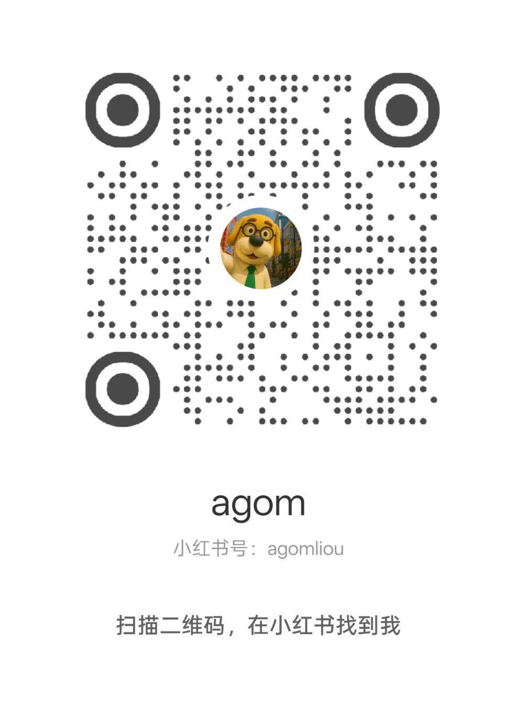
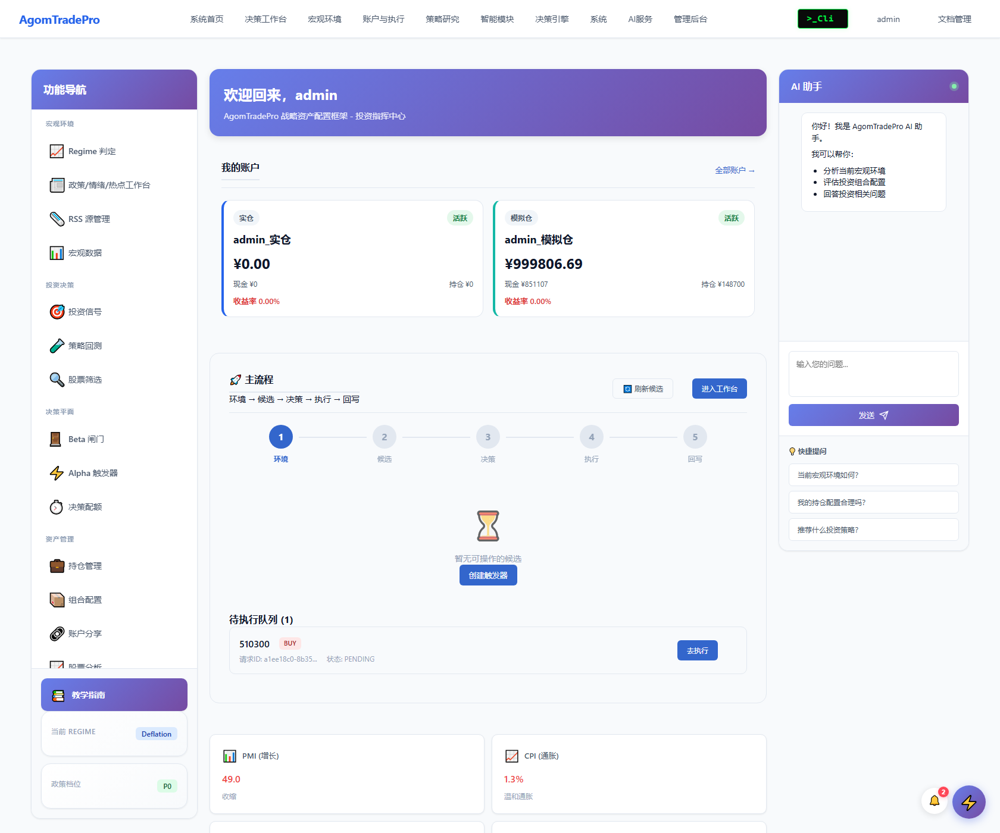
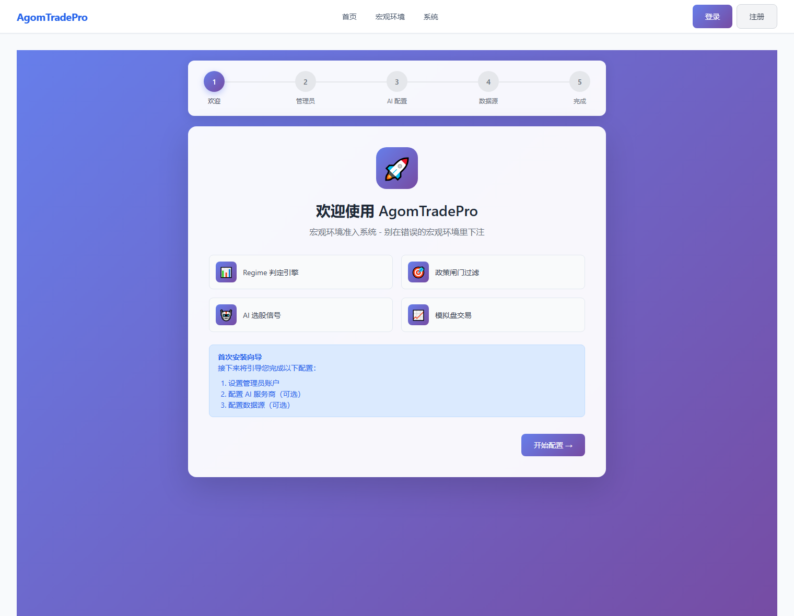
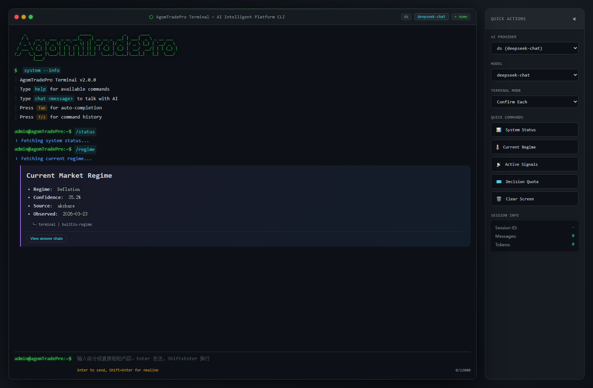
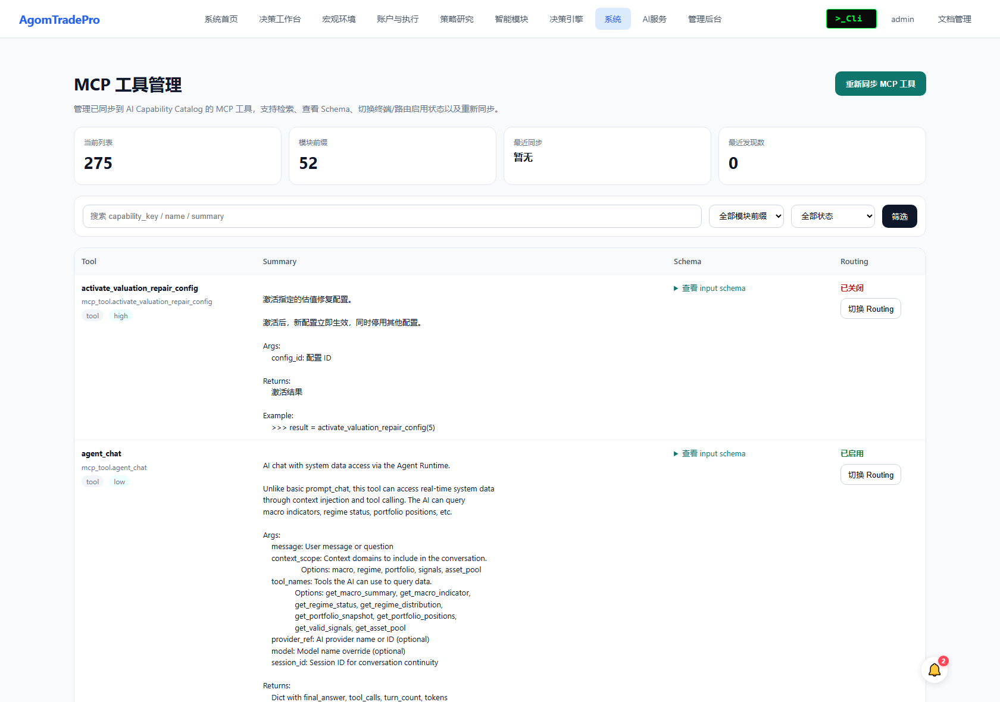

<div align="center">

**[English](README_EN.md) | [中文](README.md)**

# AgomTradePro

### 别在错误的宏观环境里下注，哪怕你的逻辑是对的。

**一个 AI-native 的个人投资研究底座：为 AI 提供数据基础与决策框架，把宏观判断、策略纪律、Agent 能力和执行工作流放进同一个系统里。**

[](https://www.python.org/downloads/)
[](https://www.djangoproject.com/)
[](#测试)
[](#架构)
[](#ai-原生集成)
[](#项目状态)
[](LICENSE)

[快速开始](#快速开始) · [为什么做这个](#为什么做这个) · [为什么值得-fork--star](#为什么值得-fork--star) · [架构](#架构) · [AI 集成](#ai-原生集成) · [截图](#截图) · [文档](docs/INDEX.md)

</div>

---

## What's New

> 这个区域按天维护，优先记录最近 1-7 天内对外可见、值得关注的变化。

### 2026-03-29

- 决策工作台 6-step workflow 已进一步收口：第 5 步推荐刷新与第 6 步执行流稳定，执行主线不再回退成审计页
- 决策工作台推荐链路补齐了账户级真实刷新与阻断原因展示，前端 HTMX/Alpine 片段替换后的 `ReferenceError` 已清理
- 页面级 UAT 脚本已对齐当前界面结构，`decision/workspace` 步骤识别和 Regime 控件检测恢复为稳定可回归状态
- GitHub Actions 的架构门禁历史误报点已从热路径代码中清掉，`main` / `dev` 当前 checks 全绿

### 2026-03-28

- 金融数据源运行时统一到新的 registry/factory 路径，补入 QMT 行情接入与配置中心可见配置
- `strategy` 绑定链路改经 facade 收口，减少页面层与底层存储的耦合
- 多模块写一致性继续加固：`strategy` / `beta_gate` / `regime` / `prompt` 的关键写路径补充事务与唯一激活约束
- 文档基线已同步到当前事实：系统对外口径更新为 35 个业务模块、个人投研平台

### 2026-03-27

- 真实仓持仓 API 已在预上线阶段直接切到统一账本：`/api/account/positions/*` 现在就是唯一 canonical 实仓持仓入口
- 取消单独的 `/api/account/unified-positions/` 路径，避免真实仓出现两条正式读口径
- 持仓修改、部分平仓、全平仓统一走 `UnifiedPositionService`，派生字段、交易记录和平仓行为链路同步收口
- 决策工作台主链和定价/审批相关接口继续清理，CI guardrails 也一并补强

### 2026-03-24

- Regime Navigator + Pulse redesign 三阶段已全部收口，Dashboard / 决策工作台 / Regime 页面主线统一
- Dashboard 导航已收束，`beta_gate` / `alpha_trigger` / `decision_rhythm` 不再作为首页独立主入口暴露
- Regime 页面新增历史 `Regime + Pulse + Action` 三层叠加时序图
- Dashboard 新增可选的浏览器级 Pulse 转向提醒
- SDK / MCP / 文档口径已对齐：支持 `decision_workflow.get_funnel_context(trade_id, backtest_id)` 与 `client.pulse.*`

### 日更维护规则

- 只写对用户、集成方、Fork 开发者真正有感知的变化
- 同一天优先追加到当日条目，不重复刷屏
- 超过一周的重要变化应沉淀到 `CHANGELOG.md`

---

> **免责声明**  
> 本项目仅用于**个人研究与系统实验**，不代表任何机构的投资观点，**不构成任何投资建议**。

---

## 先说重点

AgomTradePro 和大多数“量化工具 / AI 投研 demo / 股票分析面板”的差异，不在于多几个图表，而在于它从一开始就是按“**构建自己的 AI 研究底座**”来设计的。

- **AI-native，不是后贴 AI**：原生 MCP、Terminal CLI、Agent Runtime、Capability Catalog 都是系统内建能力
- **不是单页工具，而是一套研究与决策底座**：宏观、政策、信号、审批、执行、审计在一个闭环里
- **适合继续长自己的能力**：你可以把它 Fork 成自己的宏观研究台、Agent 投研平台、策略实验底座
- **作者工作流本身就是 AI-assisted**：这个项目的大量构建与迭代，直接使用了 **Claude Code / Codex** 这样的 agentic coding workflow 去推进

如果你关心的不是“再看一个 dashboard”，而是“怎么搭一个属于自己的 AI 研究基础设施”，这个项目会更对路。

---

## 项目状态

> 这个项目已经可以运行、可以演示、可以继续扩展，但**仍处于积极开发中**。  
> 当前仓库的**前端呈现和部分操作逻辑仍在持续修改**。  
> 现阶段更准确的理解方式是：它正在逐步形成一个**给 AI 使用的数据基础和决策框架**，而不是已经完全冻结的成品 SaaS；公开仓库后续也会继续更新界面、交互流、监控能力和相关文档。

- 核心宏观准入链路已可用：Regime / Policy / Signal / 审批 / 执行 / 审计
- 新主线已落地：Dashboard 日常模式 + Decision Workspace 决策模式 + Regime Navigator / Pulse 联动
- AI 原生能力已成型：**原生 MCP、Terminal CLI、Agent Runtime、Capability Catalog**
- 仍在持续完善：定时任务监控、更多 public demo 场景、README/文档国际化与部署体验

---

## 快速开始

当前先给一个**最简单的安装方式**：

1. 克隆仓库到本地
2. Windows 用户可先运行根目录的 `install.bat`，自动创建本地虚拟环境并安装依赖
3. 然后运行根目录的 `start.bat`，选择 `Quick Start`
4. 或者直接让 **OpenClaw** 或 **Claude Code** 读取当前仓库，自行完成依赖安装、环境初始化、数据库迁移和启动
5. 如果你更习惯手动部署，再按 `deploy/README_DEPLOY.md` 和 `docs/deployment/` 里的说明继续细化

### 提示

- 本地虚拟环境目录默认叫 `agomtradepro/`，它是**本地开发环境**，在 `.gitignore` 里，**不会提交到 git**
- 如果你是 **Windows** 用户，并且本地 Python 环境与项目依赖已经准备好，通常在克隆仓库后直接运行根目录的 `start.bat`，再选择 `Quick Start` 即可启动
- 目前公开仓库的安装流程还在持续整理中，**最省事的方式就是让 OpenClaw 或 Claude Code 代你安装**
- 后续作者会补充一个更直接的 **Docker 安装包 / 部署包**，把开箱门槛再降下来

---

## 联系方式

如果你想交流这个项目的思路或后续演进，可以通过微信联系：`Uncleliou`

### 小红书开发日记

后续会在小红书持续更新这个项目的开发日记，欢迎关注：

<p align="center">
  
</p>

<p align="center">
  <b>小红书号：agomliou</b><br>
  <sub>小红书日更开发日记</sub>
</p>

---

## 为什么做这个

最近金融市场波动很大。很多时候，真正让人难受的不是单次涨跌，而是**你明明在持续看信息、持续思考，却还是越来越困惑**。

这个项目最早不是从“我要做个平台”开始的，而是从一个更直接的问题开始的：

> **如果我是那个被宏观、政策、情绪、噪音反复扰动的人，我能不能先给自己造一套解释系统？**

大部分散户亏钱，不是因为选股差，而是因为**在错误的时间出手**。

- 你买了好股票 —— **但正值滞胀周期**
- 你执行了好策略 —— **但政策正在收紧**
- 你看到了明确信号 —— **但脚下的宏观地基正在移动**

**结果是什么？** 逻辑正确，世界不对。亏钱。

AgomTradePro 只相信一个原则：

> **"不要在错误的宏观世界里，用正确的逻辑下注。"**

它是一个**宏观守门员** —— 在你每一笔投资决策执行之前，先用 Regime（增长 × 通胀象限）和 Policy（政策档位）过滤一遍。它不预测价格，它阻止错误。

---

## 为什么值得 Fork / Star

如果你在找的不是一个“又一个股票分析页面”，而是一套**能继续长出策略、Agent、执行工作流的底座**，这个项目值得你点开、Fork，甚至长期跟。

- **它不是 demo 站，而是一套可运行的投资系统骨架**：登录、配置、分析、决策、审批、执行、审计已经串起来了
- **它不是 AI wrapper，而是 AI-native**：原生 MCP、Terminal CLI、Agent Runtime、Capability Catalog 都在系统内部，不靠外面硬接
- **它不是单点脚本，而是可扩展架构**：35 个业务模块、DDD 四层、明确边界，适合继续长功能
- **它不是“只能作者自己维护”的代码**：模块拆分清楚，文档量够大，适合二开、Fork、做私有策略内核
- **它有明显的产品感**：Setup Wizard、Dashboard、CLI、MCP 管理台都已经能展示“这是个系统”，而不是一堆脚本拼盘

如果这些方向和你一致，这个仓库最适合的使用方式通常是：

1. 先 `Star`，持续关注功能演进
2. 再 `Fork`，把它改造成你自己的宏观/策略/Agent 基础设施
3. 最后按你的交易逻辑或研究框架，把模块继续长出来

---

## 它解决什么问题

### 1. 信息过载 → 结构化宏观情报

PMI 发布了、CPI 出来了、M2 又变了、政策又吹风了…… 你淹没在噪音里。AgomTradePro 从多个数据源采集宏观数据，标准化处理，用 Kalman/HP 滤波提取趋势，最终浓缩成一个清晰的答案：**我们现在处于哪个 Regime？**

| Regime | 增长 | 通胀 | 应对策略 |
|--------|------|------|----------|
| **复苏 Recovery** | ↑ | ↓ | 进攻，加仓权益 |
| **过热 Overheat** | ↑ | ↑ | 精选，注意通胀风险 |
| **滞胀 Stagflation** | ↓ | ↑ | 防御，减仓观望 |
| **通缩 Deflation** | ↓ | ↓ | 等待，保留现金 |

不用猜了。不用听各路大V互相矛盾。一个宏观状态，用真实数据计算。

### 2. 情绪化交易 → 系统化纪律

每一笔交易在执行前都必须过关：

```
你的想法 → Regime 闸门 → Policy 闸门 → 信号验证 → 审批 → 执行
               ↓              ↓              ↓
          "宏观环境        "政策面         "这个信号有
           支持吗？"      配合吗？"       证伪条件吗？"
```

- **没有证伪逻辑的信号不能创建** —— 你必须在入场前定义"什么情况下我是错的"
- **敌对 Regime 下不能交易** —— 系统会物理阻止你
- **决策频率约束** —— 防止过度交易和 FOMO
- **完整审计链** —— 每一个决策都有记录，事后可复盘

这不是建议，这是**纪律的执行基础设施**。

### 3. 手动流程 → AI 原生自动化

不是后期加个 API 就叫 AI。AgomTradePro 从底层为 AI Agent 时代而设计：

- **Python SDK** — 32 个模块的完整编程接口
- **MCP Server（65+ 工具）** — 直接接入 Claude、Cursor 或任何支持 MCP 的 AI
- **Terminal CLI** — 终端风格的 AI 交互界面
- **Agent Runtime** — 任务编排，支持 提案 → 审批 → 执行 全生命周期

你的 AI Agent 可以检查宏观环境、评估信号、提出交易建议 —— 但执行仍需要人类审批。**AI 的速度，人类的判断。**

---

## 截图

<details>
<summary><b>登录后的系统主界面（Dashboard）</b></summary>



*登录后第一眼就是投资指挥中心：账户、宏观状态、决策平面、AI 选股与工作流都聚合在同一屏。*

</details>

<details>
<summary><b>系统初始化向导（Setup Wizard）</b></summary>



*第一次启动即可完成密钥自动生成、管理员创建、AI Provider 和数据源配置，无需手动编辑 .env 文件。*

</details>

<details>
<summary><b>Terminal CLI（原生 AI 交互界面）</b></summary>



*不是“附带一个聊天框”，而是面向操作流设计的 CLI：命令、上下文、会话、能力路由都在一个终端界面里。*

</details>

<details>
<summary><b>原生 MCP Tools 管理页</b></summary>



*系统内建 MCP 工具目录、Schema 检视、Terminal/Routing 开关，不是后贴一层 API wrapper。*

</details>

---

## 功能一览

### 核心系统
| 模块 | 做什么 |
|------|--------|
| **Regime 引擎** | 从增长/通胀指标计算当前宏观象限，Z-score 标准化 |
| **Policy 闸门** | 追踪财政/货币政策事件，评估对风险偏好的影响 |
| **信号管理器** | 创建、验证、追踪投资信号，强制要求证伪逻辑 |
| **决策工作流** | 预检 → 审批 → 执行流水线，带频率约束 |
| **回测引擎** | 历史验证，支持 Brinson 归因分析 |
| **审计系统** | 事后复盘，完整决策链路追踪和绩效归因 |

### 组合与执行
| 模块 | 做什么 |
|------|--------|
| **模拟交易** | 模拟盘交易，保证金追踪，每日巡检 |
| **实时监控** | 价格预警、涨跌排行、市场监控 |
| **策略系统** | 数据库驱动的仓位规则，按组合绑定策略 |
| **板块轮动** | 基于 Regime 的板块配置建议 |

### AI 与智能分析
| 模块 | 做什么 |
|------|--------|
| **Alpha 评分** | AI 选股评分，4 层降级（Qlib → 缓存 → 简单 → ETF） |
| **因子管理** | 因子计算、IC/ICIR 评估 |
| **对冲策略** | 期货对冲计算和组合保护 |
| **舆情闸门** | 新闻/舆情分析作为额外风险过滤 |

### 数据源
| 数据源 | 覆盖范围 |
|--------|----------|
| **Tushare Pro** | A 股行情、SHIBOR、指数数据 |
| **AKShare** | 宏观指标（PMI、CPI、M2、GDP 等） |
| **自动容灾** | 主备切换，1% 容差验证 |

---

## 架构

AgomTradePro 不是把几个页面和几个 API 拼在一起，而是按“**投资操作系统**”的思路来设计：

```
数据源 → 宏观判定 → 政策过滤 → 信号生成 → 决策约束 → 审批执行 → 审计复盘
         ↓             ↓             ↓             ↓
      Regime        Policy        Signal      Workflow / Audit
```

这意味着你 Fork 之后，不必推翻重写，只需要沿着现有边界继续加能力。

### 1. 业务架构：模块化投资底座

- **宏观层**：`macro`、`regime`、`policy` 负责回答“现在是什么环境”
- **决策层**：`signal`、`beta_gate`、`alpha_trigger`、`decision_rhythm` 负责回答“现在该不该做”
- **执行层**：`strategy`、`simulated_trading`、`realtime` 负责回答“怎么执行、怎么跟踪”
- **分析层**：`backtest`、`audit`、`factor`、`rotation`、`hedge` 负责回答“为什么有效、哪里错了”
- **AI 层**：`terminal`、`agent_runtime`、`ai_capability`、`prompt`、`ai_provider` 负责回答“怎么让 Agent 真正接进来”

### 2. 技术架构：严格 DDD 四层

核心业务严格按照四层拆分，不把金融规则塞进视图、模型或脚本里：

```
┌─────────────────────────────────────────────────────────┐
│  Interface 层      │ REST API、Admin UI、序列化          │
├─────────────────────┼───────────────────────────────────┤
│  Application 层    │ 用例编排、Celery 任务、DTO         │
├─────────────────────┼───────────────────────────────────┤
│  Infrastructure 层 │ Django ORM、API 适配器、仓储       │
├─────────────────────┼───────────────────────────────────┤
│  Domain 层         │ 实体、规则、服务                    │
│  （纯 Python）      │ 禁止 Django、Pandas、NumPy        │
└─────────────────────────────────────────────────────────┘
```

**为什么这对 Fork 很重要：**

- 你可以只替换数据源，不动领域规则
- 你可以只换前端/UI，不动策略内核
- 你可以只接入自己的 Agent，不动审批与审计链
- 你可以把某个模块单独拿出去复用，而不是连根拔整个项目

### 3. AI 架构：不是外挂，而是内建

- **MCP Server** 直接暴露系统能力给 Claude、Cursor、Codex 这一类 Agent
- **Terminal CLI** 提供面向操作的 AI 交互界面，而不是单纯聊天窗
- **Capability Catalog** 统一管理路由、工具、Schema、开关
- **Agent Runtime** 把“提案 → 预检 → 审批 → 执行”这条链真正系统化

这部分是整个仓库最适合 public 展示、也最容易让人想 Fork 的地方，因为它天然适合二次开发。

### 4. 当前状态

- **核心结构已稳定**：足够支撑继续加模块
- **产品表面已成型**：足够让别人一眼看懂这不是 toy project
- **细节仍在迭代**：所以现在正是适合关注、参与、Fork 的阶段

---

## AI 原生集成

### Python SDK

```python
from agomtradepro import AgomTradeProClient

client = AgomTradeProClient(
    base_url="http://localhost:8000",
    api_token="your_token"
)

# 现在是什么宏观 Regime？
regime = client.regime.get_current()
print(f"当前 Regime: {regime.dominant_regime}")  # 比如 "Recovery"

# 这个标的现在能交易吗？
check = client.signal.check_eligibility(
    asset_code="000001.SH",
    logic_desc="PMI 连续回升，经济复苏"
)

# 创建信号（必须包含证伪条件）
if check["is_eligible"]:
    signal = client.signal.create(
        asset_code="000001.SH",
        logic_desc="PMI 连续回升，经济复苏",
        invalidation_logic="PMI 跌破 50 且连续 2 月低于前值",
        invalidation_threshold=49.5
    )
```

### MCP Server —— 给 AI Agent 用

把 AgomTradePro 接入 Claude Code、Cursor 或任何支持 MCP 的 AI：

```json
{
  "mcpServers": {
    "agomtradepro": {
      "command": "python",
      "args": ["-m", "agomtradepro_mcp.server"],
      "env": {
        "AGOMTRADEPRO_BASE_URL": "http://localhost:8000",
        "AGOMTRADEPRO_API_TOKEN": "your_token"
      }
    }
  }
}
```

然后直接跟 AI 对话：

```
你：   "现在宏观环境怎么样？我能加仓权益吗？"

Claude: [调用 get_current_regime] → 滞胀（增长 ↓，通胀 ↑）
        [调用 get_policy_status] → 货币政策偏紧

        "当前处于滞胀 Regime，货币政策偏紧。这是防御性环境，
         加仓权益与 Regime 信号相悖。建议等待 Regime 转换，
         或者考虑对冲仓位。"
```

**65+ MCP 工具**不是只覆盖几个查询接口，而是横跨宏观、政策、信号、回测、账户、组合、交易、AI 能力目录、终端命令、运行时编排、系统配置等多个系统面向。

### AI 决策工作流

```
AI Agent 提出交易建议
        ↓
系统自动预检（Regime 闸门 → Policy 闸门 → 频率检查）
        ↓
生成提案，包含完整上下文
        ↓
人类审核，批准或驳回
        ↓
受保护的执行，全程审计
```

AI 负责分析速度。人类负责执行判断。全链路可追溯。

---

## 快速开始

### 前置条件

- Python 3.11+
- Redis（Celery 任务队列需要）

### 安装

```bash
# 克隆
git clone https://github.com/guiyinan/agomTradePro.git
cd agomTradePro

# 复制环境变量模板
copy .env.example .env   # Windows
# cp .env.example .env   # Linux/Mac

# 创建虚拟环境
python -m venv agomtradepro
source agomtradepro/bin/activate  # Linux/Mac
# 或: agomtradepro\Scripts\activate  # Windows

# 安装依赖
pip install -r requirements.txt

# 数据库初始化
python manage.py migrate

# 启动开发服务器
python manage.py runserver

# 访问 http://localhost:8000/setup/ 完成安装向导
```

安装向导会引导你完成：
1. **自动生成安全密钥** — `SECRET_KEY` 和 `AGOMTRADEPRO_ENCRYPTION_KEY` 如果未配置，向导会自动生成并写入 `.env`
2. 创建管理员账户
3. 配置 AI 服务商（可选）— API Key 使用 Fernet 加密存储
4. 配置数据源（可选）

> **密钥不再需要手动配置。** 向导在欢迎步骤点击"开始"时会检查密钥状态，缺失则自动生成。你也可以提前在 `.env` 里手动设置，向导会跳过已配置的项。

### Docker 部署

```bash
# 本地 Docker 一键启动（SQLite + Redis）
copy .env.example .env       # Windows
docker-compose up -d

# VPS 生产部署
cd deploy
copy .env.vps.example .env   # 按需修改
docker compose -f ../docker/docker-compose.vps.yml up -d
```

**Docker 环境中密钥也会自动处理：**

- `entrypoint.prod.sh` 在 Django 启动前检查 `SECRET_KEY` 和 `AGOMTRADEPRO_ENCRYPTION_KEY`
- 未提供时自动生成，并持久化到数据卷 `/app/data/.env.generated`
- web、celery_worker、celery_beat 共享同一组密钥，容器重启不丢失
- 如果在 `deploy/.env` 中显式设置了密钥，则优先使用手动值

### 初次安装容易踩坑

#### 1. `SECRET_KEY` / `AGOMTRADEPRO_ENCRYPTION_KEY`

**通常不需要手动设置。** 安装向导和 Docker entrypoint 都会自动生成。

如果你想手动设置，可以用以下命令生成：

```bash
# Django SECRET_KEY
python -c "from django.core.management.utils import get_random_secret_key; print(get_random_secret_key())"

# 数据加密密钥（Fernet）
python -c "from cryptography.fernet import Fernet; print(Fernet.generate_key().decode())"
```

然后写入 `.env`：

```env
SECRET_KEY=your-own-django-secret-key
AGOMTRADEPRO_ENCRYPTION_KEY=your-generated-fernet-key
```

#### 2. `DATABASE_URL`

`.env.example` 里默认给的是 PostgreSQL 示例连接。
如果你只是本地快速体验，**可以直接留空或删掉 `DATABASE_URL`，项目会默认使用根目录下的 SQLite**。

#### 3. `REDIS_URL` / Celery

Redis 不是本地首次体验的强制依赖。

- 本地没有配置 `REDIS_URL` 时，Celery 会退化为同步执行模式
- 如果你要体验完整异步任务、worker、beat，再去配置 Redis

#### 4. 首次只想跑起来，最小可用配置

复制 `.env.example` 后，你甚至不需要改任何密钥 — 安装向导会自动搞定：

```bash
copy .env.example .env
python manage.py migrate
python manage.py runserver
# 访问 http://localhost:8000/setup/ → 点击"开始"即可
```

如果你想跳过向导手动配置，最少确认这几项：

```env
SECRET_KEY=your-own-django-secret-key
AGOMTRADEPRO_ENCRYPTION_KEY=your-generated-fernet-key
DEBUG=True
ALLOWED_HOSTS=localhost,127.0.0.1
```

### 安装 SDK（可选）

```bash
cd sdk
pip install -e ".[dev]"
```

### 运行测试

```bash
pytest tests/ -v --cov=apps
```

---

## 技术栈

| 层级 | 技术选型 |
|------|----------|
| **后端** | Python 3.11+、Django 5.x、DRF |
| **数据库** | SQLite（开发）/ PostgreSQL（生产） |
| **任务队列** | Celery + Redis |
| **数据处理** | Pandas、NumPy、Statsmodels |
| **可视化** | Streamlit、Plotly |
| **前端** | Django Templates + HTMX |
| **AI 集成** | MCP Server、Python SDK |
| **测试** | Pytest（1,600+ 用例）、Playwright（E2E） |

---

## 项目规模

```
34    业务模块（每个都有完整 DDD 四层实现）
65+   MCP 工具（供 AI Agent 调用）
100+  REST API 端点
1,600+ 自动化测试用例
230+  文档文件
```

---

## 文档

| 文档 | 说明 |
|------|------|
| **[上手手册](docs/QUICK_START.md)** | 从零到跑模拟盘的操作指南 |
| **[系统规格书](docs/SYSTEM_SPECIFICATION.md)** | 完整技术 + 功能规格 |
| **[SDK 参考](sdk/README.md)** | Python SDK 和 MCP Server 指南 |
| **[架构设计](docs/architecture/)** | DDD 设计、模块依赖关系 |
| **[文档索引](docs/INDEX.md)** | 全部文档导航 |

---

## 适合谁用

- **个人投资者** —— 想用系统化纪律替代情绪化操作
- **量化开发者** —— 需要一个生产级的宏观叠加层来增强策略
- **AI/LLM 爱好者** —— 想构建有护栏的投资 Agent，而不是裸奔的 GPT wrapper
- **金融学生** —— 用真实代码学习宏观驱动的投资框架

---

## 参与贡献

欢迎贡献！提交 PR 前请阅读[开发规范](docs/development/outsourcing-work-guidelines.md)。

```bash
# 格式化
black . && isort . && ruff check .

# 类型检查
mypy apps/ --strict

# 测试（Domain 层覆盖率 ≥ 90%）
pytest tests/ -v --cov=apps
```

---

## 开源协议

Apache License 2.0 —— 详见 [LICENSE](LICENSE)。

---

<div align="center">

**如果这个项目帮你少亏了一次钱，请给个 Star 吧**

*源于太多次"逻辑没错、时机全错"的惨痛教训。*

</div>
