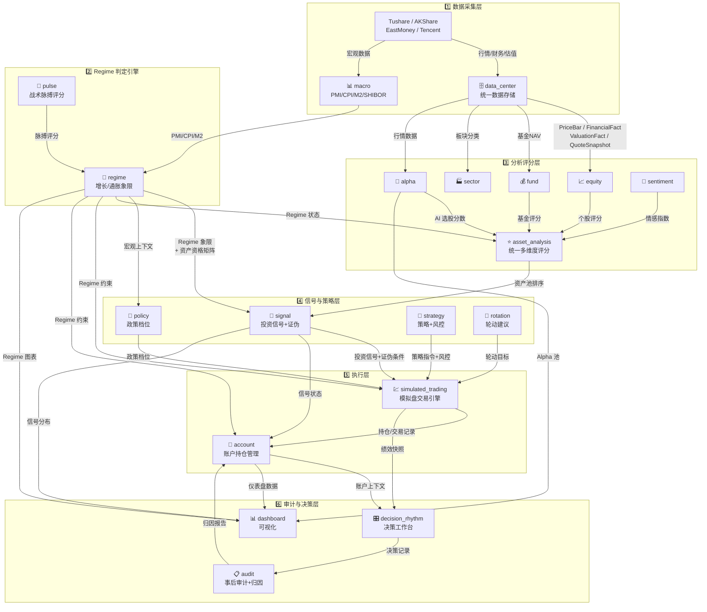
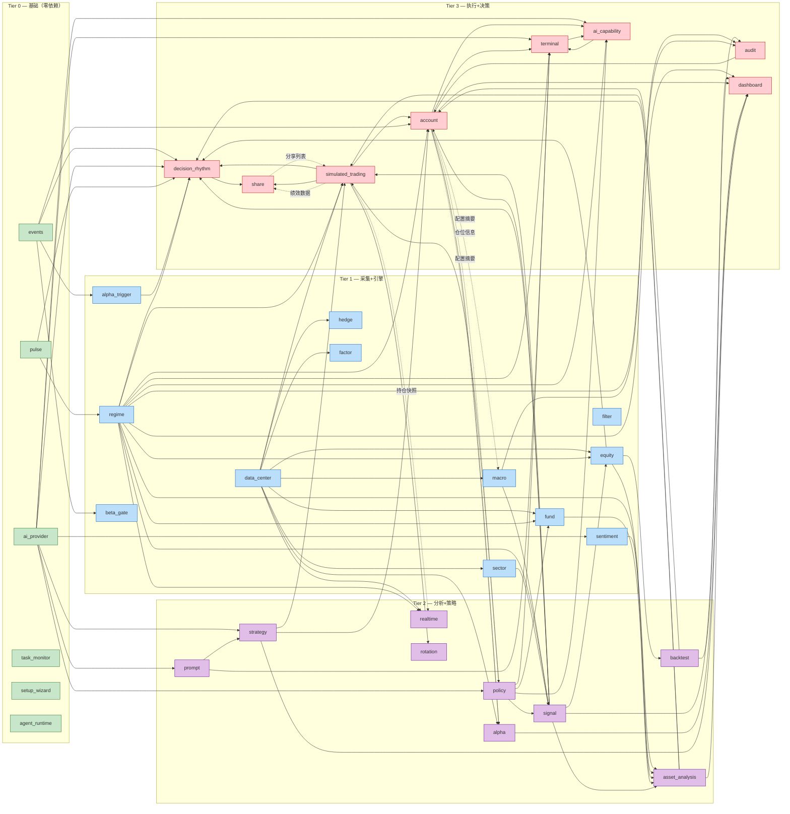
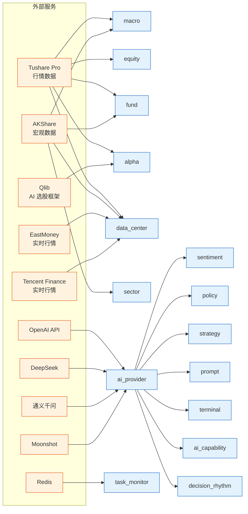
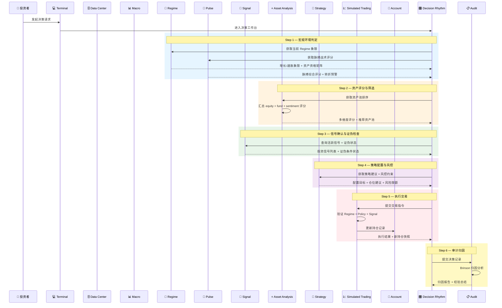

# AgomTradePro 系统模块拓扑图与数据流

> 生成日期: 2026-04-26
> 系统版本: 0.7.0
> 模块总数: 35
> 架构状态: app 级循环依赖 `0`，架构审计债 `0`

> 说明:
> 1. 本文展示的是业务能力拓扑与数据流，不等于 Python 静态 import 图。
> 2. 自 2026-04-26 起，跨模块 concrete 装配统一经 `infrastructure/providers.py` 与 `core/integration/*` 收口；图中的箭头表示业务调用/数据影响，不表示允许直接跨层 import。
> 3. MCP / SDK 对外契约未因本轮整改变化；变化的是内部模块归属与治理边界。

---

## 一、系统全景拓扑图（分层架构）

```mermaid
graph TB
    subgraph EXTERNAL["🔌 外部数据源 / 服务"]
        TS["Tushare Pro"]
        AK["AKShare"]
        EM["EastMoney"]
        TF["Tencent Finance"]
        QL["Qlib AI"]
        LLM["OpenAI / DeepSeek<br/>Qwen / Moonshot"]
        REDIS["Redis + Celery"]
        QMT["QMT 券商网关"]
    end

    subgraph SHARED["shared/ 技术组件层"]
        SEC["secrets 密钥管理"]
        TSC["tushare_client"]
        CACHE["cache_service"]
        CRYPT["crypto 加密"]
        KALMAN["kalman_filter"]
        ALERT["alert_service"]
        SAN["sanitization"]
    end

    subgraph L0["Tier 0 — 基础设施层（无跨模块依赖）"]
        EVENTS["📦 events<br/>事件总线"]
        PULSE["💓 pulse<br/>脉搏层"]
        AI_PROV["🤖 ai_provider<br/>AI 服务商"]
        TASK_MON["📋 task_monitor<br/>任务监控"]
        SETUP["⚙️ setup_wizard<br/>初始化向导"]
        AGENT_RT["🧠 agent_runtime<br/>Agent 运行时"]
    end

    subgraph L1["Tier 1 — 数据采集与核心引擎"]
        DC["🗄️ data_center<br/>数据中台"]
        MACRO["📊 macro<br/>宏观数据"]
        EQUITY["📈 equity<br/>个股分析"]
        FUND["💰 fund<br/>基金分析"]
        SECTOR["🏭 sector<br/>板块分析"]
        REGIME["🎯 regime<br/>Regime 判定引擎"]
        SENTIMENT["💬 sentiment<br/>舆情情感"]
        FILTER["🔍 filter<br/>筛选器"]
        HEDGE["🛡️ hedge<br/>对冲策略"]
        FACTOR["🧪 factor<br/>因子管理"]
        A_TRIG["⚡ alpha_trigger<br/>Alpha 触发"]
        B_GATE["🚧 beta_gate<br/>Beta 闸门"]
    end

    subgraph L2["Tier 2 — 分析与策略层"]
        SIGNAL["🚦 signal<br/>投资信号"]
        ASSET_A["⭐ asset_analysis<br/>统一评分框架"]
        POLICY["📜 policy<br/>政策管理"]
        PROMPT["📝 prompt<br/>Prompt 模板"]
        BACKTEST["🔄 backtest<br/>回测引擎"]
        ALPHA["🔮 alpha<br/>AI 选股"]
        REALTIME["⚡ realtime<br/>实时行情"]
        ROTATION["🔄 rotation<br/>板块轮动"]
        STRATEGY["🎯 strategy<br/>策略系统"]
    end

    subgraph L3["Tier 3 — 交易执行与决策层"]
        SIM_TRADE["💹 simulated_trading<br/>模拟盘交易"]
        ACCOUNT["🏦 account<br/>账户与持仓"]
        DECISION["🎛️ decision_rhythm<br/>决策频率约束"]
        AUDIT["📋 audit<br/>事后审计"]
        SHARE["📤 share<br/>分享功能"]
        TERMINAL["💻 terminal<br/>终端 CLI"]
        AI_CAP["🌐 ai_capability<br/>AI 能力目录"]
        DASHBOARD["📊 dashboard<br/>仪表盘"]
    end

    %% ===== EXTERNAL → Tier 0/1 =====
    TS --> DC
    AK --> DC
    EM --> DC
    TF --> DC
    QMT --> DC
    TS --> MACRO
    AK --> MACRO
    TS --> EQUITY
    TS --> FUND
    AK --> SECTOR
    AK --> FUND
    LLM --> AI_PROV
    QL --> ALPHA
    REDIS --> TASK_MON

    %% ===== shared/ 依赖 =====
    SEC -.-> MACRO
    SEC -.-> EQUITY
    SEC -.-> FUND
    SEC -.-> ALPHA
    TSC -.-> MACRO
    TSC -.-> FUND
    TSC -.-> ALPHA
    CACHE -.-> REGIME
    CRYPT -.-> AI_PROV
    KALMAN -.-> REGIME
    ALERT -.-> TASK_MON
    SAN -.-> AGENT_RT

    %% ===== Tier 0 内部 =====
    PULSE --> REGIME

    %% ===== Tier 0 → Tier 1 =====
    EVENTS --> A_TRIG
    EVENTS --> B_GATE
    AI_PROV --> SENTIMENT

    %% ===== Tier 1 内部 =====
    DC --> MACRO
    DC --> EQUITY
    DC --> FUND
    DC --> SECTOR
    DC --> ALPHA
    DC --> HEDGE
    DC --> FACTOR
    DC --> REALTIME
    REGIME --> EQUITY
    SIGNAL -.-> EQUITY

    %% ===== Tier 1 → Tier 2 =====
    MACRO --> SIGNAL
    REGIME --> SIGNAL
    POLICY ~~~ SIGNAL
    SECTOR --> SIGNAL
    REGIME --> ASSET_A
    POLICY --> ASSET_A
    SENTIMENT --> ASSET_A
    EQUITY --> ASSET_A
    FUND --> ASSET_A
    SIGNAL --> ASSET_A
    AI_PROV --> POLICY
    AI_PROV --> PROMPT
    EQUITY --> BACKTEST
    ACCOUNT --> ALPHA
    DC --> ALPHA
    EQUITY --> ALPHA
    REGIME --> REALTIME
    DC --> REALTIME
    SIM_TRADE ~~~ REALTIME
    SIM_TRADE --> ROTATION

    %% ===== Tier 2 → Tier 3 =====
    SIGNAL --> SIM_TRADE
    ASSET_A --> SIM_TRADE
    POLICY --> SIM_TRADE
    REGIME --> SIM_TRADE
    STRATEGY --> SIM_TRADE
    DC --> SIM_TRADE
    REGIME --> ACCOUNT
    SIGNAL --> ACCOUNT
    BACKTEST --> ACCOUNT
    AUDIT --> ACCOUNT
    STRATEGY --> ACCOUNT
    SIM_TRADE --> ACCOUNT
    EVENTS --> ACCOUNT
    EVENTS --> DECISION
    A_TRIG --> DECISION
    EQUITY --> DECISION
    SIGNAL --> DECISION
    SIM_TRADE --> DECISION
    ASSET_A --> DECISION
    AI_PROV --> DECISION
    PULSE --> DECISION
    REGIME --> DECISION
    BACKTEST --> AUDIT
    REGIME --> AUDIT
    MACRO --> AUDIT
    DECISION --> SHARE
    SIM_TRADE --> SHARE
    AI_PROV --> TERMINAL
    AI_CAP --> TERMINAL
    PROMPT --> TERMINAL
    ACCOUNT --> TERMINAL
    POLICY --> TERMINAL
    REGIME --> TERMINAL
    AI_PROV --> AI_CAP
    POLICY --> AI_CAP
    REGIME --> AI_CAP
    ACCOUNT --> AI_CAP
    TERMINAL --> AI_CAP
    AI_PROV --> STRATEGY
    PROMPT --> STRATEGY
    ACCOUNT --> STRATEGY
    REGIME --> DASHBOARD
    SIGNAL --> DASHBOARD
    ACCOUNT --> DASHBOARD
    ALPHA --> DASHBOARD
    STRATEGY --> DASHBOARD
    ASSET_A --> DASHBOARD
    FUND --> DASHBOARD
    REGIME --> FUND
    POLICY --> FUND

    classDef external fill:#f9e2ae,stroke:#b8860b,color:#333
    classDef shared fill:#e8e8e8,stroke:#666,color:#333
    classDef l0 fill:#c8e6c9,stroke:#2e7d32,color:#333
    classDef l1 fill:#bbdefb,stroke:#1565c0,color:#333
    classDef l2 fill:#e1bee7,stroke:#6a1b9a,color:#333
    classDef l3 fill:#ffcdd2,stroke:#b71c1c,color:#333

    class TS,AK,EM,TF,QL,LLM,REDIS,QMT external
    class SEC,TSC,CACHE,CRYPT,KALMAN,ALERT,SAN shared
    class EVENTS,PULSE,AI_PROV,TASK_MON,SETUP,AGENT_RT l0
    class DC,MACRO,EQUITY,FUND,SECTOR,REGIME,SENTIMENT,FILTER,HEDGE,FACTOR,A_TRIG,B_GATE l1
    class SIGNAL,ASSET_A,POLICY,PROMPT,BACKTEST,ALPHA,REALTIME,ROTATION,STRATEGY l2
    class SIM_TRADE,ACCOUNT,DECISION,AUDIT,SHARE,TERMINAL,AI_CAP,DASHBOARD l3
```



---

## 二、核心数据流图



---

## 三、模块依赖关系矩阵

### 2026-04-26 架构治理结果

| 项目 | 状态 |
|---|---|
| app 级双向依赖 | `0` |
| app 级 cycle component | `0` |
| `Application -> infrastructure.repositories` | `0` |
| `shared/` 中业务 Django Model | `0` |
| MCP 外部契约变更 | 无 |

当前真实治理边界:

1. `shared/` 只保留技术组件、算法、密钥和兼容解析。
2. 业务配置 ORM 已回到 owning app，不再定义在 `shared/`。
3. application 层不得直接 import `infrastructure.repositories`，统一走 `infrastructure/providers.py` 或 `core/integration/*`。
4. `data_center` 不再反向 import 业务模块 concrete 实现；业务模块通过 provider / integration bridge 接入。

### 依赖深度排行（从高到低）

| # | 模块 | 跨模块依赖数 | 层级 | 角色 |
|---|------|-------------|------|------|
| 1 | **account** | 14+ | L3 | 重度集成器 — 账户/持仓/RBAC/风控 |
| 2 | **dashboard** | 7+ | L3 | 顶层聚合器 — 可视化展示 |
| 3 | **simulated_trading** | 7 | L3 | 交易引擎 — 自动执行 |
| 4 | **decision_rhythm** | 8 | L3 | 决策中枢 — 工作台+AI辅助 |
| 5 | **terminal** | 5 | L3 | AI 交互界面 |
| 6 | **asset_analysis** | 6 | L2 | 统一评分中心 |
| 7 | **signal** | 5 | L2 | 信号管理+证伪 |
| 8 | **fund** | 6 | L1 | 基金分析 |
| 9 | **ai_capability** | 5 | L3 | AI 能力路由 |
| 10 | **equity** | 4 | L1 | 个股分析 |
| 11 | **strategy** | 3 | L2 | 策略+仓位+风控 |
| 12 | **policy** | 3 | L2 | 政策事件管理 |
| 13 | **alpha** | 3 | L2 | AI 选股 |
| 14 | **realtime** | 3 | L2 | 实时行情 |
| 15 | **audit** | 3 | L2 | 事后审计 |
| 16 | **share** | 2 | L3 | 分享功能 |
| 17 | **prompt** | 2 | L2 | Prompt 模板 |
| 18 | **macro** | 2 | L1 | 宏观数据 |
| 19 | **data_center** | 3 | L1 | 数据中台 |
| 20 | **backtest** | 1 | L2 | 回测引擎 |
| 21 | **regime** | 1 | L1 | Regime 引擎 |
| 22 | **rotation** | 1 | L2 | 板块轮动 |
| 23 | **alpha_trigger** | 1 | L1 | Alpha 触发 |
| 24 | **beta_gate** | 1 | L1 | Beta 闸门 |
| 25 | **hedge** | 1 | L1 | 对冲策略 |
| 26 | **factor** | 1 | L1 | 因子管理 |
| 27 | **sector** | 1 | L1 | 板块分析 |
| 28 | **filter** | 1 | L1 | 筛选器 |
| 29 | **sentiment** | 1 | L1 | 舆情分析 |
| 30 | **events** | 0 | L0 | 事件总线 |
| 31 | **pulse** | 0 | L0 | 脉搏层 |
| 32 | **ai_provider** | 0 | L0 | AI 服务商 |
| 33 | **task_monitor** | 0 | L0 | 任务监控 |
| 34 | **setup_wizard** | 0 | L0 | 初始化向导 |
| 35 | **agent_runtime** | 0 | L0 | Agent 运行时 |

---

## 四、详细依赖关系图（按模块）



---

## 五、外部服务连接图



---

## 六、核心决策流程（6 步漏斗）



---

## 七、关键架构特征

### 1. 依赖方向：严格自下而上

```
Tier 0 (基础) → Tier 1 (采集) → Tier 2 (分析) → Tier 3 (执行)
     ↑                                                      |
     └──────────── 反馈环路（虚线，通过事件/查询） ──────────────┘
```

### 2. 核心引擎：Regime（居中枢纽）

Regime 是系统最核心的模块，被 **16 个模块** 直接依赖：
- `signal`, `asset_analysis`, `policy`, `strategy`, `terminal`
- `simulated_trading`, `account`, `decision_rhythm`, `dashboard`
- `equity`, `fund`, `realtime`, `ai_capability`, `prompt`
- `audit`, `rotation`

### 3. 数据中台：data_center（统一数据入口）

所有外部数据通过 `data_center` 统一接入，提供：
- `PriceBar` / `QuoteSnapshot` — 行情数据
- `FinancialFact` / `ValuationFact` — 财务/估值
- `AssetMaster` — 资产主数据
- `ProviderRegistry` — 数据源健康监控

### 4. 事件驱动：events 总线

`events` 模块提供领域事件基础设施，驱动：
- `alpha_trigger` — Alpha 信号激活事件
- `beta_gate` — Beta 敞口约束事件
- `account` — 账户状态变更事件
- `decision_rhythm` — 决策配额事件

### 5. AI 能力扩散路径

```
ai_provider (基础)
    → sentiment (情感分析)
    → policy (政策分类)
    → prompt (Prompt 模板管理)
    → strategy (AI 策略执行)
    → terminal / ai_capability (AI 交互界面)
    → decision_rhythm (AI 辅助决策)
```

---

## 八、模块角色分类

| 角色 | 模块 | 说明 |
|------|------|------|
| **数据生产者** | data_center, macro, sector, hedge, factor, alpha | 产生原始/衍生数据 |
| **核心引擎** | regime, pulse | Regime 判定 + 战术评分 |
| **分析引擎** | equity, fund, sentiment, asset_analysis, backtest | 多维度分析评分 |
| **信号/策略** | signal, policy, strategy, rotation | 投资信号与策略配置 |
| **事件驱动** | events, alpha_trigger, beta_gate | 领域事件触发与响应 |
| **交易执行** | simulated_trading, account, realtime | 模拟交易与持仓管理 |
| **决策审计** | decision_rhythm, audit, share | 决策工作台与事后归因 |
| **AI 服务** | ai_provider, prompt, ai_capability, agent_runtime | AI 能力管理与路由 |
| **用户界面** | terminal, dashboard, setup_wizard | 终端/仪表盘/向导 |
| **基础设施** | task_monitor, filter | 任务监控与数据筛选 |
