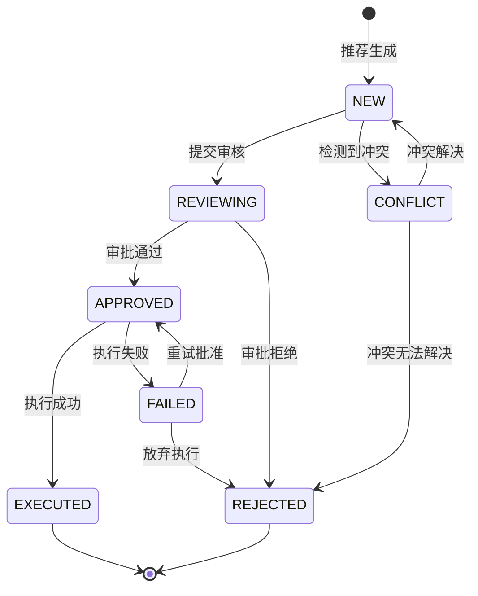

# 决策工作台统一工作流技术文档

> 文档版本: v1.2
> 创建日期: 2026-03-03
> 最后更新: 2026-03-29
> 适用范围: 决策工作台 Top-down + Bottom-up 融合系统

## 1. 概述

本文档描述决策工作台统一工作流的技术实现细节，包括数据模型、融合算法、状态流转、API 端点和错误处理策略。新开发者可通过本文档快速理解统一决策工作流的完整技术栈。

### 1.1 核心目标

1. **统一推荐对象**：Top-down 和 Bottom-up 信号融合为单一 `UnifiedRecommendation`
2. **计划层落地**：执行前必须先生成账户级 `PortfolioTransitionPlan`
3. **去重与冲突处理**：同账户同证券同方向只出现一条推荐；BUY/SELL 冲突不进入计划
4. **审批闭环**：审批对象从单 recommendation 升级为整份 plan
5. **状态一致性**：Recommendation/Plan/ApprovalRequest/Candidate 四处状态同步
6. **入口统一**：`/equity/screen/` 同时承接系统自动推荐和手动二次筛选，不再拆成两套页面体验

### 1.2 架构分层

```
Interface 层 (api_views.py)
    ↓
Application 层 (use_cases.py, dtos.py)
    ↓
Domain 层 (entities.py, services.py)
    ↓
Infrastructure 层 (models.py, repositories.py, feature_providers.py)
```

## 2. 统一推荐对象数据模型

### 2.0 2026-03-26 主链重构说明

当前工作台主链路已经调整为：

`系统级分析 -> 推荐筛选 -> 账户级交易计划 -> 审批执行 -> 审计入口`

边界定义如下：

- `UnifiedRecommendation`：回答“为什么做”
- `PortfolioTransitionPlan`：回答“当前账户具体怎么调”
- `ExecutionApprovalRequest`：回答“这份计划是否允许执行”
- `Audit`：执行后的归因与复盘，不再属于工作台主漏斗步骤

### 2.0.1 2026-03-28 前端收口说明

- Step 5 片段通过 `window.*` 调用主模板中暴露的工作台函数，避免 HTMX 局部更新后出现函数未定义
- Step 6 固定为 `审批执行`，不再根据 `backtest_id` 或 `trade_id` 回退渲染审计片段
- 审计只保留为执行后的独立入口，由 `/audit/` 承接

### 2.0.2 2026-03-29 Step 4 推荐可见性修复

- Step 4 首次加载为空时，前端会自动触发一次 `/api/decision/workspace/recommendations/refresh/`，避免只显示空白壳子
- `CompositeFeatureProvider` 修复多继承下的 `_repository` / `_use_case` / `_service` 冲突，避免特征读取串线
- `AlphaTrigger` / `AlphaCandidate` ORM 映射补齐大小写与兼容字段归一化，真实 `trigger -> candidate -> recommendation` 链路可直接落库
- `Beta Gate` 未通过时不再把资产静默过滤掉，而是保留为 `HOLD` 推荐，并写入 `BETA_GATE_BLOCKED` 原因码与解释文案
- 当前 Step 4 的含义调整为“候选可见性 + 执行约束展示”，而不是“只展示已通过执行闸门的资产”

### 2.0.3 2026-03-29 DTO 初始化稳定性修复

- `UnifiedRecommendationDTO.security_name` 调整为 keyword-only 可选字段，避免在 DTO 字段扩展或重排时触发 dataclass 的“default field before non-default field”导入错误
- 新增 `tests/unit/decision_rhythm/test_application_dtos.py`，覆盖 DTO 最小初始化与 `security_name` 关键字传参回归

### 1.3 2026-03-22 入口统一补充

本轮调整把首页 Alpha 推荐、`/equity/screen/` 和决策工作台串成同一条路径：

1. `/equity/screen/` 无论从首页还是导航栏进入，都会加载同一批系统自动推荐
2. 手动筛选接口 `/api/equity/screen/` 补充返回 `items`，前端不再依赖占位符渲染
3. 结果项直接支持 `加入观察` / `采纳`，跳转到 `/decision/workspace/`
4. 决策工作台新增 `user_action` 维度，用于表达用户显式决策，不污染审批执行状态
5. `/decision/workspace/` 的页面 deep link 已统一收口到 `source`、`security_code`、`step`、`account_id`、`action`；推荐读取链路同步返回 `user_action_label`，前端与 MCP/SDK 不再各自维护动作显示口径

### 2.1 领域实体：UnifiedRecommendation

定义位置：`apps/decision_rhythm/domain/entities.py`

```python
@dataclass(frozen=True)
class UnifiedRecommendation:
    """统一推荐对象

    融合 Top-down 和 Bottom-up 信号，形成统一推荐对象。
    """
    # 标识字段
    recommendation_id: str
    account_id: str
    security_code: str
    side: RecommendationSide  # BUY | SELL | HOLD

    # Top-down 信号
    regime: str                      # 当前 Regime 状态 (e.g., "HIGH_GROWTH_HIGH_INFLATION")
    regime_confidence: float         # Regime 置信度 [0, 1]
    policy_level: str                # 政策档位 (e.g., "LOOSE", "TIGHT", "NEUTRAL")
    beta_gate_passed: bool           # Beta Gate 是否通过

    # Bottom-up 信号
    sentiment_score: float           # 舆情分数 [0, 1]
    flow_score: float                # 资金流向分数 [0, 1]
    technical_score: float           # 技术面分数 [0, 1]
    fundamental_score: float         # 基本面分数 [0, 1]
    alpha_model_score: float         # Alpha 模型分数 [0, 1]

    # 综合评分
    composite_score: float           # 综合分数 [0, 1]
    confidence: float                # 置信度 [0, 1]
    reason_codes: List[str]          # 原因代码列表
    human_rationale: str             # 人类可读理由

    # 交易参数
    fair_value: Decimal              # 公允价值
    entry_price_low: Decimal         # 入场价格下限
    entry_price_high: Decimal        # 入场价格上限
    target_price_low: Decimal        # 目标价格下限
    target_price_high: Decimal       # 目标价格上限
    stop_loss_price: Decimal         # 止损价格
    position_pct: float              # 建议仓位比例 [%]
    suggested_quantity: int          # 建议数量
    max_capital: Decimal             # 最大资金量

    # 溯源字段
    source_signal_ids: List[str]     # 来源信号 ID 列表
    source_candidate_ids: List[str]  # 来源候选 ID 列表
    feature_snapshot_id: str         # 特征快照 ID

    # 状态
    status: RecommendationStatus      # NEW | REVIEWING | APPROVED | REJECTED | EXECUTED | FAILED | CONFLICT
    created_at: datetime
    updated_at: datetime
```

### 2.2 ORM 模型：UnifiedRecommendationModel

定义位置：`apps/decision_rhythm/infrastructure/models.py`

```python
class UnifiedRecommendationModel(models.Model):
    """统一推荐 ORM 模型"""

    recommendation_id = models.CharField(max_length=64, unique=True)
    account_id = models.CharField(max_length=64, db_index=True)
    security_code = models.CharField(max_length=32, db_index=True)
    side = models.CharField(max_length=8)

    # Top-down
    regime = models.CharField(max_length=32)
    regime_confidence = models.FloatField()
    policy_level = models.CharField(max_length=16)
    beta_gate_passed = models.BooleanField(default=False)

    # Bottom-up
    sentiment_score = models.FloatField(default=0.0)
    flow_score = models.FloatField(default=0.0)
    technical_score = models.FloatField(default=0.0)
    fundamental_score = models.FloatField(default=0.0)
    alpha_model_score = models.FloatField(default=0.0)

    # 综合
    composite_score = models.FloatField(db_index=True)
    confidence = models.FloatField()
    reason_codes = models.JSONField(default=list)
    human_rationale = models.TextField(default="")

    # 交易参数
    fair_value = models.DecimalField(max_digits=18, decimal_places=4)
    entry_price_low = models.DecimalField(max_digits=18, decimal_places=4)
    entry_price_high = models.DecimalField(max_digits=18, decimal_places=4)
    target_price_low = models.DecimalField(max_digits=18, decimal_places=4)
    target_price_high = models.DecimalField(max_digits=18, decimal_places=4)
    stop_loss_price = models.DecimalField(max_digits=18, decimal_places=4)
    position_pct = models.FloatField()
    suggested_quantity = models.IntegerField()
    max_capital = models.DecimalField(max_digits=18, decimal_places=4)

    # 溯源
    source_signal_ids = models.JSONField(default=list)
    source_candidate_ids = models.JSONField(default=list)

    # 外键
    feature_snapshot = models.ForeignKey(
        'DecisionFeatureSnapshotModel',
        on_delete=models.PROTECT,
        null=True,
        related_name='recommendations'
    )

    # 状态
    status = models.CharField(max_length=16, default='NEW', db_index=True)
    created_at = models.DateTimeField(auto_now_add=True)
    updated_at = models.DateTimeField(auto_now=True)

    class Meta:
        indexes = [
            models.Index(fields=['account_id', 'security_code', 'side']),
            models.Index(fields=['status', '-composite_score']),
        ]
```

### 2.3 领域实体：PortfolioTransitionPlan

定义位置：`apps/decision_rhythm/domain/entities.py`

```python
@dataclass(frozen=True)
class PortfolioTransitionPlan:
    plan_id: str
    account_id: str
    as_of: datetime
    source_recommendation_ids: list[str]
    current_positions_snapshot: list[dict[str, Any]]
    target_positions_snapshot: list[dict[str, Any]]
    orders: list[TransitionOrder]
    risk_contract: dict[str, Any]
    summary: dict[str, Any]
    status: TransitionPlanStatus
    approval_request_id: str | None = None
```

`TransitionOrder` v1 语义：

- `BUY`：新开仓或加仓
- `REDUCE`：减仓
- `EXIT`：清仓
- `HOLD`：保留不动

约束：

- `SELL` recommendation 只允许生成 `REDUCE` / `EXIT`
- 不支持负仓位，不支持做空
- 非 `HOLD` order 缺少 `invalidation_rule` 或 `stop_loss_price` 时，plan 不得进入审批
- Step 5 提供三种证伪录入方式：
  - 系统模板：结合 `Pulse` / `Regime` 自动生成
  - JSON 自定义：直接人工编辑结构化规则
  - AI 草稿：基于系统模板和用户补充提示生成

### 2.4 ORM 模型：PortfolioTransitionPlanModel

定义位置：`apps/decision_rhythm/infrastructure/models.py`

v1 采用“计划主表 + JSON 快照”建模，不拆 order 子表：

- `current_positions_snapshot`
- `target_positions_snapshot`
- `orders`
- `risk_contract`
- `summary`

### 2.5 ExecutionApprovalRequest 升级

`ExecutionApprovalRequest` 与 `ExecutionApprovalRequestModel` 已新增 `plan_id` / `transition_plan` 关联。

升级后的语义：

- recommendation-scoped preview：兼容模式
- plan-scoped preview：主模式
- 审批状态同步时，必须回写到 plan 和 plan 关联的全部 `UnifiedRecommendation`

### 2.6 特征快照：DecisionFeatureSnapshot

定义位置：`apps/decision_rhythm/domain/entities.py`

```python
@dataclass(frozen=True)
class DecisionFeatureSnapshot:
    """决策特征快照

    保存打分输入的完整特征快照，支持回放与审计。
    """
    snapshot_id: str
    security_code: str
    asof_date: date

    # Top-down 快照
    regime_state: Dict[str, Any]
    policy_state: Dict[str, Any]
    beta_gate_state: Dict[str, Any]

    # Bottom-up 快照
    sentiment_features: Dict[str, Any]
    flow_features: Dict[str, Any]
    technical_features: Dict[str, Any]
    fundamental_features: Dict[str, Any]
    alpha_features: Dict[str, Any]

    # 模型参数快照
    model_params: Dict[str, Any]

    created_at: datetime
```

### 2.7 模型参数配置：ModelParamConfig

定义位置：`apps/decision_rhythm/domain/entities.py`

```python
@dataclass(frozen=True)
class ModelParamConfig:
    """模型参数配置

    存储推荐引擎的可配置参数。
    """
    param_key: str
    param_value: str
    param_type: str  # float | int | str | bool
    env: str         # dev | test | prod
    version: int
    is_active: bool
    description: str
    updated_by: str
    updated_reason: str
    created_at: datetime
    updated_at: datetime
```

## 3. Top-down + Bottom-up 融合算法

### 3.1 综合分计算

定义位置：`apps/decision_rhythm/domain/services.py:RecommendationScoringService`

```python
# 默认权重配置（v1 初始值）
DEFAULT_WEIGHTS = {
    "alpha_model": 0.40,
    "sentiment": 0.15,
    "flow": 0.15,
    "technical": 0.15,
    "fundamental": 0.15,
}

# Gate 惩罚系数
GATE_PENALTIES = {
    "cooldown": 0.10,
    "quota": 0.10,
    "volatility": 0.10,
}

def calculate_composite_score(
    alpha_model_score: float,
    sentiment_score: float,
    flow_score: float,
    technical_score: float,
    fundamental_score: float,
    weights: Dict[str, float] = None,
) -> float:
    """
    计算综合分数

    公式：
    composite_score = w1*alpha + w2*sentiment + w3*flow + w4*technical + w5*fundamental

    Args:
        alpha_model_score: Alpha 模型分数 [0, 1]
        sentiment_score: 舆情分数 [0, 1]
        flow_score: 资金流向分数 [0, 1]
        technical_score: 技术面分数 [0, 1]
        fundamental_score: 基本面分数 [0, 1]
        weights: 权重配置（可选）

    Returns:
        综合分数 [0, 1]
    """
    if weights is None:
        weights = DEFAULT_WEIGHTS

    composite = (
        weights["alpha_model"] * alpha_model_score +
        weights["sentiment"] * sentiment_score +
        weights["flow"] * flow_score +
        weights["technical"] * technical_score +
        weights["fundamental"] * fundamental_score
    )

    return max(0.0, min(1.0, composite))
```

### 3.2 Hard Gate 检查

定义位置：`apps/decision_rhythm/domain/services.py:RecommendationGateService`

```python
@dataclass
class GateCheckResult:
    """Gate 检查结果"""
    passed: bool
    blocked_by: List[str]  # 被哪个 Gate 拦截
    penalties: Dict[str, float]  # 扣分项

def check_hard_gates(
    beta_gate_passed: bool,
    regime: str,
    policy_level: str,
    forbidden_regimes: List[str] = None,
    forbidden_policies: List[str] = None,
) -> GateCheckResult:
    """
    检查 Hard Gate

    必须通过的 Gate：
    - Beta Gate: beta_gate_passed 必须为 True
    - Regime 禁止: regime 不能在 forbidden_regimes 中
    - Policy 禁止: policy_level 不能在 forbidden_policies 中

    任何一个 Gate 不通过，直接过滤（不生成推荐）。
    """
    blocked_by = []

    if not beta_gate_passed:
        blocked_by.append("BETA_GATE")

    if forbidden_regimes and regime in forbidden_regimes:
        blocked_by.append(f"REGIME_{regime}")

    if forbidden_policies and policy_level in forbidden_policies:
        blocked_by.append(f"POLICY_{policy_level}")

    return GateCheckResult(
        passed=len(blocked_by) == 0,
        blocked_by=blocked_by,
        penalties={},
    )
```

### 3.3 风险惩罚项

```python
def apply_risk_penalties(
    composite_score: float,
    cooldown_check: CooldownCheckResult,
    quota_check: QuotaCheckResult,
    volatility: float = None,
    volatility_threshold: float = 0.3,
) -> float:
    """
    应用风险惩罚项

    惩罚项（从综合分中扣除）：
    - 冷却期不足: 扣 10%
    - 配额紧张: 扣 10%
    - 波动超阈值: 扣 10%
    """
    penalty = 0.0

    if not cooldown_check.is_ready:
        penalty += GATE_PENALTIES["cooldown"]

    if quota_check.is_quota_exceeded:
        penalty += GATE_PENALTIES["quota"]

    if volatility is not None and volatility > volatility_threshold:
        penalty += GATE_PENALTIES["volatility"]

    return max(0.0, composite_score - penalty)
```

### 3.4 参数治理

**要求：** 模型参数必须"可视、可配置、可审计"，禁止在业务代码中硬编码生产参数。

#### 参数加载流程

```
1. 尝试从数据库加载 (DecisionModelParamConfigModel)
   ↓
2. 失败时从配置文件加载 (YAML/JSON)
   ↓
3. 最终回退到内置默认值（仅兜底）
```

#### 参数初始化

```bash
# 初始化默认参数
python manage.py init_decision_model_params
```

定义位置：`apps/decision_rhythm/infrastructure/repositories.py:DecisionModelParamConfigRepository`

```python
class DecisionModelParamConfigRepository:
    """模型参数配置仓储"""

    DEFAULT_PARAMS = {
        "alpha_model_weight": 0.40,
        "sentiment_weight": 0.15,
        "flow_weight": 0.15,
        "technical_weight": 0.15,
        "fundamental_weight": 0.15,
        "gate_penalty_cooldown": 0.10,
        "gate_penalty_quota": 0.10,
        "gate_penalty_volatility": 0.10,
        "volatility_threshold": 0.30,
    }

    def get_param(self, param_key: str, env: str = "dev") -> Optional[ModelParamConfig]:
        """获取参数（优先从数据库）"""
        try:
            model = DecisionModelParamConfigModel.objects.filter(
                param_key=param_key,
                env=env,
                is_active=True,
            ).order_by("-version").first()

            if model:
                return model.to_domain()
        except Exception:
            pass

        # 回退到默认值
        default_value = self.DEFAULT_PARAMS.get(param_key)
        if default_value is not None:
            return ModelParamConfig(
                param_key=param_key,
                param_value=str(default_value),
                param_type="float",
                env=env,
                version=0,
                is_active=True,
                description=f"Default value for {param_key}",
                updated_by="system",
                updated_reason="Fallback to default",
                created_at=datetime.now(timezone.utc),
                updated_at=datetime.now(timezone.utc),
            )
        return None
```

### 3.5 推荐生成流程

定义位置：`apps/decision_rhythm/application/use_cases.py:GenerateUnifiedRecommendationsUseCase`

```python
class GenerateUnifiedRecommendationsUseCase:
    """
    生成统一推荐用例

    流程：
    1. 数据汇聚：拉取 Top-down 和 Bottom-up 特征
    2. Hard Gate 检查：过滤不满足条件的候选
    3. 综合分计算：模型分数主导 + 规则约束兜底
    4. 去重与冲突检测：按 account_id + security_code + side 去重
    5. 保存推荐与快照
    """

    def execute(self, request: GenerateRecommendationsRequest) -> GenerateRecommendationsResult:
        # 1. 数据汇聚
        features = self._feature_provider.get_features(request.security_codes)

        # 2. 硬检查（Gate）
        for candidate in features.candidates:
            gate_result = self._check_gates(candidate)
            if not gate_result.passed:
                continue  # 过滤

        # 3. 综合分计算
        scores = {}
        for candidate in features.candidates:
            composite = calculate_composite_score(
                alpha_model_score=candidate.alpha_score,
                sentiment_score=candidate.sentiment_score,
                flow_score=candidate.flow_score,
                technical_score=candidate.technical_score,
                fundamental_score=candidate.fundamental_score,
                weights=self._get_weights(),
            )
            scores[candidate.security_code] = composite

        # 4. 估值与交易参数
        valuations = self._valuation_provider.get_valuations(request.security_codes)

        # 5. 去重与冲突检测
        (recommendations, conflicts) = self._deduplicate_and_detect_conflicts(
            scores, valuations, features
        )

        # 6. 保存
        self._save_recommendations(recommendations, features)

        return GenerateRecommendationsResult(
            success=True,
            recommendations=recommendations,
            conflicts=conflicts,
        )
```

## 4. 去重与冲突处理

### 4.1 聚合键

```
聚合键 = account_id + security_code + side
```

### 4.2 去重规则

定义位置：`apps/decision_rhythm/domain/services.py:RecommendationDeduplicationService`

```python
def consolidate_recommendations(
    recommendations: List[UnifiedRecommendation],
    account_id: str,
) -> List[UnifiedRecommendation]:
    """
    推荐聚合去重

    规则：
    1. 按 account_id + security_code + side 聚合
    2. 同键多来源：合并 reason/source，保留最高置信度
    3. 返回去重后的推荐列表
    """
    grouped = {}

    for rec in recommendations:
        key = f"{rec.account_id}:{rec.security_code}:{rec.side}"

        if key not in grouped:
            grouped[key] = rec
        else:
            # 保留置信度更高的
            if rec.confidence > grouped[key].confidence:
                grouped[key] = rec

    return list(grouped.values())
```

### 4.3 冲突检测

```python
def detect_conflicts(
    recommendations: List[UnifiedRecommendation],
) -> List[ConflictDTO]:
    """
    检测同证券 BUY/SELL 冲突

    冲突条件：同一账户、同一证券、同时存在 BUY 和 SELL 推荐

    处理：
    - 冲突推荐状态设置为 CONFLICT
    - 进入冲突队列，不直接可执行
    """
    from collections import defaultdict

    # 按 account_id:security_code 分组
    groups = defaultdict(lambda: {"BUY": None, "SELL": None})

    for rec in recommendations:
        key = f"{rec.account_id}:{rec.security_code}"
        if groups[key][rec.side] is None or rec.confidence > groups[key][rec.side].confidence:
            groups[key][rec.side] = rec

    # 检测冲突
    conflicts = []
    for key, sides in groups.items():
        if sides["BUY"] and sides["SELL"]:
            account_id, security_code = key.split(":")
            conflicts.append(ConflictDTO(
                security_code=security_code,
                account_id=account_id,
                buy_recommendation=UnifiedRecommendationDTO.from_domain(sides["BUY"]),
                sell_recommendation=UnifiedRecommendationDTO.from_domain(sides["SELL"]),
                conflict_type="BUY_SELL_CONFLICT",
                resolution_hint="需要人工判断方向",
            ))

            # 更新状态为 CONFLICT
            sides["BUY"] = replace(sides["BUY"], status=RecommendationStatus.CONFLICT)
            sides["SELL"] = replace(sides["SELL"], status=RecommendationStatus.CONFLICT)

    return conflicts
```

## 5. 状态流转机制

### 5.1 状态定义

```python
class RecommendationStatus(Enum):
    """推荐状态枚举"""
    NEW = "NEW"                    # 新建
    REVIEWING = "REVIEWING"        # 审核中
    APPROVED = "APPROVED"          # 已批准
    REJECTED = "REJECTED"          # 已拒绝
    EXECUTED = "EXECUTED"          # 已执行
    FAILED = "FAILED"              # 执行失败
    CONFLICT = "CONFLICT"          # 冲突

class ApprovalStatus(Enum):
    """审批状态枚举"""
    DRAFT = "DRAFT"                # 草稿
    PENDING = "PENDING"            # 待审批
    APPROVED = "APPROVED"          # 已批准
    REJECTED = "REJECTED"          # 已拒绝
    EXECUTED = "EXECUTED"          # 已执行
    FAILED = "FAILED"              # 执行失败

class ExecutionStatus(Enum):
    """执行状态枚举"""
    PENDING = "PENDING"            # 待执行
    EXECUTED = "EXECUTED"          # 已执行
    FAILED = "FAILED"              # 执行失败
    CANCELLED = "CANCELLED"        # 已取消
```

### 5.2 状态转换图



### 5.3 状态转换验证

定义位置：`apps/decision_rhythm/domain/services.py:ApprovalStatusStateMachine`

```python
class ApprovalStatusStateMachine:
    """审批状态机"""

    ALLOWED_TRANSITIONS = {
        ApprovalStatus.DRAFT: [ApprovalStatus.PENDING],
        ApprovalStatus.PENDING: [ApprovalStatus.APPROVED, ApprovalStatus.REJECTED],
        ApprovalStatus.APPROVED: [ApprovalStatus.EXECUTED, ApprovalStatus.FAILED],
        ApprovalStatus.REJECTED: [],  # 终态
        ApprovalStatus.EXECUTED: [],  # 终态
        ApprovalStatus.FAILED: [ApprovalStatus.PENDING],  # 允许重试
    }

    @classmethod
    def validate_transition(
        cls,
        from_status: ApprovalStatus,
        to_status: ApprovalStatus,
    ) -> Tuple[bool, str]:
        """
        验证状态转换是否合法

        Returns:
            (是否合法, 错误原因)
        """
        if to_status in cls.ALLOWED_TRANSITIONS.get(from_status, []):
            return True, ""

        return False, f"非法状态转换: {from_status.value} -> {to_status.value}"
```

### 5.4 状态一致性保证

执行完成后，以下三处状态必须保持一致：

| 对象 | 状态字段 | 说明 |
|------|----------|------|
| UnifiedRecommendation | recommendation_status | 推荐状态 |
| DecisionRequest | execution_status | 决策请求执行状态 |
| AlphaCandidate | candidate_status | Alpha 候选状态 |

同步机制：

```python
def sync_execution_status(
    recommendation_id: str,
    success: bool,
) -> None:
    """
    同步执行状态到所有相关对象

    成功时：recommendation=EXECUTED, request=EXECUTED, candidate=EXECUTED
    失败时：recommendation=FAILED, request=FAILED
    """
    with transaction.atomic():
        uni_rec = UnifiedRecommendationModel.objects.get(recommendation_id=recommendation_id)

        if success:
            uni_rec.status = "EXECUTED"
            uni_rec.save(update_fields=["status", "updated_at"])

            # 同步 DecisionRequest
            if uni_rec.decision_request:
                uni_rec.decision_request.execution_status = "EXECUTED"
                uni_rec.decision_request.save()

            # 同步 AlphaCandidate（通过事件）
            for candidate_id in uni_rec.source_candidate_ids:
                publish_event(
                    EventType.DECISION_EXECUTED,
                    payload={"candidate_id": candidate_id},
                )
        else:
            uni_rec.status = "FAILED"
            uni_rec.save(update_fields=["status", "updated_at"])
```

## 6. API 端点使用指南

### 6.1 获取推荐列表

**端点：** `GET /api/decision/workspace/recommendations/`

**Query 参数：**

| 参数 | 类型 | 必填 | 说明 |
|------|------|------|------|
| account_id | string | 是 | 账户 ID |
| status | string | 否 | 状态过滤 (NEW/REVIEWING/...) |
| page | int | 否 | 页码（默认 1） |
| page_size | int | 否 | 每页大小（默认 20，最大 200） |

**响应示例：**

```json
{
  "success": true,
  "data": {
    "recommendations": [
      {
        "recommendation_id": "rec_abc123",
        "account_id": "default",
        "security_code": "000001.SZ",
        "side": "BUY",
        "regime": "HIGH_GROWTH_LOW_INFLATION",
        "regime_confidence": 0.85,
        "policy_level": "LOOSE",
        "beta_gate_passed": true,
        "sentiment_score": 0.72,
        "flow_score": 0.68,
        "technical_score": 0.75,
        "fundamental_score": 0.80,
        "alpha_model_score": 0.85,
        "composite_score": 0.78,
        "confidence": 0.75,
        "reason_codes": ["ALPHA_STRONG", "SENTIMENT_POSITIVE"],
        "human_rationale": "Alpha 模型强烈推荐，舆情支持",
        "fair_value": "15.50",
        "entry_price_low": "14.80",
        "entry_price_high": "15.20",
        "target_price_low": "17.00",
        "target_price_high": "18.50",
        "stop_loss_price": "14.00",
        "position_pct": 5.0,
        "suggested_quantity": 340,
        "max_capital": "50000.00",
        "source_signal_ids": ["sig_xyz"],
        "source_candidate_ids": ["cand_def"],
        "feature_snapshot_id": "snap_ghi",
        "status": "NEW",
        "created_at": "2026-03-03T10:00:00Z",
        "updated_at": "2026-03-03T10:00:00Z"
      }
    ],
    "total_count": 1,
    "page": 1,
    "page_size": 20
  }
}
```

### 6.2 手动刷新推荐

**端点：** `POST /api/decision/workspace/recommendations/refresh/`

**请求体：**

```json
{
  "account_id": "default",
  "security_codes": ["000001.SZ", "600000.SH"],
  "force": true,
  "async_mode": false
}
```

**响应示例：**

```json
{
  "success": true,
  "data": {
    "task_id": "refresh_abc123",
    "status": "COMPLETED",
    "message": "刷新完成",
    "recommendations_count": 2,
    "conflicts_count": 0
  }
}
```

### 6.3 获取冲突列表

**端点：** `GET /api/decision/workspace/conflicts/`

**Query 参数：**

| 参数 | 类型 | 必填 | 说明 |
|------|------|------|------|
| account_id | string | 是 | 账户 ID |

**响应示例：**

```json
{
  "success": true,
  "data": {
    "conflicts": [
      {
        "security_code": "000001.SZ",
        "account_id": "default",
        "buy_recommendation": {
          "recommendation_id": "rec_buy",
          "side": "BUY",
          "composite_score": 0.75,
          "confidence": 0.70
        },
        "sell_recommendation": {
          "recommendation_id": "rec_sell",
          "side": "SELL",
          "composite_score": 0.65,
          "confidence": 0.60
        },
        "conflict_type": "BUY_SELL_CONFLICT",
        "resolution_hint": "需要人工判断方向"
      }
    ],
    "total_count": 1
  }
}
```

### 6.4 执行预览（创建审批请求）

**端点：** `POST /api/decision/execute/preview/`

**请求体：**

```json
{
  "recommendation_id": "rec_abc123",
  "account_id": "default",
  "market_price": "15.00"
}
```

**响应示例：**

```json
{
  "success": true,
  "data": {
    "request_id": "apr_xyz789",
    "recommendation_id": "rec_abc123",
    "recommendation_type": "unified",
    "preview": {
      "security_code": "000001.SZ",
      "side": "BUY",
      "confidence": 0.75,
      "composite_score": 0.78,
      "fair_value": "15.50",
      "price_range": {
        "entry_low": "14.80",
        "entry_high": "15.20",
        "target_low": "17.00",
        "target_high": "18.50",
        "stop_loss": "14.00"
      },
      "position_suggestion": {
        "suggested_pct": 5.0,
        "suggested_quantity": 340,
        "max_capital": "50000.00"
      },
      "regime_source": "V2_CALCULATION"
    },
    "risk_checks": {
      "price_validation": {
        "passed": true,
        "reason": ""
      },
      "beta_gate": {
        "passed": true,
        "reason": ""
      },
      "quota": {
        "passed": true,
        "remaining": 8,
        "reason": ""
      },
      "cooldown": {
        "passed": true,
        "hours_remaining": 0,
        "reason": ""
      }
    }
  }
}
```

### 6.5 批准执行

**端点：** `POST /api/decision/execute/approve/`

**请求体：**

```json
{
  "approval_request_id": "apr_xyz789",
  "reviewer_comments": "市场趋势良好，批准执行",
  "market_price": "15.00"
}
```

**响应示例：**

```json
{
  "success": true,
  "data": {
    "request_id": "apr_xyz789",
    "approval_status": "APPROVED",
    "reviewer_comments": "市场趋势良好，批准执行"
  }
}
```

### 6.6 拒绝执行

**端点：** `POST /api/decision/execute/reject/`

**请求体：**

```json
{
  "approval_request_id": "apr_xyz789",
  "reviewer_comments": "市场波动较大，暂不执行"
}
```

**响应示例：**

```json
{
  "success": true,
  "data": {
    "request_id": "apr_xyz789",
    "approval_status": "REJECTED",
    "reviewer_comments": "市场波动较大，暂不执行"
  }
}
```

### 6.7 获取模型参数

**端点：** `GET /api/decision/workspace/params/`

**Query 参数：**

| 参数 | 类型 | 必填 | 说明 |
|------|------|------|------|
| env | string | 否 | 环境（默认 dev） |

**响应示例：**

```json
{
  "success": true,
  "data": {
    "env": "dev",
    "params": {
      "alpha_model_weight": {
        "value": "0.40",
        "type": "float",
        "description": "Alpha 模型权重",
        "updated_by": "admin",
        "updated_at": "2026-03-01T10:00:00Z"
      },
      "sentiment_weight": {
        "value": "0.15",
        "type": "float",
        "description": "舆情权重",
        "updated_by": "admin",
        "updated_at": "2026-03-01T10:00:00Z"
      }
    }
  }
}
```

### 6.8 更新模型参数

**端点：** `POST /api/decision/workspace/params/update/`

**请求体：**

```json
{
  "param_key": "alpha_model_weight",
  "param_value": "0.45",
  "param_type": "float",
  "env": "dev",
  "updated_reason": "提高 Alpha 模型权重以增强模型主导"
}
```

**响应示例：**

```json
{
  "success": true,
  "data": {
    "param_key": "alpha_model_weight",
    "old_value": "0.40",
    "new_value": "0.45",
    "env": "dev",
    "version": 2
  }
}
```

## 7. 错误处理与降级策略

### 7.1 错误码定义

| 错误码 | 说明 | HTTP 状态码 |
|--------|------|-------------|
| MISSING_REQUIRED_PARAM | 缺少必填参数 | 400 |
| INVALID_STATE_TRANSITION | 非法状态转换 | 400 |
| RECOMMENDATION_NOT_FOUND | 推荐不存在 | 404 |
| PENDING_REQUEST_EXISTS | 待审批请求已存在 | 409 |
| GATE_CHECK_FAILED | Gate 检查失败 | 400 |
| QUOTA_EXCEEDED | 配额不足 | 400 |
| COOLDOWN_ACTIVE | 冷却期内 | 400 |
| FEATURE_UNAVAILABLE | 特征不可用 | 500 |

### 7.2 特征缺失降级

```python
def get_scores_with_fallback(
    alpha_score: Optional[float],
    sentiment_score: Optional[float],
    flow_score: Optional[float],
    technical_score: Optional[float],
    fundamental_score: Optional[float],
) -> Dict[str, float]:
    """
    特征缺失时的降级处理

    策略：
    1. 缺失特征使用中性值 0.5
    2. 添加风险标签
    3. 降低整体置信度
    """
    scores = {
        "alpha_model_score": alpha_score or 0.5,
        "sentiment_score": sentiment_score or 0.5,
        "flow_score": flow_score or 0.5,
        "technical_score": technical_score or 0.5,
        "fundamental_score": fundamental_score or 0.5,
    }

    # 缺失特征标记
    missing = []
    if alpha_score is None:
        missing.append("ALPHA_MISSING")
    if sentiment_score is None:
        missing.append("SENTIMENT_MISSING")
    if flow_score is None:
        missing.append("FLOW_MISSING")
    if technical_score is None:
        missing.append("TECHNICAL_MISSING")
    if fundamental_score is None:
        missing.append("FUNDAMENTAL_MISSING")

    return {
        **scores,
        "missing_tags": missing,
        "confidence_penalty": len(missing) * 0.1,  # 每个缺失特征降 10% 置信度
    }
```

### 7.3 参数读取降级

```python
def load_model_param(param_key: str, env: str) -> float:
    """
    参数读取降级策略

    优先级：
    1. 数据库配置
    2. 配置文件
    3. 内置默认值（兜底）
    """
    # 1. 尝试数据库
    try:
        config = DecisionModelParamConfigModel.objects.filter(
            param_key=param_key,
            env=env,
            is_active=True,
        ).first()
        if config:
            return float(config.param_value)
    except Exception:
        logger.warning(f"数据库参数读取失败: {param_key}")

    # 2. 尝试配置文件
    try:
        import yaml
        with open("config/decision_params.yaml") as f:
            params = yaml.safe_load(f)
            return float(params.get(param_key, 0))
    except Exception:
        logger.warning(f"配置文件参数读取失败: {param_key}")

    # 3. 内置默认值
    default = DecisionModelParamConfigRepository.DEFAULT_PARAMS.get(param_key)
    if default is not None:
        logger.info(f"使用默认参数: {param_key}={default}")
        return default

    raise ValueError(f"参数 {param_key} 无法获取且无默认值")
```

### 7.4 执行失败重试

```python
MAX_RETRY_ATTEMPTS = 3
RETRY_BACKOFF_BASE = 60  # 秒

def execute_with_retry(
    approval_request: ExecutionApprovalRequest,
    attempt: int = 1,
) -> ExecutionResult:
    """
    执行失败重试

    策略：
    1. 最多重试 3 次
    2. 指数退避：60s, 120s, 240s
    3. 最终失败转为 REJECTED
    """
    try:
        result = do_execute(approval_request)
        if result.success:
            return result
    except Exception as e:
        logger.error(f"执行失败 (attempt {attempt}): {e}")

    if attempt < MAX_RETRY_ATTEMPTS:
        # 计算退避时间
        backoff = RETRY_BACKOFF_BASE * (2 ** (attempt - 1))
        logger.info(f"等待 {backoff}s 后重试...")
        time.sleep(backoff)

        # 更新状态为 FAILED（允许重试）
        approval_request = replace(
            approval_request,
            approval_status=ApprovalStatus.FAILED,
        )
        repository = ExecutionApprovalRequestRepository()
        repository.save(approval_request)

        return execute_with_retry(approval_request, attempt + 1)
    else:
        # 超过重试次数，转为 REJECTED
        approval_request = replace(
            approval_request,
            approval_status=ApprovalStatus.REJECTED,
        )
        repository = ExecutionApprovalRequestRepository()
        repository.save(approval_request)

        return ExecutionResult(
            success=False,
            error=f"执行失败，已重试 {MAX_RETRY_ATTEMPTS} 次",
        )
```

### 7.5 事务回滚

```python
@transaction.atomic
def approve_execution(
    request_id: str,
    reviewer_comments: str,
) -> Optional[ExecutionApprovalRequest]:
    """
    批准执行（带事务回滚）

    任何步骤失败时，回滚所有状态变更。
    """
    try:
        # 1. 验证状态转换
        approval_request = repository.get_by_id(request_id)
        can_approve, reason = ExecutionApprovalService().can_approve(approval_request)
        if not can_approve:
            raise ValidationError(reason)

        # 2. 更新审批状态
        approval_request = replace(
            approval_request,
            approval_status=ApprovalStatus.APPROVED,
            reviewer_comments=reviewer_comments,
        )
        approval_request = repository.save(approval_request)

        # 3. 同步 UnifiedRecommendation 状态
        if approval_request.unified_recommendation:
            uni_rec_model = UnifiedRecommendationModel.objects.get(
                recommendation_id=approval_request.recommendation_id
            )
            uni_rec_model.status = "APPROVED"
            uni_rec_model.save(update_fields=["status", "updated_at"])

        # 4. 发布事件
        _publish_decision_approved_event(approval_request)

        return approval_request

    except Exception as e:
        # 事务自动回滚
        logger.error(f"批准执行失败: {e}")
        raise
```

## 8. 附录

### 8.1 相关文档索引

- [决策工作台规格文档](../plans/decision-workspace-topdown-bottomup-outsourcing-spec-2026-03-02.md)
- [状态流转图](decision-workflow-state-diagram.md)
- [领域实体定义](../../apps/decision_rhythm/domain/entities.py)
- [状态机实现](../../apps/decision_rhythm/domain/services.py)

### 8.2 代码落位

| 功能 | 文件位置 |
|------|----------|
| 聚合与评分编排 | `apps/decision_rhythm/application/use_cases.py` |
| 推荐领域对象 | `apps/decision_rhythm/domain/entities.py` |
| 状态机服务 | `apps/decision_rhythm/domain/services.py` |
| 推荐存储与查询 | `apps/decision_rhythm/infrastructure/repositories.py` |
| ORM 模型 | `apps/decision_rhythm/infrastructure/models.py` |
| 特征提供者 | `apps/decision_rhythm/infrastructure/feature_providers.py` |
| 工作台 API | `apps/decision_rhythm/interface/api_views.py` |
| DTO 定义 | `apps/decision_rhythm/application/dtos.py` |

### 8.3 快速开始

```bash
# 1. 初始化默认参数
python manage.py init_decision_model_params

# 2. 创建迁移
python manage.py makemigrations decision_rhythm
python manage.py migrate decision_rhythm

# 3. 手动触发推荐重算
curl -X POST http://localhost:8000/api/decision/workspace/recommendations/refresh/ \
  -H "Content-Type: application/json" \
  -d '{"account_id": "default"}'

# 4. 获取推荐列表
curl http://localhost:8000/api/decision/workspace/recommendations/?account_id=default

# 5. 查询冲突
curl http://localhost:8000/api/decision/workspace/conflicts/?account_id=default
```

### 8.4 测试覆盖要求

| 层级 | 覆盖率要求 | 重点测试内容 |
|------|-----------|-------------|
| Domain 层 | >= 90% | 状态机、综合分计算、Gate 检查 |
| Application 层 | >= 80% | 用例编排、参数读取、降级逻辑 |
| Infrastructure 层 | >= 70% | 仓储 CRUD、模型转换 |

### 8.5 性能基准

| API 端点 | P95 要求 | 说明 |
|----------|---------|------|
| GET /api/decision/workspace/recommendations/ | < 500ms | 非重算场景 |
| POST /api/decision/workspace/recommendations/refresh/ | < 5s | 重算场景（单批次 50 证券） |
| POST /api/decision/execute/preview/ | < 300ms | |
| POST /api/decision/execute/approve/ | < 200ms | |
