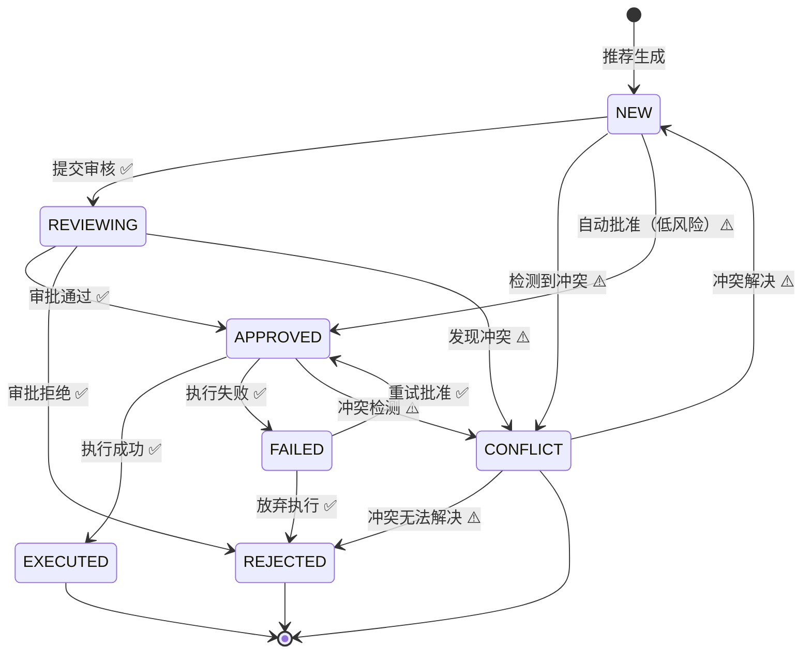
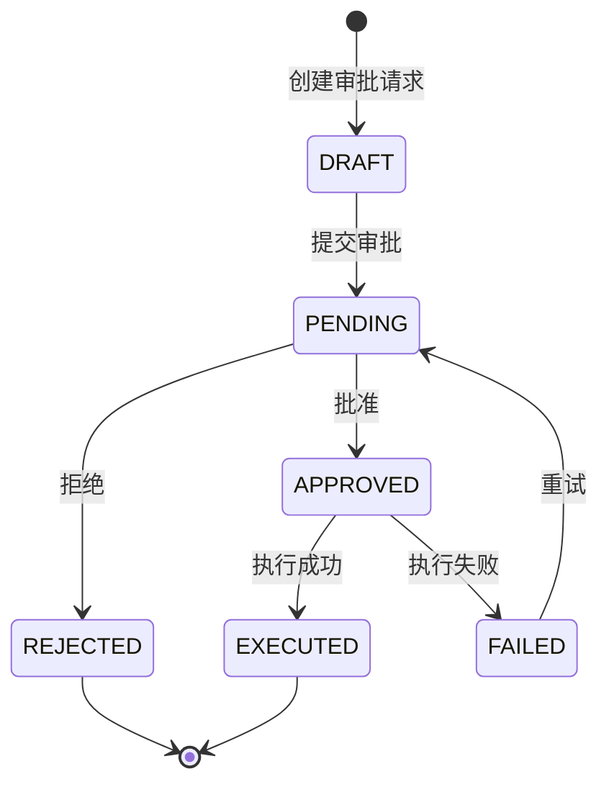
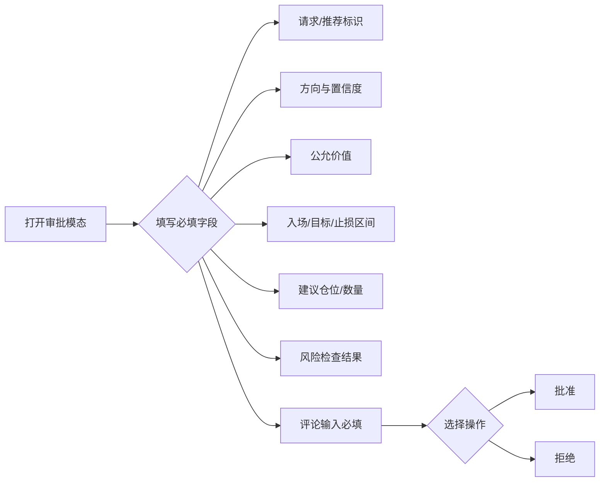
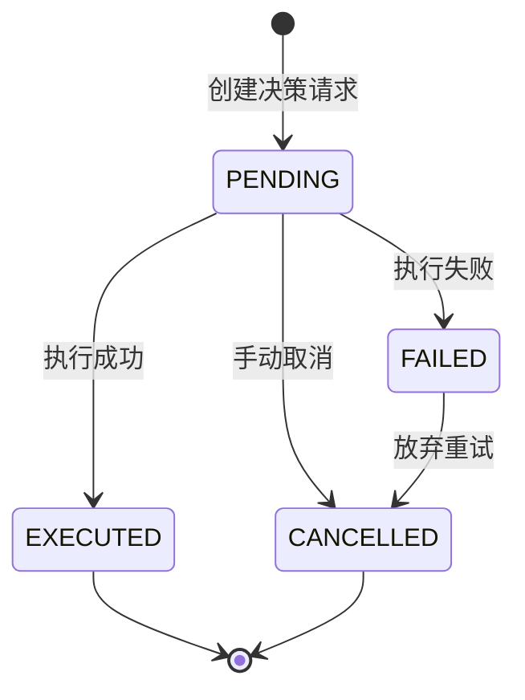
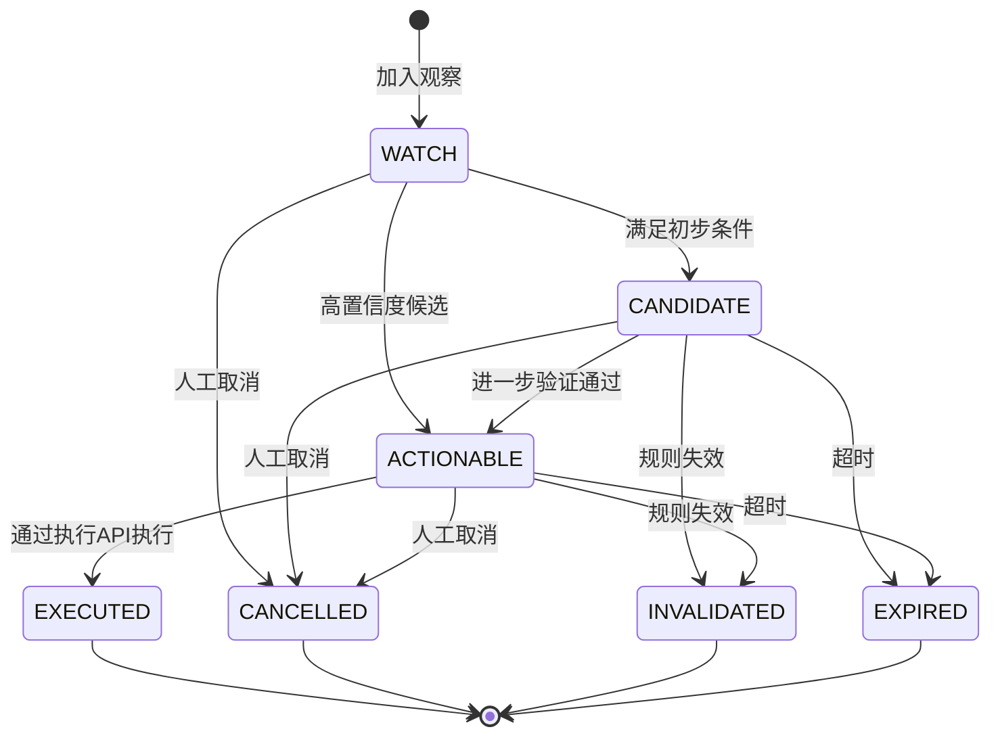

# 决策工作台状态流转图

> 文档版本: v1.1
> 创建日期: 2026-03-03
> 最后更新: 2026-03-03
> 适用范围: 决策工作台统一推荐系统

## 概述

决策工作台涉及三种核心状态机：

1. **RecommendationStatus** - 统一推荐状态
2. **ApprovalStatus** - 执行审批状态
3. **ExecutionStatus** - 决策请求执行状态

> **实现状态说明**：
> - ✅ 已实现：NEW → REVIEWING → APPROVED/REJECTED → EXECUTED/FAILED
> - ⚠️ 规划中：自动批准、冲突自动检测、DRAFT 状态

## 1. 推荐状态流转（RecommendationStatus）

### 1.1 状态流转图



### 1.2 状态说明

| 状态 | 说明 | 触发条件 | 实现状态 |
|------|------|----------|----------|
| NEW | 新建推荐刚生成 | 推荐引擎完成聚合和评分 | ✅ |
| REVIEWING | 正在审核 | 人工或自动审核流程启动 | ✅ |
| APPROVED | 审批通过等待执行 | 审批通过，等待执行接口调用 | ✅ |
| REJECTED | 审批拒绝 | 审批拒绝或放弃执行 | ✅ |
| EXECUTED | 执行完成 | 执行接口成功返回 | ✅ |
| FAILED | 执行失败 | 执行接口失败，可重试 | ✅ |
| CONFLICT | 同证券 BUY/SELL 冲突 | 检测到方向冲突，进入冲突队列 | ⚠️ | ✅ |
| REVIEWING | 正在审核 | 人工或自动审核流程启动 |
| APPROVED | 审批通过等待执行 | 审批通过，等待执行接口调用 |
| REJECTED | 审批拒绝 | 审批拒绝或放弃执行 |
| EXECUTED | 执行完成 | 执行接口成功返回 |
| FAILED | 执行失败 | 执行接口失败，可重试 |
| CONFLICT | 同证券 BUY/SELL 冲突 | 检测到方向冲突，进入冲突队列 |

### 1.3 状态转换规则

```python
# 定义位置: apps/decision_rhythm/domain/entities.py
class RecommendationStatus(Enum):
    NEW = "NEW"
    REVIEWING = "REVIEWING"
    APPROVED = "APPROVED"
    REJECTED = "REJECTED"
    EXECUTED = "EXECUTED"
    FAILED = "FAILED"
    CONFLICT = "CONFLICT"
```

**允许的状态转换：**

| 从状态 | 可转换到 | 触发操作 |
|--------|----------|----------|
| NEW | REVIEWING | 提交审核 |
| NEW | APPROVED | 自动批准（低风险场景） |
| NEW | CONFLICT | 冲突检测触发 |
| REVIEWING | APPROVED | 审批通过 |
| REVIEWING | REJECTED | 审批拒绝 |
| REVIEWING | CONFLICT | 发现冲突 |
| APPROVED | EXECUTED | 执行成功 |
| APPROVED | FAILED | 执行失败 |
| APPROVED | CONFLICT | 后续冲突检测 |
| FAILED | APPROVED | 重试并批准 |
| FAILED | REJECTED | 放弃重试 |
| CONFLICT | NEW | 冲突已解决 |
| CONFLICT | REJECTED | 冲突无法解决 |

**终态（不可再转换）：**
- EXECUTED
- REJECTED

## 2. 审批状态流转（ApprovalStatus）

### 2.1 状态流转图



### 2.2 状态说明

| 状态 | 说明 | 触发条件 |
|------|------|----------|
| DRAFT | 草稿初始状态 | 创建 ExecutionApprovalRequest |
| PENDING | 待审批已提交审批 | 点击去执行打开审批模态 |
| APPROVED | 已批准审批通过 | 审批模态确认批准 |
| REJECTED | 已拒绝审批拒绝 | 审批模态拒绝 |
| EXECUTED | 已执行执行完成 | 执行接口成功返回 |
| FAILED | 执行失败执行出错 | 执行接口失败 |

### 2.3 状态转换规则

```python
# 定义位置: apps/decision_rhythm/domain/entities.py
class ApprovalStatus(Enum):
    DRAFT = "DRAFT"
    PENDING = "PENDING"
    APPROVED = "APPROVED"
    REJECTED = "REJECTED"
    EXECUTED = "EXECUTED"
    FAILED = "FAILED"
```

**状态机实现位置：** `apps/decision_rhythm/domain/services.py:ApprovalStatusStateMachine`

```python
ALLOWED_TRANSITIONS = {
    ApprovalStatus.DRAFT: [ApprovalStatus.PENDING],
    ApprovalStatus.PENDING: [ApprovalStatus.APPROVED, ApprovalStatus.REJECTED],
    ApprovalStatus.APPROVED: [ApprovalStatus.EXECUTED, ApprovalStatus.FAILED],
    ApprovalStatus.REJECTED: [],  # 终态
    ApprovalStatus.EXECUTED: [],  # 终态
    ApprovalStatus.FAILED: [ApprovalStatus.PENDING],  # 允许重试
}
```

**允许的状态转换：**

| 从状态 | 可转换到 | 触发操作 |
|--------|----------|----------|
| DRAFT | PENDING | 提交审批 |
| PENDING | APPROVED | 审批通过 |
| PENDING | REJECTED | 审批拒绝 |
| APPROVED | EXECUTED | 执行成功 |
| APPROVED | FAILED | 执行失败 |
| FAILED | PENDING | 重试 |

**终态（不可再转换）：**
- REJECTED
- EXECUTED

### 2.4 审批模态必填字段



## 3. 执行状态流转（ExecutionStatus）

### 3.1 状态流转图



### 3.2 状态说明

| 状态 | 说明 | 触发条件 |
|------|------|----------|
| PENDING | 待执行等待执行 | 决策请求创建 |
| EXECUTED | 已执行执行完成 | 执行接口成功返回 |
| FAILED | 执行失败执行出错 | 执行接口失败 |
| CANCELLED | 已取消执行被取消 | 人工取消 |

### 3.3 状态转换规则

```python
# 定义位置: apps/decision_rhythm/domain/entities.py
class ExecutionStatus(Enum):
    PENDING = "PENDING"
    EXECUTED = "EXECUTED"
    FAILED = "FAILED"
    CANCELLED = "CANCELLED"
```

**状态机实现位置：** `apps/decision_rhythm/domain/services.py:ExecutionStatusStateMachine`

```python
ALLOWED_TRANSITIONS = {
    "PENDING": ["EXECUTED", "FAILED", "CANCELLED"],
    "FAILED": ["CANCELLED"],
    "EXECUTED": [],  # 终态
    "CANCELLED": [],  # 终态
}
```

**允许的状态转换：**

| 从状态 | 可转换到 | 触发操作 |
|--------|----------|----------|
| PENDING | EXECUTED | 执行成功 |
| PENDING | FAILED | 执行失败 |
| PENDING | CANCELLED | 手动取消 |
| FAILED | CANCELLED | 放弃重试 |

**终态（不可再转换）：**
- EXECUTED
- CANCELLED

## 4. 候选状态流转（CandidateStatus）

### 4.1 状态流转图



### 4.2 状态说明

| 状态 | 说明 | 触发条件 |
|------|------|----------|
| WATCH | 观察中 | Alpha 候选加入观察列表 |
| CANDIDATE | 候选 | 满足初步筛选条件 |
| ACTIONABLE | 可执行 | 高置信度，可执行 |
| EXECUTED | 已执行 | 通过执行 API 成功执行 |
| CANCELLED | 已取消 | 人工取消 |
| INVALIDATED | 已失效 | 规则触发失效 |
| EXPIRED | 已过期 | 超时失效 |

### 4.3 状态转换规则

**状态机实现位置：** `apps/decision_rhythm/domain/services.py:CandidateStatusStateMachine`

```python
ALLOWED_TRANSITIONS = {
    "WATCH": ["CANDIDATE", "ACTIONABLE", "CANCELLED", "INVALIDATED", "EXPIRED"],
    "CANDIDATE": ["ACTIONABLE", "CANCELLED", "INVALIDATED", "EXPIRED"],
    "ACTIONABLE": ["EXECUTED", "CANCELLED", "INVALIDATED", "EXPIRED"],
    "EXECUTED": [],      # 终态
    "CANCELLED": [],     # 终态
    "INVALIDATED": [],   # 终态
    "EXPIRED": [],       # 终态
}
```

**硬约束：** 仅 ACTIONABLE 状态可以执行，且 EXECUTED 状态只能通过执行 API 设置，不能直接标记。

## 5. 状态一致性保证机制

### 5.1 一致性要求

执行完成后，以下三处状态必须保持一致：

1. **UnifiedRecommendation.recommendation_status**
2. **DecisionRequest.execution_status**
3. **AlphaCandidate.candidate_status**

### 5.2 一致性保证策略

```mermaid
sequenceDiagram
    participant User as 用户
    participant API as 执行API
    participant Rec as UnifiedRecommendation
    participant Req as DecisionRequest
    participant Cand as AlphaCandidate
    participant DB as Database

    User->>API: POST /api/decision/execute/approve/
    API->>Rec: 更新 status=APPROVED
    API->>Req: 更新 execution_status=EXECUTED
    API->>Cand: 更新 candidate_status=EXECUTED

    alt 执行成功
        API->>Rec: 更新 status=EXECUTED
        DB->>DB: 事务提交
    alt 执行失败
        API->>Rec: 更新 status=FAILED
        API->>Req: 更新 execution_status=FAILED
        DB->>DB: 事务回滚
    end

    API-->>User: 返回执行结果
```

### 5.3 事务性保证

1. **数据库事务**：所有状态更新在同一数据库事务中完成
2. **状态机校验**：每次状态转换前通过状态机验证合法性
3. **幂等性保证**：执行接口支持幂等，防止重复执行
4. **行级锁**：关键状态更新使用行级锁防止并发冲突

### 5.4 状态同步时机

| 事件 | RecommendationStatus | ExecutionStatus | ApprovalStatus |
|------|----------------------|-----------------|----------------|
| 创建推荐 | NEW | - | DRAFT |
| 提交审核 | REVIEWING | - | PENDING |
| 审批通过 | APPROVED | PENDING | APPROVED |
| 执行成功 | EXECUTED | EXECUTED | EXECUTED |
| 执行失败 | FAILED | FAILED | FAILED |
| 审批拒绝 | REJECTED | CANCELLED | REJECTED |

## 6. 触发条件与转换规则详细说明

### 6.1 推荐生成触发条件

1. **数据汇聚完成**：Regime、Policy、Beta Gate、舆情、价格交易、财务、Alpha 分数全部就绪
2. **综合分计算完成**：模型分数主导 + 规则约束兜底
3. **Hard Gate 检查通过**：Beta Gate、Regime/Policy 禁止检查
4. **去重与冲突检测完成**：按 account_id + security_code + side 去重

### 6.2 冲突检测规则

```python
# 冲突检测逻辑
def detect_conflict(recommendations: List[UnifiedRecommendation]) -> Dict[str, List]:
    """
    检测同证券的 BUY/SELL 冲突

    冲突条件：同一账户、同一证券、同时存在 BUY 和 SELL 推荐
    """
    conflicts = {}
    for rec in recommendations:
        key = f"{rec.account_id}:{rec.security_code}"
        if key not in conflicts:
            conflicts[key] = {}
        if rec.side not in conflicts[key]:
            conflicts[key][rec.side] = []
        conflicts[key][rec.side].append(rec)

    # 冲突判定
    conflict_list = []
    for key, sides in conflicts.items():
        if "BUY" in sides and "SELL" in sides:
            conflict_list.append({
                "account_id": key.split(":")[0],
                "security_code": key.split(":")[1],
                "buy_recommendations": sides["BUY"],
                "sell_recommendations": sides["SELL"],
            })

    return conflict_list
```

### 6.3 状态转换钩子

```python
# 定义位置: apps/decision_rhythm/domain/services.py
class ApprovalStatusStateMachine:
    @classmethod
    def validate_transition(
        cls,
        from_status: ApprovalStatus,
        to_status: ApprovalStatus
    ) -> Tuple[bool, str]:
        """
        验证状态迁移并返回原因

        Returns:
            (是否合法, 错误原因)
        """
        if cls.can_transition(from_status, to_status):
            return True, ""
        return False, f"非法审批状态迁移: {from_status.value} -> {to_status.value}"
```

### 6.4 前端交互规则

1. **去执行必须打开审批模态**：不允许直接 confirm 后执行
2. **审批模态必填评论**：reviewer_comments 为必填项
3. **执行中状态可恢复**：按钮状态不允许永久"提交中"
4. **冲突处理**：同证券 BUY/SELL 冲突进入冲突队列，不直接可执行

## 7. 错误处理与回滚

### 7.1 状态转换失败处理

```python
# 状态转换异常处理流程
try:
    # 验证状态转换
    can_transition, error_msg = state_machine.validate_transition(
        from_status=current_status,
        to_status=new_status
    )
    if not can_transition:
        raise InvalidStateTransitionError(error_msg)

    # 执行状态转换
    update_status(new_status)

except InvalidStateTransitionError as e:
    # 记录错误日志
    logger.error(f"状态转换失败: {e}")
    # 回滚到原状态
    revert_to_original_state()
    # 返回错误信息
    return error_response(error=str(e))
```

### 7.2 执行失败重试机制

1. **FAILED 状态允许重试**：FAILED -> PENDING -> APPROVED -> EXECUTED
2. **重试次数限制**：默认最多重试 3 次
3. **重试退避**：使用指数退避策略，避免频繁重试
4. **最终失败**：超过重试次数后转为 REJECTED

### 7.3 冲突解决策略

1. **人工介入**：冲突项进入冲突队列，需要人工决策
2. **置信度优先**：保留置信度更高的推荐
3. **时间戳优先**：同等置信度下保留最新的推荐
4. **强制取消**：人工选择取消 BUY 或 SELL 推荐

## 8. 附录

### 8.1 相关实体定义

```python
# apps/decision_rhythm/domain/entities.py

class UnifiedRecommendation:
    """统一推荐对象"""
    recommendation_id: str
    account_id: str
    security_code: str
    side: RecommendationSide
    recommendation_status: RecommendationStatus
    composite_score: float
    confidence: float
    # ... 其他字段

class ExecutionApprovalRequest:
    """执行审批请求"""
    request_id: str
    recommendation_id: str
    approval_status: ApprovalStatus
    reviewer_comments: str
    # ... 其他字段

class DecisionRequest:
    """决策请求"""
    request_id: str
    execution_status: ExecutionStatus
    account_id: str
    # ... 其他字段

class AlphaCandidate:
    """Alpha 候选"""
    candidate_id: str
    candidate_status: str  # WATCH/CANDIDATE/ACTIONABLE/EXECUTED/...
    security_code: str
    # ... 其他字段
```

### 8.2 API 端点映射

| 操作 | API 端点 | 状态变化 |
|------|----------|----------|
| 创建推荐 | POST /api/decision/workspace/recommendations/refresh/ | NEW |
| 提交审批 | POST /api/decision/execute/preview/ | REVIEWING + PENDING |
| 批准执行 | POST /api/decision/execute/approve/ | APPROVED -> EXECUTED |
| 拒绝执行 | POST /api/decision/execute/reject/ | REJECTED |
| 查询冲突 | GET /api/decision/workspace/conflicts/ | CONFLICT |

### 8.3 参考文档

- [决策工作台规格文档](../plans/decision-workspace-topdown-bottomup-outsourcing-spec-2026-03-02.md)
- [领域实体定义](../../apps/decision_rhythm/domain/entities.py)
- [状态机实现](../../apps/decision_rhythm/domain/services.py)
