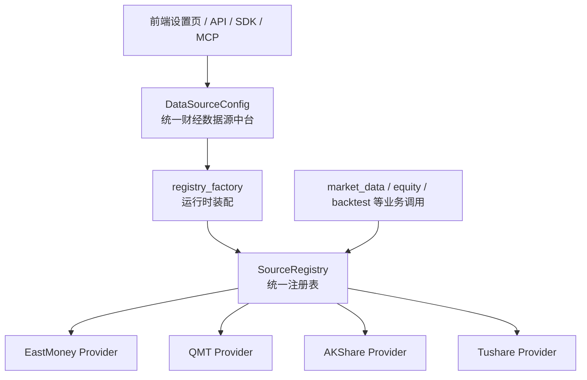

# 统一财经数据源中台与统一注册表说明

> 更新日期：2026-03-28
> 适用版本：AgomTradePro 0.7.0

---

## 1. 先说结论

系统里现在有两层容易混淆的概念：

1. `统一财经数据源中台`
负责“配什么源”。

2. `统一注册表`
负责“运行时怎么选源”。

两者不是重复建设，而是分工不同。

---

## 2. 一句话定义

### 2.1 统一财经数据源中台

统一财经数据源中台是配置层。

它的职责是：

- 存储数据源条目
- 管理启用状态、优先级、密钥、连接参数
- 给前端设置页、API、SDK、MCP 提供统一入口
- 给运行时层提供配置来源

当前主配置模型：

- `apps.macro.infrastructure.models.DataSourceConfig`

典型字段：

- `source_type`
- `priority`
- `is_active`
- `api_key`
- `http_url`
- `extra_config`

例子：

- Tushare 的第三方代理地址放在 `http_url`
- QMT 的本地连接参数放在 `extra_config`

### 2.2 统一注册表

统一注册表是运行时调度层。

它的职责是：

- 注册所有可用 provider
- 按“能力”而不是按“站点名”分发请求
- 按优先级排序
- 记录健康状态
- 失败时自动 failover
- 触发熔断和恢复

核心实现：

- `apps.market_data.infrastructure.registries.source_registry.SourceRegistry`
- `apps.market_data.application.registry_factory`

---

## 3. 为什么要拆成两层

如果只有配置层，没有注册表：

- 每个业务模块都会自己判断“先调谁、挂了换谁”
- failover 逻辑会散落在 `equity / fund / backtest / market_data`
- 健康状态无法统一观测

如果只有注册表，没有配置层：

- 数据源参数只能写在 settings 或代码里
- 前端、API、MCP 无法统一管理
- 运维和管理员无法在线修改

所以必须拆成：

- 配置层：统一财经数据源中台
- 运行时层：统一注册表

---

## 4. 当前架构图

---

## 5. 统一注册表到底在注册什么

注册表不关心“这是东财还是 QMT”本身。

它只关心每个 provider 支持什么能力。

当前能力枚举定义在：

- `apps.market_data.domain.enums.DataCapability`

主要包括：

- `REALTIME_QUOTE`
- `HISTORICAL_PRICE`
- `TECHNICAL_FACTORS`
- `CAPITAL_FLOW`
- `STOCK_NEWS`

每个 provider 只需要实现统一协议：

- `apps.market_data.domain.protocols.MarketDataProviderProtocol`

这样业务模块调用时，只需要表达“我要实时行情”，不用直接写死“必须调某个站点”。

---

## 6. 运行时是怎么工作的

以“获取实时行情”为例。

### 6.1 请求进入

业务层或接口层发起请求，例如：

- `get_realtime_quotes`

它只声明需要：

- `DataCapability.REALTIME_QUOTE`

### 6.2 注册表选源

`SourceRegistry` 会：

1. 找出所有支持 `REALTIME_QUOTE` 的 provider
2. 按优先级排序
3. 先调优先级最高的 provider
4. 如果异常或返回空结果，则自动尝试下一个
5. 记录成功/失败次数
6. 连续失败达到阈值后打开熔断

### 6.3 结果返回

只要某个 provider 返回了有效结果，调用方就拿到标准化后的领域对象。

调用方不需要知道底层到底是：

- 东方财富
- QMT
- AKShare
- Tushare

---

## 7. 当前 provider 排布

当前 `market_data` 注册工厂的主线路是：

1. 东方财富
2. QMT
3. AKShare 通用
4. Tushare

说明：

- 东方财富是主行情源
- QMT 是本地终端行情源
- AKShare 是通用备用源
- Tushare 主要承担准实时/日线级备用

实际注册顺序和优先级以运行时配置为准。

---

## 8. QMT 放在哪一层

QMT 现在只接入了“行情 provider”这一层，不接交易。

也就是说，QMT 目前属于：

- `统一注册表` 管理的一个 provider

而不是：

- 独立的交易通道子系统

当前支持能力：

- 实时行情
- 技术快照
- 日线历史 K 线

当前不包含：

- 下单
- 撤单
- 持仓同步
- 成交回报
- 账户查询

如果未来要做 QMT 交易，应该新增 broker/trading adapter，而不是继续堆进 `market_data` provider。

---

## 9. 为什么 QMT 配置放在数据源中台

因为 QMT 行情本质上仍然是“财经数据来源”。

所以它的配置适合放在统一财经数据源中台里，例如：

- `source_type = qmt`
- `priority = 15`
- `is_active = true`
- `extra_config = {"client_path": "...", "data_dir": "..."}`

这样做的好处：

- 前端设置页统一
- API / SDK / MCP 统一
- 运维入口统一
- registry 可以直接读取数据库配置注册 provider

---

## 10. Tushare 与 QMT 的配置差异

### 10.1 Tushare

关键配置：

- `api_key`
- `http_url`

说明：

- `http_url` 用来下发到 `pro._DataApi__http_url`
- 适配第三方 Tushare 代理源

### 10.2 QMT

关键配置：

- `extra_config`

常见参数：

- `client_path`
- `data_dir`
- `dividend_type`

说明：

- QMT 行情通常是本地终端连接，不走远程 token 模式
- 所以一般不依赖 `api_key / api_secret`

---

## 11. 当前边界约束

### 11.1 `macro` 模块

承担配置中心入口职责：

- 数据源配置表
- 设置页
- 配置 API
- SDK / MCP 配置入口

### 11.2 `market_data` 模块

承担运行时行情调度职责：

- provider 协议
- registry
- failover
- 熔断
- 健康状态

### 11.3 不要混用

不要把下面两件事写在一起：

- “配置数据源条目”
- “业务代码里自己手写主备切换”

正确方式是：

- 配置进中台
- 运行时交给统一注册表

---

## 12. 典型调用链

### 12.1 Tushare 第三方代理

1. 管理员在数据源中台配置 `tushare`
2. 填写 `api_key`
3. 填写 `http_url`
4. 运行时创建 Tushare client
5. 系统把 `http_url` 写入 `pro._DataApi__http_url`

### 12.2 QMT 行情源

1. 管理员在数据源中台配置 `qmt`
2. 在 `extra_config` 填本地 XtQuant 参数
3. `registry_factory` 读取激活的 `qmt` 条目
4. 注册 `QMTGateway`
5. 业务请求实时行情时，统一注册表按优先级调度 QMT

---

## 13. 设计收益

这套拆分的实际收益是：

- 数据源接入标准化
- 前端/API/SDK/MCP 入口统一
- 业务模块不再硬编码主备切换
- 新增 provider 成本变低
- 健康状态和故障转移可观测

对当前项目尤其重要，因为后续还会继续扩：

- Wind
- Choice
- 更多本地终端源
- 可能的 broker/trading adapter

---

## 14. 未来建议

### 14.1 配置域命名继续收口

目前配置模型还在 `macro` 模块中，名字历史上叫“宏观数据源配置”，但实际已经承载“统一财经数据源中台”职责。

后续建议在命名口径上继续统一成：

- 财经数据源配置
- 数据源中台

### 14.2 QMT 交易能力单独建模

如果后续接交易，不建议沿用当前 provider 协议直接扩。

建议单独建立：

- Broker Protocol
- Order Adapter
- Account Adapter
- Trade Event Sync

### 14.3 provider 能力继续细分

未来可继续细分能力，例如：

- `ETF_REALTIME_QUOTE`
- `INDEX_REALTIME_QUOTE`
- `FUND_NAV`
- `FUTURES_QUOTE`

这样统一注册表会更精确。

---

## 15. 相关代码入口

配置层：

- `apps.macro.infrastructure.models.DataSourceConfig`
- `apps.macro.interface.views.config_api`
- `core/templates/datasource/config.html`

运行时层：

- `apps.market_data.application.registry_factory`
- `apps.market_data.infrastructure.registries.source_registry`
- `apps.market_data.domain.protocols.MarketDataProviderProtocol`

当前 provider：

- `apps.market_data.infrastructure.gateways.akshare_eastmoney_gateway`
- `apps.market_data.infrastructure.gateways.akshare_general_gateway`
- `apps.market_data.infrastructure.gateways.tushare_gateway`
- `apps.market_data.infrastructure.gateways.qmt_gateway`

---

## 16. 最后一句

统一财经数据源中台解决的是“怎么配”。

统一注册表解决的是“运行时怎么选、怎么切、怎么观察”。

两者一起，才是完整的统一数据源架构。
