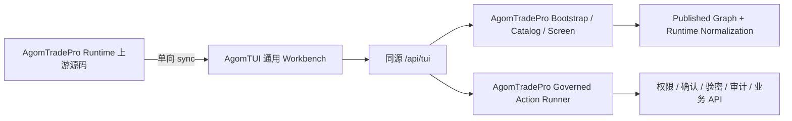

# AgomTUI 可移植性整改方案：TUI IA 跨仓库交付与宿主边界

> **日期**: 2026-07-21  
> **状态**: 待批准  
> **上游主计划**: [TUI 信息架构重构计划](tui-ia-consolidation-2026-07-20.md)  
> **涉及仓库**: `AgomTradePro`（业务宿主与 Runtime 唯一上游）、`AgomTUI`（通用框架与下游镜像）  
> **目标模式**: AgomTUI 提供通用 Workbench；AgomTradePro 继续提供业务 metadata、runtime normalization、认证权限、action executor、审计和业务 API

## 一、整改结论

TUI IA 收敛完成后可以平移到 AgomTUI，但“平移”必须按层处理：

- 通用 Runtime、Workbench、CSS、schema manifest 可以通过既有单向同步机制平移。
- 13/16 屏信息架构、金融业务 action、published graph 和 runtime injection 属于 AgomTradePro 产品制品，不得进入 AgomTUI core/runtime。
- AgomTUI 若作为 AgomTradePro 的新壳，应通过同源 `/api/tui` 调用 AgomTradePro 的 bootstrap、catalog、screen、action API。
- AgomTUI 若脱离 AgomTradePro 独立运行，则必须另行实现 metadata repository、角色过滤、runtime hook、action executor、确认验密和审计存储；这不属于本轮平移范围。

本轮完成标准是“AgomTUI 壳可无损承载 AgomTradePro 最终 TUI 契约”，不是“把 AgomTradePro 业务搬进 AgomTUI 框架仓库”。

## 二、现状证据与差距

### 2.1 已具备能力

- AgomTUI 已明确为 framework，不拥有宿主业务逻辑、认证、权限、审计存储或产品工作流。
- AgomTradePro 的 `frontend/agomtui-runtime/`、`frontend/tui-workbench/`、生成 bundle、CSS 和 runtime manifest 已进入 AgomTUI 单向同步白名单。
- 当前两仓库 `20-dashboard.js`、`30-actions.js` 内容哈希一致。
- 当前 AgomTradePro published graph 包含 37 个屏、372 个 action，已通过 AgomTUI `validate-metadata`。
- 当前 AgomTUI `check-usability` 尚未通过：5 个 error 均为首页 panel 跨屏引用 action，另有 283 个存量 warning；这些结果作为整改基线，不视为已达标。
- AgomTUI `sync_from_agomtradepro.py --check` 当前全部 `UNCHANGED`。
- AgomTUI 当前 `check:runtime`、6 个 Runtime JS 测试、34 个 core/runtime sync Python 测试已通过。

### 2.2 必须整改的差距

1. **产品 metadata 不在同步范围**：AgomTUI Runtime 明确不接收 published business graph，最终 13/16 屏不会随 Runtime 自动出现。
2. **runtime injection 属于 Django 宿主**：个人 AI 服务商、系统服务商、用户 quota、MCP、风控、实时提醒等屏/action 当前由 AgomTradePro repository 动态注入。
3. **host adapter 存在旧 key**：`operator.home.enter_governance_flow` 仍跳转 `api-library.runtime`；`slowActionScreens` 仍引用 `capability-router.gateway`，两者在 IA 收敛后都会失效。
4. **同名 schema v3 存在差异**：AgomTUI core schema 尚未正式声明 AgomTradePro 已使用的 `screen.audience`、`entry_mode`、`entry_field_key`、`dashboardRowAction`、result field presentation 等全部约束。
5. **权限只能由宿主执行**：AgomTUI Runtime 能渲染 `audience` 和 admin panel，但不能自行判定用户角色或保护 action API。
6. **跨域登录态不可直接复用**：Workbench fetch 当前使用 `credentials=same-origin` 和 Django CSRF cookie，独立域名直接访问会失去会话和 CSRF。
7. **旧 key alias 属于宿主导航契约**：AgomTUI 通用 Runtime 不应硬编码 AgomTradePro 的 screen alias。
8. **首页 panel 不满足 AgomTUI 可用性约束**：`command-center.overview` 的 Regime、Pulse、账户、Alpha、任务面板引用其他 screen 的 action；通用 Runtime 无法保证这些 action 出现在当前 screen payload。

## 三、目标架构与所有权



### 3.1 AgomTradePro 所有权

- 13/16 屏 IA、8 步链、业务文案和旧 key alias。
- published graph、DB registry、runtime injection 与 screen/action patch。
- 用户角色、screen audience 过滤、action 权限、确认、验密和审计。
- operator home 聚合、governance queue、业务 renderer/host hook。
- `/api/tui/bootstrap/`、catalog、screen、action 和静态资源同源入口。
- `frontend/agomtui-runtime/` 与 `frontend/tui-workbench/` 的通用 Runtime 源码所有权。

### 3.2 AgomTUI 所有权

- host-neutral schema、metadata validation、runtime protocol 和编译器。
- 通用 Workbench 打包、reference host、renderer 扩展协议。
- 对 AgomTradePro Runtime manifest 的兼容校验和下游镜像测试。
- 通用 host adapter 示例，不包含 AgomTradePro screen key、金融文案或权限逻辑。

### 3.3 禁止越界

- 禁止把 `tui_operation_graph.published.json` 加入 Runtime 同步白名单。
- 禁止在 AgomTUI core/runtime 硬编码 `command-center.*`、`macro-regime.*`、`risk-center.*` 等产品 key。
- 禁止从 AgomTUI 下游把同步文件反向复制回 AgomTradePro。
- 禁止仅靠浏览器隐藏 admin screen/action；后端必须继续执行权限检查。
- 禁止为跨域便利放宽 CSRF、cookie 或 action 审计要求。

## 四、整改主线

### R0 — 契约冻结与双端基线

在修改 IA 前锁定可移植性基线：

- 记录 AgomTradePro published graph hash、Runtime manifest build id、AgomTUI 下游 manifest hash。
- 保存两边 schema v3 的结构差异清单，不以文件名相同代替兼容性证明。
- 用两个 validator 校验同一份 published graph。
- 记录当前 Runtime sync `--check`、JS/Python 测试结果。
- 明确部署模式为“同源 AgomTUI shell + AgomTradePro API”；独立业务宿主不纳入本轮。

**完成门槛**：基线证据可重复生成；双端 validator 均通过；没有未解释的 schema 差异。

### R1 — AgomTradePro host adapter 去旧 key

更新 `frontend/agomtradepro-host/src/index.js`：

- `operator.home.enter_governance_flow` 的目标从 `api-library.runtime` 改为 `api-library.data-center`。
- `slowActionScreens` 删除 `capability-router.gateway`，需要保留治理快捷入口时改为 `capability-router.mcp-center`。
- 复核 home action、governance lane、last workspace、pinned screen 中所有旧 key。
- 增加测试，禁止 adapter 引用 `LEGACY_SCREEN_ALIASES` 中的来源 key。

**完成门槛**：被删除 screen key 在 host adapter、workflow、panel target、测试夹具中零引用；alias 测试除外。

### R2 — 通用 Runtime 改动可同步化

TUI IA 主计划允许两类 Runtime 改动：

1. admin GET dashboard panel 受控自动加载；
2. Phase 0 证明必要时增加 task group 折叠。

实施要求：

- 改动只能落在 AgomTradePro 上游 `frontend/agomtui-runtime/` 或 `frontend/tui-workbench/`。
- 判断必须基于通用 metadata 字段，不能判断具体产品 screen/action key。
- admin 自动加载只接受 GET/HEAD/OPTIONS、当前 admin screen payload 中存在的 action；后端仍执行权限校验。
- 组折叠只使用 `task_group`、`task_tier` 和通用状态，不引入金融业务分组常量。
- 同步前运行上游 build/check/test；同步后运行 AgomTUI runtime check/test。

**完成门槛**：AgomTUI “business leakage” 测试通过；下游只出现同步白名单内的通用 diff。

### R3 — schema 与协议兼容整改

AgomTUI core 是独立产品边界，schema 变更不能通过 Runtime sync 覆盖。应在 AgomTUI 独立提交中评审：

- 正式声明并验证 `screen.audience = authenticated | admin`。
- 评估并对齐 `entry_mode`、`entry_field_key`。
- 对齐 `dashboardRowAction`、panel `target_screen` 和 result field presentation。
- 保留兼容默认：旧 metadata 缺少 `audience` 时默认 authenticated。
- 更新 AgomTUI metadata validator、runtime normalization 和相关 core tests。
- 用最终 AgomTradePro published graph 作为外部兼容夹具或 CI 输入，但不把业务 graph 提交进 AgomTUI core 包。
- `check-usability` 必须保持 panel action 与当前 screen 一致的约束；不得仅因存在 `target_screen` 就放宽数据加载 action 的归属检查。

**完成门槛**：两边 schema 差异均被分类为“已对齐”或“有意的宿主扩展”；最终 graph 在双端 validator 下语义一致。

### R4 — 产品 metadata 与 runtime normalization 交付

不通过 Runtime sync 搬运业务 graph，改用以下交付方式：

- 生产运行：AgomTUI shell 直接调用 AgomTradePro `/api/tui/bootstrap/`，由后端返回角色过滤后的最终 catalog 和 screen。
- 发布审核：AgomTradePro 继续以 DB registry 为主、published JSON 为 fallback。
- 跨仓库测试：测试任务读取 AgomTradePro reviewed published graph；不得复制为 AgomTUI 长期真源。
- runtime injection 继续由 AgomTradePro repository 执行；AgomTUI 不维护重复 injection 表。
- 增加只读契约快照：普通用户 catalog 13 屏、admin catalog 16 屏、8 步 workflow、3 个治理屏和 alias 解析结果。
- 首页 Regime/Pulse/账户/Alpha/任务面板改为引用 `command-center.overview` 自己的 `operator.home.*` aggregate action；必要时先把稳定 operator action 从 runtime injection 提升到 curated `APPROVED_OPERATION_ACTIONS`。面板的“打开详情”再通过 `target_screen` 导航到业务屏。

**完成门槛**：AgomTUI shell 得到的目录与 AgomTradePro 原生 `/tui/` 一致；不存在两套 IA 真源。

### R5 — 同源宿主接入

推荐部署：

- AgomTUI shell 静态资源与 `/api/tui` 置于同一 origin，优先通过 AgomTradePro 模板或反向代理实现。
- `apiBase` 指向同源 `/api/tui`，`bootstrapUrl` 指向 `/api/tui/bootstrap/`。
- 保留 `credentials=same-origin`、CSRF cookie、`X-CSRFToken` 和后端 session auth。
- operator home、governance queue、CLI 等产品行为由 AgomTradePro host adapter 配置；不进入通用 reference HTML。
- 旧 key alias 在 bootstrap、screen API、分享快照和收藏恢复中由同一个 AgomTradePro resolver 处理。

若必须跨域，必须另起安全设计，明确 CORS allowlist、SameSite、CSRF trusted origins、凭证策略和反向代理边界；不得在本轮临时放宽。

**完成门槛**：同源环境下普通用户和管理员均可登录、刷新、运行 read/write/admin action，确认、验密和审计不退化。

### R6 — 双仓库测试与发布门禁

AgomTradePro 门禁：

- 完成 TUI IA 主计划全部 metadata、unit、JS、Playwright 回归。
- `npm run build:tui`、`npm run check:tui`、`npm run test:tui-js` 全绿。
- 最终 published graph 通过 AgomTradePro validator。
- host adapter 无已删除 key；catalog 13/16、workflow 8 步、alias 全绿。

AgomTUI 门禁：

- 最终 graph 通过 `agomtui_compiler.cli validate-metadata` 和 `check-usability`。
- `check-usability.error_count` 必须为 0；283 个存量 warning 建立分类基线并按本次变更不新增原则约束，P0 panel、权限和 action executor 相关 warning 必须在本轮消除。
- `sync_from_agomtradepro.py --check` 在应用同步后为 `UNCHANGED`。
- `npm run check:runtime`、`npm run test:runtime-js` 全绿。
- agomtui-core、agomtui-runtime、demo Django host 测试全绿。
- 增加一个外部宿主契约测试：用 AgomTUI shell 请求 AgomTradePro bootstrap，验证 13/16 屏和 8 步链。

## 五、分阶段实施

### Phase P0 — 可移植性基线

- 完成 R0。
- 建立 schema diff 和旧 key inventory。
- 把本方案与 TUI IA 主计划相互链接。

### Phase P1 — 上游就绪

- TUI IA 主计划完成 Phase 0–3。
- 完成 R1、R2。
- 最终 Runtime build、manifest 和 published graph 在 AgomTradePro 侧冻结。

### Phase P2 — AgomTUI 契约对齐与同步

- 在 AgomTUI 独立提交完成 R3。
- 通过 manifest 执行一次 `--apply`，审阅只读镜像 diff。
- 完成 AgomTUI Runtime/Core 回归。

### Phase P3 — 同源集成与 UAT

- 完成 R4、R5。
- 用普通用户走 8 步 daily 流程和 AI/MCP 自助。
- 用管理员走 3 个治理屏和 admin GET P0。
- 验证旧 key、确认、验密、审计、错误恢复和 console。

### Phase P4 — 发布与收口

- 完成 R6 全部门禁。
- AgomTradePro 先发布 backend/metadata，再发布与其兼容的 AgomTUI Runtime 壳。
- 更新两仓库文档、manifest build id、兼容矩阵和回滚说明。
- 交付总结分别列出两仓库已完成项、未完成项、已验证测试、未验证风险。

## 六、验证命令

### 6.1 AgomTradePro 上游

```powershell
npm run build:tui
npm run check:tui
npm run test:tui-js
agomtradepro\Scripts\python.exe tui-metadata-compiler\scripts\validate_tui_metadata.py config\tui\published\tui_operation_graph.published.json
```

### 6.2 AgomTUI 下游检查

以下为本机示例；路径应通过任务变量或本地 sync config 提供，不写入同步 manifest：

```powershell
$agomTradeProRoot = "D:\githv\agomTradePro"
$agomTuiRoot = "D:\githv\AgomTUI"
Push-Location $agomTuiRoot
$env:PYTHONPATH="$agomTuiRoot\packages\agomtui-core\src;$agomTuiRoot\packages\agomtui-compiler\src;$agomTuiRoot\packages\agomtui-runtime\src"
python scripts\sync_from_agomtradepro.py --source-root $agomTradeProRoot --check
python -m agomtui_compiler.cli validate-metadata --metadata-file "$agomTradeProRoot\config\tui\published\tui_operation_graph.published.json"
python -m agomtui_compiler.cli check-usability --metadata-file "$agomTradeProRoot\config\tui\published\tui_operation_graph.published.json"
npm run check:runtime
npm run test:runtime-js
python -m unittest discover packages\agomtui-core\tests
python -m unittest discover packages\agomtui-runtime\tests
python demo\django_host\manage.py test django_host
Pop-Location
```

首次应用同步时使用 `--apply`，随后必须重新执行 `--check` 并得到 `UNCHANGED`；不得把 `--apply` 放进无人审阅的自动发布步骤。

## 七、风险与回滚

| 风险 | 防护 | 回滚 |
|---|---|---|
| schema 同名但语义漂移 | 双 validator + schema diff inventory | 回退 AgomTUI core 独立提交，不回写上游 Runtime |
| 删除屏后 host adapter 仍跳旧 key | 禁止旧 key 引用测试 | 回退 adapter commit 或临时通过 alias resolver 承接 |
| 产品业务泄漏到通用 Runtime | sync allowlist + business leakage test | 回退 Runtime sync commit 与 manifest build |
| 跨域导致登录/CSRF 失效 | 同源部署或反向代理 | 恢复 AgomTradePro 原生 `/tui/` 入口 |
| DB registry 与文件 graph 不一致 | reviewed publish + source hash | 用旧 reviewed baseline 重新 publish |
| 两仓库发布顺序不兼容 | backend/metadata 先发，壳后发 | 回退 AgomTUI 静态 bundle，不回退业务 DB |
| runtime injection 形成第二真源 | injection 只留 AgomTradePro | 删除下游重复定义，恢复 API 驱动 |

可用的运行时回滚开关继续使用：`TUI_OPTIMIZED_BOOTSTRAP_ENABLED`、`TUI_RUNTIME_CACHE_ENABLED`；回滚不允许关闭权限、确认、验密或审计。

## 八、完成定义

- TUI IA 主计划在 AgomTradePro 本地完成，普通用户 13 屏、管理员 16 屏、8 步链全绿。
- AgomTradePro host adapter 不引用已删除 screen key。
- 最终 published graph 同时通过 AgomTradePro 和 AgomTUI validator/usability check。
- AgomTUI `check-usability` error 为 0，首页 panel 不再跨屏引用数据 action；warning 不超过批准后的分类基线。
- AgomTUI core 对 `audience` 等已采用契约有明确验证或有记录的兼容策略。
- 通用 Runtime 变更通过单向 manifest 同步，下游检查为 `UNCHANGED`，且没有业务 key 泄漏。
- AgomTUI shell 通过同源 `/api/tui` 获得与 AgomTradePro 原生 `/tui/` 一致的角色目录和 screen contract。
- read/write/admin action 的权限、确认、验密和审计没有退化。
- 旧 key 在 bootstrap、screen API、收藏和分享快照中解析到正确目标。
- 两仓库均有独立 commit、测试记录、兼容矩阵和回滚点。

## 九、不做

- 不把 AgomTradePro 金融业务代码、业务 metadata 或 runtime injection 搬入 AgomTUI core/runtime。
- 不建设脱离 AgomTradePro 的第二套生产业务后端。
- 不修改单向同步方向。
- 不为本轮平移放宽 cookie、CSRF、权限、确认、验密或审计。
- 不在同一提交中混合 AgomTradePro IA、AgomTUI core schema 和部署代理三条主线。
