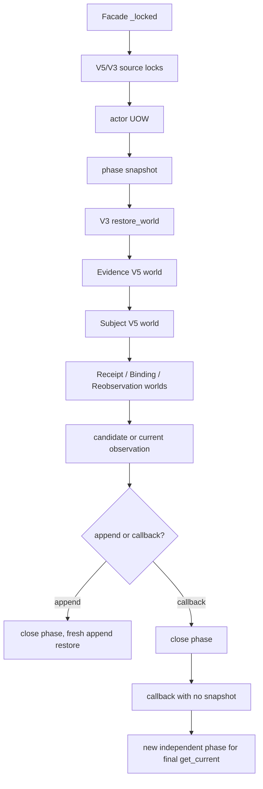

# Authority V3 Facade 写路径性能整改方案（EVID-09，2026-09-13）

> 当前状态：DATA-16 已完成仓库退出并实际部署、激活四个严格策略头；
> 后续有界性能工作登记为唯一 repository focus EVID-09；优化接线与标准部署已完成，
> 新作用域的真实 configured-validity 生产生命周期已通过 27 阶段与独立恢复复核；
> 最终候选已通过三次真实隔离 PostgreSQL 测量；兼容镜像回滚尚未演练，EVID-09 保持 active。
> 已完成的 EVID-08 不重新打开；本文保留其历史诊断，后续状态以机器注册表为准。
>
> 实际模型设置：`gpt-5.6-luna / max`。

> EVID-09 实施进展：`75e033b4e` 将通用机制移至shared并让SourceV2纯读复用，
> 原Account入口保持同函数对象；真实数据库语义RED为SELECT2而期望1，修复后13 passed。
> `6b1e63303` 追加强制独立read phase和mutation/callback期间缓存暂停；包含外层
> active snapshot的16项回归通过，新增helper增量mypy及格式/Ruff通过。
> `58077d980` 完成 typed Application read-phase 注入、锁后读取、append/CAS 前退出、
> `with_current` 两个独立 phase 与外层缓存暂停；源码冻结综合回归实际 142 passed、
> 9 个 opt-in skipped，六个生产文件增量 mypy 为零，全仓 mypy 债务为零，文件增长
> 门禁通过。`1e309dc28` 单独更新静态读取面投影，未提高债务基线。
> 源码冻结的 17 项完整静态/架构/治理门禁全部通过；五份原始回归/门禁记录与
> 16 个执行源码哈希封存于
> [读取阶段代码验证](../testing/evid09-read-phase-code-validation-2026-09-13.json)。
> 三次同源隔离 PostgreSQL 测量已在 `e9835fb58` 实际完成，三轮 exit 0，
> 5893 个源文件前后及跨轮 raw/LF 哈希一致，五项 Domain header witness 完整，
> 各轮独立 PostgreSQL 前后检查均为零表、零其他连接，协调进程已释放测量锁。
> [三轮测量封存](../testing/evid09-three-isolated-postgres-measurements-2026-09-13.json)
> 与 [原始工件归档](../testing/evid09-three-isolated-postgres-originals-2026-09-13.json)
> 保留真实 probe/fixture 范围及失败 witness pilot；优化部署已实际完成，真实生产生命周期仍待完成。
> 上述 skipped 不计为 PostgreSQL 通过，EVID-09 保持 active。
> [完整物理解码诊断封存](../testing/evid09-facade-physical-decode-diagnostic-2026-09-13.json)
> 保留原测量failed、绿色JUnit和独立清理/release；五个后验源码canonical LF哈希
> 与Git一致，三个raw差异仅CRLF，仍不补签原运行期间的source snapshot一致性。
>
> 当前生产：`f121000df1276472f172a93c16961fa74f433192` / release `source-20260914173239`。
> [当前部署保护证据](../deployment/evid09-standard-deployment-preservation-facade-reuse-v5-2026-09-14.json)
> 与 [27 阶段生产复测](../deployment/evid09-passing-facade-reuse-lifecycle-2026-09-14.json)
> 已经独立核验；以下回滚镜像信息保留其历史状态，不表示本次已演练回滚。
> 新兼容回滚镜像已实际固定为 `agomtradepro-evid09-compatible-rollback:20260914021633`，
> image `sha256:f5647b6d4a17c81963a41dd4d66dee70ccfc4b18e881b368db4b89dda7bf86fd`；
> 旧 DATA-16 兼容镜像 `agomtradepro-data16-compatible-rollback:20260913212011` /
> `sha256:b94983e0ebdc96d32ea7590c697e9652bf34bf3d554a5fd0b4d54d2f00861447` 仍在。
> 两个回滚点均未在本轮演练，严格 Publication 策略不得回退。
> [本轮部署及独立保护证据](../deployment/evid09-standard-deployment-preservation-2026-09-14.json)；
> [历史 DATA-16 部署/激活证据](../deployment/data16-standard-deployment-and-policy-activation-2026-09-13.json)。
> 历史 Account 行为基线为 `b18b18029f90af4b23693426a1f489af44ffe2b2`。
> 该提交只在 `OwnerTenantAuthorityV3Facade._locked` 外层加入已有的
> `validation_graph_operation`；后续 Account 性能改动须能独立恢复该行为。整应用镜像
> 回滚必须兼容当时已激活的 Publication policy/evidence，不能据此自动部署旧 b18 镜像。

## 1. 结论

2026-09-13 新增真实隔离 PostgreSQL Facade 测量：JUnit 1 passed/5312.682秒，
`runtest_call` 探针范围4686.704秒；stdlib物理解码6284次/0.700012秒，SQL7002次
（SELECT6741、非SELECT261），client execute4660.126秒。`json.loads/decode/raw_decode`
各6284为同一链路的层计数，不能相加；wrapper105834/original5344/cache hit100490
与物理解码也不能混用。探针不覆盖fixture setup/teardown、预绑定别名、第三方或driver解码。
测量runner的loaded-source snapshot equality=false，原receipt保持failed；尚不能证明
完整冻结基准通过。唯一目标JUnit绿色及独立public base tables=0清理事实分别保留。
这一运行与旧1716秒/生产四root工作负载、资源和探针条件不同，不计算优化比例。
EVID-09须先修复后续测量的原始前后snapshot留存与解释，再取得三次完整一致测量。

Source V2不能直接新增对Account Infrastructure的依赖，否则可能形成App循环。
通用无业务immutable-read机制可下沉到shared Infrastructure并保留Account原入口兼容，
或通过typed组合边界注入；必须保持单一ContextVar及原namespace/实例/精确参数key，
不能通过跨App反向依赖或放宽key获得命中。实际 Account composition 为405行/348非空行，
Application service 为1096行/964非空行；后者接近1000非空行增长门。新增职责应按实际
增长检查决定是否抽取，不抬门禁预算，也不按误记的文件规模重构无关职责。

`b18` 已经证明了同一对象图内的解码与对象校验可以复用，但它没有减少 SQL。独立完整图
诊断的两次 `get_winner` restore 在保持相同 PostgreSQL 快照、相同 `58,492 SELECT` 的
前提下，candidate 的 elapsed/CPU 从 `2,636.320s/2,473.226s` 降到
`1,128.302s/1,014.602s`；已登记的解码包装器调用从 `329,320` 降到 `40`，装饰器对象
校验调用从 `1,838,056` 降到 `29,864`。计数只覆盖列出的包装器，未测全部物理 JSON
解码次数；这属于该诊断的 CPU/成功校验复用收益，不能作为写入性能通过。

真实 `issue_existing_root_replay` 的结果为 `2,677.7866s` elapsed、`2,180.4248s`
CPU、`245,223 SELECT`、`245,262` total query、`717.1529s` database execute。
相对于完整图两次 restore 的 `58,492 SELECT`，它约等于 `8.38` 个单次完整 restore
的 SELECT 量。这个比值只是工作负载等价比，不能替代按 operation/phase 的精确 SQL
调用归因。CPU/对象图恢复仍是主要耗时来源；DB execute 约占 elapsed 的 `26.78%`，
平均约 `2.92ms/SELECT`。`245,262 - 245,223 = 39` 个非 SELECT 查询的具体类型
尚未由该摘要证实；现有 instrumentation 已确认其中 `INSERT = 0`，不能据此推断其余
非 SELECT 查询的具体类型。

目前最小可验证方向是把 immutable read cache 放到**已取得全部相关来源锁之后的每个纯读取
phase**，并在任何 append/回调之前结束该 phase。`with_current` 必须拥有两个独立的
读取 phase，中间的 callback 不得处于 immutable snapshot。源 V2 的 physical provider
也必须在需要 current source 的写路径取得稳定锁；它的 `_visible_records` 当前未接入
`reuse_immutable_read`，是已确认的读缓存覆盖缺口。

这不是把一个 snapshot 包住整次写事务，也不是放宽 closed-world restore。若 phase 复用后
SQL 仍超出可接受范围，再进入共享 graph read context 的第二阶段；第二阶段仍按
`alias + ledger + exact cutoff + phase` 隔离，不能放宽现有 repository object/cutoff
安全边界。

## 2. 已有证据与边界

| 证据 | 实际结果 | 能证明的内容 | 不能证明的内容 |
|---|---|---|---|
| 生产已部署 facade transaction job，`verify_evid08_deployed_facade_transaction.py`，`issue_existing_root_replay` | `2,677.7866s` elapsed；`2,180.4248s` CPU；`245,223 SELECT`；`245,262` total query；`717.1529s` DB execute | 真实生产写回放很慢，SQL 与 Python 图恢复均需单独定位 | 摘要没有逐 phase SQL fingerprint，不能把所有 query 精确归因到某个 repository |
| `AccountSystemAuditOwnerTenantAuthorityV3Reader.execute` 的当前只读实测 | `14.66s`、`1,863 queries` | 已有 `get_current` 锁后 snapshot 读路径明显小于写回放 | 与四 roots 写回放不是同一 workload，不能直接计算优化百分比 |
| [完整图 cProfile 检查点](../deployment/sprint-evid08-complete-graph-cprofile-2026-09-13-c8bb9b780.json) | 同一 READ ONLY/REPEATABLE READ 快照内两次完整 restore；baseline `2,636.320s/2,473.226s/58,492 SELECT`；candidate `1,128.302s/1,014.602s/58,492 SELECT` | `validation_graph_operation` 显著降低 CPU，SQL 不变 | 不是新 issue/successor/revoke，也不是并发验收；cProfile 有额外开销 |
| [完整图解码计数检查点](../deployment/sprint-evid08-complete-graph-decode-work-2026-09-13-c8bb9b780.json) | 已登记解码包装器调用 `329,320→40`；decorated object validation `1,838,056→29,864`；两阶段均 `58,492 SELECT` | 列出的包装器/成功校验复用效果与 SQL 变化明确分离 | 未测全部物理 JSON 解码，只计数显式列出的 decorated function，不能称全部 Python/JSON/validator 调用 |
| 独立 rollback 核验（父代理回传的实际结果） | `2026-09-13T04:40:25.814398Z`；`4 roots / 0 revocations`；原 canonical SHA 与 rollback 后相同 | rollback 后 canonical ledger 指纹没有漂移 | 这是独立 rollback 完整性事实，不是新 candidate 写性能通过 |
| 真实 rollback lifecycle job | validity 仅 30 分钟，完整 write/replay 无法在窗口内完成，已取消，exit `130` | 该运行不能作为通过或失败的业务结果 | 不得从 exit 130 推导 latency、query budget 或 lifecycle correctness |

完整图 cProfile 的调用层级还显示了重复恢复的形状：两次 V3
`_restore_world` 包含 8 次 `_root_parents`、8 次 Evidence V5 exact/world、64 次
Subject exact/world、1,280 次 Reobservation exact；这些调用都发生在同一闭图 restore
下。candidate 的这些 SQL 调用量未减少，说明外层验证缓存没有触及数据库读取放大。

## 3. 源码审阅结论

### 3.1 当前 facade 边界

`apps/account/owner_tenant_authority_v3_composition.py` 当前行为如下：

1. `_locked` 先验证 PostgreSQL，进入 READ COMMITTED 外层事务，调用
   `lock_owner_tenant_authority_v3_sources`，再进入 actor repository UOW；b18 的
   `@validation_graph_operation` 包住了这一整段。
2. `get_current` 在调用 service 前取得注入的 physical source lock，并在 service
   读取外层开启 `immutable_read_snapshot()`。
3. `issue`、`supersede`/`successor`、`get_exact`、`revoke` 当前没有 immutable read
   snapshot。
4. `with_current` 当前没有调用 physical source lock，也没有 snapshot；它在同一外层
   transaction 中执行初次 `get_current`、callback、末次 `get_current`。

`apps/account/domain/validation_graph.py` 的缓存只复用成功的 exact JSON decode 和
对象 identity validation。JSON tree 仍受 visited-node `100,000` 与 depth `128` guard
约束；任何实现不得改变这些上限、原始 hash、时钟、可用性或异常语义。

`apps/account/infrastructure/immutable_read_snapshot.py` 的 ContextVar 默认不启用
缓存。缓存 key 包含 decorator namespace、function、repository object 和精确参数，
因此不同 repository instance、不同 cutoff、不同 `lock` 参数不会误共享。返回值为
`None` 时也会作为本 phase 的成功结果缓存；异常不会写入缓存。它不是 PostgreSQL
repeatable-read snapshot，也不能在没有 source lock 时自行提供一致性。

### 3.2 245k 查询的闭图放大机制

`OwnerTenantAuthorityV3Service` 的 write/replay 路径有多个业务上必须保留的读取阶段：

- `issue` 先选 winner；replay 时还要做 `_root_matches` 和 `_current`。新 root 路径
  还读取 authority/assignment 两个空槽、current Evidence/participants 两次，随后
  才生成 candidate 并 append。
- `successor` 在 replay 或新 successor 路径读取 winner/predecessor、current
  inputs 两次、recorded-at 的 predecessor head，并执行 predecessor CAS。
- `revoke` 读取 selected authority、历史 Evidence、participants 两次、head 和已有
  revocation，再 append immutable event。
- `_current` 读取历史 Evidence、revocation、head、current assignment/participants，
  在 cutoff、second cutoff、observed cutoff 重复复核，并在任一漂移/失效时 fail closed。

每次上述读取进入 `DjangoOwnerTenantAuthorityV3Repository._restore_world` 时，repository
都会恢复所有 V3 roots/revocations，并为每个 root 调 `_root_parents`。后者又读取：

1. Evidence V5 exact；
2. policy 在 approved-at 与 recorded-at 的两次 exact-current；
3. actor source exact 与 recorded-at current head；
4. 原始 durable parent FK。

Evidence V5 的 `_world` 会扫描全部 Subject/Evidence 行，并对每个 Subject/Evidence
再次恢复 Subject/actor parent。Subject V5 又会恢复 Receipt、Binding、Reobservation
的完整 world。每个 child repository 的 decorator 只在相同 repository object、相同
精确参数且有 active snapshot 时命中；authority 的多个 recorded-at、不同 composition
实例以及当前的 snapshot 缺口都会使它们重新扫描。

此外，`apps/simulated_trading/infrastructure/simulated_account_row_source_v2_repository.py`
的 `_visible_records(as_of, lock)` 扫描并恢复整个 source V2 table，但当前没有
`@reuse_immutable_read`。因此即便外层 `get_current` 已经开启 snapshot，physical
provider 的 `get_winner` 与 `get_current_head` 仍不能通过该 ContextVar 复用 source
table restore。这个缺口是代码事实；真实写回放中它所占的确切 query 数需要后续计数器
确认。

现有模型的 identity/time 索引主要服务 selector 与 chain 约束，而 closed-world
repository 明确按全表恢复、seal/FK 校验后再选择 winner/head。仅增加 selector index
不能替代完整性恢复，也不能作为本方案的 correctness shortcut。

## 4. 实施目标与不可变约束

### 4.1 目标

目标是减少同一**已锁定、无 mutation 的纯读 phase**内重复的 full-world restore，
并让 query/cache counter 能够证明每个命中。目标不包括把 append-only ledger 改成
mutable cache，也不包括绕过父图、只读 header 或降低验证强度。

### 4.2 强制约束

1. `lock_owner_tenant_authority_v3_sources` 必须先完成 V5/V3 parent 与 decision-table
   锁定。需要 current physical source 的操作再调用注入的
   `lock_current_physical_sources`，调用发生在 snapshot 之前，并保持现有锁顺序。
2. `issue`、`successor` 和任何会读取 current Evidence physical source 的 phase 必须
   取得 physical source lock；`get_current` 保留现有 lock；`with_current` 新增一次
   lock 并在两次观察之间保持该锁。`get_exact`/历史 revoke 不因性能方案绕过已有
   durable source lock。
3. append/append_revocation 是 phase 的硬边界。pre-append phase 关闭后才能调用
   append；repository append 内部的 world restore 不得命中 append 前缓存。若新增
   post-append check，必须在新的 fresh phase 中进行。
4. `with_current` 的 initial `get_current` 与 final `get_current` 必须各自创建、清理
   独立 snapshot。callback 完全处于两个 phase 之外；不得跨 callback 复用 mutable
   query、`None` negative result 或其他读缓存。callback 在同一 UOW 中的 mutation、
   corrupt source、expiry、authority/policy/authentication/source hash drift 必须仍被
   末次 live revalidation 拒绝。
5. 所有 phase cache 都是 ContextVar operation-local state，不能变成 module/global/
   process-lifetime cache；不得放宽 repository object/cutoff 的 key 隔离。cache 不得
   把不同 alias、不同 cutoff、`lock=True`/`lock=False` 结果合并。
   既有 `immutable_read_snapshot` 嵌套时共用外层结果，所以新phase使用
   `isolated_immutable_read_snapshot` 强制独立；Facade完整操作在
   `suspend_immutable_read_reuse` 内隔离caller缓存。暂停期间仅纯读phase可开启复用，
   callback、append/CAS无缓存；暂停进入和退出均清空外层结果，失败也不恢复旧结果。
6. 保持现有 `100,000` JSON node、depth `128`、exact raw payload/hash、FK/seal、
   availability、clock monotonicity、source lock、append-only、current validity 与
   异常映射。失败或 `None` 的读取不能跨 phase 保留。

## 5. 候选 API 与 phase 设计

### 5.1 Application 只定义 Protocol

在 `apps/account/application/owner_tenant_authority_v3_contracts.py` 定义一个标准库
边界，例如 `OwnerTenantAuthorityV3ReadPhase`：其 callable 返回
`AbstractContextManager[None]`。`OwnerTenantAuthorityV3Service` 接受该 protocol 的
构造注入；单元测试可以使用 `contextlib.nullcontext`，生产 composition 才提供真实
实现。

Application 只能依赖 `Protocol`、`AbstractContextManager` 和本层已有 port，不得导入
`apps.account.infrastructure.immutable_read_snapshot` 或任何 repository implementation。
`apps/account/owner_tenant_authority_v3_composition.py` 作为 composition root 负责把
`immutable_read_snapshot` 适配为该 callable。这样 cache 的实现位置仍在 Infrastructure，
而 phase 的业务边界由 Application 明确表达。

### 5.2 每个公开操作的边界

| 操作 | 锁后 phase 内容 | phase 结束点 | callback/mutation 规则 |
|---|---|---|---|
| `issue` | winner、空槽、current inputs、participant 双读、candidate 构造与校验 | 调用 `repository.append` 之前 | append 使用 fresh restore；replay 无 append，整个 replay read path 仍只在一个有限 phase 内 |
| `successor`/`supersede` | winner、predecessor head、两次 inputs、recorded-at head、candidate/CAS 校验 | 调用 `repository.append` 之前 | predecessor CAS 与 append 不能读 pre-append cache |
| `revoke` | selected、历史 Evidence、participants 双读、head、revocation、candidate | 调用 `append_revocation` 之前 | revocation append 使用 fresh restore；reason replay 的 `None`/winner 结果不跨 operation |
| `get_exact` | winner、hash、历史 Evidence、knowable-at 校验 | service 返回前 | 无 callback；outer source locks 仍保留 |
| `get_current` | physical lock 后的完整 current service read | service 返回前 | 保留现有 lock+single phase；不把 phase 外提到整个 facade transaction |
| `with_current` 初读 | physical lock 后，独立 phase 内的一次 `get_current` | 返回 initial 后立即关闭 | callback 不在 snapshot |
| `with_current` 末读 | callback 返回后，重新创建的独立 phase 内的一次 `get_current` | final live revalidation 完成 | final 必须看到同 UOW 可见的 mutation；drift/expiry/corruption 仍拒绝 |

service 内的 phase wrapper 应覆盖其纯读与 repository atomic 所需的同 alias read，
但不能包住 append。facade `_locked` 的 `validation_graph_operation` 可以继续覆盖
整个锁内调用以保留 b18 的 CPU 收益；它与 immutable read phase 是两种不同缓存，不能
用前者替代后者，也不能借此把 `with_current` 两个 live read 合并。

### 5.3 已确认的 P0 覆盖缺口

给 `simulated_account_row_source_v2_repository._visible_records` 增加现有
`reuse_immutable_read` decorator，使用独立 namespace。`lock` 已是精确参数的一部分，
因此锁定读取和非锁定读取不会共享结果；在没有 active snapshot 时行为完全不变。
只有调用方已经完成 physical source lock、并进入相应 phase 时才会获得复用。

## 6. 分阶段实施与完成标准

### Stage 0：隔离计数与基线绑定

在隔离 PostgreSQL 运行与生产同形的四-root/零-revocation representative graph，先
记录 operation、phase、repository instance、exact cutoff、cache hit/miss、SELECT
fingerprint、decode/validation counters、source lock 顺序和每个 phase entry/exit。
所有计数 artifact 必须绑定候选源码 commit、fixture 的四个 root header、原 canonical
SHA 与数据库 alias；不能以总 elapsed 猜测某个 namespace 的命中。

完成标准：能够把一次 issue replay 的每个 `get_winner/get_head/_world` 调用归到
phase，并确认 30 分钟取消的 exit 130 不被写成 lifecycle pass/fail。Stage 0 不连接或
写生产。

### Stage 1：最小 phase cache 修复

实现 typed `read_phase` 注入、锁后 phase 边界、append fresh boundary、
`with_current` 双 phase，以及 source V2 `_visible_records` decorator。同步补充单元与
composition contract 测试，测试只证明边界与语义，不把 mock query count 当生产性能。

完成标准：

1. Application 静态架构扫描证明没有直接导入 Infrastructure helper；composition
   适配器是唯一实现绑定点。
2. 同一 phase 内相同 repository/cutoff/lock 的重复读取命中；不同 phase、不同
   cutoff、不同 lock mode 均产生独立读取。
3. `with_current` 的 callback 前后 probe 能证明第二个 `get_current` 不使用第一 phase
   的 `None`/对象结果；callback mutation、corrupt source、expiry、authority 或
   authentication drift 均按现有契约拒绝。
4. append/append_revocation 前的缓存已清理；插入后 repository fresh restore 能
   看到正确的 first winner/head，失败回滚后没有 cache 泄漏。
5. 现有 100k/depth/hash/clock/availability/source-lock/current-validity 与错误映射
   回归全部通过；不改变 ledger schema、canonical payload 或原始 SHA。
6. 同一 fixture 的 production-shaped replay 在至少三次隔离重复中，分别提供
   elapsed、CPU、DB execute、SELECT、cache hit/miss 和 SQL fingerprint；只有实际
   query/CPU 下降且功能证据完整，才能进入下一阶段。任何 query 下降都不能单独宣称
   lifecycle 通过。

Stage 1 的性能门以 Stage 0 的重复调用计数为分母，而不是预先编造绝对秒数。最低要求
是所有可安全复用的 phase 内重复读取均被消除；若完整图的 unique cutoff/跨实例恢复
仍主导 SELECT，则明确转入 Stage 2，而不是扩大 snapshot 范围。

### Stage 2：共享 graph read context（仅在 Stage 1 仍不足时）

如果计数显示主要浪费来自同一 alias 的等价 repository instances 或同一 phase 的
跨层 parent worlds，才设计 Infrastructure-only shared graph context。优先在
composition 中共享已经构造好的 repository instances；不得全局放宽
`immutable_read_snapshot` 的 key，也不得按 content hash 跳过完整 world restore。

若仍需 context object，它必须明确携带 alias、ledger namespace、精确 cutoff、锁已
取得证明和 phase token；在 phase 结束、append 开始或 callback 开始时清理。所有 row
仍需 payload/seal/FK/full-chain 校验；只允许把同一个已锁定 phase 的批量加载与索引
复用，不允许把历史 cutoff 当成 current。

完成标准：每个 ledger/cutoff 的 full-world load 数量能由 phase trace 解释，内存和
cache entry 数量受单次 operation 边界约束；两次 `with_current` live read、append
fresh restore、corruption/expiry rejection 仍有独立证据。若无法同时满足性能和这些
语义，保留 Stage 1 或回滚，不继续放宽缓存。

### Stage 3：候选部署与真实 lifecycle（本稿不执行）

只有 Stage 1/2 的隔离证据完成后，才准备候选部署。先通过性能修复证明完整
issue/replay、current、`with_current`、successor、revoke、exact 能在真实策略和来源
剩余有效期内完成；不得仅为测试放宽有效期或忽略 expiry。之前 30 分钟配置不足，
run 以 exit `130` 取消，不能复用为通过证据。

生产动作前需重新绑定 candidate commit/release/image、备份与 rollback point。运行时
只记录原始 query trace、phase/counter、耗时、锁与四-root/零-rev ledger 指纹；不把
独立 rollback 的 `4 roots / 0 revocations / original canonical SHA unchanged`
事实拼成新的 write-performance 通过结果。rollback 验证时间基准为
`2026-09-13T04:40:25.814398Z` 的既有独立事实，新的 candidate 必须重新产生自己的
绑定 artifact。

Stage 3 完成标准是同一候选下功能生命周期、query/CPU/DB 指标、append-only ledger
指纹、锁竞争与 callback live revalidation 全部有可复核 artifact；任一阶段取消、
超时、缺少 canonical SHA 或缺少 source-lock trace，都保持后续生产写路径验收未通过。
既有 EVID-08 repository 单元已完成，不将这一后续性能缺口改写为旧单元未完成。

## 7. 风险、回滚与停止条件

| 风险 | 防护 |
|---|---|
| snapshot 包住 append，插入后读取命中旧 world | pre-append phase 在 append 前退出；append 内 restore 不在 snapshot；必要的 post-check 新开 phase |
| snapshot 在 source lock 之前启动 | facade 先完成 V5/V3 lock，再取得 physical source lock，再进入 phase |
| `with_current` 复用 callback 前的 `None` 或对象 | initial/final 各自独立 ContextVar；callback 中不调用 immutable snapshot wrapper |
| 物理 Source V2 未稳定，current 读到竞争状态 | issue/successor/get_current/with_current 在 phase 前调用注入 locker；保持 `lock=True` 与 `lock=False` key 分离 |
| 放宽 cache key 后跨 alias/cutoff/实例误共享 | 保留现有 exact key；Stage 2 只允许显式 alias/cutoff/phase context |
| 完整闭图仍需全表校验，index 优化不足以解决 Python/SQL | Stage 0 记录 per-namespace trace；Stage 2 才处理已证明的跨实例重复；不以 selector shortcut 取代 integrity restore |
| phase cache 占用过多内存 | cache 只存在单次 phase ContextVar；记录 unique key/entry 上限，超出预算时停止复用而继续正确读取，不能返回陈旧值 |

候选出现 correctness、hash、clock、availability、callback revalidation、query count
或资源占用回归时，停止生产复测并恢复 b18 的 Account 行为。整应用镜像必须回退到
已验证、且兼容当前 Publication policy/evidence 的候选；DATA-16 p2 激活后不能自动
回退到旧 b18 镜像。回退是 code-only 选择，不删除或修复任何 append-only production
ledger；保留失败候选与 rollback artifact 供审计。本文性能阶段不创建迁移，不能通过
逆迁移 DATA-16 additive schema 掩盖代码回退。

## 8. 本草案的范围结论

本草案只把 b18 的已证实 CPU 复用与尚未解决的 SQL 放大分层处理：先补缺失的 source
read decorator，再以 Application Protocol 表达 phase、由 composition 注入
Infrastructure snapshot，严格在锁后和 mutation/callback 两侧切断缓存。完整闭图
仍然恢复并校验所有 rows、原始 payload/hash、parent FK、时钟和可用性；真实生产
write/replay、部署和 rollback lifecycle 继续沿用用户的部署与测试授权，但必须生成新 artifact，不能从本次
只读诊断或 exit 130 推断通过。

## 9. 三轮同源隔离测量（已完成，生产复测待完成）

真实执行候选为 `e9835fb5814bc73f27ee559f2184ff5f407a1e3d`。三轮协调进程
在 `2026-09-13T17:46:00Z` 返回第三轮 passed，最终 exit 0，确认三轮完成和测量锁
释放。每轮均使用同一原始 opt-in PostgreSQL test node、新进程和空白独立夹具；
没有改动原始合成 UTC cutoff 或一小时 fixture validity，没有连接生产。

| 范围 | 第一轮 | 第二轮 | 第三轮 |
| --- | ---: | ---: | ---: |
| 整体 pytest wall（含夹具准备与清理，秒） | 1484.752168 | 1284.786388 | 1151.438103 |
| 实际 runtest_call wall（秒） | 925.214121 | 732.563514 | 670.354404 |
| 实际 runtest_call caller CPU（秒） | 11.765625 | 12.328125 | 12.125000 |
| stdlib 物理 JSON 解码链数 | 2091 | 2091 | 2091 |
| stdlib 物理 JSON 解码耗时（秒） | 0.262607 | 0.250752 | 0.247685 |
| SQL execute 总数 / SELECT | 2619 / 2356 | 2619 / 2356 | 2619 / 2356 |
| SQL client execute wall（秒） | 903.939611 | 715.294879 | 647.944078 |
| Source V2 wrapper / original / hit | 27 / 9 / 18 | 27 / 9 / 18 | 27 / 9 / 18 |

每轮 JUnit 为一个 passed、零 failure/error/skip；probe、Source V2 binding 与 Domain
trace 均恢复。非 SELECT 的 263 次为 INSERT 21、first-token OTHER 242，OTHER 不能
直接解释为精确 SQL 类型。`loads/decode/raw_decode` 各 2091 是同一链路，不能相加；
decorated wrapper 与 caller CPU、SQL client wall 分别保留，后者不是数据库服务器 CPU。
相同计数下的 wall 变化包含本地 Docker/传输等待差异，不计算配对优化比例。

5893 个原始源文件快照前后及跨三轮一致，并在封存前逐个复验当前 raw/LF 字节；
16 个代码验证绑定与原始 code seal 相符。记录的 lazy loaded-module 添加不等于源文件
漂移，其文件已包含在原始完整源快照。原始 51 份三轮/协调/工具工件、私有 review、
builder 后执行源、失败 pilot 及 stdlib/noflag 支撑记录共 58 份逐字节归档，不补造
执行期间快照。此前 witness pilot 因 CPython 3.13 FrameLocalsProxy 不属于 dict，
未采得完整见证；原 receipt 保持 failed，绿色 JUnit 不能将其升级。私有 tracer 修复
仅复制 frame locals 并保留/恢复先前 trace，原始 RED/GREEN 控制证据另行保留。

该固定 node 使用 fixture principal42，播种 actor/Evidence V5/physical parents 后只新增
一个 Authority V3 root 并撤销；没有 issue replay 或 successor，也不是生产四个 committed
V3 root 的等价负载。三轮结果满足同源代表性隔离测量这一项，不替代标准部署、真实
来源有效期内的生产 lifecycle、独立 admin/ledger recovery 或签署验收。

部署仍须在最终审查 head 的 CI 通过后，通过标准 code-only Upgrade 保留 Catalog、
四个严格 Publication heads，验证新备份及兼容回滚点。新生产 case 需重新读取真实
source/actor/policy/assignment 窗口与完整绑定，不能延长旧字段、降低门槛或用日期
代替 UTC instant。public actor publisher 的五分钟有效期无法满足拟议三十分钟 Authority
生命周期及五十五分钟父来源窗口；旧 sealed extended actor 只有在新鲜 live 校验、
原 principal tuple 和真实剩余窗口全部满足时才可条件复用。旧永久 V5 mapping 的
root-only 约束仍保留，临时新 scope 的回滚不能恢复旧映射，也不关闭 DATA-02/EVID-01/02。

## 12. 标准优化部署与独立保护核验（2026-09-14）

本节更新上一节的部署待办；保留之前各次失败诊断及实际测量范围。PR39 的真实审查
head `70547a550e18fdef3e2d71a51cf61bb4731b4504` 已取得 30 项 completed/SUCCESS，
合并 Main `6760c9aa1607c55e9ae0fd0bcb5435ca32080b0b`。标准
`scripts/deploy-vps.ps1 -Upgrade -GitBranch main -PreserveDataCenterCatalog` 在 clean
Main 工作树执行，原进程实际 terminal exit 0；未带 SQLite restore、wipe、跳过备份或
关闭 rollback 参数。最终 verify 的 TLS、容器、schema、TUI、Qlib、worker/beat 等检查
均实际 OK。独立 SSH RejectPolicy 核验取得新 release/image/CID，15 项关键文件的
Git、release 和运行容器 SHA 全部一致，HTTPS 200、healthy、restart 0。

独立 before/after repeatable-read/read-only 观察证明：14 条 policy 完整行集、10 个
active policy identity、三组完整 Catalog 行集及已有 published-current metadata 保持
一致。四个 Authority durable root 的主键、content hash 和 canonical payload SHA
逐项一致，revocation 前后均为零。本轮未再次激活 policy，也未发布新 current；保留
metadata 不表示旧 Publication 已可用于决策。严格 financial3 与另外三个 policy2
头仍在，DATA-02 来源可用时刻和原始哈希的生产验收没有因此完成。

新 PostgreSQL dump 实际为 153,184,066 bytes，独立远端 SHA 与原始 manifest 一致。
实际 UTC stat 为 dump `18:24:27Z`、manifest `18:24:30Z`，位于本次 build finish
`18:23:34Z` 之后、新 after identity 之前；标准输出记录备份先于 schema migration。
manifest 本身没有 release identity，报告也没有 `include_sqlite` 字段，行为绑定来自
真实命令、报告 source/image/release、文件 stat/SHA 和独立观察。没有下载或恢复 dump。
迁移前独立观察确认现有 PostgreSQL migration marker；实际只走 schema migration。

实际 `18:32:42Z` 的 admin1 原 selector current 读取用时 10.187 秒、1,170 queries、
零业务 DML，返回 `None`；此时已经超过旧 assignment `18:01:06Z` 和 Authority
`18:11:14Z` 两个真实边界。该结果证明到期拒绝，不能与旧未到期读计算配对优化比例，
不能代替新认证写生命周期。随后 `18:43:50Z` 的真实 Facade `get_exact` 另行返回原始
admin selector/hash，用时 6.837 秒、1,150 queries、零业务 DML；四个 payload 的保存
指纹与该历史操作分别记录。历史可读不表示已到期 Authority 当前重新有效。

新 `agomtradepro-evid09-compatible-rollback:20260914021633` 已实际 pin 至 f564 镜像，
旧 DATA-16 b949 兼容 tag 仍独立验证存在；本轮没有演练 rollback。通用部署 wrapper
的 verify 异常、host-key 和 legacy restore 分支仍需另组 hardening，不把本次明确成功的
检查与未触发分支混用。[原始报告与 24 份逐字节工件封存](../deployment/evid09-standard-deployment-preservation-2026-09-14.json)
记录范围与限制；EVID-09 继续 active，剩余重点为新 scope 的真实 30m 配置生命周期、
55m 实际父来源窗口、25m+5m 限时回滚及独立 admin 历史 exact/ledger recovery。

## 13. 新完整父链复测失败与独立恢复（2026-09-14）

标准优化部署仍为 Main `6760c9aa1607c55e9ae0fd0bcb5435ca32080b0b`，没有因后续
DATA-02 候选合并而重新部署。本阶段临时新 scope 的 Case5/Case6 均在重新观测入口
因 immutable chain conflict 失败，实际 child exit 1、已回收。Case6 的失败阶段为
19 次 SQL、零 INSERT；不能据此声称移除重复 append 已解决唯一根因。修正为保留
原物理 observation_id、采用新的 reobservation version 后，Case7 的重新观测通过。
失败原件分别封存在 [Case5](../testing/evid09-case5-failed-lifecycle-recovery-2026-09-14.json)
和 [Case6](../testing/evid09-case6-failed-lifecycle-recovery-2026-09-14.json)，各含 21 份逐字节原件。

Case7 实际 parent 打开于 `2026-09-13T21:28:57.252384Z`，来源窗口门、account binding、
policy、reobservation、Receipt V5、Subject V5 均通过。Receipt 和 Subject 阶段分别用时
21.695365 秒、47.835364 秒。Evidence V5 在 `21:53:57.630540Z` 因既定 25 分钟硬看门狗
失败；该阶段 wall 1423.344873 秒、caller CPU 1195.771646 秒，SQL 125181 次，其中
SELECT 125161、INSERT 1，client execute wall 324.246511 秒。CPU 与 SQL wall 的统计
边界不同，不能相加成总耗时，也不是 PostgreSQL 服务端 CPU。一个 INSERT 不表示
Evidence 写生命周期成功；本轮没有到达 Authority V3 issue/replay/successor/revoke 验收。

内部回滚读取 `21:53:57.638099Z` 至 `21:54:15.070236Z` 通过，supervisor 实际回收 child、
exit 1、没有触发外层 35 分钟超时。随后独立的新观察与原 before 逐项对比，8 项检查
全部通过：19 个账本完整行集、四个旧 root、旧 admin current/exact 以及 15 项运行
源码保持不变，独立 after 零业务 DML 且强制 rollback。[Case7 原始封存](../testing/evid09-case7-failed-lifecycle-recovery-2026-09-14.json)
包含 24 份逐字节原件与 sidecar。覆盖范围排除 auth.User、django_session、日志、指标、
sequence 及无关业务表；独立恢复不等于完整生命周期或人工验收。

固定 PostgreSQL node 的三轮结果仍成立，但其播种 V5 父链、单一 V3 root 不等价于本轮
完整新父链及既有全账本负载。下一阶段先验证 V5 完整账本读取的重复恢复边界，在原
READ COMMITTED、确定性来源锁、精确 cutoff 双读及 DML 后新观察下优化；保留 canonical
payload/hash、真实来源时钟和失败阻断。不得抬高时间预算、延长旧证据或将读取缓存跨越
写入。代码检查和隔离完整父链回归通过后，使用标准部署重新冻结 runtime，再进行同范围
生产复测。EVID-09 继续 active，DATA-02/EVID-01/02 的退出门未改变。

## 14. V5 读取边界修复与完整夹具待验（2026-09-14）

V5 Application 的 approval/current 必须进入 Repository 提供的新读取阶段，默认配置及
显式 nullcontext 均不能绕过它。Infrastructure 仅复用同一个 Repository 所有者的阶段，
入口先暂停旧阶段并隔离新阶段；来源锁、精确 cutoff 双读及写入后重新观察保持有效。
主代理独立验证格式、增量 mypy、债务上限及架构增量全部通过，相关回归为 15 passed、
零 failure/error/skip；另行 owner application 回归为 10 passed。上述测试不替代真实
PostgreSQL 完整父链测试或生产生命周期。

完整夹具包含 31 张物理表。冻结夹具的离线 PostgreSQL 编译实际生成 281 条 DDL；此前
审查中的 116 条是估计错误，不能作为执行证据。真实 PostgreSQL 新尝试在建表 setup
发生 statement timeout，JUnit 为一个 error，pytest exit 1，监督器回收 child。没有进入
业务测量阶段，没有可接受的新解码计数。旧私有解析器对叶子 error 元素使用布尔判断，
错误摘要误报零 error；整体尝试仍为 failed。新版本解析器应同时核对原始 JUnit 和
pytest exit，不改写旧失败原件。

同一冻结 DDL 的独立 Socket 回滚诊断也超时，诊断自身的 after 查询未成功；随后另行
只读检查实际 exit 0，确认该隔离数据库零 public 表、零其他客户端、read_only=on。
该观察只证明清理后的状态，不证明夹具通过，也不与 TCP 或生产性能统计混用。
本阶段同步重新生成架构及入口清单，修复 CI 的确定性清单陈旧；未提高治理债务基线。

下一步为定位建表超时、在严格源版本绑定下完成真实完整夹具及物理解码测量，再进行
标准保数据部署、新 runtime 封存和生产复测。V5 候选仍未部署，EVID-09 保持 active；
DATA-02 原始响应持久化、真实可用时间及来源身份的生产退出门仍待验证。

夹具连接配置的独立修正已通过主代理复核：专用 alias 创建前固定
connect_timeout=30、sslmode=disable、gssencmode=disable；URL query 仅校验这些固定值，
重复、未知及非固定参数均拒绝，不允许 host/service/options 改写连接。新增 10 项离线
配置契约与现有 15 项 V5 回归一起实际通过，零 failure/error/skip，格式检查及前后两文件
SHA 一致。此轮显式关闭 PostgreSQL opt-in，不把配置测试称为真实夹具通过。

新增最小建表诊断在 BEFORE 只读观察阶段 40 秒超时，未发送 CREATE；该失败进一步
表明阻断不限于完整 DDL。生产 VPS 的另行只读容量及镜像观察成功，真实生产源码仍为
6760 版本；完全独立的临时 PostgreSQL 环境正在准备，尚未启动、部署或取得验收结果。

修正连接配置后的真实 V3 driver 尝试仍失败：冻结 head f2aa0eff7，实际测量 child exit 3、
pytest exit 1，原始 JUnit 为一项 error，没有业务阶段文件。after TCP observer 在连接
阶段超时；监督器已回收 child、释放 owner lock，5909 个 Python 文件 finally 快照与
before 完全一致。随后独立 Socket 只读查询 exit 0，取得零表、零其他客户端、read_only=on。
配置修正未被证明解决超时，也没有新的可接受解码计数。当前 head 的四项 CI 失败均
定位到新增配置测试后的入口清单陈旧，继续按生成器同步，不改治理基线或放宽门禁。

## 15. VPS 隔离夹具环境创建失败与定界清理（2026-09-14）

本节保留后续完整父链夹具整改阶段的第 14 节编号。V5 候选冻结于
`f32287ec969001a2da36a74a54f1d855b59e2700`，其真实 PostgreSQL 完整父链
仍未取得成功结果。换用新 VPS cohort 的本地计划绑定九个源码文件；完整源码的
5,909 文件测量属于另一独立边界，不能以九文件清单代替。

主代理实际创建一次临时环境，独立 internal bridge、独立角色、tmpfs 数据目录、
1 CPU、768 MiB 容器上限，并要求现有服务保留 2 GiB 可用内存。创建后的实际
Docker `NetworkSettings.Ports["5432/tcp"]` 为 null，虽然 HostConfig 记录了
127.0.0.1 发布请求，仍未分配端口。因此 v2 创建验收 actual exit 2，没有 ready
manifest；未启动业务 pytest、测量 child 或 SSH relay，也没有实际解码计数。

失败后独立 SSH 观察确认同一 CID/image/owner labels/network：零业务表、零其他
连接，`transaction_read_only=on`，SQL 15 秒、lock 5 秒。随后只关闭该临时 CID，
再核对相同身份、restart 0 和 closed 状态，删除该 CID、无其他容器的独立 network、
空的远端凭据目录及该次本地 PostgreSQL 密码；八个清理阶段实际 exit 0。

[失败及清理封存](../testing/evid09-failed-vps-isolated-test-creation-2026-09-14.json)
与 sidecar 保存 29 份工件。本地 subprocess stdout/stderr 是原始 binary；SSH
边界流按实际 decoded UTF-8 text 标识，不声称另行捕获了原始 channel binary。
旧 v1/v2 工具和失败记录不改写。没有操作生产 compose、数据库或 catalog。

下一版保持内部网络，使用实际同一容器的 network/IP/5432 作为 SSH direct-tcpip
目标，避免依赖 host publish；该路线依据 [Docker networking 文档](https://docs.docker.com/engine/network/)
关于宿主机访问 bridge 容器端口的说明，仍须通过真实连接验证。完成 driver 清单
绑定、原始失败工件保存、子进程回收和实际六阶段 rollback 门后，再评估合并与
标准部署。既有生产 runtime 仍为 `6760c9aa...`，未形成新优化部署或配对性能结论。

## 16. 完整 PostgreSQL 父链通过与标准升级进行中（2026-09-14）

本节更新当前结果，保留第 14、15 节各次失败的原始范围。VPS 独立 PostgreSQL
16.15 的 V6 实测绑定候选 `f32287ec969001a2da36a74a54f1d855b59e2700`，严格
JUnit 为一个通过的目标测试，零 error/failure/skip，pytest 与测量 child exit 均为 0。
六个业务阶段全部完成，5,909 个源码文件和 1,568 个已加载文件的前后快照逐字节一致。

物理解码链实际为 2,144 次，耗时 0.277757 秒；loads/decode/raw_decode 是同一链的
三个入口观测，不能相加。pytest runtest_call 范围内 SQL 为 2,608 次，其中 SELECT 2,356、
INSERT 21；client SQL wall 705.500381 秒，完整 pytest 调用 wall 742.809449 秒、caller CPU
25.468750 秒。Evidence approval 阶段 wall 148.066760 秒，测量 child wall
839.477001 秒。SQL 与物理解码计数不包含 fixture setup/teardown；wall duration 按各自
边界记录，caller CPU 不是 PostgreSQL 服务端 CPU，
也不能与旧播种夹具或失败的生产 Case7 计算配对优化比例。

外层 rollback 后，独立只读观察确认零 public 表、零其他客户端、read_only=on，
SQL 15 秒、lock 5 秒。V6 relay close 存在晚接收 worker 的竞态，原工具的 cleanup
eligible=false 保留；主代理另行确认三个所属进程消失、55440 无监听，再按同一
CID/image/owner/network 身份检查关闭状态并删除该临时容器、网络及其专属密码，
实际清理 exit 0。V7 的离线修正不作为另一轮实测。

[主代理复核及原件引用](../testing/evid09-v5-postgres-full-parent-validation-2026-09-14.json)
与 sidecar 记录 15 份原件引用，包含四份压缩封存的小原件；大型测量、源码快照及
私有流保留路径、字节数和 SHA，未宣称全部原件公开嵌入。独立关闭证据补足 V6 的
关闭竞态，不改写原始工具、失败报告或既有 pending-review 封存。

PR49 已在最终候选 `e1ae4022ea5b0a60be41ef5e1e0b837d277fe5a8` 的 30 项 CI 全部
通过后合并，Main 为 `194183454fdef541a728ccce7e0a1520fe5ac860`。九个测量源码与
冻结候选一致；合并 Main 增加的四个原件存储源码/测试文件另有回归，合并后实际
58 passed，增量 mypy 与全量债务上限均零错误，没有提高基线。5,909 文件快照属于
冻结测量候选，不能当作合并后 Main 的全树快照。

标准保数据升级正在运行，目标 Main 194183；升级前实际 runtime 为 6760，新的
28 项关键文件清单中 20 项存在、8 项缺失，四个旧 authority root 已独立读取。
部署成功仍须核对新 runtime、全部 Git/release/live 哈希、备份及历史 exact，并执行
新 scope 的生产限时生命周期与独立恢复；本节不声称生产验收已经完成。

DATA-02 的加密原始响应持久化基础已合并，但 provider 到原件、审计及事实元数据
的接入、可信可用时间和原生来源身份仍未完成。代码部署不能回填或证明这些历史
数据缺口，DATA-02/EVID-01/02 与人工验收退出门不变，EVID-09 继续 active。

## 17. Authority V3 composition-owned read reuse candidate（2026-09-14）

本切片只收敛一次 Authority V3 operation 内的读取图。Account composition root
现在构造一个绑定同一数据库 alias 与底层物理 connection 的短生命周期 read context，
并把同一个 Evidence V5、actor、policy、subject repository graph 注入 V3/V5
facades。V5 repository 只有在这个 context 的当前 phase、alias 和 connection
仍完全一致时复用 immutable-read cache；直接使用或连接变化时仍建立独立 fresh
phase。exact cutoff 仍是缓存调用参数的一部分，不能跨 cutoff 或 phase 复用。

该候选保留 Authority V3 的全量 world/FK/head/revocation 校验、来源锁、两次
`with_current` `get_current` 及 callback 后 fresh re-read；append/revoke 发生在
read phase 退出后，因此不会继承写入前的缓存。没有修改 schema、锁顺序、超时或
业务 validity budget，也没有把缓存提升为进程级或跨 callback 状态。

新增的纯 context/graph identity regression 覆盖 exact cutoff、phase 隔离、嵌套
V5 facade 不清空外层 phase，以及 composition 共享 repository graph。既有
Authority V3 component 与 Application lifecycle tests 继续覆盖 successor/replay、
callback 后复核和 current source revalidation。当前结果只证明本地契约和回归行为；
尚未取得生产规模 PostgreSQL 的 query/wall 性能复测，必须由后续同源环境重新测量。

Root 复核发现首次候选只绑定持久 Django wrapper：底层 connection 更换时身份仍不变。
新增测试实际先失败后修正为 native connection；无底层连接不能进入可复用 phase，
正常 phase 退出前再次核对物理身份，发生变化则抛识别型错误并清理 ContextVar。
修正后 context 单测 5 passed，四文件定向回归 31 passed、1 skipped。
该 skipped 是显式启用的真实 PostgreSQL lifecycle/successor/replay 测试，尚未执行；
本地 Application 测试不替代它，也不证明生产 query/wall 或物理解码收益。

另一个先失败的 Root 回归证实首次 nested V5 候选直接返回而未执行来源锁。
已删除该提前返回：嵌套调用仍进入数据库事务并执行原 ordered source locks 和 physical row locks；
仅当前 phase 与共享 actor UOW 均已活跃时复用缓存/actor UOW，避免嵌套 UOW 冲突。
单测明确核对两次嵌套调用均执行来源锁、物理锁及事务，且 exact read 只执行一次。
最终同一定向包实际 31 passed、1 个真实 PG opt-in skipped；生产规模复测仍待完成。
冻结最终生产源码后，Root 五个生产文件增量 mypy 零回归、全生产债务检查 0 错误，
Black/isort/Ruff、diff 检查及 62 个 current-data surfaces 契约通过；独立只读审核无 P0/P1。
可信 composition 的实例/alias 绑定已核对，手工注入与共享 actor UOW token 约束仍为后续加强项。

## 18. Read reuse 真实 PostgreSQL 两组验证（2026-09-14）

PR59 已合并为 Main `f121000df1276472f172a93c16961fa74f433192`，最终候选
`26c60bfba5ae726d2a53fa68036274ea9802ab03` 的 30 项 CI 全部通过。此前本地
定向包中的真实 PG opt-in skip 已由两次独立目标的实际执行补足：V8 fresh-parent
测试与 V9 composition successor/replay 测试各 1 passed，均无失败、错误或跳过。
两组使用同一个新建隔离 PostgreSQL 16.15，执行前后各自为零用户表、零客户端；
每组 5,922 文件源码快照及 17 个边界文件均保持一致。

V8 实际 test-call wall 为 241.622 秒，SQL 1,573 次、物理解码链 1,117 次；它
覆盖六个 fresh-parent 阶段，不能作为 successor/replay 验收。V9 实际 test-call
wall 为 483.046 秒，SQL 3,092 次、物理解码链 2,270 次，覆盖 issue/replay、
current/with_current、successor/replay 和 revoke/exact。两组解码错误均为零；
计数按一次 loads→decode→raw_decode 物理链记录，不把三个 parser 层重复相加。
这些独立目标不合计、不平均，也不与旧环境换算生产性能提升百分比。

[实际测量与清理证据](../testing/evid09-facade-operation-read-reuse-postgres-validation-2026-09-14.json)
保留原件引用及两个原始 JUnit。两次 child 均已 reaped，relay 均关闭；随后独立
核对本地进程与 55441 listener 均为零，按所有权校验删除此次隔离容器、网络和
临时凭据。早期测量时容器尚在运行的原始 cleanup witness 未被改写。

优化 Main 的标准保数据升级正在执行，已独立取得升级前 identity、四个历史 root、
catalog 和 policy 全量基线。部署后仍须核对 40 个 Git/release/live 关键文件、
新备份、历史 exact 及全量保留结果，再运行同源生产生命周期并逐阶段记录物理解码。
本节不声称生产生命周期已通过；DATA-02 可用时间和原生来源身份缺口、EVID-09
以及人工验收退出门保持未完成。

## 19. 优化版标准部署与生产生命周期复测（2026-09-14）

标准升级实际退出 0，运行 Source 为 `f121000df1276472f172a93c16961fa74f433192`。
新容器 healthy、restart 0、HTTPS 200；40 个关键文件逐项核对 Git/release/live。
Qlib identity 为 pyqlib 0.9.7、wrong_qlib absent。实际 PostgreSQL 备份
153,285,973 字节，SHA `1afae21c08c5d54f56ae09ed1af4abf384194c2cb08ecc5fb598bde9dcc92fc3`，
原始终端行序证明备份先于 migration marker，不重构未公布的 migration 开始时间。
四个历史 root、零 revocation、10 条 active policy 完整字段、14 条 policy 全字段
指纹、三组 catalog 指纹与四条 current metadata 均与此次实际升级前基线一致。
[标准部署原件封存](../deployment/evid09-standard-deployment-preservation-facade-reuse-v5-2026-09-14.json)
经独立只读审查通过；完整 14 行政策由原 collector 哈希，snapshot 不逐行嵌入。

同源生产 scope 生命周期实际 27 阶段全部 passed，child 退出 0 并已 reaped，
没有触发超时。1500 秒 lifecycle 与 2100 秒 child deadline 均未增加。
current 为 10.585 秒、1671 SQL、3467 条物理解码链；with_current 为 20.956 秒、
3331 SQL、6934 条解码链；此前失败的 successor with_current 本次为 27.328 秒、
3377 SQL、7030 条解码链。27 阶段解码错误总数为零；各 parser 层不重复相加。

独立 after snapshot 的六项恢复检查全部通过：19 个完整 ledger、四个 bound root、
current/exact、baseline fingerprint、exclusions，以及观测时间包围真实已 reaped child。
21 项临时 scope 行均不存在，旧 admin current 仍为 None，历史 exact 保持原记录。
登录/session 位于外层事务之外，不声称它们或日志、序列和无关表全部回滚。
[生产复测与独立恢复](../deployment/evid09-passing-facade-reuse-lifecycle-2026-09-14.json)
保留 71 份原件引用；独立 recovery 原件的 lifecycle acceptance=false 不被改写。

这次生产执行完成优化部署复测，不替代 EVID-09 要求的第三组最终一致 Source 的
代表性 isolated PostgreSQL 测量；该测量继续推进。历史 Source194 失败原件保持原状，
不将不同 run 换算为因果性能提升百分比。DATA-02 可用时间、原生身份、原始哈希
生产验收与 EVID-01/02、AUD-03、TAR-05 退出门保持独立且未完成。

## 20. 第三组最终候选 PostgreSQL 测量与剩余退出门（2026-09-14）

第三组使用新的隔离 PostgreSQL 16.15 和项目虚拟环境，最终候选仍为
`26c60bfba5ae726d2a53fa68036274ea9802ab03`。实际 JUnit 为 1 passed，
无失败、错误或跳过；三组共六份 5,922 文件 source snapshot 字节一致。
Raw 与 canonical LF 的校验保留原始 Windows 换行事实，不要求历史 raw Git
blob ID 等于后来规范化的 LF blob ID；canonical LF 的全文件 Git 校验一致。

本次 test-call wall 为 671.672 秒、CPU 15.25 秒；完整 pytest wall 为
768.330 秒、CPU 29.53125 秒，两种范围分别记录。物理解码链 2,270 次，
loads/decode/raw_decode 各 2,270，错误为零；SQL 3,092 次，其中 SELECT
2,636、INSERT 22、OTHER 434，client execute 为 651.770 秒。
不重复相加 parser 层，不据不同环境的独立运行计算生产性能提升百分比。

[第三组原件封存](../testing/evid09-third-final-candidate-pg-validation-2026-09-14.json)
SHA 为 `d40fd88fc18f656c9ab18a81e9c7f7137ccb602c13442190a0839fe3aa0fa039`，
独立审核 76/76 引用通过。正式 owned closure 九条命令均退出 0，child 已回收、
relay 关闭、PG 零表/零其他客户端；此次容器、网络与临时凭据均按所有权删除。
较早使用错误系统 Python 的失败 pilot 和其清理原件保持原状，不计入通过数量。

三次隔离测量和第 19 节真实生产生命周期现已完成。兼容镜像 rollback 尚未
实际演练，应用事务 rollback 与独立 ledger 恢复不能替代它；EVID-09 继续 active。
退出复核须按原 canonical exit gate 验证受控兼容回滚，不能用历史 seal 中的
active 状态或未提供人工签名反向推导新的门槛。DATA-02 两次真实供应商请求
返回 code 2003、含义未知；原始成功响应可重放、精确源可用时间、原生身份及
历史缺口仍未通过生产验收，EVID-01/02、AUD-03、TAR-05 保持独立。

## 21. 2026-09-14 兼容回滚夹具两次真实失败

当前 BA/D407 标准部署和 Facade 生产生命周期已验证，兼容回滚仍未通过。修正夹具两阶段事务后，第一次执行在旧 194 镜像检查阶段停止，未创建临时资源；只读 inventory 确认保留的优化前兼容 Source 6760/image f564，后续演练绑定该真实镜像。第二次恢复、部署检查、迁移检查和 health 通过，Stage A 真实 physical source LOCK 因 scratch 角色权限不足返回 SQLSTATE 42501，业务 DML 为 0，事务回滚并关闭连接。10 份失败原始流 SFTP bytes/SHA 已核对，独立清理确认临时资源和 private 目录全不存在，生产 BA/D407 identity 保持。

[失败证据封存](../deployment/evid09-compatible-rollback-fixture-failures-2026-09-14.json)保留两次原件；后续只补 public.simulated_account_row_source_v2_ledger 的 scratch UPDATE 锁权限，不修改生产角色、15s/5s 预算或有效期。完整 19 组账本部署保全仍待真正 backup-derived before 对照，不能将失败当通过。本地新备份 153542945 B/SHA3e93 已完整独立核对，与远端一致，备份验证不等于应用回滚验收。

## 22. 2026-09-15 兼容镜像隔离回滚通过（旧候选隔离范围）

V9 仅为 scratch 角色补齐 22 张来源锁表的 `UPDATE` 锁权限，生产角色、有效期、15 秒 statement timeout 和 5 秒 lock timeout 未改变。离线控制全部通过后，使用已核验备份 `153532742 bytes / 8bc8ed47…` 在专属 PostgreSQL 16.15 副本实际完成 `ba1605fa2/d407e93e → 6760c9aa/f5647b6d → ba1605fa2/d407e93e` 三阶段演练；每阶段 HTTPS health、Django deploy check、migration check-only、typed Facade current/historical exact 均通过。Stage A 禁止业务 DML 为零，Stage B 为新 backend 的 repeatable-read/read-only；19 组账本 rowset、策略/Catalog 基线和 DATA-02 runtime profile 三阶段一致。

[独立技术复核](../deployment/evid09-compatible-rollback-rehearsal-2026-09-15.json)绑定原始 `328314 bytes / eae558bf…`，实际进程 exit 0。生产 CID、source/image、healthy、restart 0 前后完全一致；没有生产切流、生产数据库 restore 或 provider 请求。本次专属容器、volume、network 和临时凭据均按拥有权清理。这是旧 BA 候选的 scratch 技术演练，不含现行 891c40c57 的生产切流或前进恢复；EVID-09 现行 exit gate 未满足，保持 active。EVID-01/02、DATA-02、AUD-03、TAR-05、TUI-02 及人工签署继续独立 fail-closed。

## 23. 新部署后的 EVID-09 回滚镜像边界（2026-09-15）

现行 web 经只读 container inspect 为 `891c40c57` / `20260915110952`、运行中且
restart 0。优化候选 `f121000` 的历史运行镜像 ID 现不可 inspect；保留的 EVID-09
兼容回滚标签仍存在，但 OCI revision 是更早的 `6760c9aa`。直接上一版 web 镜像
revision 为 `ba1605fa`，亦不是 `f121000`。原有生命周期、隔离 PG 测量与恢复原件
仍有效于它们各自冻结的候选，不替代当前镜像回滚演练。

精确输出见 [只读绑定检查点](../deployment/evid09-rollback-binding-checkpoint-2026-09-15.json)。
本次没有启动 live rollback、数据库 restore、生产重启或历史观察回填。EVID-09 保持
`active`；先明确 `891c40c57` 的目标/前进恢复镜像、备份/保留基线、停止线和 TUI-02
观察重置代价，再核验该精确动作的授权，不把旧标签当成现成的安全回滚证明。

## 24. 当前候选保护基线的只读复核（2026-09-15）

[候选绑定的只读保护基线](../deployment/evid09-current-candidate-preservation-readonly-2026-09-15-891c40c57.json)
证明当前 web 的四条 committed Authority 根/零撤销仍与旧指纹逐项一致。
all-persisted policy/Catalog rowset SHA 发生漂移，不能沿用“全部字段 unchanged”；
不过 10 条活动 policy 的业务字段与 immutable identity 均等于 2026-09-14
基线，三组 Catalog Domain 值等于 reviewed projection，相关 governance manifests
从 f121000 至 891c40c57 未改。同步/重激活的 updated_at 更新能解释
摘要变化的一部分，不自动证明每个存储字段都只有时间戳变化。

Financial/Price/Quote 三条旧 current 元数据未变，但 News 于 03:00 UTC
发布了新 current；03:17 UTC 的现有备份已核对大小与 SHA，未做 restore。
兼容目标、forward recovery、strict policy/新 News current 兼容性、TUI-02
观察重置和精确 live rollback 授权仍缺。没有执行 rollback，EVID-09
exit gate 未满足；下一步不可把旧版本四项 current 恒等断言原样套到现行生产。

兼容目标 6760c9aa 与现行 891c40c57 在三组 migration 目录、选定
Publication read/model/policy 文件及四份治理投影上的静态 diff 为零；
它不替代包含新 News current 的隔离库运行或受控回滚验收。

## 25. 本机现有备份入口就绪，restore 等待目标确认（2026-09-15）

[隔离入口 preflight](../deployment/evid09-existing-backup-local-isolation-preflight-2026-09-15-891c40c57.json)
证明只下载现有 post-News 生产归档，无新建/清理 VPS 备份。
154912289 bytes、SHA 0a1210ab…f7250a、远端/本机 pg_restore --list
manifest SHA a143a55f…9021f564 均匹配，TOC 7569 项；本机 Docker
PostgreSQL 16 工具镜像可用。任务专用 disposable 容器/数据库目标不存在，
但备份技能要求 owner 明确确认该精确 restore 目标，故尚未 restore 或做
兼容镜像 runtime 测试。EVID-09 exit gate 仍未满足，生产不变。

只读补审一份历史 v9 原件：上一候选 ba1605fa 的旧克隆库中，
ba1605fa/6760c9aa/ba1605fa 三阶段 technical code switch、
health 与 typed reader 通过且 owned cleanup 完整；原报告仍将
compatible_rollback_gate_passed 置 false。它不涉及本次 891c40c57
或新 News current，不能替代待确认的本机 restore 与新候选实测。

f121000 至 891c40c57 的优化生命周期 Account/Source V2/shared snapshot
及所列测试源码精确 diff 为零。历史 27 阶段真实生命周期仍与现行实现
同源，但旧候选时间/DB 状态不自动继承；当前缺口仍是新 dump 隔离
兼容证明和受控 live image rollback。

## 26. 已核验 post-News dump 的本机隔离 restore（2026-09-15）

owner 已显式确认精确的一次性本机 PG 容器/数据库。
[结构化 restore 检查点](../deployment/evid09-local-isolated-postnews-restore-2026-09-15-891c40c57.json)
记录 dump SHA 再核、无网络/零端口/只读归档、空目标库及
`pg_restore --exit-on-error` 退出 0。克隆库 561 张 public 表、511 条
迁移；四根/零撤销、14/10 policy、Catalog 10/15/10，以及今日新
`market.news` current 的 ID/hash/时间均与候选保护基线一致。

目标 `6760c9aa` OCI 镜像经完整重导返回远端 save 0/本机 load 0；
首次中断导入留下本机 missing snapshot，已清理该损坏本机标签，
不能把那次 ID inspect 当运行时通过。新镜像已实际启动并通过本机
PG loopback，app 根文件系统只读而日志使用 tmpfs，DB 会话默认为
read-only。Django check、migration check、News Published Query 分别
在约 55/46/35 分钟本机窗口内活跃但未返回最终结果；任务 app 容器
随后停止并移除，故没有自然通过退出码，目标 Django runtime 兼容
保持未验证。PG 容器已停止，专用卷与原 dump 保留；停前再次只读核验
四根/零撤销、10 活动策略、新 News current 精确一致。
本机 restore 不等于生产 live rollback。EVID-09 保持 active，
TUI 观察重置、镜像恢复绑定与 live 授权缺口不变。

## 27. 现行／目标／前进恢复身份与 manifest tag 缺口（2026-09-15）

新的[三元组只读 preflight](../deployment/evid09-current-target-forward-binding-preflight-2026-09-15-891c40c57.json)
把 production current `891c40c57` / `20260915110952` / `554f816b…c164d`
与目标 `6760c9aa` / `20260914021633` / `f5647b6d…a7bf86fd`、
前进恢复的现行 immutable image tag 精确绑定。两份 release manifest 均
mode 0444/379 字节并有 SHA；web running/restart 0，当前原始 image tag
留存。目标 manifest 所指的原始 web tag 已不存在，只有 EVID-09 兼容别名
指向同一 ID/OCI。身份绑定不是 Compose 可直接执行的回滚：精确 retag/
override、目标新 clone Django 兼容结果、TUI-02 候选重置和 protected query、
真实 stop/recovery check 及 owner 的 live action 授权尚缺。

本机又以单一目标 Python 进程运行约一小时，停在 `django.setup()` 前后
的启动路径，没有 `django_setup_done`、News 读结果或自然退出码；该进程
随后随本轮 task-only app 容器停止，不记为失败的目标兼容测试，也不记为
通过。克隆 PG 容器停止、卷和原 dump 保留。EVID-09 继续 active，
生产容器/数据库/观察窗口均未被本检查点修改。

## 28. 目标旧 release 的执行前 DENY（2026-09-15）

[只读 Compose/provenance preflight](../deployment/evid09-target-release-compose-preflight-deny-2026-09-15-891c40c57.json)
证明目标 `deploy/.env` 与 Compose 四处镜像引用均要求已缺失的原始
`agomtradepro-web:20260914021633` 标签；别名虽同 image ID，却不会由
Compose 自动采用。当前 production verifier 脚本的 LF SHA 与本地
canonical LF SHA 一致，并在 mutation 前检查原始 tag 的 ID/OCI；
整个 verifier 未执行，标准目标 preflight 的 fail-closed 是由真实源码
和缺失标签作出的明确推断。目标 release 的 host-only
`prometheus-query.env` 也缺失，现行 release 文件仅以 stat 检得
0600/127 字节，不收集凭据。目标 protected query 和 TUI-02 观察
不能继承现行验收。没有 retag、env 写入、镜像切换或数据库动作；
EVID-09 的目标 clone Django 结果、精确 live action 与 stop/recovery
仍为退出门硬缺口。
