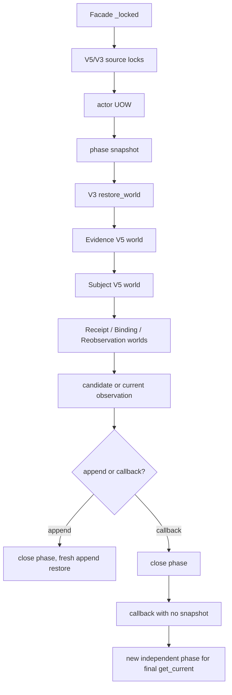

# EVID-08 Facade 写路径性能整改方案（2026-09-13 草案）

> 状态：只读诊断与实施方案草案。本文对应的工作没有连接生产、没有部署、没有改动
> Account 源码或测试、没有写入账本、没有提交。当前工作树的 DATA-16 变更属于另一条主线。
>
> 实际模型设置：`gpt-5.6-luna / max`。
>
> 基线与回滚点：生产已部署 `b18b18029f90af4b23693426a1f489af44ffe2b2`。
> 该提交只在 `OwnerTenantAuthorityV3Facade._locked` 外层加入已有的
> `validation_graph_operation`；本文提出的后续实现必须能够独立回退到该提交。

## 1. 结论

`b18` 已经证明了同一对象图内的解码与对象校验可以复用，但它没有减少 SQL。独立完整图
诊断的两次 `get_winner` restore 在保持相同 PostgreSQL 快照、相同 `58,492 SELECT` 的
前提下，candidate 的 elapsed/CPU 从 `2,636.320s/2,473.226s` 降到
`1,128.302s/1,014.602s`；raw decode 从 `329,320` 降到 `40`，对象校验从
`1,838,056` 降到 `29,864`。这属于 CPU/解码收益，不能作为写入性能通过。

真实 `issue_existing_root_replay` 的结果为 `2,677.7866s` elapsed、`2,180.4248s`
CPU、`245,223 SELECT`、`245,262` total query、`717.1529s` database execute。
相对于完整图两次 restore 的 `58,492 SELECT`，它约等于 `8.38` 个单次完整 restore
的 SELECT 量。这个比值只是工作负载等价比，不能替代按 operation/phase 的精确 SQL
调用归因。CPU/对象图恢复仍是主要耗时来源；DB execute 约占 elapsed 的 `26.78%`，
平均约 `2.92ms/SELECT`。`245,262 - 245,223 = 39` 个非 SELECT 查询的具体类型
尚未由该摘要证实；现有 instrumentation 已确认其中 `INSERT = 0`，不能据此推断其余
非 SELECT 查询的具体类型。

目前最小可验证方向是把 immutable read cache 放到**已取得全部相关来源锁之后的每个纯读取
phase**，并在任何 append/回调之前结束该 phase。`with_current` 必须拥有两个独立的
读取 phase，中间的 callback 不得处于 immutable snapshot。源 V2 的 physical provider
也必须在需要 current source 的写路径取得稳定锁；它的 `_visible_records` 当前未接入
`reuse_immutable_read`，是已确认的读缓存覆盖缺口。

这不是把一个 snapshot 包住整次写事务，也不是放宽 closed-world restore。若 phase 复用后
SQL 仍超出可接受范围，再进入共享 graph read context 的第二阶段；第二阶段仍按
`alias + ledger + exact cutoff + phase` 隔离，不能放宽现有 repository object/cutoff
安全边界。

## 2. 已有证据与边界

| 证据 | 实际结果 | 能证明的内容 | 不能证明的内容 |
|---|---|---|---|
| 生产已部署 facade transaction job，`verify_evid08_deployed_facade_transaction.py`，`issue_existing_root_replay` | `2,677.7866s` elapsed；`2,180.4248s` CPU；`245,223 SELECT`；`245,262` total query；`717.1529s` DB execute | 真实生产写回放很慢，SQL 与 Python 图恢复均需单独定位 | 摘要没有逐 phase SQL fingerprint，不能把所有 query 精确归因到某个 repository |
| `AccountSystemAuditOwnerTenantAuthorityV3Reader.execute` 的当前只读实测 | `14.66s`、`1,863 queries` | 已有 `get_current` 锁后 snapshot 读路径明显小于写回放 | 与四 roots 写回放不是同一 workload，不能直接计算优化百分比 |
| [完整图 cProfile 检查点](../deployment/sprint-evid08-complete-graph-cprofile-2026-09-13-c8bb9b780.json) | 同一 READ ONLY/REPEATABLE READ 快照内两次完整 restore；baseline `2,636.320s/2,473.226s/58,492 SELECT`；candidate `1,128.302s/1,014.602s/58,492 SELECT` | `validation_graph_operation` 显著降低 CPU，SQL 不变 | 不是新 issue/successor/revoke，也不是并发验收；cProfile 有额外开销 |
| [完整图解码计数检查点](../deployment/sprint-evid08-complete-graph-decode-work-2026-09-13-c8bb9b780.json) | raw decode `329,320→40`；decorated object validation `1,838,056→29,864`；两阶段均 `58,492 SELECT` | 解码/成功校验复用效果与 SQL 变化明确分离 | 只计数显式列出的 decorated function，不能称全部 Python/JSON/validator 调用 |
| 独立 rollback 核验（父代理回传的实际结果） | `2026-09-13T04:40:25.814398Z`；`4 roots / 0 revocations`；原 canonical SHA 与 rollback 后相同 | rollback 后 canonical ledger 指纹没有漂移 | 这是独立 rollback 完整性事实，不是新 candidate 写性能通过 |
| 真实 rollback lifecycle job | validity 仅 30 分钟，完整 write/replay 无法在窗口内完成，已取消，exit `130` | 该运行不能作为通过或失败的业务结果 | 不得从 exit 130 推导 latency、query budget 或 lifecycle correctness |

完整图 cProfile 的调用层级还显示了重复恢复的形状：两次 V3
`_restore_world` 包含 8 次 `_root_parents`、8 次 Evidence V5 exact/world、64 次
Subject exact/world、1,280 次 Reobservation exact；这些调用都发生在同一闭图 restore
下。candidate 的这些 SQL 调用量未减少，说明外层验证缓存没有触及数据库读取放大。

## 3. 源码审阅结论

### 3.1 当前 facade 边界

`apps/account/owner_tenant_authority_v3_composition.py` 当前行为如下：

1. `_locked` 先验证 PostgreSQL，进入 READ COMMITTED 外层事务，调用
   `lock_owner_tenant_authority_v3_sources`，再进入 actor repository UOW；b18 的
   `@validation_graph_operation` 包住了这一整段。
2. `get_current` 在调用 service 前取得注入的 physical source lock，并在 service
   读取外层开启 `immutable_read_snapshot()`。
3. `issue`、`supersede`/`successor`、`get_exact`、`revoke` 当前没有 immutable read
   snapshot。
4. `with_current` 当前没有调用 physical source lock，也没有 snapshot；它在同一外层
   transaction 中执行初次 `get_current`、callback、末次 `get_current`。

`apps/account/domain/validation_graph.py` 的缓存只复用成功的 exact JSON decode 和
对象 identity validation。JSON tree 仍受 visited-node `100,000` 与 depth `128` guard
约束；任何实现不得改变这些上限、原始 hash、时钟、可用性或异常语义。

`apps/account/infrastructure/immutable_read_snapshot.py` 的 ContextVar 默认不启用
缓存。缓存 key 包含 decorator namespace、function、repository object 和精确参数，
因此不同 repository instance、不同 cutoff、不同 `lock` 参数不会误共享。返回值为
`None` 时也会作为本 phase 的成功结果缓存；异常不会写入缓存。它不是 PostgreSQL
repeatable-read snapshot，也不能在没有 source lock 时自行提供一致性。

### 3.2 245k 查询的闭图放大机制

`OwnerTenantAuthorityV3Service` 的 write/replay 路径有多个业务上必须保留的读取阶段：

- `issue` 先选 winner；replay 时还要做 `_root_matches` 和 `_current`。新 root 路径
  还读取 authority/assignment 两个空槽、current Evidence/participants 两次，随后
  才生成 candidate 并 append。
- `successor` 在 replay 或新 successor 路径读取 winner/predecessor、current
  inputs 两次、recorded-at 的 predecessor head，并执行 predecessor CAS。
- `revoke` 读取 selected authority、历史 Evidence、participants 两次、head 和已有
  revocation，再 append immutable event。
- `_current` 读取历史 Evidence、revocation、head、current assignment/participants，
  在 cutoff、second cutoff、observed cutoff 重复复核，并在任一漂移/失效时 fail closed。

每次上述读取进入 `DjangoOwnerTenantAuthorityV3Repository._restore_world` 时，repository
都会恢复所有 V3 roots/revocations，并为每个 root 调 `_root_parents`。后者又读取：

1. Evidence V5 exact；
2. policy 在 approved-at 与 recorded-at 的两次 exact-current；
3. actor source exact 与 recorded-at current head；
4. 原始 durable parent FK。

Evidence V5 的 `_world` 会扫描全部 Subject/Evidence 行，并对每个 Subject/Evidence
再次恢复 Subject/actor parent。Subject V5 又会恢复 Receipt、Binding、Reobservation
的完整 world。每个 child repository 的 decorator 只在相同 repository object、相同
精确参数且有 active snapshot 时命中；authority 的多个 recorded-at、不同 composition
实例以及当前的 snapshot 缺口都会使它们重新扫描。

此外，`apps/simulated_trading/infrastructure/simulated_account_row_source_v2_repository.py`
的 `_visible_records(as_of, lock)` 扫描并恢复整个 source V2 table，但当前没有
`@reuse_immutable_read`。因此即便外层 `get_current` 已经开启 snapshot，physical
provider 的 `get_winner` 与 `get_current_head` 仍不能通过该 ContextVar 复用 source
table restore。这个缺口是代码事实；真实写回放中它所占的确切 query 数需要后续计数器
确认。

现有模型的 identity/time 索引主要服务 selector 与 chain 约束，而 closed-world
repository 明确按全表恢复、seal/FK 校验后再选择 winner/head。仅增加 selector index
不能替代完整性恢复，也不能作为本方案的 correctness shortcut。

## 4. 实施目标与不可变约束

### 4.1 目标

目标是减少同一**已锁定、无 mutation 的纯读 phase**内重复的 full-world restore，
并让 query/cache counter 能够证明每个命中。目标不包括把 append-only ledger 改成
mutable cache，也不包括绕过父图、只读 header 或降低验证强度。

### 4.2 强制约束

1. `lock_owner_tenant_authority_v3_sources` 必须先完成 V5/V3 parent 与 decision-table
   锁定。需要 current physical source 的操作再调用注入的
   `lock_current_physical_sources`，调用发生在 snapshot 之前，并保持现有锁顺序。
2. `issue`、`successor` 和任何会读取 current Evidence physical source 的 phase 必须
   取得 physical source lock；`get_current` 保留现有 lock；`with_current` 新增一次
   lock 并在两次观察之间保持该锁。`get_exact`/历史 revoke 不因性能方案绕过已有
   durable source lock。
3. append/append_revocation 是 phase 的硬边界。pre-append phase 关闭后才能调用
   append；repository append 内部的 world restore 不得命中 append 前缓存。若新增
   post-append check，必须在新的 fresh phase 中进行。
4. `with_current` 的 initial `get_current` 与 final `get_current` 必须各自创建、清理
   独立 snapshot。callback 完全处于两个 phase 之外；不得跨 callback 复用 mutable
   query、`None` negative result 或其他读缓存。callback 在同一 UOW 中的 mutation、
   corrupt source、expiry、authority/policy/authentication/source hash drift 必须仍被
   末次 live revalidation 拒绝。
5. 所有 phase cache 都是 ContextVar operation-local state，不能变成 module/global/
   process-lifetime cache；不得放宽 repository object/cutoff 的 key 隔离。cache 不得
   把不同 alias、不同 cutoff、`lock=True`/`lock=False` 结果合并。
6. 保持现有 `100,000` JSON node、depth `128`、exact raw payload/hash、FK/seal、
   availability、clock monotonicity、source lock、append-only、current validity 与
   异常映射。失败或 `None` 的读取不能跨 phase 保留。

## 5. 候选 API 与 phase 设计

### 5.1 Application 只定义 Protocol

在 `apps/account/application/owner_tenant_authority_v3_contracts.py` 定义一个标准库
边界，例如 `OwnerTenantAuthorityV3ReadPhase`：其 callable 返回
`AbstractContextManager[None]`。`OwnerTenantAuthorityV3Service` 接受该 protocol 的
构造注入；单元测试可以使用 `contextlib.nullcontext`，生产 composition 才提供真实
实现。

Application 只能依赖 `Protocol`、`AbstractContextManager` 和本层已有 port，不得导入
`apps.account.infrastructure.immutable_read_snapshot` 或任何 repository implementation。
`apps/account/owner_tenant_authority_v3_composition.py` 作为 composition root 负责把
`immutable_read_snapshot` 适配为该 callable。这样 cache 的实现位置仍在 Infrastructure，
而 phase 的业务边界由 Application 明确表达。

### 5.2 每个公开操作的边界

| 操作 | 锁后 phase 内容 | phase 结束点 | callback/mutation 规则 |
|---|---|---|---|
| `issue` | winner、空槽、current inputs、participant 双读、candidate 构造与校验 | 调用 `repository.append` 之前 | append 使用 fresh restore；replay 无 append，整个 replay read path 仍只在一个有限 phase 内 |
| `successor`/`supersede` | winner、predecessor head、两次 inputs、recorded-at head、candidate/CAS 校验 | 调用 `repository.append` 之前 | predecessor CAS 与 append 不能读 pre-append cache |
| `revoke` | selected、历史 Evidence、participants 双读、head、revocation、candidate | 调用 `append_revocation` 之前 | revocation append 使用 fresh restore；reason replay 的 `None`/winner 结果不跨 operation |
| `get_exact` | winner、hash、历史 Evidence、knowable-at 校验 | service 返回前 | 无 callback；outer source locks 仍保留 |
| `get_current` | physical lock 后的完整 current service read | service 返回前 | 保留现有 lock+single phase；不把 phase 外提到整个 facade transaction |
| `with_current` 初读 | physical lock 后，独立 phase 内的一次 `get_current` | 返回 initial 后立即关闭 | callback 不在 snapshot |
| `with_current` 末读 | callback 返回后，重新创建的独立 phase 内的一次 `get_current` | final live revalidation 完成 | final 必须看到同 UOW 可见的 mutation；drift/expiry/corruption 仍拒绝 |

service 内的 phase wrapper 应覆盖其纯读与 repository atomic 所需的同 alias read，
但不能包住 append。facade `_locked` 的 `validation_graph_operation` 可以继续覆盖
整个锁内调用以保留 b18 的 CPU 收益；它与 immutable read phase 是两种不同缓存，不能
用前者替代后者，也不能借此把 `with_current` 两个 live read 合并。

### 5.3 已确认的 P0 覆盖缺口

给 `simulated_account_row_source_v2_repository._visible_records` 增加现有
`reuse_immutable_read` decorator，使用独立 namespace。`lock` 已是精确参数的一部分，
因此锁定读取和非锁定读取不会共享结果；在没有 active snapshot 时行为完全不变。
只有调用方已经完成 physical source lock、并进入相应 phase 时才会获得复用。

## 6. 分阶段实施与完成标准

### Stage 0：隔离计数与基线绑定

在隔离 PostgreSQL 运行与生产同形的四-root/零-revocation representative graph，先
记录 operation、phase、repository instance、exact cutoff、cache hit/miss、SELECT
fingerprint、decode/validation counters、source lock 顺序和每个 phase entry/exit。
所有计数 artifact 必须绑定候选源码 commit、fixture 的四个 root header、原 canonical
SHA 与数据库 alias；不能以总 elapsed 猜测某个 namespace 的命中。

完成标准：能够把一次 issue replay 的每个 `get_winner/get_head/_world` 调用归到
phase，并确认 30 分钟取消的 exit 130 不被写成 lifecycle pass/fail。Stage 0 不连接或
写生产。

### Stage 1：最小 phase cache 修复

实现 typed `read_phase` 注入、锁后 phase 边界、append fresh boundary、
`with_current` 双 phase，以及 source V2 `_visible_records` decorator。同步补充单元与
composition contract 测试，测试只证明边界与语义，不把 mock query count 当生产性能。

完成标准：

1. Application 静态架构扫描证明没有直接导入 Infrastructure helper；composition
   适配器是唯一实现绑定点。
2. 同一 phase 内相同 repository/cutoff/lock 的重复读取命中；不同 phase、不同
   cutoff、不同 lock mode 均产生独立读取。
3. `with_current` 的 callback 前后 probe 能证明第二个 `get_current` 不使用第一 phase
   的 `None`/对象结果；callback mutation、corrupt source、expiry、authority 或
   authentication drift 均按现有契约拒绝。
4. append/append_revocation 前的缓存已清理；插入后 repository fresh restore 能
   看到正确的 first winner/head，失败回滚后没有 cache 泄漏。
5. 现有 100k/depth/hash/clock/availability/source-lock/current-validity 与错误映射
   回归全部通过；不改变 ledger schema、canonical payload 或原始 SHA。
6. 同一 fixture 的 production-shaped replay 在至少三次隔离重复中，分别提供
   elapsed、CPU、DB execute、SELECT、cache hit/miss 和 SQL fingerprint；只有实际
   query/CPU 下降且功能证据完整，才能进入下一阶段。任何 query 下降都不能单独宣称
   lifecycle 通过。

Stage 1 的性能门以 Stage 0 的重复调用计数为分母，而不是预先编造绝对秒数。最低要求
是所有可安全复用的 phase 内重复读取均被消除；若完整图的 unique cutoff/跨实例恢复
仍主导 SELECT，则明确转入 Stage 2，而不是扩大 snapshot 范围。

### Stage 2：共享 graph read context（仅在 Stage 1 仍不足时）

如果计数显示主要浪费来自同一 alias 的等价 repository instances 或同一 phase 的
跨层 parent worlds，才设计 Infrastructure-only shared graph context。优先在
composition 中共享已经构造好的 repository instances；不得全局放宽
`immutable_read_snapshot` 的 key，也不得按 content hash 跳过完整 world restore。

若仍需 context object，它必须明确携带 alias、ledger namespace、精确 cutoff、锁已
取得证明和 phase token；在 phase 结束、append 开始或 callback 开始时清理。所有 row
仍需 payload/seal/FK/full-chain 校验；只允许把同一个已锁定 phase 的批量加载与索引
复用，不允许把历史 cutoff 当成 current。

完成标准：每个 ledger/cutoff 的 full-world load 数量能由 phase trace 解释，内存和
cache entry 数量受单次 operation 边界约束；两次 `with_current` live read、append
fresh restore、corruption/expiry rejection 仍有独立证据。若无法同时满足性能和这些
语义，保留 Stage 1 或回滚，不继续放宽缓存。

### Stage 3：候选部署与真实 lifecycle（本稿不执行）

只有 Stage 1/2 的隔离证据完成后，才准备候选部署。先通过性能修复证明完整
issue/replay、current、`with_current`、successor、revoke、exact 能在真实策略和来源
剩余有效期内完成；不得仅为测试放宽有效期或忽略 expiry。之前 30 分钟配置不足，
run 以 exit `130` 取消，不能复用为通过证据。

生产动作前需重新绑定 candidate commit/release/image、备份与 rollback point。运行时
只记录原始 query trace、phase/counter、耗时、锁与四-root/零-rev ledger 指纹；不把
独立 rollback 的 `4 roots / 0 revocations / original canonical SHA unchanged`
事实拼成新的 write-performance 通过结果。rollback 验证时间基准为
`2026-09-13T04:40:25.814398Z` 的既有独立事实，新的 candidate 必须重新产生自己的
绑定 artifact。

Stage 3 完成标准是同一候选下功能生命周期、query/CPU/DB 指标、append-only ledger
指纹、锁竞争与 callback live revalidation 全部有可复核 artifact；任一阶段取消、
超时、缺少 canonical SHA 或缺少 source-lock trace，都保持后续生产写路径验收未通过。
既有 EVID-08 repository 单元已完成，不将这一后续性能缺口改写为旧单元未完成。

## 7. 风险、回滚与停止条件

| 风险 | 防护 |
|---|---|
| snapshot 包住 append，插入后读取命中旧 world | pre-append phase 在 append 前退出；append 内 restore 不在 snapshot；必要的 post-check 新开 phase |
| snapshot 在 source lock 之前启动 | facade 先完成 V5/V3 lock，再取得 physical source lock，再进入 phase |
| `with_current` 复用 callback 前的 `None` 或对象 | initial/final 各自独立 ContextVar；callback 中不调用 immutable snapshot wrapper |
| 物理 Source V2 未稳定，current 读到竞争状态 | issue/successor/get_current/with_current 在 phase 前调用注入 locker；保持 `lock=True` 与 `lock=False` key 分离 |
| 放宽 cache key 后跨 alias/cutoff/实例误共享 | 保留现有 exact key；Stage 2 只允许显式 alias/cutoff/phase context |
| 完整闭图仍需全表校验，index 优化不足以解决 Python/SQL | Stage 0 记录 per-namespace trace；Stage 2 才处理已证明的跨实例重复；不以 selector shortcut 取代 integrity restore |
| phase cache 占用过多内存 | cache 只存在单次 phase ContextVar；记录 unique key/entry 上限，超出预算时停止复用而继续正确读取，不能返回陈旧值 |

候选出现 correctness、hash、clock、availability、callback revalidation、query count
或资源占用回归时，停止生产复测并代码回退到
`b18b18029f90af4b23693426a1f489af44ffe2b2`。回退是 code-only 选择，不删除或修复任何
append-only production ledger；保留失败候选与 rollback artifact 供审计。本文阶段不
创建迁移，因此不需要用 schema rollback 掩盖代码回退。

## 8. 本草案的范围结论

本草案只把 b18 的已证实 CPU 复用与尚未解决的 SQL 放大分层处理：先补缺失的 source
read decorator，再以 Application Protocol 表达 phase、由 composition 注入
Infrastructure snapshot，严格在锁后和 mutation/callback 两侧切断缓存。完整闭图
仍然恢复并校验所有 rows、原始 payload/hash、parent FK、时钟和可用性；真实生产
write/replay、部署和 rollback lifecycle 继续沿用用户的部署与测试授权，但必须生成新 artifact，不能从本次
只读诊断或 exit 130 推断通过。
