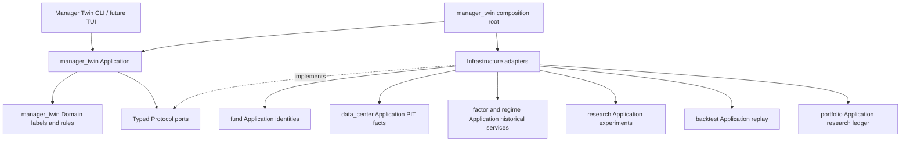
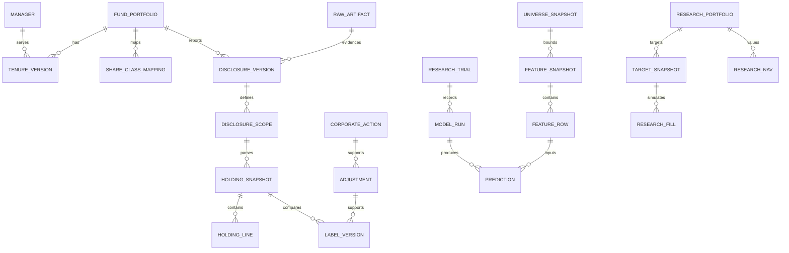

# Manager Holdings / Decision Twin Development Plan

> 状态：Draft for Review；仅规划，未批准 Probe 或 MVP。
> 日期：2026-09-30；版本：0.1。
> 代码检查基点：`70efc73c9e170ab5f76cc4a55b7247ca976bbd81`，`dev/next-development`。
> 项目定位：Manager Holdings / Behavior Replication。Decision Twin 是候选研究方向，不是已经成立的能力。
> 授权顺序：Plan review → 单独批准 3—5 人日 Probe → Probe review → 单独决定是否批准 MVP。

## Executive Summary

**我们究竟要预测什么？** 在一个明确的 `prediction_time`，使用当时已公开且可验证的信息，预测特定经理管理的特定基金在下一指定报告期末将公开披露的持仓状态变化。主研究采用完整股票持仓的半年度间隔；季度 Top10 是独立辅助任务。输出包括可观察净数量变化的概率、新增持仓候选排名和受约束的研究合成组合。标签不等于真实成交指令，期末不变也不等于未交易。

**为什么 AgomTradePro 适合做？** 仓库已经包含基金/任期/净值/持仓模型，Data Center 的版本化 PIT 事实和冻结清单，因子组件，Research 实验与切分证据，Backtest 和 Portfolio 组件。可以复用这些边界和数据合同。尚缺报告级披露档案、完整性证明、经理/份额统一身份、行为标签及专用时序验证。现有 Qlib 训练和股票筛选回测不是直接可用的经理复刻器。

**最大的不确定性是什么？** 公开持仓是否足够连续、完整、可追溯，并能提供足够多的独立时间截面及稀有标签。季度榜单截断、半年间往返交易不可见、申赎、公司行为及共同管理，都限制对“真实决策”的识别。即使技术闭环正确，模型也可能不优于持仓延续和历史风格基线。

**出现什么证据才值得投入完整 MVP？** Probe 必须证明：核心身份和范围没有歧义；选定历史区间具备足够完整持仓及真实披露证据；负样本可识别；历史候选池及最小 PIT 特征可重建；数据获取许可可接受；预计能按冻结方案留出至少 8 个半年度目标截面。Probe 不以模型收益或拟合效果作为 GO 条件，也不在 Probe 内训练正式模型。

建议首选 Probe 候选为朱少醒／富国天惠精选成长混合（LOF），以 `161005` 对应份额作为净值比较序列；研究身份是整个基金投资组合。官方页面及 2010 年报告可核对任职线索，历史共同管理、合同变化、A/B/C/D 份额关系仍须逐期验证。选择依据是可观察历史与研究简化，不是收益排名。[官方产品页](https://www.fullgoal.com.cn/fundDetail/161005/index.html)、[2010 年一季报](https://www.fullgoal.com.cn/UserFiles/File/20101jibaotianhui-1.pdf)

预算建议：Probe 3—5 人日；通过并获批后的研究 MVP 38—58 人日；可选 TUI/定时产品化另计 5—10 人日。历史 PDF 大量依赖 OCR、PIT 基本面缺失或非 A 股资产显著时，停止按原预算推进并重新 review。

允许的终点包括：`GO_MVP`、`HOLD_EVIDENCE_INCOMPLETE`、`NO_GO_BEHAVIOR_REPLICATION`。后者仍可能支持 Holdings Analytics / Style Fingerprint。上述状态均不代表允许实盘、生产写入或自动晋级。

---

## 1. 研究问题、边界与预注册

### 1.1 可检验假设

| ID | 假设 | 证伪或未获支持的情形 |
|---|---|---|
| H1 | 公开 PIT 特征对未来披露持仓状态有超出 persistence 的预测信息 | OOS Brier 改善不稳定、置信区间跨 0，或只来自多数类 |
| H2 | 行为模型在历史风格之外有增量 | 不优于冻结的 style baseline，或仅增加换手和交易成本 |
| H3 | 合成组合可以部分复现真实基金的持仓/风险暴露 | 权重、行业/因子偏差没有改善；NAV 相似仅由市场 beta 导致 |
| H4 | 可以估计公开信息复制后的残差 Alpha | 若样本、费用、资产范围或因子数据不足，只给差额描述，不作能力归因 |

首要终点是完整持仓线的分任务 OOS Brier Skill；新买入候选与已持有股票变化分开。经济结果是次要终点，不能用高收益代替预测正确性。MVP 不以正 Alpha 为工程验收条件，也不允许因负结果反复更换经理直至“有效”。

### 1.2 一个样本的精确定义

样本身份为 `(manager_id, portfolio_id, mandate_version, track, base_report_date, target_report_date, prediction_time, asset_id)`。

- 主线 `FULL_HOLDINGS`：基准报告日 `R0` 为 6/30 或 12/31，目标 `R1` 为紧接的下一半年末。`P` 为完整基准报告可用后第一个交易日 09:00（Asia/Shanghai）。报告仅有日期时按第 4 节保守规则安排。若 `P >= R1`，样本无效。
- 副线 `QUARTERLY_TOP10`：基准和目标是相邻季度末，基准必须采用该季度报告的 Top10。中报/年报可形成另一独立版本，但不得回填更早的季度知识集。
- 特征截止为 `P`；价格量特征只取 `P` 前已结束交易日。当前组合状态指“P 时最后公开的、带源日期的状态”，不是经理真实当前持仓。
- `Y` 是 `R0 → R1` 的可观察状态差；`label_available_at` 为目标范围及相关证据都可获得的时间。`P` 前这段区间已发生的部分无法分解，输出必须称“下一报告状态预测”，不是“P 后全部交易预测”。
- 同一经理同期多个产品不能当作独立实验；MVP 只选一个 portfolio。共同管理、经理/合同切换区间排除主分析并计入覆盖损失。

### 1.3 能与不能得出的结论

可以报告限定经理、基金、时期、候选池和可观察标签下的预测增量，风格暴露变化、跟踪误差和残差估计。不能从样本行数推算独立决策次数；不能还原交易日、成交价、区间内路径、研究动机或经理私有信息；不能把残差全部解释为 Human Skill；不能把单经理结果推广为全体经理可复制比例。

### 1.4 三道决策门

| 门 | 决策对象 | 放行标准 | 不放行结果 |
|---|---|---|---|
| G0 Plan review | 研究设计与 Probe 范围 | 时间、scope、标签、候选池、数据 owner、预算和停止线得到确认 | 修订本计划，不抓数、不训练 |
| G1 Probe review | 是否值得开发完整 MVP | 第 15 节数据 GO 条件全部满足；不存在核心许可/PIT 阻断 | HOLD 或转 Analytics；GO 后仍需单独批准 MVP |
| G2 MVP review | 研究是否支持继续扩展 | 工程验收全部满足；主终点有稳定增量且不依赖单期/多数类；经济及数据限制完整披露 | 可接受“有效实现但研究假设未成立”；不自动进入文本/群体模型 |

G2 研究支持的预注册建议：最终留出至少 8 个完整目标截面；Entry与Held-change两个共同主任务均须相对 persistence 的 `RS >= 5` 且分块 95% CI 下界 > 0；均须相对 style baseline 的配对 Brier 改善 CI 下界 > 0；各任务至少 60% 可评分报告期有改善；固定五类条件诊断中非 HOLD 标签 Macro-F1 比 persistence 提高至少 0.03。两个主任务全部通过才作完整行为增量主张，只通过一个则限定结论并另review范围；预注册联合主张不从多个结果里择优。任一稀有类未满足支持量时，不声称完整五类复制成立。数字是本研究的拟议预算/证据门槛，不是行业标准；只能在开封留出集前 review 修改。

## 2. 仓库事实与复用清单

本轮只做源码/文档检查和官方网页样本核对，没有连生产库、调用付费数据 API、运行训练或测试。下表的“可复用”指代码能力存在，不等于历史数据齐全或生产可用。现有测试文件是未来回归入口，不是本轮通过证据。

| 模块 | 已核验源文件/对象 | 直接复用 | 扩展与禁止直接复用 |
|---|---|---|---|
| fund | [models.py](../../apps/fund/infrastructure/models.py)，`FundInfoModel/FundManagerModel/FundHoldingModel`；[repositories.py](../../apps/fund/infrastructure/repositories.py) | 主数据入口、净值/业绩查询和基础约束 | 新增稳定经理/portfolio/任期版本；旧 holding 无披露/范围且 update_or_create，不能作 PIT 真源 |
| fund providers | [akshare_fund_adapter.py](../../apps/fund/infrastructure/adapters/akshare_fund_adapter.py)、[tushare_fund_adapter.py](../../apps/fund/infrastructure/adapters/tushare_fund_adapter.py) | Tushare 客户端装配经验；兼容旧调用 | AKShare 类实际读取本地库；季度 cutoff 使用季度末月 1 日，不能作为历史季末正确性依据；新链路在 DC 实现，不复制兼容缺陷 |
| data_center | [public.py](../../apps/data_center/application/public.py)、[pit.py](../../apps/data_center/domain/pit.py)、[pit_models.py](../../apps/data_center/infrastructure/pit_models.py)、[pit_repository.py](../../apps/data_center/infrastructure/pit_repository.py)、[pit_use_cases.py](../../apps/data_center/application/pit_use_cases.py) | provider/原始审计/公开 ports、PIT 版本及 manifest | 新增报告级事实与批次完整性；现有按 business_key 最新行查询不能直接解决报告整组选择 |
| data_center financial | [financial_fact_repository.py](../../apps/data_center/infrastructure/financial_fact_repository.py) | knowledge cutoff/revision 查询机制 | 验证源财报公告和历史修订覆盖；不可退回 current/latest 财报 |
| factor | [services.py](../../apps/factor/domain/services.py)、[models.py](../../apps/factor/infrastructure/models.py) | `FactorEngine`、因子目录和标准化定义 | `FactorExposureModel` 只有 trade_date 等字段，不能仅凭日期推定当时可得；新增冻结来源清单的历史计算入口 |
| regime | [query_services.py](../../apps/regime/application/query_services.py) | 历史环境计算组件 | 禁止 latest 作为历史特征；宏观修订/PIT 不足时从主模型移除该特征族，而非伪造 |
| alpha/Qlib | [qlib_artifact_runtime.py](../../apps/alpha/infrastructure/qlib_artifact_runtime.py)、[train_qlib_model.py](../../apps/alpha/management/commands/train_qlib_model.py)、[pyproject.toml](../../pyproject.toml) | scikit-learn 依赖；LightGBM 可选依赖、运行隔离/产物模式 | 现有 Alpha158/360 + MSE 训练不是分类任务；MVP 使用专用 sklearn/LightGBM adapter，不占用 Alpha active model 或 cache |
| research | [models.py](../../apps/research/infrastructure/models.py)、[use_cases.py](../../apps/research/application/use_cases.py) | `ResearchExperiment/ExperimentTrial/DatasetSplitSpec/MetricObservation/MultipleTestFamily`，代码/种子/成本/清单绑定 | 新增经理研究 evidence adapter；不能假定现有 promotion 已支持本任务，更不能借用其他策略晋级 |
| backtest | [stock_selection_backtest.py](../../apps/backtest/domain/stock_selection_backtest.py)、[use_cases.py](../../apps/backtest/application/use_cases.py) | 基础风险计算、结果存储、PIT 信任等级 | 现有引擎耦合 Regime/StockScreener，换手以股票数量近似；新增 target-weight replay 接口及金额换手，不硬塞筛选规则 |
| portfolio | [entities.py](../../apps/portfolio/domain/entities.py)、[use_cases.py](../../apps/portfolio/application/use_cases.py)、[canonical_snapshot_models.py](../../apps/portfolio/infrastructure/canonical_snapshot_models.py) | 权重守恒、组合差分概念、版本化政策模式 | 现有实体要求 account/decision 身份；研究不伪造实盘账户/Evidence。新增独立研究账本和公开 research service |

进一步确认的接口风险：现有 Tushare 经理适配器请求/解析 `start_date`，已有 mock 测试也使用这个字段；官方接口定义为 `begin_date`。因此“单测覆盖适配器”不能证明真实接口兼容，Probe 必须抓一个脱敏响应核对。官方持仓示例在相同 end_date 下存在不同 ann_date，进一步说明不能按期末日期直接合并为同一次披露。[经理接口](https://tushare.pro/document/2?doc_id=208)、[持仓接口](https://tushare.pro/document/2?doc_id=121)

## 3. 架构、依赖和数据流

### 3.1 新增 manager_twin bounded context

建议批准 MVP 后新增 `apps/manager_twin/`，承载标签语义、样本构造、模型比较、预测和经理向量。Probe 不创建 Django app，不做迁移。新 app 的 Domain 仅标准库；sklearn、LightGBM、Pandas 在 Infrastructure；Application 通过 Protocol 注入。Interface 不导入任何 `apps.*.infrastructure`。



箭头是调用/装配方向，不许可 Domain 导入其他 App。所有被调用模块都不反向导入 manager_twin；Portfolio/Backtest 接受通用目标权重及数据 ports，不识别经理模型。新增服务使用各 owner 的独立公开 Application 文件，避免扩张现有超大文件。`shared` 只放确有第二使用方的无业务语义工具，不放经理标签或默认策略。

fund 是身份/任期含义的 owner；DC 是外部原始报告、标准化观测及 PIT 副本的 owner。身份的 PIT 副本保留 fund 版本 ID/hash，是生成投影，不可从 DC 修改身份。DC 持仓里的 portfolio_ref 是不透明 ID，无需导入 fund ORM。只允许同 owner 内 ORM 外键；跨 App 使用有验证的 ID/DTO 引用。

```mermaid
flowchart LR
    SRC[Tushare / AKShare / official report] --> RAW[DC immutable raw bytes and receipts]
    RAW --> PARSE[Parse and reconcile report scope]
    PARSE --> FACT[DC versioned holdings and source facts]
    ID[fund identity and tenure versions] --> PROJ[DC PIT identity projection]
    FACT --> M[Prediction-time feature and universe manifests]
    PROJ --> M
    M --> X[Feature rows]
    FACT --> Y[Separate outcome manifest and labels]
    X --> FIT[Train / validate / calibrate]
    Y --> FIT
    FIT --> P[Immutable OOS probabilities]
    P --> TARGET[Deterministic weight policy]
    TARGET --> REPLAY[Backtest with portfolio research ledger]
    REPLAY --> EVAL[Evaluation and residual report]
    P --> EVAL
    Y --> EVAL
    EVAL --> EVID[Research trial evidence]
```



目标报告只流向标签/评分；不得进入该样本的 Feature、Universe、预测或建仓。历史标签进入训练前再次按训练知识截止过滤。

### 3.2 拟新增文件布局

| Owner | 拟新增文件族（不是已实现文件） |
|---|---|
| fund | `domain/manager_identity.py`；`application/manager_identity.py`；`infrastructure/manager_identity_models.py`、`manager_identity_repository.py`；`manager_identity_composition.py` |
| data_center | `domain/fund_disclosures.py`；`application/fund_disclosure_queries.py`、`fund_disclosure_sync.py`；`infrastructure/fund_disclosure_models.py`、`fund_disclosure_repository.py`、`fund_disclosure_provider.py`、`fund_disclosure_parser.py`；`fund_disclosure_composition.py` |
| manager_twin | `domain/{contracts,labels,universe,metrics,weight_policy,manager_vector}.py`；`application/{ports,dataset_builder,training,validation,prediction,evaluation}.py`；`infrastructure/{models,repositories,sklearn_adapter,lightgbm_adapter,feature_adapter,evidence_adapter}.py`；`composition.py` |
| factor / regime | `application/point_in_time_features.py` 及各自 Infrastructure 历史 adapter；只纳入已有来源可证明的特征 |
| portfolio | `domain/research_portfolio.py`；`application/research_portfolio.py`；`infrastructure/research_portfolio_models.py`、对应 repository/composition |
| backtest | `domain/target_weight_replay.py`；`application/target_weight_replay.py`；对应数据 adapter 与结果存储映射 |
| research | `application/manager_holdings_evidence.py`；Infrastructure evidence adapter；不改变通用 promotion 语义 |

模块注册还涉及 `apps/manager_twin/apps.py`、`models.py` 导出、迁移、实际 INSTALLED_APPS 入口和 tests。具体迁移编号实施时按 HEAD 顺序生成，计划不预占编号。

### 3.3 公开服务合同与研究产物

以下为拟议Application合同，DTO在相应owner内定义；方法完整类型签名在E0冻结，不返回ORM或未收窄的Any。所有输入都在Application入口校验，CLI/后续HTTP只做额外校验。

| 服务/Port | 必需输入 | 输出/失败边界 |
|---|---|---|
| fund `ResolveManagerPortfolioIdentity` | manager_ref、fund_code、effective_date、knowledge_cutoff、scope | 稳定manager/portfolio/tenure/mandate版本；歧义阻断 |
| DC `QueryFundDisclosureSnapshot` | portfolio_ref、report_date、report_type、scope_code、as_of、knowledge_scope | 一份完整snapshot DTO及manifest；禁止只返回按股票拼接的latest rows |
| DC `QueryHistoricalInvestableAssets` | effective_time、knowledge_cutoff、market_policy_version | eligible/held-only/excluded及source versions；缺资格证据阻断 |
| Twin `BuildManagerDataset` | study_spec_ref、feature_set_version、label_policy_version、frozen_prediction_schedule | sample/universe/feature/outcome manifests和coverage；不训练 |
| Twin `RunManagerHoldingsStudy` | study_spec_ref、dataset_manifest_ref、phase=development/final、budget、seed | run/outcome、fold metrics、artifact hashes；final必须有冻结spec且未被修改 |
| Twin `PredictDisclosureState` | model_run_ref、feature_snapshot_ref、target_report_date | prediction batch、probabilities、abstentions；PIT/类别支持不足时blocked |
| Portfolio `CreateResearchTargets` | research_portfolio_ref、current_research_snapshot、target_weights、policy_version、earliest_execution_at | 研究target，不生成OrderIntent，不接受真实broker binding |
| Backtest `ReplayTargetWeights` | research_portfolio_ref、target refs、calendar/price/action manifests、cost spec | fills/NAV/quality/replay ID；事件、价格缺失显式失败或unverified |
| Research `RecordManagerHoldingsEvidence` | experiment/trial refs、run+manifest hashes、split、metrics/CI、limitations | immutable evidence receipt；不授予实盘/promotion权限 |

本地研究产物拟置 `var/manager-twin/<study_id>/<run_id>/`：`spec.json`、`identity_manifest.json`、`universe_manifest.json`、`feature_manifest.json`、`outcome_manifest.json`、`dataset.parquet`、`predictions.parquet`、`model_artifact`、`metrics.json`、`report.html`、`report.md`。原文bytes在DC artifact store按hash引用；manifest记录全路径/相对artifact URI及SHA-256，报告不泄露secrets或商业原件。Probe产物使用独立 `var/manager-twin-probe/<probe_id>/`，不混入正式run。

正式CLI拟支持 `--spec <path> --phase development --output <path>`，默认只检查spec和依赖；显式 `--execute` 才在指定研究环境运行，`--phase final` 要求已冻结的research trial。离线dataset准备、模型研究、报告导出分成不同command/use case；不能一次命令自动联网补洞并训练。LightGBM若未安装，先报告缺依赖；通过pyproject的可选研究依赖声明后生成requirements投影，不为该任务引入Qlib深度学习运行栈。

## 4. PIT 时间和防未来函数合同

### 4.1 字段语义

| 字段 | 语义与规则 |
|---|---|
| `report_date` | 持仓/财务状态日，date；不是发布日期，也不是交易日 |
| `disclosure_at` | 该报告版本最早有证据的公开时间，aware datetime；另存 `disclosure_date`、`time_precision`、证据来源 |
| `available_at` | public replay 可安全使用时间；有精确时刻时不早于 disclosure_at，日期精度时使用该日结束后的保守边界；保留 availability policy 版本 |
| `ingested_at` | 系统真实收到原始数据的 UTC 时间；回填不得改写为历史公开时间 |
| `effective_at/effective_to` | 业务有效区间。持仓快照以报告日为 effective_at，effective_to 默认为空；不在下一季末强行失效，否则下一季尚未公开时会丢掉最后已知快照 |
| `revision_number/source_revision` | 真实报告更正产生新版本和新的可得时间；同一报告 different parser 属 parser_version，不伪装为更正公告 |
| `prediction_time` | 做出预测的模拟/真实时刻；同时记录实际 `computed_at` 和 replay 模式 |
| `label_available_at` | 生成标签所需两期范围、公司行为及必要归属证据的最晚可得时间；训练只能使用已成熟标签 |

只知道日期时，`disclosure_at` 可以为空；保存已验证的 disclosure_date，`available_at` 设置为次日 00:00 Asia/Shanghai，随后选第一个严格满足 available_at < 当日 09:00 的交易日预测。不得编造“公告当天开盘前可得”。日期证据可靠且采用保守上界，可在扩展后的 dataset contract 标为 verified，并显示 date precision；日期本身无法证实时必须 estimated/unknown，退出可信主分析。

public 历史重建允许 `ingested_at > prediction_time`，条件是原始报告版本及其历史公开证据真实可验证；system replay 必须同时满足实际已收到、已公开、已处理且未越过 P。现有 PIT SYSTEM 只按 ingested_at 选择，新的研究门需额外检查 available_at 和资格，不把框架存在当作自动正确。

真实在线模式必须有 `computed_at <= execution_time`；回溯重建是模拟公开知识，不声称系统当年已运行。只允许使用截至历史时点已发生的源输入；特征算法和解析器的当今实现标记为 retrospective reconstruction。

### 4.2 一例完整时间线（示意日期，不是实测公告）

```mermaid
sequenceDiagram
    participant Report as Reports
    participant Public as Public knowledge
    participant Twin as Twin
    participant Train as Next training
    Report->>Report: 2019-12-31 base R0
    Report->>Public: 2020-03-30 base report disclosed (date only)
    Public->>Twin: 2020-03-31 09:00 prediction P
    Twin->>Twin: Feature/universe manifests frozen; earliest trade 09:30
    Report->>Report: 2020-06-30 target R1
    Report->>Public: 2020-08-28 target full report disclosed
    Public->>Train: Labels mature only after conservative availability
    Report->>Public: Later correction creates a new version
    Train->>Train: Old predictions/manifests remain immutable
```

时间线只说明语义；正式时间来自版本化交易日历。`R0 → P` 已经过去，所以不把区间变化全部称为 P 后决策。

### 4.3 查询和冻结算法

1. 用身份/报告政策确定预先指定的报告类型和 R0；筛选所有 `available_at <= P` 且 source evidence verified 的报告版本。
2. 以 document/snapshot 为整组选一个完整解析版本，不把多报告日期的股票行拼成“更完整”的早期快照；不同范围不互相 supersede。
3. DC PIT business_key 含 `portfolio_ref/report_date/document_family/scope/asset_id`，header 和 members 同时冻结；在一个事务快照下核对 count/hash/totals。
4. 用公开身份/上市状态/政策版本生成 U(P)，冻结全体成员及排除原因。现有 today active universe 不得替代历史集合。
5. 每个 P 生成独立 feature/universe manifest；训练运行再引用多个样本 manifest 的集合摘要，不能用一个回测末日清单替代全部时点检查。
6. 标签使用独立 outcome manifest，特征构造服务拿不到目标标签数据 port。训练截止 C 只接收 `label_available_at <= C` 的版本。
7. 后续报告更正重算为新 dataset/run；已冻结标签、预测和指标不覆盖。分别保留当时可评分口径与截至评估日更正口径的敏感性报告。

关键失败原因固定为 `DISCLOSURE_TIME_UNKNOWN`、`REPORT_SCOPE_UNVERIFIED`、`REPORT_JOIN_AMBIGUOUS`、`PIT_SOURCE_UNVERIFIED`、`TARGET_ALREADY_PASSED`、`TENURE_AMBIGUOUS`、`CORPORATE_ACTION_UNRESOLVED`、`UNIVERSE_HISTORY_INCOMPLETE`、`LABEL_NOT_YET_AVAILABLE`、`INSUFFICIENT_CLASS_SUPPORT`。不使用缺失值 0 回退。

## 5. 数据模型与 ER

### 5.1 通用存储规则

以下全部是拟议 schema。ID 采用 UUID/固定长度内容哈希，金额/股数/权重采用有精度的 Decimal；UTC aware 时间，业务日期按中国交易日历解释。业务权重统一 fraction `[0,1]`，原始百分数/万股/万元及精度另存。新增事实 append-only；对实例、QuerySet、bulk update/delete 都有守卫并以 PostgreSQL 集成测试验证；保护逻辑放 Infrastructure。跨 owner 引用用不透明 ID/hash，由 Application 验证存在和版本，不允许跨 App ORM 查询。

通用 provenance `E`：`source_provider, source_record_id, document_version_ref, raw_artifact_hash, parser_version, ingested_at, content_hash`。派生记录 `D`：`input_manifest_refs, policy_version, code_commit, computed_at, content_hash`。下表注明 E/D 即代表这些字段必须存在；不是允许遗漏来源。

### 5.2 实体与约束

| Owner / 实体 | PK 与唯一约束 | 主要字段、时间及来源 |
|---|---|---|
| fund / ManagerIdentity + ManagerIdentityVersion | 稳定身份表PK=manager_id；版本表PK=identity_version_id、`(manager_id, revision)` 唯一 | canonical_name、机构关联、provider IDs、identity_resolution_status；valid_from/to、available_at、E；姓名不作主键；不必要的私人资料不采集 |
| fund / FundPortfolioIdentity + MandateVersion | 稳定身份表PK=portfolio_id、legal_fund_ref唯一；版本表PK=mandate_version_id、`(portfolio_id, mandate_version)` 唯一 | 法律基金身份、历史名称、合同范围、基准版本；成立/终止、effective/available 时间、E |
| fund / FundShareClassMapping | mapping_version_id；`(provider, fund_code, valid_from, revision)` 唯一 | portfolio_id、A/B/C/D、收费及净值口径；valid interval、available_at、E；同代码有效区间不得重叠冲突 |
| fund / ManagerTenureVersion | tenure_version_id；`(manager_id, portfolio_id, start_date, revision)` 唯一 | end_date、role=manager/assistant、co_manager_set、公告身份；effective interval、available_at、E；assistant 不视为共同经理；期末前交接独立隔离 |
| DC / RawArtifact + FetchReceipt | raw hash；receipt_id；请求/响应身份可重复但 bytes 去重 | MIME、size、受控存储路径、URL、HTTP metadata、fetched/ingested_at、许可标记；不存 token；每次抓取保留 receipt |
| DC / DisclosureDocumentVersion | document_version_id；`(provider, source_report_id, raw_hash)` 唯一 | document_family_id、portfolio_ref、report_type、report_date、disclosure_date/at、available_at、time_precision、source_revision、supersedes_ref、E |
| DC / DisclosureScope | scope_id；`(document_version_id, scope_code, market_scope)` 唯一 | FULL_EQUITY/TOP_N/OTHER、N、是否完整、排序方法、预期/实际行数、股票资产合计、净资产、报告页/节证据；E |
| DC / HoldingSnapshot | snapshot_id；`(document_version_id, scope_id, parser_version)` 唯一 | report_date、header_available_at、rowset_hash、row_count、reconciliation_status、totals、E；重复解析形成版本，不混行 |
| DC / HoldingSnapshotLine | line_id；`(snapshot_id, asset_id)` 唯一 | quantity、market_value、weight_nav、weight_equity（分别命名）、currency、rank、raw units/precision；继承 header 时点、source page/cell、E；非负检查 |
| DC / FundStateFactVersion | state_version_id；`(portfolio_ref, report_date, state_kind, source_revision, source_record_id)` 唯一 | net_assets、shares by class、subscriptions/redemptions、asset allocation、benchmark/fee refs；available_at、E；不跨份额重复加总组合资产 |
| DC / CorporateActionFactVersion | action_version_id；`(asset_id, source_event_id, revision)` 唯一 | action_type、ex_date、record/pay date、share_multiplier、cash_per_share、conversion refs；announced/available_at、E；UNKNOWN 不套用其他事件 |
| Twin / CorporateActionAdjustment | adjustment_id；`(base_snapshot, target_snapshot, asset_id, policy_version, input_hash)` 唯一 | adjusted_base_quantity、multiplier、action refs、unresolved reason；D、as_of/outcome cutoff；只调数量，不用价格复权因子替代 |
| Twin / LabelVersion | label_id；`(base_snapshot, target_snapshot, asset_id, label_policy_version, evidence_hash)` 唯一 | track、label、observation_status、q0/q0_adjusted/q1、tolerance、flow flag、manager tenure refs；R0/R1、label_available_at、D；UNKNOWN/CENSORED 没有伪造数值类 |
| Twin / CandidateUniverseSnapshot | universe_id；`(portfolio_id, P, universe_policy_version, input_hash)` 唯一 | eligible members、held-only members、excluded reasons、expected/observed counts、rowset hash；P、D；大型 members 用 child table/artifact 并校验摘要 |
| Twin / FeatureSnapshot | feature_snapshot_id；`(manager_id, portfolio_id, P, universe_id, feature_set_version)` 唯一 | feature manifest、schema hash、列定义、缺失统计、fit transform ref；P、D |
| Twin / FeatureRow | row_id；`(feature_snapshot_id, asset_id)` 唯一 | 类型化 features、missing flags、每族 source max available_at、source refs；D；进 Domain/Application 前从 JSON 收窄 |
| Twin / ModelRun | model_run_id；run fingerprint 唯一 | research_trial_id、task、fold、train/calibration manifest refs、model type/params/seed、artifact hash、dependency hash、outcome；train_cutoff、started/finished_at、D |
| Twin / PredictionBatch + Prediction | batch_id / prediction_id；`(run_id, feature_snapshot_id, asset_id, task)` 唯一 | 类别概率、rank、abstain reason、base state、target date、calibration ref；P、computed_at、mode、D；概率和=1、范围检查 |
| Twin / ManagerVectorSnapshot | vector_id；`(manager_id, portfolio_id, as_of, kind, definition_version, input_hash)` 唯一 | kind=holdings/behavior、维度及覆盖、uncertainty、窗口、D；不得把 importance 原值当偏好 |
| portfolio / ResearchPortfolio | research_portfolio_id；`(experiment_id, variant, policy_version, run_group)` 唯一 | variant=FOLLOWER/STYLE/BEHAVIOR、base currency、initial capital、source prediction refs、D；research_only=true，无 broker/account binding |
| portfolio / ResearchTargetSnapshot | target_id；`(research_portfolio_id, P, policy_hash, input_hash)` 唯一 | per-asset target weights、cash、约束命中、prediction refs；P、earliest_execution_at、D |
| portfolio / ResearchFill + ResearchNAV | fill_id / nav_id；`(replay_run, order_ref, fill_sequence)` / `(replay_run, session)` 唯一 | 成交价/数量/手续费/税/拒绝原因；日现金、持仓、NAV；event/session time、价格/公司行为 source refs、D |
| research / ExperimentTrial & MetricObservation | 复用现有 trial/metric schema | 绑定 above run/manifests、split、benchmark/cost/universe spec；指标 family、样本量、CI；必要扩展用独立 evidence payload，不伪造现有 backtest_id |

表中各实体的历史更新通过新 revision 完成；有效区间重叠校验在事务内执行并有并发测试。provenance 没有完整 document 关联的旧 fund rows 只能作为查找线索，不能自动升级 verified。

### 5.3 ER 示意



ER 是逻辑关系；LABEL 对两个 snapshot 的 base/target 引用分别验证；跨 owner 关系不要求 Django ForeignKey。

### 5.4 迁移和兼容

先增加新表和公开查询，不删除或重定义 `FundHoldingModel`；旧 UI 保持旧读取，新研究只读新事实。可选 backfill 只在隔离库执行、输出 source-to-target reconciliation，缺失来源继续 unknown。不在数据迁移中联网、抓取、训练或 seed 巨量持仓。Module Map 用生成脚本更新，依赖只改 pyproject 后生成投影。所有参数、因子码、单位/标签/组合政策以版本化数据库配置或 Probe 配置文件承载，不在生产算法中新增业务硬编码。

## 6. 数据采集、对账和覆盖

### 6.1 来源职责

| 来源 | 用途 | 不允许推定的事实 |
|---|---|---|
| Tushare `fund_portfolio/fund_manager/fund_nav/fund_div` | 候选结构化持仓、任期、净值与分红；先验证真实返回字段/权限/分页 | ann_date 不自动证明某份完整报告；返回所有行不等于完整披露；`stk_mkv_ratio` 不直接映射 weight_nav |
| AKShare `fund_portfolio_hold_em` | 第二结构化来源、股数/市值交叉核对 | 接口没有披露日期；万股/万元必须显式转换，不能把年份参数当报告身份 |
| AKShare `fund_announcement_report_em` | 报告目录、公告日期、报告 ID 关联候选 | 目录不是完整原文；更正、摘要、年度与季度不能混淆 |
| 基金公司报告及公告 | 身份、任期变更、合同/份额、完整范围、单位、原始持仓和更正的最终证据 | 当前产品页不能反推每个历史时点的状态 |
| 已有 DC 行情/财务/证券事实 | 构造 PIT 特征和交易执行 | 当前表存在不代表历史、退市证券或公告版本齐全 |

接口字段依据：[Tushare 持仓](https://tushare.pro/document/2?doc_id=121)、[经理](https://tushare.pro/document/2?doc_id=208)、[净值](https://tushare.pro/document/2?doc_id=119)、[AKShare 基金数据](https://akshare.akfamily.xyz/data/fund/fund_public.html)。权限/费率在 Probe 当日核实，本计划不承诺接口额度或采购价格。Tushare 比例分母若没有明确证据，保留 vendor 字段名和 unknown denominator，用原报告净资产重新核算 weight_nav。

### 6.2 报告 ID 与持仓关联流程

1. 保存公告目录的原始响应和 receipt；按 fund-code mapping 查 portfolio，不按基金简称模糊合并。
2. 建立 report family：portfolio、report_date、report_type、语言/正文/摘要、原公告 ID。更正另建版本并引用 predecessor。
3. 下载原文（Probe 仅限已批准限额），保存 bytes/hash、URL、公开日期证据、抓取时间；PDF 按表格标题/页码解析，不用 LLM。
4. 根据原报告标题、正文日期、完整表范围及汇总值，构建 header 和 lines。供应商数据按 portfolio、report_date、ann_date、scope、行集合交叉匹配。
5. 唯一关联且数值/范围对账通过才入 verified；多对一/多候选无法消歧记 `REPORT_JOIN_AMBIGUOUS`。相同 end_date 的 7 月季报和 8 月中报分别保留，不提前发布后者内容。
6. 若供应商不同股票使用不同 ann_date，不用最大/最小日期“一键修复”整个表；必须找到对应报告成员证据。没有就仅保留源候选。
7. 行 hash + snapshot hash + 原 bytes hash 三层留痕；parser 修复保留旧输出和新版本。报告真正更正的 available_at 取更正公开时间；纯解析纠错绑定同一原件，标记 retrospective parser correction，不改原历史 manifest。

### 6.3 清洗与异常处理

- 缺期：建立预期报告槽位（合同存续期间的四季报、半年报、年报），缺失也占分母。不得跨缺期生成“下一半年”的标签；另标长区间，仅作补充分析。
- A/C 等份额：先读报告说明和合同，映射共同 portfolio；份额净值/费用分别保存。股票总额只算一次，基金份额/净资产按报告实际分项与合计核对。
- 共同管理：保存所有经理及角色，不按姓名顺序挑负责人；主线只用完整区间单一实质经理，身份不清的时期隔离。更换经理公告的实际公开时间独立保留。
- 单位：外部数值按 `shared.numeric.safe_float` 校验有限性、显式清理/缩放，再转精确 Decimal；报告原字符也保存。空白/横线不自动等于零。
- 对账：数量×报告估值价与市值、持仓总市值与股票合计、权重与净资产核对；总资产比例与净资产比例分开。停牌估值差异不得当作普通收盘价误差静默修正。
- 默认 source 一致性容差 1%，超过告警并隔离；正式同一原件数值采用报告舍入精度允许的更严格容差。切换来源必须保留差异，不能同一时点以更晚报告填洞。
- 汇总误差门建议：FULL 股票市值合计与原报告差异 ≤0.1% 且在累计舍入误差容许范围内；如不满足，必须人工解释并有证据。不得要求股票权重合计=100%，因为现金/债券存在。

### 6.4 覆盖率和原始证据要求

覆盖报告必须同时列出：预期/找到/有原件/披露日期 verified/范围 verified/完整解析/可相邻配对的数量；stock row 缺失率；weight coverage；按年、scope、来源的缺期；份额重复、单位异常、共同管理及公司行为未解决数量。不能只报告“抓到 N 行”。

纳入主评分的所有 FULL header、股数、净值权重及 NEW_BUY/EXIT 的零持仓证据，必须可追溯至完整原报告；经理任期边界、合同及份额关系、更正公告也需原始文件证据。供应商可提高效率，不能替代这些事实。历史网页最早公开时间不可靠时可用官方公告目录/交易所留存交叉验证，仍不能确认则 unknown。

原始数据留在带访问控制的本地/服务端 artifact 存储，Git 只保存许可允许的脱敏小 fixture、manifest 和摘要；不把整套商业数据提交仓库。批次结果按报告计 `requested/succeeded/failed`，另报 stored rows；重复下载为 noop；部分失败不能宣称全成功。

## 7. Label Decision Table

### 7.1 数量口径

`q0* = q0 × product(已核验纯股数公司行为倍率)`，换算到 R1 股份基准；`Δq = q1 - q0*`。容差 `ε = max(原报告两端精度传播误差, τ × q0*)`，拟定主 `τ=0.5%`，0.1%/1% 仅作为预注册敏感性，不用留出集选阈值。τ 进入 label_policy 版本。NEW_BUY/EXIT 要求明确零与正数，不因数量很小而归零。

| 标签 | 生成条件 | 禁止生成条件 | 必需 evidence |
|---|---|---|---|
| NEW_BUY | R0 完整合格清单证明未持有；R1 明确 q1>0 | R0 仅 Top10 未出现；IPO 在 P 后才上市；未知转换得到新代码 | R0 FULL header/全部成员、R1 原行、证券身份/公司行为清单；主线要求两期 FULL |
| ADD | 两期明确持有；Δq>ε | 送转股倍率不清、数量单位或证券身份不一致 | 两端原行、精度、公司行为 adjustment；flow flag |
| HOLD | 两期明确持有且 abs(Δq)≤ε | 两端均未持有；缺失；只因权重相同 | 两端原行与精度、调整证据；含义仅净数量稳定 |
| REDUCE | 两期明确持有；Δq<−ε | 缺失被当作零；公司行为未解 | 同 ADD；不解释为主动看空 |
| EXIT | R0 q0>0；R1 FULL 完整且无该证券 | 离开 Top10；并购换股/代码迁移；缺页 | R0 原行、R1 FULL header/成员/汇总、公司行为排除证据 |
| ENTER_TOP10 | R0 完整 Top10 排名不在榜，R1 完整 Top10 在榜 | 任一期榜单不完整或排序口径不同 | 两期 Top10 scope 和原报告榜单；只表示入榜 |
| LEAVE_TOP10 | R0 在榜、R1 完整 Top10 不在榜 | 供应商遗漏/只有部分榜单 | 同上；不解释为卖出或清仓 |
| UNKNOWN | 时点/数值/归属/单位/事件证据不足 | 为平衡类别而赋值 HOLD/EXIT | missing reason、缺少的 evidence keys |
| CENSORED | 已知观测范围不足以判断数量/零持仓，如只知 Top10 之外 | 把 censored 当作负类 | 有限 scope 和边界；允许 Top10 任务有标签而持仓任务 censored |

两期 FULL 都未持有记观测状态 `ABSENT_BOTH`，不增加第六个“决策”标签；它用于 Entry 二分类的 `entry=0`。已持有任务输出 ADD/HOLD/REDUCE/EXIT；已知未持有任务输出 NEW_BUY/NO_ENTRY，其中 NO_ENTRY 是预测/抽样状态而非经理交易行为。Top10 使用次期 membership 二分类，再结合基期 membership 导出进入/离开/持续在榜/持续不在榜，不能只训练发生进出的样本。

### 7.2 申赎、公司行为和不可见交易

主标签命名 `observed_net_quantity_change`，即使 flow 很大也不是主动决策标签。保存 `fund_flow_proxy/quality`，分别报告有/无重大 flow 区间的敏感性结果，不把事后 flow 输入历史 P 特征。

辅助口径可以计算 `(q1 / shares1) - (q0* / shares0)`，但仅在 share class 可加总、无未处理份额折算时使用；AUM 变化扣除收益只能作 net-flow proxy，不能当作经理真实流动性需求。该辅助口径另建 label policy，不覆盖主标签。

现金分红改变现金而不改变股数；送转/拆并股可调整数量；配股、并购换股、合并、退市整理、转股等有经济选择的事件主分析先隔离，不能用通用复权因子强行换算。未知事件映射 UNKNOWN 并日志。区间内买入再卖出不可见；HOLD 可能包含往返交易，NEW_BUY 也不代表历史首次买入。

## 8. Feature Engineering

主模型拟限制为不超过 25 个数值特征（行业 one-hot 另计），先用有证据的最小组。缺少关键历史源则整个特征族退出主模型并记录 version；不逐行挑出“容易预测”的样本。可选特征缺失用 train-only 中位数及 missing flag，树模型可保留 NaN；原始缺失仍可审计。

| 特征族 | MVP 候选 | PIT 来源及 P 时可得性 |
|---|---|---|
| 基本面 | ROE、毛利率、杠杆、收入/利润增长 | DC 财务版本，source announcement ≤P；增长两端也要当时可得；不用后来重述的 TTM |
| 估值 | earnings yield、book-to-price、估值历史分位 | P 前收盘价与可得财务/股本；亏损单独标记；当前 PE 表不能覆盖历史 |
| price/volume | 20/60/120 日收益、波动、换手、成交额 | 截至前一交易日；复权仅由当时已发生公司行为构造；成交单位显式；不足窗口标 missing |
| 因子暴露 | quality/value/growth/momentum/size | factor 定义版本 + DC 输入清单；横截面标准化只用当期 U(P)，不得全样本拟合 |
| 行业 | 行业类别、相对行业估值 | 当时有效行业及公开时间；历史变更缺失标 unknown，不用今天分类回填 |
| 组合状态 | 最后公开股数/权重、榜单 rank、披露滞后、可观测持有期 | snapshot available ≤P；真实当前数量未知；不连续披露不能累加为准确持有期 |
| 基金规模/flow | log AUM、历史份额增减、滞后 flow proxy | 仅 P 前已披露基金状态；目标期末规模仅作 outcome 分析 |
| 市场环境 | 过去市场收益/波动、PIT Regime 概率 | 市场收盘可得；宏观 vintage/发布日期齐全才纳入，HP 扩张窗口，不用全量平滑 |
| 历史行为 | 历史 entry/exit 率、净加减频率、延续率 | 仅 label_available≤P 的标签，平滑强度 train-only；不能用全任期统计 |
| 历史风格 | 持仓加权暴露、行业偏离、HHI | P 前已知完整快照及其 PIT 因子，保留 age/coverage；Top10 指标不能冒充全组合 |

完整财务历史达不到要求时，Probe 可以建议 price/volume + lagged holdings 的更窄 MVP，但必须形成修订计划并重新批准；不能执行中悄悄删除“基本面学习”后仍称原方案完成。

## 9. Candidate Universe 与负样本

### 9.1 在 P 冻结的集合

`U_buy(P)`：P 时已上市且属于预注册 A 股市场/板块、基金当时合同允许、证券身份和当时交易状态可验证的股票。拟议 MVP 包含沪深 A 股；北交所、港股、B 股、基金、债券另列范围外。是否含新上市/风险警示股由历史合同与版本化研究政策决定，不按未来表现过滤。

`U_hold(P)`：基准披露中所有范围内持仓，包括暂停交易或已不允许新买入的股票。`U_eval(P)=U_buy(P)∪U_hold(P)`。停牌不代表未持有；资产后来退市仍留在历史样本与回测账本。P 后上市的新股不补进该次候选池，实际新增部分记 `outside_universe_entry` 并报告不可覆盖的数量及权重。

Universe 快照含每个证券的 inclusion/exclusion reason、上市/退市/板块/合同版本、source evidence 和 hash。数据缺失不能作为不可投资证据：保留资格与 feature missing，核心资格不可证实时阻断该期主分析。后续 IPO 不允许在该次 Precision@K 分母中隐身，应另报全实际新增中本候选池可覆盖比例。

### 9.2 训练与评估负样本

| 任务 | 合法样本与负例 | 禁止 |
|---|---|---|
| Entry | P 时 FULL 基期明确未持有的 U_buy；目标 FULL 持有=1、未持有=0 | 只选未来买过的股票；用 Top10 缺席标 0 |
| Held-change | 基期明确持有的 U_hold；四类 ADD/HOLD/REDUCE/EXIT | 加入 ABSENT_BOTH 使 HOLD 虚增；忽略已无法交易持仓 |
| Top10 membership | 两期榜单完整，U_eval 中目标在榜=1、不在榜=0 | 将目标不在榜解释为实际没有持仓 |

MVP 默认全量保留合法 Entry 负样本（单经理半年度矩阵规模无需先抽样）。若性能确需抽样，只能在训练窗按期/行业做确定种子抽样，保存每行 inclusion probability，以 inverse-probability 权重修正；验证、校准和测试一律完整候选池。不能事后根据目标把训练时可见候选池扩大。

主五类指标只在“基期持有或目标新增”的可观察事件集计算，明确这是条件化诊断，不能替代面向全 U(P) 的 Entry 评分；相同报告期内样本相关性由分组权重/分块置信区间处理。

## 10. 模型、基线和校准

| 模型 | 输入与输出 | 目的/实现 |
|---|---|---|
| Persistence | 已知持有→HOLD；已知未持有→NO_ENTRY；榜单延续；基准持仓漂移后续持 | 强基线；用于概率分数时，以训练期条件频率作 Dirichlet/Beta 平滑，混合强度只在开发窗确定，避免人造 0/1 概率毁掉 Log Loss |
| Historical style | 历史 FULL 风格质心、行业偏离、历史持有延续 | 当前股票与历史风格距离、已持有加成构造固定 score；简单 sigmoid/softmax 转概率，系数仅在开发窗拟合；不含当前行为模型完整交互 |
| Logistic Regression | 标准化数值、行业 one-hot、组合状态；Entry 二分类/Held-change 多项分类/Top10 二分类 | 低容量、易诊断；L2 正则，预注册 C∈{0.1,1,10}；未知行业单独值 |
| Small LightGBM | 同一源特征、同一候选池和样本 | 验证有限非线性；num_leaves∈{7,15}，min_child_samples∈{50,100}，learning_rate=0.03，轮数≤300；仅在开发窗 early stopping |

所有数值是拟议研究配置，不硬编码到生产函数。每任务先做 LR，数据/类别支持不足则 LightGBM 标记 blocked。算法依赖在 Infrastructure；不安装 XGBoost、不用 LLM，不改 Qlib 收益标签训练流程。特征矩阵、缺失处理、encoder、模型、校准器作为一个有 hash 的产物保存。

每报告期总权重归一，防止股票数多的时期支配；类不平衡先比较 unweighted 与 train-only capped inverse-frequency（上限 5），选择依据开发期 Macro-F1/Brier。任何类权重改变先验，必须在自然分布校准集重新校准。无样本类不训练虚假概率；报告 `INSUFFICIENT_CLASS_SUPPORT`，不得静默合并成 HOLD。

校准采用低参数方案：二分类 sigmoid，Held-change 单温度 scaling；开发阶段用按时序生成的 OOS logits 拟合。每个任务校准集至少 4 个报告期、每个拟评分类至少 30 个观测才称 calibrated；不足则保留 uncalibrated 并不得通过概率主终点门。模型概率 clip ε=1e-6 只用于 Log Loss 数值稳定，原始概率另存；不优化测试集阈值。

## 11. Walk-forward Validation

### 11.1 初始时间划分

首选研究区间为 2010—2025 报告期；2009 H2 及之前必要行情/财务作 warm-up。按目标 report_date 分组，最终留出 2022—2025 的 8 个半年度目标截面；2026 数据不参加模型选择或主评分。以下是拟议切分，Probe 只核验数据可用性，不查看预测效果。

```text
目标报告期     2010—2015       2016—2019       2020—2021        2022—2025
用途          initial train   walk-forward    calibration     final holdout
                              model selection OOS logits     8 FULL endpoints
每个预测 P    仅使用标签在 P 前成熟且满足 embargo 的历史样本
最终 holdout  参数/特征/校准政策/权重政策冻结；按预注册算法顺序更新，不人工择优
```

若有效数据不足，不把 4 个留出期包装成原定 8 期研究；G1 HOLD/NO-GO 或提交新的范围与证据门 review。季度副线用同样年份边界但独立 fold/模型/指标，不把季度数与半年数相加作独立证据。

### 11.2 每个 fold 的完整过程

1. 选验证/测试组 P 与目标 R1，冻结身份、scope、候选池、特征政策。整期所有股票同组。
2. 初始训练候选为此前时期；只保留 label_available_at ≤ P 前第 5 个交易日 cutoff 的样本。5 个交易日是预注册保守 gap，不是 universal leakage cure。
3. purge 掉 outcome 窗口 `(R0,R1]` 与当前验证/测试 outcome 窗口交叠的训练样本；相邻半开区间只共享边界不算重叠。额外删除未成熟标签及同报告重复份额。跨基金扩展时须全经理/基金同时间组隔离。
4. 标准化、缺失、因子筛选、样本权重、模型训练只能 fit 于该 fold 训练集合；early stopping 仅用更早、标签已成熟的内层验证组，不能使用当前测试组。
5. 2016—2019 多个 forward folds 选择一次 model/parameter policy；记录全部尝试（LR 3 组、LGB 4 组/任务，early-stopping 轨迹也留存），不新增无记录试验。
6. 2020—2021 逐期生成训练外 logits，拟合校准政策。在第一 holdout P 之前未成熟或未满足 gap 的末期校准数据必须排除；不足 4 期则使用预先规定的更早 OOS 验证 logits 补足，记录来源，禁止拿 holdout 补足。
7. Holdout 内允许按冻结算法扩张训练集，前一个 holdout 标签只有真正公开且满足 gap 后才能加入后续训练；每期预测先存档，再开封目标评分。人工不能看结果后改特征/阈值/超参。校准也仅依照冻结 rolling OOS 政策更新。
8. 汇总所有实际 out-of-time 预测；同时报告严格 initial model frozen 的敏感性，避免把更新收益和固定模型收益混为一谈。

历史文件下载和数据 QA 不等于预测效果开封；但任意通过留出标签分布调整特征、模型或分类阈值均计为 holdout 污染。Probe 可统计支持量以决定是否研究，不能以这些标签挑有利参数；MVP 前冻结方案并记录哪些统计已见过。

### 11.3 小样本和不确定性

按报告期对预测误差做 paired moving-block bootstrap，拟定块长 2 个半年度、2,000 次、固定 seed；另报告块长 1/3 和逐期 leave-one-period-out。CI 若对块长敏感或改善全由一期驱动，结论为不稳定。8 个截面仍然少，不能声称普适性；未来扩展需要前瞻留样或独立经理复制实验。

## 12. Evaluation Matrix

| 指标 | 口径与集合 | 要回答的问题/限制 |
|---|---|---|
| Macro-F1 | Held-change 四类、Entry 二类、Top10 二类分别算；另列五类条件诊断 | 避免 HOLD/NO_ENTRY 支配；预注册类别全集，缺 support 不能简单删类抬分 |
| per-class P/R | 每类 precision/recall、support、confusion matrix | NEW_BUY/EXIT 是否真的可识别；0 denominator 输出 N/A |
| Brier | 二类用 (p−y)^2；多类为各类平方误差之和；先期内平均再等权跨期 | 同任务同 mask 比 baseline；不同类别空间不可直接横比 |
| Log Loss | 完整自然分布候选；原概率留存，固定 ε clip | 概率是否过度自信；不只看分类阈值 |
| Calibration | 二类 reliability diagram/ECE，固定 5 个等频箱；多类逐类图与校准斜率 | 小样本箱显示 count/CI；无样本不绘虚假曲线 |
| Precision@K / Recall@K | Entry 的 P 时合法未持有候选；K=5/10/20 预注册，K=10 为主 | 所选名单能否命中；目标新增=0 时 Recall N/A；另报范围外新增 |
| holdings overlap | FULL：Jaccard；weighted overlap=sum(min(predicted_i,actual_i))，现金/其他桶明确 | 不把 Top10 overlap 当全组合复制 |
| weight error | 对两个组合资产并集及现金/其他桶算 L1、MAE；目标权重和 drifted realized weights 分开 | 不归一化 Top10 为100%后与全基金直接比 |
| exposure difference | FULL 披露日期的行业 L1、因子各维差，缺失覆盖另报 | realized 归因用该日共同基准；不回写 P 特征 |
| Tracking Error | 对齐净值交易日 `std(r_actual−r_synth, ddof=1) × sqrt(252)` | 日历/估值时间一致；不前填缺失收益为0；报告有效观测天数 |
| 经济指标 | NAV、累计/年化收益、Sharpe、最大回撤、资金换手、成本 | 相同区间和净值初值；现金收益与无风险利率序列固定 |

`Replicability Score = 100 × (1 − Brier_model / Brier_persistence)`。baseline 必须有正 Brier；若为 0，RS=N/A 并报告原始损失。允许负值，不截断。Entry/Held-change/Top10 各自独立 score；不做未预注册综合分。RS=20 仅表示此评分口径相对 baseline 的 Brier 误差减少 20%，不表示复制 20% 的真实决策。

必须伴随 coverage：预期报告期、实际评分期、未知/censored 行、共同管理/公司行为排除、范围外资产权重、类别支持、有效独立截面。主标签完整性与特征缺失分别统计，不能用筛选后子集的高分掩盖大比例不可观察。

## 13. Synthetic Portfolio

### 13.1 四组比较与两种资产范围

| 组 | 信息与建仓规则 |
|---|---|
| Actual Fund | 161005 对应份额复权总回报净值；用官方分红/单位净值重建或验证供应商 adj_nav；不能直接把累计净值当再投资收益 |
| Disclosure Follower | FULL 报告公开后，将数量按 P 前收盘价漂移重估，采用上次公开权益预算；跟随已披露组合，不用下一期权重 |
| Style Portfolio | 历史公开 holdings exposure vector 对当时 U(P) 评分，使用冻结选择/权重/约束政策 |
| Behavior Model Synthetic | Entry/Held-change 概率转目标权重，使用同一交易执行、成本和风险预算政策 |

主预测只研究 A 股。四组 NAV 可以比较，但 Actual Fund 含现金、债券和可能的其他资产，因此全基金残差不能称“股票决策 Alpha”。同时提供 equity-sleeve 的披露日持仓/暴露比较；真实 equity sleeve 日净值不可见时不得伪造。主合成组合把不能模拟的非权益预算留作现金并明确报告，不能把全组合权益自动放大到100%。债券代理等作为后续独立敏感性，必须预先定义和单独显示。

Follower、Style和Behavior都执行同一研究资金/交易/约束政策，Actual保留真实结果。因此Follower的正式名称为“受研究约束的披露跟随组合”，50只上限等造成的截断权重须单列。可附不施加研究持仓数上限的原披露权重shadow诊断，不能替换正式baseline或当可执行结果。三个研究组合使用独立同额资金、相同初始日及统一绩效窗口。

### 13.2 概率到权重的确定性映射

在训练窗从调整后 Δq/q0 学得 ADD 正幅度中位数 `a` 和 REDUCE 幅度中位数 `b`，winsorize 规则 train-only，配置上界；它们是辅助映射参数，不是新回归模型。对基期持有股票：

`expected_q_i = q0_adjusted_to_P × [p_HOLD + p_ADD(1+a) + p_REDUCE(1−b)]`，EXIT 项为 0。

对合法未持有候选：按 calibrated entry probability 排名，主 K=10；仅 p≥开发期冻结阈值的股票进入，预算参考训练期新增持仓 weight 中位数 × p。不满足阈值则保留现金，不凑满名单。所有 p、阈值、a/b、new-entry weight 都必须来自 P 前可得模型/历史。

已持有 raw score=`expected_q_i × P 前收盘价 / 基准披露组合按P前价格漂移重估的总资产`，新增 raw score 为上述 weight budget，二者均是资金权重口径，再在可投资权益预算内归一。非股票部分按最后公开金额维持名义值用于这一预算代理，不能声称是基金P时真实总资产。基金权益预算来自最后公开资产配置、加 age 标记。用确定性的 capped proportional allocation + stable asset_id tie-break 调整单股、行业和现金；不可行则残余留现金、输出 binding constraints，不自动放宽约束。

比较只说明这套“概率+权重政策”的表现；a/b 代表未来净数量幅度的粗代理，不能当作真实未来股数预测。权重政策在所有 OOS folds 中冻结为版本，不能按实际下一期 weight 调整。

### 13.3 组合与执行合同

| 项 | MVP 拟议规则（批准后存版本化配置） |
|---|---|
| 资金/现金 | 初始研究资金 1,000,000 CNY；不杠杆、不做空；最低现金5%；剩余现金按可验证历史现金利率，否则0并标明假设 |
| 最大持仓 | 最多50只，单股≤10%；未知行业归独立桶；行业≤30%，且可选相对已公开行业预算偏离上限预注册 |
| 换手预算 | 每次 `0.5 × sum(abs(target_weight−pretrade_weight))`（含现金）≤20%；以向当前组合线性收缩实现，首建仓单独标记，不隐去成本 |
| 不能交易持仓 | 冻结实际可持有数量/权重后对自由资产分配；被动超过上限记 breach，不假设卖出成功 |
| rebalance | 主线仅在新 FULL 报告可用后的 P 生成目标，最早 P 日09:30；特征不含当天收盘；副线不混入主线调仓 |
| 成交 | 采用开盘价加方向性滑点；当日全天停牌/开盘涨停买入/开盘跌停卖出不成交；只有日 OHLC 时采用保守限制，不推定盘口可成交 |
| 延期 | 未成交订单有效5个交易日；随后取消，保留当前持仓/现金；下次报告重新生成；禁止用未来价格回填当日成交 |
| A股细节 | T+1、板块历史最小交易单位/涨跌幅规则、卖出零股、价格精度依历史配置；不在代码硬编码一个全市场规则 |
| 流动性 | 单日成交≤过去20个交易日平均成交量的1%；这是保守代理，非真实冲击模型；限额不足部分排队/取消 |
| 成本 | 基线佣金3bp/方向、最低费用及税费按历史政策；卖出印花税使用时点版本，滑点10bp/方向并做5/20bp敏感性；实际已含NAV的基金费用不重复扣 |
| 公司行为 | 按实际 ex/pay date 更新数量、现金和权益；未知公司行为阻断该资产可信NAV，不使用含未来事件的调整价格当成交价 |
| 缺行情/退市 | 不把缺数据卖出为0或剔除；停牌估值有证据才沿用，明确 stale；退市按可验证最终结算处理，否则该段收益 unverified |

资金换手另报实际成交额 `(buy_notional+sell_notional)/(2×同期平均NAV)`，定义年化方式；不能用进出股票个数近似。订单顺序固定：可执行卖出→费用与现金→可执行买入；不得透支。初始/结束日期统一，不强制期末全部清仓使最后一天不对称。

## 14. Residual Alpha 与 Manager Vector

### 14.1 Public-information Replication Residual Alpha

统一名称 `Public-information Replication Residual Alpha (PIRRA)`：

`PIRRA = alpha_actual − alpha_synthetic`。

Actual 与 Synthetic 用相同有效日期、rf、因子收益、回归方法和费用定义估计；等价地回归差额 `r_actual−r_synthetic = intercept + delta_beta × factors + error`，相同样本/设计矩阵的线性回归下截距差一致。主 alpha 是选定因子模型的截距，不混用累计收益差/超额基准收益。年化截距按252线性近似并注明，累计收益差独立展示。

因子最小集拟为市场、Size、Value、Momentum；Quality/Growth 仅来源和构建可验证时加入。因子收益由冻结 universe/方法构建或获许可的可靠历史源提供，不能直接把持仓 factor exposure 当因子收益。对 daily residual 用 HAC 标准误（预注册 lag=20）及20交易日 block bootstrap，另对策略结果按披露期分块敏感性。至少252个对齐日、足够跨期证据，否则 alpha CI 标 insufficient；252天本身不弥补只有很少次调仓。

PIRRA 包含经理私有信息、未披露股票、区间内交易与择时、现金/债券、申赎、规模/流动性、费用差异、交易执行、因子遗漏和模型误差；不等于 Human Skill。对 Follower/Style/Behavior 分别报告 residual，观察哪一步减少可解释差异。报告 NAV 已净管理费，合成先扣交易成本，再另列匹配历史管理/托管费的可比版本；不把前端申购费混入基金NAV。基准和费用的历史版本不足则只给描述性结果。

### 14.2 两类向量

| 向量 | 定义 | 限制 |
|---|---|---|
| Holdings Exposure Vector | P 前最新 FULL 持仓的加权 quality/growth/value/momentum/size，HHI、Top10占比、行业相对同期可投资基准偏离、可观察净换手代理 | 因子缺失则给 coverage；Top10-only 另标；净变动换手是路径不完整代理，不是总成交换手 |
| Behavioral Preference Vector | LR 标准化条件系数、在冻结参考分布上的平均边际概率变化，按 entry/held任务分开；跨 rolling folds 均值/区间 | 共线性、样本选择和可得特征限制；树模型 importance 只用于预测诊断，不当作心理偏好 |

向量按 manager×portfolio×as_of×method_version 保存，不生成跨基金不加权的“永久经理人格”。主任务失败仍可独立交付有来源的 Holdings Exposure Vector；Behavioral Vector 没有稳定 OOS 支持时标 exploratory。

## 15. Data Feasibility Probe：3—5 人日

### 15.1 候选与范围

首候选：朱少醒／富国天惠精选成长混合（LOF），净值比较选择161005对应A类历史序列。已通过官方当前产品页和2010年报告核对任职线索，不代表已验证整个历史区间单一管理。官方页面同时显示多类份额且投资组合为不区分份额的整个基金数据，正适合验证 portfolio identity。不得把A/B/C/D当作四个样本。[官方产品页](https://www.fullgoal.com.cn/fundDetail/161005/index.html)

候选筛选按任期长度、原件可得、共同管理少、可验证A股覆盖、基金合同相对稳定排序；禁止按未来收益、已知调仓“容易预测”或模型试跑成绩选择。若首候选不符合数据门，仅在review后按同一清单换候选，保留失败记录，不自动扩大经理数量。

拟议Probe限额：一个经理、一个portfolio；报告目录覆盖2010—2025共96个常规定期报告槽位（四季报+中报+年报/年），另2009年报warm-up。原件优先33份FULL（2009H2及2010—2025半年/年报）+8份分层季度样本（早/中/晚年、Q2/Q4同日不同报告各覆盖），身份/合同/更正等补充后总下载上限60份。目录预期数量须按合同存续及实际制度核对，不因缺文件缩分母。

结构化持仓按单基金报告期受控拉取，建议预算≤120次外部请求（含目录/元数据，不含上述原文下载）；失败最多2次退避重试，权限/配额不足立即停止，不升级订阅。行情/财务探针只查6个冻结时点×最多20只股票（随机未持有、持有、后来退市/更名及公司行为各有覆盖），优先读取已有本地数据。这个样本只能验证接口和构造路径，不能证明全历史特征齐全。

Probe在独立输出目录和文件型存储执行；允许一次性离线脚本，但不注册app、不迁移、不写生产/默认业务库、不接生产Redis。若需要数据库读取，显式本地只读连接并记录目标身份。运行任何包含写入的现有service之前必须检查副作用，不能因名字是query就信任。密钥通过既有secrets入口读取，不输出到日志或manifest。

### 15.2 每日工作和交付

| 时段 | 工作 | 交付 |
|---|---|---|
| D1 | 固定候选/合同/份额/经理证据，列出预期报告，检查来源权限和真实接口字段 | `probe_spec.json`、`identity_map.csv`、`report_inventory.csv`、脱敏schema样本 |
| D2 | FULL原件/结构化响应受控获取，报告关联、单位和完整性对账 | raw hash manifest、`snapshot_quality.csv`、缺期/冲突清单 |
| D3 | 离线生成标签可行性计数、公司行为/flow/Top10边界抽样；构造6个历史候选池探针 | `label_support.csv`、`universe_probe.csv`、`feature_availability.csv` |
| D4—D5（需要时） | 解决有限歧义、人工核对所有关键header及分层行，评估是否能支持既定切分 | `probe_report.md`、`go_no_go.json`、可复现实验命令与工时/剩余风险 |

固定样本抽查至少100行，涵盖early/late、ADD/EXIT候选、A/C重复、送转股；所有进入FULL训练资格的报告必须完成完整性header/汇总校验，不能用100行抽查代替整份缺页检查。目标期类频数可以统计，但不得运行LR/LGB、收益择时优化或调参。

`go_no_go.json`至少包含：spec hash、raw hashes、source_schema_versions、expected/verified reports、paired periods、per-class support by split、unknown reasons、PIT source coverage、sampling seed、license status、budget spent、decision、blocking reasons、suggested reduced scope。未经真实执行的字段不得填写估算值当observed。

### 15.3 G1 GO 条件（全部满足）

| 维度 | 预注册门槛 | 不满足时 |
|---|---|---|
| 身份/范围 | 纳入时期经理、portfolio/份额、合同边界100%明确；共同管理区间不进入主集 | HOLD；不能凭单姓名假定归属 |
| 历史完整性 | 33个FULL槽位至少32个verified；至少28个有效相邻半年transition；2022—2025留出8个目标及其基期全部完整 | NO-GO当前切分；更短研究须另review |
| 时间证据 | 纳入主集的全部base/target均有verified实际公开日期或时刻；仅日期采用保守规则 | 任一无法解决核心时间歧义即退出该样本；不得以法规最晚日填充 |
| 标签支持 | 开发集合NEW_BUY/ADD/REDUCE/EXIT每类≥100，HOLD≥30；每类分布≥6个目标期；留出每类≥30且覆盖≥3期 | 不批准完整五类主张；可提出更窄任务，禁止静默合并 |
| 可观察比例 | 已持有样本中公司行为/归属/数量不清导致unknown≤10%；eligible snapshot全部通过原文对账；抽查单位/身份硬错误为0 | 修复后重核；不能只保留正确行降低分母 |
| A股边界 | 纳入FULL报告的范围内A股占股票市值≥95%；剩余资产范围明确；不超过非A股建模预算 | NO-GO原A股方案或另行设计跨市场范围 |
| Universe | 6个probe时点均能构造有历史证据的资格集合；退市/更名测试通过；无当前active清单回填 | HOLD；行情覆盖率不能替代上市状态覆盖 |
| 特征/执行探针 | 样本矩阵核心price/identity可得率≥99%，预注册基本面最小组≥90%，所有非缺失输入均满足available≤P；公司行为样本可解释 | 建议缩减特征集须review；大规模覆盖仍列MVP前置验证 |
| 许可/资源 | 使用与原始留存范围明确；授权能覆盖单基金历史；3—5日内可完成或明确停止 | HOLD_EXTERNAL，不通过扩大抓取掩盖 |

这些阈值不是先验可行承诺。样本支持检查依赖最终解析，任何提前“肯定够用”的判断无效。Probe GO只说明值得投入，不证明可复制或能赚钱。若主线NO-GO而季度榜单完整，可另提Top10 forecasting；若PIT也不足，仅做历史Holdings Analytics/Style Fingerprint。

## 16. Epic → Task 实施清单与估算

所有文件均按第3节路径规划，新文件名在正式开发review时最终确认；下表是批准MVP后的工作，不是本轮待执行命令。估算含相应单测、集成和数据质量检查，不含采购等待、通用OCR、全市场历史回填、生产部署及实盘。

E5/E6只在fixture及开发窗口联调；最终留出结果在E7.3之前不用于模型或组合政策选择。E7.3若遇实现错误需修正，记录开封及修正原因，原运行保留，不能称为完全未触碰的holdout；需要后续独立验证。

测试列引用第17节U/I/D套件：每项同时约定单元、集成和数据质量测试；不存在“只写代码再补验收”的任务。

| Task | 文件/模块与修改 | 前置 | 人日 | 单元 / 集成 / 数据质量 | 逐项验收 |
|---|---|---|---:|---|---|
| E0.1 冻结研究合同 | Twin `domain/contracts.py`，配置schema，研究spec artifact | G1+MVP批准 | 1 | U1/I1/D1 | track、时间、类别、范围、失败码、spec hash确定 |
| E0.2 app与装配骨架 | Twin apps/models/composition，项目注册，module map生成 | E0.1 | 1—2 | U1/I1/D1 | 无循环/跨层新增违规；全默认research-only |
| E1.1 身份及任期schema | fund manager_identity domain/models/migrations | E0 | 1—2 | U2/I2/D2 | 同名不误合并、份额不重复、任期有版本 |
| E1.2 公开身份port/PIT投影 | fund Application/repository；DC projection adapter | E1.1 | 2 | U2/I2/D2 | P时身份可重建，DC无反向fund实现依赖 |
| E2.1 报告与snapshot存储 | DC fund_disclosure models/repository/migrations | E1 | 2—3 | U3/I3/D3 | 原件→header→行可追溯；append-only/幂等成立 |
| E2.2 provider/解析/关联 | DC provider/parser，schema fixtures，source reconciliation | E2.1 | 3—4 | U3/I3/D3 | begin_date正确；Q2/中报分离；单位、scope、报表合计通过 |
| E2.3 批次/PIT查询 | DC sync/query/composition，task/manifest合同 | E2.2 | 2—3 | U4/I4/D4 | partial/noop/blocked真实；冻结整份报告，无混版本 |
| E3.1 标签与调整 | Twin labels，DC corporate action facts/query | E2 | 2—3 | U5/I5/D5 | 八类状态表及公司行为/flow语义全部覆盖 |
| E3.2 候选池/负样本 | Twin universe，DC历史上市状态port | E2 | 2—3 | U6/I6/D6 | IPO/退市/停牌/缺数据不泄漏；完整负样本定义成立 |
| E3.3 样本清单 | Twin dataset_builder，LabelVersion repository | E3.1—2 | 1—2 | U4/I5/D5 | feature/outcome隔离；冻结来源、零伪造标签 |
| E4.1 PIT特征 | factor/regime historical service；Twin feature_adapter | E3 | 2—3 | U7/I7/D7 | 各族有source max time；不可得字段退出/标missing |
| E4.2 样本产物与变换 | Twin FeatureSnapshot/Row、Parquet artifact writer | E4.1 | 2—3 | U7/I7/D7 | 数值稳定、train-only fit、同输入hash可重复 |
| E5.1 基线和分类adapter | Twin sklearn/lightgbm adapters、产物模型 | E4 | 2—3 | U8/I8/D8 | persistence/style/LR/LGB同口径输入输出和支持检查 |
| E5.2 walk-forward/calibration | Twin validation/training，Research split映射 | E5.1 | 2—3 | U9/I9/D9 | 实际披露cutoff、purge/gap、holdout不择优 |
| E5.3 预测/指标/研究证据 | Twin prediction/evaluation/metrics，Research evidence | E5.2 | 2—3 | U10/I10/D10 | 每fold预测不可变；RS/CI/coverage和全trial可查 |
| E6.1 权重与研究账本 | Twin weight_policy；portfolio research_* | E5 | 3—4 | U11/I11/D11 | 权重/现金/约束守恒；无账户或broker副作用 |
| E6.2 target-weight replay | backtest replay，price/action/cost adapters | E6.1 | 3—5 | U12/I12/D12 | 停牌/限价/T+1/分红/缺价及金额换手正确 |
| E6.3 四组归因/向量 | Twin evaluation/manager_vector，Research metrics | E6.2 | 2—3 | U13/I13/D13 | 四组同窗，PIRRA无Human Skill主张，向量有coverage |
| E7.1 隔离CLI与报告 | Twin `management/commands/run_manager_holdings_study.py`，只读报告导出 | E5/E6 | 1—2 | U14/I14/D14 | 用户能冻结spec→运行→读报告，不依赖手工查DB |
| E7.2 验收/治理 | 关联tests、mypy、架构、合同清单、专项文档 | 所有核心 | 1—2 | U1/I14/D14 | 门禁无新增债务；新默认配置可审计 |
| E7.3 最终holdout及交接 | 冻结实验批次，结果/风险/停止或扩展建议 | E7.2 | 1—2 | U10/I14/D14 | 无人工调参重跑择优；负结果同样完整交付 |

| Epic | 估算 |
|---|---:|
| E0 研究合同与骨架 | 2—3 人日 |
| E1 身份 | 3—4 人日 |
| E2 披露事实 | 7—10 人日 |
| E3 标签/候选池 | 5—8 人日 |
| E4 特征 | 4—6 人日 |
| E5 模型与验证 | 6—9 人日 |
| E6 组合回测/归因 | 8—12 人日 |
| E7 验收交付 | 3—6 人日 |
| **正式研究MVP合计** | **38—58 人日** |
| 前置Probe（不计入上项） | 3—5 人日 |
| 可选产品化（另批准） | 5—10 人日 |

按单名熟悉仓库且有量化经验的开发者、5工作日/周，研究MVP约8—12周；加Probe合计41—63人日。相对初评32—51人日上调，原因是本计划明确增加报告级版本、完整候选池、隔离组合账本与执行细节。若核心历史行情/财务不存在，估算失效；应在Probe报告独立列数据回填成本，而不是隐入E4。

建议提交组依次为 `fund/data_center facts`、`manager_twin labels/features`、`research modeling`、`portfolio/backtest`、`governance/docs`，保留当前长期开发分支，不新建专题分支。每阶段有本计划任务ID、完成证据、剩余/风险/回滚点；不顺带修复无关存量架构债务。

回滚以禁用新增研究入口/任务和回到旧读取路径为主；不通过删历史报告或删append-only证据回滚。schema变更加法优先，旧fund查询保持。任何生产上线需独立部署评估，不在该研究预算里。

## 17. Test Plan 与 Acceptance Criteria

### 17.1 测试矩阵

下列文件为拟新增套件；开发时可按关注点拆文件，测试语义和任务映射必须保留。单元路径统一 `tests/unit/manager_twin/test_<topic>.py`（owner专属测试可归相应子目录），集成路径 `tests/component/manager_twin/test_<topic>.py`，真实数据质量脚本先在Probe文件工具、后在隔离CLI实施。

| ID/topic | U 单元 | I 集成 | D 数据质量/攻击性场景 |
|---|---|---|---|
| 1 contracts | typed DTO、aware时间、概率/权重有限性、非法枚举 | App注册/port装配/无循环、默认disabled | spec必填、配置版本/hash一致 |
| 2 identity | 同名、份额映射、assistant/共同经理、任期交界 | PG唯一/区间冲突/并发版本，fund→DC投影 | 同组合多份额去重，历史身份原件匹配 |
| 3 disclosures | 解析万股/万元/百分数、日期、摘要/更正 | 真正脱敏provider schema→原件→facts完整链路 | 缺页、重复行、合计差错、公告ID歧义、源间>1% |
| 4 pit | P前后1微秒、date-only、迟到/修订、label成熟 | 两连接隔离验证整组snapshot、不混版本 | 把目标期数据插入feature manifest必须失败；unknown不可verified |
| 5 labels | 每标签正反例、ε边界、零与缺失、送转/分红/并购 | 两期snapshot+action→LabelVersion，追加不覆盖 | Top10消失非EXIT；两期均未持有非HOLD；flow单列 |
| 6 universe | 退市/IPO/停牌/合同变化/代码映射 | as-of身份源→完整候选manifest | 加入未来买过股票不改变过去U；抽样概率/分母核对 |
| 7 features | 公布/重述、TTM、历史行业、缺失训练变换 | DC→factor/regime→FeatureRow来源可回溯 | 修改未来财报不影响旧P特征；验证所有max source time |
| 8 models | 小合成数据验证形状、概率、支持不足/权重、序列化 | 固定fixture训练→产物→加载预测，专用队列隔离 | classes顺序、natural prior校准；禁止访问Alpha active cache |
| 9 splitting | group split、maturity、purge、5-session gap | recorder验证各fold读取范围，holdout预存预测 | 随机按股票split拒绝；test进入early stop/calibration拒绝 |
| 10 metrics | 手算Brier/F1/RS、零分母、负RS、CI seed | 全U的OOS合并与同mask baseline配对 | 期内/跨期权重正确；不能删无预测/失败期抬分 |
| 11 weights | Cash守恒、limits、frozen holdings、tie-break | Portfolio研究账本幂等、无实盘account/intent写入 | 未来真实weight注入拒绝；约束不可行保留现金/原因 |
| 12 execution | 次日可得、开盘限价/停牌、T+1、卖零股、税费 | 小型真实日历价格fixture→四组账本NAV | split后财富守恒、dividend现金、缺价不记0、资金换手手算 |
| 13 attribution | 总回报分红、TE、回归差额截距、HHI/向量 | ActualNAV+Synthetic+factor matrix对齐 | 无未来因子回填、遗漏日显式；非股票桶与费用一致 |
| 14 end_to_end | 输入范围/预算/失败码/报告字段 | 隔离PG完整study，重跑幂等，超时断点恢复，成果可读 | 任意manifest/hash漂移阻断；所有指标能追到来源 |

关键不变性测试：在未来时点插入新的报告/更正/价格/经理变更后，过去P的候选池、特征、预测字节和manifest不变；缺一期报告不能靠下一期回填。标签更正只能影响新版本评估，不得修改既有OOS预测。

已存在回归入口（本轮未执行）：

```text
tests/unit/fund/test_model_integrity.py
tests/unit/fund/test_fund_adapter_contracts.py
tests/unit/fund/test_t4b_use_case_and_adapter_contracts.py
tests/component/test_fund_repository_data_center.py
tests/component/data_center/test_pit_research_integrity.py
tests/api/test_research_integrity_contracts.py
tests/unit/domain/test_stock_selection_backtest_financial_invariants.py
```

批准开发后，生产Python改动运行增量mypy与debt ceiling；领域覆盖目标≥90%；Black/isort/Ruff按仓库配置。变更结构运行module map生成和校验；新增Celery/当前数据合同需更新机器清单并运行对应检查，所有新增API另加Content-Type/状态码/越权/副作用测试。命令模板（`<changed-production-files>`由实际diff替换）：

```text
python scripts/check_mypy_regression.py <changed-production-files>
python scripts/check_mypy_debt_ceiling.py
python scripts/build_module_map.py
python scripts/check_module_map.py
python scripts/check_celery_task_contracts.py
python scripts/check_current_data_contracts.py
```

使用虚拟环境agomtradepro；真实数据集测试不连接生产Redis/默认生产数据库。不能运行的PG、真实provider或许可受限检查必须明确blocked及影响，不能用mock通过代替。应用异常使用core/exceptions体系；public函数完整类型/docstring；新Admin如需要则用TypedModelAdmin/TypedModelForm和decorator规范。

### 17.2 工程验收和研究验收分开

**工程完成必须同时满足：**

- A01 每一预测可追溯到P时身份、完整报告版本、候选池、特征、模型/校准、政策和代码hash。
- A02 全部纳入主分析的时点/范围证据verified；所有排除和unknown保留；没有未来字段、季度缺席伪零和不同报告混行。
- A03 重跑同一frozen manifest/seed可重现样本、概率和指标（声明浮点容差与依赖版本）；更正不覆盖历史。
- A04 三类任务概率各有完整候选集合、类别支持、baseline、校准和时序验证；失败fold计入报告而非悄悄跳过。
- A05 四组比较、现金、成本、执行阻断、资金换手、暴露和PIRRA都按统一口径输出；不能观察的指标明确N/A。
- A06 隔离CLI能从冻结spec运行并生成可阅读报告，用户能看懂预测对象、数据限制和每类结果；无需查ORM理解结论。
- A07 测试/类型/架构/专项门禁完成且有源码绑定证据；未通过项列为未完成；无生产/实盘副作用。

**研究是否获支持：**按G2预注册门判断，可得到positive/negative/inconclusive。工程A01—A07全部通过仍可能研究NO-GO；不为交付“成功”降低统计门槛。合成高收益但行为预测不优于baseline时，不能认定复刻成立。

### 17.3 可选产品化

仅在MVP review通过且另行批准后做TUI。拟议主任务：“选择已完成经理研究 → 查看可观察范围和预测增量 → 比较四组结果 → 导出证据”。P0首屏显示prediction time、目标报告期、scope、coverage、blocked原因和OOS状态；不得把概率展示为确定买卖建议。默认action为查看最新已完成研究，不触发生产抓取；遵循TUI规范、迁移矩阵/配置和库存check，Classic不新增主业务页。

定时采集才接Celery/Task Monitor，按业务outcome计数并支持断点；全局运行配置归config_center，标签/特征政策归研究业务owner、组合限制归portfolio。SDK/MCP和实盘不在本期默认交付；后续若增加须独立合同和授权边界，不能自动连接OrderIntent或broker。

## 18. Risk Register

Severity/Probability均为1—5的规划判断，Score=S×P，非统计概率；按分数降序，平分优先信息正确性。Residual列是缓解后的仍存限制。

| 风险 | S | P | Score | 检测/缓解、责任Task | Residual/停止线 |
|---|---:|---:|---:|---|---|
| Observability：快照不能识别真实交易路径 | 5 | 5 | 25 | 严格命名净状态变化，FULL/Top10隔离；E0/E3 | 永久限制；不得作真实决策函数/Human Skill结论 |
| Sparse samples：独立时间期少 | 5 | 5 | 25 | G1支持量/8期holdout，低容量/块CI；E5 | CI不稳定则inconclusive，不按股票行数宣称大样本 |
| PIT leakage：披露/修订/标签成熟错位 | 5 | 4 | 20 | 三套manifest与未来变更不变性；E2—E5 | 无真实公开证据则退出主分析 |
| Disclosure scope：Top10被当完整清单 | 5 | 4 | 20 | scope header、原件对账、禁止缺席伪零；E2/E3 | 缺scope不得训练EXIT/Entry负例 |
| Fund flow：数量变化被当主动偏好 | 4 | 5 | 20 | 流量代理/原始份额、分层分析；E3/E4 | 区间内流量时点仍不可见，不作因果归因 |
| Universe leakage / survivorship | 5 | 4 | 20 | 历史上市/退市/合同，全候选负样本；E3 | 无历史资格证据则G1不通过 |
| Model overfitting / repeated search | 4 | 5 | 20 | 试验预算、固定holdout、记录失败试验；E5/E7 | 看holdout改规则即新研究，不保留旧显著性声明 |
| Evaluation distortion：HOLD/费用/范围不一致 | 5 | 4 | 20 | 分任务Brier、完整分母、四组合对照；E5/E6 | NAV相似不证明行为复制 |
| Corporate actions / security identity | 5 | 3 | 15 | 原事件、股数调整、未知隔离、财富守恒；E2/E3/E6 | 配股/并购未解不强制分类 |
| Data licensing / provider reliability | 5 | 3 | 15 | 权限和使用/留存核对，预算/限流/原文替补；Probe/E2 | 不可使用或不可审计则HOLD_EXTERNAL |
| Co-management / mandate attribution | 4 | 3 | 12 | 任期/角色/合同版本；E1 | 不能归个人的时期仅做基金级analytics |
| Style drift / regime break | 4 | 3 | 12 | 报告逐期结果/向量漂移，固定规则forward更新；E5/E6 | 稳定风格假设不成立则不能外推 |
| 全基金与权益复制器资产范围差异 | 4 | 3 | 12 | cash/other桶、A股覆盖门、sleeve诊断；E6 | PIRRA含非股票因素，必要时停止alpha解读 |
| 存量代码与真实供应商schema不一致 | 4 | 3 | 12 | begin_date等真实样本fixture、季度cutoff边界；E2 | mock只能证逻辑，接口未核验不算可复用闭环 |
| 生产链路误接/资源争用 | 5 | 2 | 10 | research-only独立DB/队列/账本，不用active模型；E0/E7 | 任何实盘意图/生产写入即停止并处理，不靠UI警告 |

## 19. Review 包、证据状态和后续停止点

### 19.1 本轮交付和未验证事项

已完成：仓库模型/公开port/训练/回测/组合边界核对；官方数据schema和少量基金网页/报告文本检查；形成架构、ER、PIT、标签、候选池、验证、Probe、任务、测试和风险计划。

本轮没有执行：生产数据库查询/写入、真实Tushare/AKShare认证API调用、批量报告下载、数据Probe、模型训练、回测、迁移、部署或生产Python修改。没有声称现有回归测试本轮通过。开发依据是源码基点加本计划内明确的拟议设计；既有生产动态状态不被本计划改变。

仍需Probe验证：完整历史覆盖及原件可得性、161005各份额/任期全历史关系、财务/行业vintage、退市证券历史、source usage许可、真实接口权限/响应schema、五类支持量及G1是否可达到。公司行为事件与多资产范围可能改变估算，不能忽略。

### 19.2 Review检查项

- [ ] 认可“未来公开披露持仓状态”作为预测对象，并认可已经过去但未披露的区间无法拆解。
- [ ] 认可FULL主线/Top10副线、Entry负例和UNKNOWN规则；不以accuracy/Human Skill立论。
- [ ] 确认身份归fund、外部PIT事实归DC、行为语义归Twin、组合账本归portfolio、实验归research。
- [ ] 确认首候选、2010—2025区间、2022—2025留出、Probe请求/下载上限及3—5人日预算。
- [ ] 认可G1/G2预注册门槛及数据不足时HOLD/NO-GO/Analytics的退出路径。
- [ ] 确认本轮只review文档，后续只先批准Probe；Probe GO不自动批准完整MVP。

Review输出写明approved/revise、spec版本和允许的下一阶段。下一阶段执行前先复核HEAD与本计划源码基点差异；如果公开ports/schema已变，修订相关任务，不使用旧路径强接。

### 19.3 来源和相关规范

源码依据见第2节的直接链接。专项规范以以下原文为真源，不复制动态治理计数：

- [AGENTS.md](../../AGENTS.md)、[Git工作流](../GIT_WORKFLOW.md)、[模块地图](../architecture/MODULE_MAP.md)。
- [PIT双时间ADR](../architecture/adr-0002-pit-bitemporal-semantics.md)、[数据新鲜度合同](../development/data-freshness-contract-guard.md)、[Celery任务合同](../development/celery-task-contract-guard.md)。
- [API/交付规范](../development/outsourcing-work-guidelines.md)、[TUI规范](../development/tui-user-facing-design-standard.md)、[Web迁移计划](web-to-tui-migration-plan-2026-07-25.md)。旧示例与AGENTS硬约束冲突时，按后者执行（例如missing默认None，而非0）。
- [Tushare持仓schema](https://tushare.pro/document/2?doc_id=121)、[经理schema](https://tushare.pro/document/2?doc_id=208)、[净值schema](https://tushare.pro/document/2?doc_id=119)、[权限说明](https://tushare.pro/document/1?doc_id=108)：2026-09-30网页核对；不是本账户权限验证。
- [AKShare公募接口](https://akshare.akfamily.xyz/data/fund/fund_public.html)：持仓与公告目录分属不同接口，原始单位及日期必须分别处理。
- [富国天惠产品页](https://www.fullgoal.com.cn/fundDetail/161005/index.html)、[2010年一季报](https://www.fullgoal.com.cn/UserFiles/File/20101jibaotianhui-1.pdf)、[2015年年报](https://www.fullgoal.com.cn/upload/pdf/1459134568098-fgthjxczhhxzqtzjje0ywnndbg.pdf)：候选历史/份额/披露内容线索，不证明全历史数据通过。
- [2026定期报告准则公告](https://www.csrc.gov.cn/csrc/c101954/c7619929/content.shtml)、[准则正文](https://www.sse.com.cn/lawandrules/regulations/csrcannoun/c/10814374/files/31e45535438641ea84592689b7e71f50.pdf)：历史报告按当时实际格式解析；法定期限不代替真实disclosure时间。

本计划的最终成功标准是给出可审计的可行性判断，包括否定结论。只有公开数据足以支持、样本外增量可重复且边界清楚时，才讨论文本增强、更多经理或Synthetic Population；这些扩展均不在当前授权和预算内。
