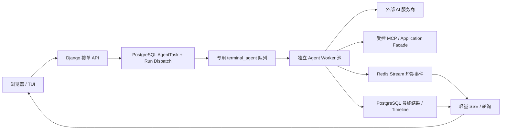
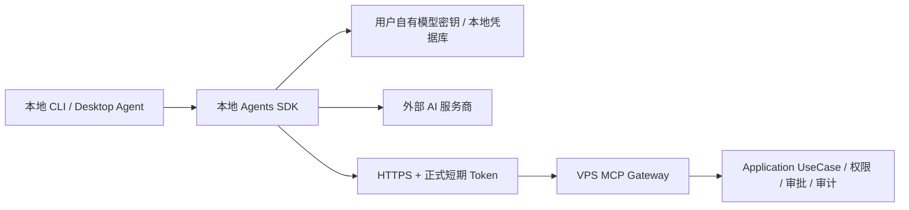

# Terminal Agent 多用户队列、Worker 隔离与本地 CLI 混合运行整改计划

> 创建日期：2026-08-18
> 工作流：`terminal-agent-multi-user-runtime`（category: `product_interface_and_runtime`，priority: P0）
> Owner：`agent_runtime + terminal + task_monitor + operational_readiness + sdk + mcp`
> 机器进度真源：`governance/active_plan_registry.json`
> Canonical closure units：`TAR-01` 至 `TAR-05`
> 执行优先级：`TAR-01` 是机器注册表当前唯一 repository execution focus；严格按 `TAR-01 → TAR-02 → TAR-03` 推进。`TUI-01` 等待 `TAR-03` 后再冻结最终候选并启动正式 M5 关闭窗口；在 `TAR-05` 生产验收前不得直接放大全局 inline 并发。

本文只维护问题、目标架构、分期交付、验收门和回滚边界。`active / waiting_dependency / production_validation` 等执行状态只在机器注册表维护，不在本文形成第二套进度。

## 1. 决策摘要

本计划确认以下架构决策：

1. 当前 `TERMINAL_AGENT_MAX_CONCURRENCY=1` 是生产事故后的临时熔断器，只用于限制故障半径，不是多用户终态。
2. Web/TUI 聊天不得继续在 Django/Daphne 请求进程中运行完整 Agent SDK、MCP 和模型调用；HTTP 入口必须快速接单并返回持久任务标识。
3. Web/TUI 默认采用“PostgreSQL 任务账本 + 有界队列 + 专用 Agent Worker + 可恢复事件流”模式。
4. 本地安装的真实 CLI 可采用“本地 Agent SDK + 用户自有模型密钥 + 远程受控 MCP”模式，把模型连接和编排负载移出 VPS。
5. 浏览器不得持有平台模型密钥，也不得绕过服务器侧身份、额度、审计、MCP 权限、审批和交易风控。
6. PostgreSQL 是任务状态、幂等和最终结果的真源；Redis/Celery 只承担调度和短期事件传输，不能成为唯一任务账本。
7. Agent Worker 必须使用独立队列、独立进程池和独立健康/容量指标，不能与 Web、Qlib 训练/推理或数据新鲜度任务争抢同一执行池。
8. 超额请求进入有上限的公平队列；只有队列达到硬上限、依赖不可用或用户额度耗尽时才拒绝，禁止无限排队。
9. 现有 inline 路径在迁移期继续保持并发 1、60 秒超时和 fail-closed；新路径生产验收后再受控退役，回滚不得重新开放无界 inline 执行。

## 2. 背景、现状证据与根因

### 2.1 当前调用链

现有 Web/TUI 路径为：

```text
POST /api/terminal/chat/ 或 /api/terminal/chat/stream/
  -> TerminalChatView / TerminalChatStreamView
  -> RunTerminalAgentChatUseCase / StreamTerminalAgentChatUseCase
  -> OpenAIAgentsTerminalService
  -> Agents SDK + MCP + 外部模型服务
  -> 请求结束后才释放 Django/Daphne 执行上下文
```

代码证据：

- `apps/terminal/interface/api_views.py` 的同步接口直接调用 `RunTerminalAgentChatUseCase(...).execute()`；SSE 接口的生成器也直接迭代 `StreamTerminalAgentChatUseCase`。
- `apps/agent_runtime/infrastructure/terminal_agent_service.py` 使用 `run_awaitable_sync(asyncio.wait_for(...))` 在请求链内执行 Agent，默认上限 60 秒、最大 4 turns。
- `apps/agent_runtime/infrastructure/terminal_agent_execution_guard.py` 通过 Redis cache lease 实现同用户去重和全局 slot。
- `docker/docker-compose.vps.yml` 当前默认 `TERMINAL_AGENT_MAX_CONCURRENCY=1`，因此第二个用户不会排队，而是返回 `429 AI_AGENT_BUSY`。
- 当前通用 `celery_worker` 同时消费 `celery,qlib_infer,qlib_train`，默认并发 1；若直接加入聊天任务，会让 AI 长任务与数据/训练任务相互饥饿。
- 当前 Redis 使用 AOF，但 `maxmemory-policy=allkeys-lru`；未消费的调度消息或事件不得只依赖可被逐出的 Redis key。

### 2.2 已发生的故障模式

此前生产故障由重复聊天请求、长 MCP/内部调用、重试和 Agent turn 叠加触发，Daphne 资源被持续占用。`restart: unless-stopped` 不会因为进程“仍存活但无法服务”自动重启，最终表现为整站不可访问。

已经上线的止血措施包括：

- 同用户与全局缓存租约；
- 60 秒总体超时、4 turns、MCP 20 秒、内部 API 8 秒且不重试；
- 429/504 稳定错误语义；
- Web 连续健康检查失败后自终止并交给 Docker 重启；
- 并发、超时、缓存异常和健康检查状态机测试。

这些措施控制了故障半径，但没有提供队列、公平调度、任务恢复、取消、队列位置或 Web/Worker 隔离。

### 2.3 根因结论

根因不是“模型推理跑在 VPS”。模型推理主要发生在外部服务商；真正的问题是 VPS Web 进程承担了长连接、Agent 编排、MCP 调用、工具访问、审计和等待过程。全局并发 1 只能在“保护网站”和“多人可用”之间选择前者，无法同时满足二者。

## 3. 目标与非目标

### 3.1 目标

- Web API 在完成鉴权、校验、幂等接单和持久化后快速返回，不执行模型或 MCP 长任务。
- 不同用户可同时提交；容量内并行执行，容量外进入有界队列并获得稳定任务状态。
- 同一用户重复提交不会重复调用模型、MCP 或产生重复副作用。
- Worker 崩溃、Redis 短暂不可用、模型超时或客户端断线后，任务状态可解释、可重试或可终止，不拖垮网站。
- TUI 能展示排队、执行、等待审批、完成、失败、超时、取消状态，并支持恢复连接和取消。
- SDK 提供类型化的创建、查询、事件消费和取消接口。
- 本地 CLI 支持用户自有模型密钥在本机运行 Agent，只通过正式 Token 调用远程 MCP/API。
- 建立多用户容量、队列老化、Worker 心跳、失败率、模型/MCP 延迟和 Web SLO 监控。
- 通过 1/5/10/20 用户并发、重复提交、Worker crash、Redis 故障、模型超时和部署回滚验证。

### 3.2 非目标

- 不允许浏览器直接持有平台 OpenAI、DashScope 或其他服务商密钥。
- 不用无限队列掩盖容量不足；队列必须有用户级和全局上限。
- 不在本线重写 Agents SDK、MCP 能力注册表或高风险审批业务规则。
- 不把 Celery result backend 当作任务真源，不把完整 Prompt、模型密钥或解密后的 Token放进 broker payload。
- 不为追求“实时”而允许 SSE 事件绕过任务 ownership 校验。
- 不直接扩大现有 Daphne inline 并发来替代架构整改。
- 不把 Local CLI 误解为浏览器 JavaScript 直连模型；本地模式只适用于受控安装的 CLI/桌面 Agent。

## 4. 目标架构

### 4.1 Web/TUI 服务器排队模式



请求创建成功后返回 `202 Accepted` 和 `run_id/task_id`。Django Web 不等待模型完成。Worker 并发和 Web 并发相互独立；Worker 停止只使 AI 能力降级，不影响普通页面和健康检查。

### 4.2 本地 CLI 混合模式



本地模式把模型调用、turn 循环和大部分上下文编排放到用户机器；VPS 仍负责业务数据、工具授权、额度、审批、审计和所有高风险写操作。该模式与现有“三机架构：C 端 Agent 经 VPS/FRP 调后端”的边界一致。

### 4.3 三个运行模式

| 模式 | 适用入口 | 模型/Agent 编排位置 | VPS 责任 | 生命周期 |
|------|----------|--------------------|----------|----------|
| `web_queued` | 浏览器、TUI、服务端 SDK | 专用 Agent Worker | 接单、队列、工具、权限、审计、事件 | 目标默认 |
| `local_cli` | 安装式 CLI/桌面 Agent | 用户本机 | 远程 MCP、权限、审批、审计 | 目标可选 |
| `legacy_inline` | 旧 `/chat/`、旧 SSE | Daphne 请求链 | 全部 | 迁移期受限，最终退役 |

## 5. 领域、持久化与状态契约

### 5.1 复用现有 Agent Runtime，而不是再建第二套任务系统

现有 `AgentTask`、`AgentTimelineEvent`、`AgentExecutionRecord`、Proposal/Approval 已是 AI-Native 冻结契约。整改必须复用它们作为用户任务、时间线和最终执行证据，不得在 `terminal` App 复制一套通用 Agent 任务模型。

由于现有 `TaskStatus` 已冻结且没有 `queued / claimed / cancel_requested / timed_out` 等调度态，本计划新增 agent-runtime 所有的专用调度实体（暂定 `TerminalAgentRun`，最终名称在 `TAR-01` ADR 冻结），以一对一或多对一关系绑定 `AgentTask`：

| 字段语义 | 硬要求 |
|----------|--------|
| `run_id` | 对外不可猜 UUID，所有事件和取消操作使用该 ID |
| `task_id` | 绑定 canonical `AgentTask`，不复制通用任务数据 |
| `actor_user_id` | ownership 与配额真源；查询和事件订阅必须按 actor 过滤 |
| `session_id` | 会话关联，不代替用户身份 |
| `client_request_id` | 用户范围幂等键；重复请求返回原 run，不再入队 |
| `runtime_mode` | `web_queued / local_cli / legacy_inline` |
| `dispatch_status` | 调度状态机；与冻结的 `TaskStatus` 有明确映射 |
| `provider_ref` | 只保存服务商引用，不保存解密后的密钥 |
| `deadline_at` | 服务器计算的绝对截止时间，timezone-aware |
| `claimed_by / claimed_at / heartbeat_at` | Worker claim、失联检测和恢复证据 |
| `cancel_requested_at` | 协作式取消真源；不能只依赖 Celery revoke |
| `attempt_count` | 仅记录受控调度尝试，不等同模型内部重试 |
| `last_event_id / result_ref` | 事件恢复和持久最终结果引用 |
| `last_error` | 稳定机器码和安全摘要，不存 raw exception/secret |

Broker task 参数只允许携带 `run_id` 或 `task_id`。Prompt、API Key、用户 Token、审批 payload 和数据库对象不得进入 Celery 消息；Worker claim 后按 ID 从可信 Repository 重新读取并校验。

### 5.2 调度状态机

```text
accepted -> queued -> claimed -> running
running  -> waiting_approval -> queued/resumed -> running
queued/claimed/running/waiting_approval -> cancel_requested -> cancelled
claimed/running -> completed | failed | timed_out
claimed/running -> orphaned -> queued（仅满足安全重放条件）或 failed
```

硬规则：

- 所有转移由 Application 状态机校验并记录 timeline；Interface 和 Celery task 不直接写 ORM。
- claim 使用数据库 first-winner 语义，重复 delivery 只能有一个 Worker 执行。
- 已发生非幂等工具副作用后不得自动重跑整个 Agent；应进入 `needs_human/failed` 并暴露已完成步骤。
- `cancel_requested` 是协作式信号。Worker 在 turn、MCP 调用和事件循环边界检查；外部调用仍受硬超时约束。
- 终态不可被晚到的 Worker 或事件覆盖；stale owner 不能删除新 owner 的 lease。
- orphan reaper 只重排尚未发生不可重放副作用的任务。

### 5.3 敏感数据与保留策略

- 模型服务密钥继续由服务器 secrets/provider repository 或本地 OS 凭据库持有；不得写入任务表、事件流或日志。
- Prompt 是否持久化、保留多久、是否加密必须在 `TAR-01` 固化；默认最小化保存并对日志做截断/脱敏。
- MCP 工具参数按现有风险、审批和审计契约处理；Token、密码、密钥字段不得进入普通 timeline payload。
- SSE/轮询响应不得包含其他用户的队列位置明细、Prompt、provider credential scope 或内部异常。

## 6. API、事件与兼容契约

### 6.1 新的异步 API

最终路径名称在 `TAR-01` 依据现有 `/api/terminal/` 命名冻结；最低能力必须包含：

| 操作 | 语义 | 成功状态 | 关键响应字段 |
|------|------|----------|--------------|
| 创建 Agent run | 鉴权、校验、幂等接单 | `202` | `run_id`, `task_id`, `status`, `submitted_at`, `status_url`, `events_url`, `cancel_url` |
| 查询 run | 返回 owner-scoped 当前状态 | `200` | 状态、排队摘要、时间、稳定错误码、最终结果引用 |
| 消费事件 | SSE，支持恢复；轮询为兼容回退 | `200 text/event-stream` | `event_id`, `event_type`, `run_id`, `occurred_at`, `data` |
| 取消 run | 设置 cancel request，幂等 | `202/200` | `run_id`, `status`, `cancel_requested_at` |
| 查询本人队列摘要 | 只返回本人任务和全局容量摘要 | `200` | 本人 running/queued、估算等待、系统 degraded 状态 |

接口规则：

- 创建请求必须支持 `Idempotency-Key` 或等价 `client_request_id`，唯一范围至少包含 actor。
- 所有端点有 Content-Type、状态码、ownership、404/403、重复提交、队列满、依赖不可用契约测试。
- `queue_position` 只能是近似值并标明估算，不承诺精确开始时间。
- `Retry-After` 只用于队列满/依赖恢复等明确可重试状态，不要求客户端高频轮询。
- API 只调用 Application UseCase；Interface 不导入 Infrastructure，不直接 ORM。

### 6.2 事件传输

- PostgreSQL timeline 和最终结果是可审计真源。
- Redis Streams 可承载短期 token delta、tool progress 和状态事件，使用有界 `MAXLEN`、TTL 和 key namespace。
- 客户端使用 `Last-Event-ID` 恢复；若 Stream 事件已过期，从 PostgreSQL checkpoint/最终结果恢复，不返回空白会话。
- 禁止只用 Redis Pub/Sub：断线期间事件会丢失且无法重放。
- SSE endpoint 必须使用真正的异步迭代或 Channels/ASGI 方案，不能把同步生成器换个路径继续阻塞线程。
- Nginx 对 SSE 关闭代理缓冲并设置单独超时；普通 Web 超时不随聊天任务无限放大。

### 6.3 旧接口迁移

1. 新增异步 v2 run API，不立刻改变旧接口响应结构。
2. TUI 首先通过 feature flag 切到新 API；staff/canary 先启用。
3. SDK 增加新类型化模块；旧同步 helper 标记 deprecated，并可在客户端用“提交 + 等待”实现兼容，而不是让服务器同步等待。
4. 旧 `/api/terminal/chat/` 与 `/api/terminal/chat/stream/` 在观察期继续受并发 1 和 60 秒硬限保护。
5. 所有正式调用方迁移并通过候选 UAT 后，旧接口返回稳定弃用响应或受控关闭。
6. 回滚新路径时默认暂停新 AI 提交或恢复到受限 inline，禁止移除保护后回滚。

## 7. 队列、Worker 与背压设计

### 7.1 专用执行池

新增独立 `terminal_agent` queue 和 `celery_agent_worker`（最终服务名在部署实现时冻结）：

- 不消费 `celery / qlib_infer / qlib_train`；通用 Worker 也不消费 `terminal_agent`。
- 独立 concurrency、prefetch、soft/hard time limit、max-tasks-per-child、memory limit 和 health probe。
- Worker 并发是实际全局执行容量；Application guard 只作为迁移期二次保险，不再长期固定为 1。
- Worker 关闭使用 drain/graceful stop；部署时先停止接单、等待可完成任务，再终止超时任务。
- Agent Worker 不得通过扩大 Daphne worker 数量伪装隔离。

### 7.2 有界接单与公平性

接单策略必须同时满足：

- 每用户 active 上限；
- 每用户 queued 上限；
- 全局 queued 上限；
- provider/user quota；
- Worker heartbeat/readiness；
- Prompt/请求体大小上限；
- 幂等键去重。

上限值不在代码中硬编码，由 Config Center/环境配置并有安全默认值。具体容量必须由 staging 压测确定。一个用户不能通过大量 pending run 占满全局队列；最低公平性由“每用户小队列 + oldest accepted 调度”保证，后续有多租户时扩展 tenant weight。

### 7.3 Celery 交付语义

- Celery 是 at-least-once transport，不假设 exactly-once。
- API 在数据库事务内创建 task/run，使用 `transaction.on_commit` 派发。
- 派发失败必须留下 `dispatch_pending` 证据，由 dispatcher/reconciler 重发；不能出现“数据库显示 queued 但永远没有消息”。
- Worker 开始前以数据库原子 claim 去重；晚到的重复消息返回 `noop`。
- `acks_late / reject_on_worker_lost` 只与原子 claim、幂等副作用和 orphan recovery 一起启用。
- unsafe write 或已触发模型/tool side effect 的任务不做盲目自动重试。
- 新关键 Celery task 必须登记 `governance/celery_task_contracts.json`，返回 `outcome=success/partial/noop/blocked/failed` 及明确的 requested/succeeded/failed/stored 统计。

### 7.4 Redis 边界

生产 broker 不能依赖会静默逐出未消费消息的 `allkeys-lru`。`TAR-02` 必须在以下方案中冻结一个：

- 独立 Agent Redis/broker，AOF + `noeviction` + 内存告警；或
- 共享 broker 但改为不会静默删除队列消息的策略，并证明不会影响现有缓存；或
- 以 PostgreSQL dispatcher 为可靠源，Redis 仅作为可重建 transport，并有丢消息 reconciliation 指标和演练。

无论选哪种，Redis 故障不得拖垮普通网站；AI 接单可以进入明确 degraded/dispatch_pending，或在无法保证恢复时返回 bounded `503`。

## 8. Local CLI 目标契约

本地 CLI 是独立交付面，不等于把 Web JavaScript 改成直连模型。

最低能力：

- 提供 `agomtradepro agent` 或等价 SDK CLI 入口，Agents SDK 作为可选依赖组安装。
- 服务商密钥从本地环境或 OS 凭据库读取，不上传到 VPS，不写仓库配置。
- 使用正式 AgomTradePro API Token/短期 access package 连接远程 MCP；不得复用浏览器 session cookie。
- 远程 MCP 能力发现、schema、调用、确认恢复遵循现有 canonical registry，不在 CLI 复制业务逻辑。
- 本地 Agent 的 tool allowlist 由服务器能力目录和用户权限交集决定；Prompt 不能扩大权限。
- 所有中高风险写操作仍由服务器生成 proposal/confirmation，CLI 只展示并提交明确确认。
- CLI 对网络中断、Token 过期、MCP 429/503、审批等待和重连给出稳定错误与恢复提示。
- SDK、MCP、CLI 版本兼容矩阵和最小支持版本进入发布清单。

## 9. 分期、工期与交付包

工期是工程量估算，不是跳过验收门的日期承诺。按 1 名后端主责、1 名 Terminal/SDK 主责、运维和 QA 分时参与估算，总计约 16–24 人日；允许测试、TUI 和部署资产在依赖冻结后并行，预计 3–4 个日历周完成仓库实现和 staging 验收，生产观察另计。

| 阶段 | Canonical unit | 估算 | 主责 | 交付重点 | 退出门 |
|------|----------------|------|------|----------|--------|
| M0 契约与基线 | `TAR-01` | 2–3 人日 | Agent Runtime / Architecture / QA | ADR、现状负载基线、状态机、API/事件/幂等/敏感数据契约、feature flag | 冻结目标边界；测试先失败证明现有 Web 会直接执行 Agent；容量和回滚指标可机器采集 |
| M1 持久任务与接单 | `TAR-02` | 3–4 人日 | Agent Runtime / Terminal | `AgentTask` 复用、Run Dispatch、Repository、202 API、ownership、幂等、有界 admission、on-commit dispatch/reconciler | 创建接口不调用 Agent/provider/MCP；重复请求只产生一个 run；broker 失败可恢复或明确失败 |
| M2 Worker 与事件隔离 | `TAR-03` | 5–7 人日 | Agent Runtime / DevOps / Task Monitor | 专用 queue/worker、原子 claim、timeout/cancel/orphan、Redis Stream + durable checkpoint、指标与健康 | 杀死 Worker 不影响 Web；重复 delivery 不重复执行；断线恢复事件；数据/QLib Worker 不被 Agent 饥饿 |
| M3 TUI/SDK 用户闭环 | `TAR-03` | 3–4 人日 | Terminal / SDK / QA | 排队/执行/审批/完成/失败/取消 UI，SSE reconnect + polling fallback，SDK 类型化接口，旧接口迁移 | 普通用户可完成提交、等待、恢复、取消；无内部路由/异常泄露；API/SDK/TUI 契约一致 |
| M4 本地 CLI 混合模式 | `TAR-04` | 3–5 人日 | SDK / MCP / Security | 本地 Agent、用户自有 provider key、远程 MCP Token、确认恢复、安装/升级/卸载文档 | 模型密钥不离开本机；远程工具继续按用户授权与审批；断网/过期 Token 有可恢复行为 |
| M5 容量与生产验收 | `TAR-05` | 3–4 人日 + 观察期 | Operational Readiness / QA / Owners | 1/5/10/20 用户压测、故障注入、资源预算、canary、候选绑定、回滚演练、旧 inline 退役决策 | 达成第 11 节 SLO；生产 Web 无重启/拥塞；同候选 UAT 和观察通过后才解除全局并发 1 |

### 9.1 `TAR-01`：契约冻结与基线

交付顺序：

1. 记录单用户与 5/10/20 并发时 Web p50/p95/p99、CPU、RSS、Daphne 活跃请求、Redis、DB 连接、MCP/模型延迟基线。
2. 增加架构回归测试，证明新接单 API 不得构造或调用 `OpenAIAgentsTerminalService`。
3. 冻结 `AgentTask` 与 Run Dispatch 的职责、状态映射、幂等键、Prompt 保留和错误码。
4. 冻结新 API/SDK/MCP/TUI 命名和兼容策略。
5. 冻结 Worker、broker/stream、队列上限、取消、超时、orphan 判定和 feature flag。

### 9.2 `TAR-02`：持久接单和可靠派发

交付顺序：

1. 以 Domain entity/Protocol 定义状态和 port；Application 编排状态机；Infrastructure 实现 ORM/Redis/Celery。
2. 创建 schema-only migration 和索引，验证 PostgreSQL 并发 first-winner、幂等唯一约束和 rollback。
3. 建立创建、查询、取消和 queue summary API，补 Content-Type/状态码/权限契约。
4. 使用 `transaction.on_commit` 派发，仅传 `run_id`；实现 dispatch reconciliation。
5. 实现每用户与全局 admission、稳定 queue-full/degraded 错误和 `Retry-After`。
6. 登记 Celery task contract 和失败矩阵。

### 9.3 `TAR-03`：专用 Worker、事件与 TUI/SDK

交付顺序：

1. 新增专用 Agent Worker compose/service、queue route、resource limit、graceful drain 和 heartbeat。
2. 把现有 `OpenAIAgentsTerminalService` 从 Web composition root 移到 Worker composition root。
3. 实现 claim、heartbeat、cooperative cancel、soft/hard timeout、orphan reconciliation、max-tasks-per-child。
4. 事件写入 Redis Stream，关键状态和最终结果同步到 timeline/execution record；支持 Last-Event-ID 恢复。
5. 更新 TUI metadata/runtime：主任务仍是“与智能助手协作”，P0 显示当前任务和下一步；用户文案不得暴露 Celery、Redis、route 或 worker 实现。
6. SDK 增加 create/get/events/cancel；旧同步 helper 仅在客户端等待，服务器不恢复同步执行。
7. Task Monitor 增加 queue depth、oldest age、running、orphan、timeout、cancel latency、provider/MCP latency 和 Worker heartbeat。

### 9.4 `TAR-04`：本地 CLI

交付顺序：

1. 建立 CLI optional dependency、配置目录、凭据读取和版本诊断。
2. 复用 SDK/MCP registry 实现 capability discovery、schema、call、confirmation resume。
3. 本地 Agent 直接调用用户配置的服务商；服务器只看到 MCP/API 请求和审计，不接收模型密钥。
4. 建立本地会话、取消、重连、Token 轮换和最小日志脱敏。
5. 完成 Windows/WSL/Linux 安装、升级、卸载、故障排查和端到端测试。

### 9.5 `TAR-05`：容量、发布与退役

交付顺序：

1. 在隔离/staging 运行容量阶梯和 soak test，确定 Worker concurrency、prefetch、queue limits、Redis/DB 内存与连接预算。
2. 注入 Redis 不可用、broker message 丢失、Worker SIGKILL、模型 429/5xx/timeout、MCP timeout、SSE 断线和部署 drain。
3. staff canary 切换到 queued path；核对费用、工具调用、审批、timeline 和结果一致性。
4. 扩到普通用户并观察 Web SLO、队列老化和 Worker 资源；任何硬门失败立即回滚 feature flag。
5. 把候选 commit、OCI revision、migration、TUI manifest、SDK/MCP version、压测报告和回滚证据绑定为同一发布包。
6. 观察通过后才移除/关闭 legacy inline；保留 emergency disable，不保留无界旁路。

TAR-05 的证据采集默认自动化：在已经批准的 staging/候选环境中，代理持续运行 1/5/10/20 阶梯与 soak 套件，采集 Web/Worker/Redis/DB/MCP/模型指标、事件 timeline、费用、重复/公平性和恢复时长，并绑定 commit/OCI/manifest；指标不可用必须保留为 unavailable。只有生产负载、生产 chaos、canary/feature flag、inline 退役或容量提升需要逐项授权，容量接受仍由 Operations/Product owner 判断。缺少 load/metrics collector 时先补 collector，不得以“需要生产证据”结束 TAR-05。

## 10. 分工与交付责任

| 角色/Owner | 主责任 | 必交证据 | 不得越界 |
|------------|--------|----------|----------|
| Agent Runtime | 状态机、Run Dispatch、Worker execution、claim/cancel/recovery | Domain 单测、PostgreSQL 并发、Worker crash/replay | 不把 ORM 放进 Application，不复制 Terminal UI 逻辑 |
| Terminal/TUI | 接单 API、owner-scoped 查询、SSE/polling、用户状态与恢复动作 | API 契约、TUI metadata、浏览器主任务证据 | 不在 Interface 直接查询 ORM，不向用户泄露实现细节 |
| SDK | run client、事件迭代、取消、兼容 helper、Local CLI 外壳 | SDK contract、断线/重连、版本矩阵 | 不复制服务端权限和业务规则 |
| MCP | 远程工具认证、能力目录、确认恢复、Local CLI 接入 | registry/handler/permission tests、审计 trace | 不单独实现另一套 Agent Runtime |
| Task Monitor / Audit | 队列、Worker、延迟、失败、orphan、费用与 timeline 观测 | metrics contract、告警、dashboard/TUI evidence | 不把 Celery `SUCCESS` 当业务成功 |
| Operational Readiness | Compose、Redis/broker、资源限制、canary、drain、回滚 | staging/prod manifest、容量报告、故障演练 | 不在未压测前放大并发，不破坏 DB volume |
| QA / Security | 多用户、隔离、幂等、secret、负载和攻击面验证 | 测试矩阵、跨用户泄漏=0、secret scan、UAT | 不用 mock/fixture 代替生产容量与权限证据 |

实施允许在接口冻结后并行：Terminal 可并行做状态 UI，SDK 可并行做类型与本地配置，运维可并行准备专用 Worker；但数据库状态机、幂等和 ownership 未完成前不得接真实模型流量。

## 11. 验收指标与测试矩阵

### 11.1 硬 SLO

| 指标 | 门槛 |
|------|------|
| 新建 run API 延迟 | staging 负载下 p95 ≤ 500 ms，且 provider/MCP mock 断言为 0 次调用 |
| 普通 Web 可用性 | 20 个并发聊天用户压测期间，普通健康/只读页面 5xx = 0；p95 相对空载基线劣化不超过 10% |
| Web 进程稳定性 | 15 分钟容量测试与故障注入期间 Daphne 因聊天负载重启次数 = 0 |
| 幂等 | 同用户同幂等键 20 次并发提交，只创建 1 个 run，只执行 1 次模型调用 |
| 用户隔离 | 跨用户查询、SSE、取消、队列摘要泄漏 = 0；所有越权请求为稳定 403/404 |
| 任务恢复 | Worker crash 后任务进入可解释终态或安全重排；无永久 `running`，无重复非幂等副作用 |
| 队列边界 | 每用户和全局上限可验证；超过上限 bounded 拒绝，Redis/DB 无无界增长 |
| 超时 | 单 run 总时限、MCP、内部 API、审计时限继续有硬上限；晚到事件不能覆盖终态 |
| 取消 | 非外部阻塞阶段的取消请求在下一个安全检查点生效；外部阻塞不超过硬 deadline |
| 事件恢复 | SSE 断开重连不丢关键状态；短期 delta 过期后仍可读取最终结果和 durable timeline |
| 队列隔离 | Agent soak test 不增加 Qlib/data Celery queue oldest-age，不抢占通用 Worker |
| 密钥 | 浏览器、broker payload、数据库任务字段、timeline、日志中平台/用户模型密钥出现次数 = 0 |

### 11.2 必测场景

| 层级 | 场景 |
|------|------|
| Domain | 状态合法/非法转移、终态不可覆盖、取消、orphan、安全重排判断 |
| Application | ownership、幂等、quota、queue full、dispatch pending、duplicate delivery、unsafe retry 阻断 |
| Repository | PostgreSQL first-winner、唯一约束、select-for-update、rollback、stale heartbeat、分页/索引 |
| Celery | invalid input、success、noop duplicate、blocked、provider failure、zero output、worker lost |
| API | 202/200/403/404/409/429/503、Content-Type、Location/Retry-After、未知字段、请求体上限 |
| Events | 单调 event ID、Last-Event-ID、stream trim、断线恢复、final checkpoint、跨用户隔离 |
| TUI | 排队、执行、审批、完成、失败、取消、重试、刷新/返回后恢复；无裸错误和路由术语 |
| SDK | create/get/events/cancel、同步兼容 helper、本地超时、网络重连、版本不兼容 |
| Local CLI/MCP | 本地 key 不上传、Token 过期、capability allowlist、确认恢复、write 审批 |
| Load | 1/5/10/20 用户、同用户连点、单用户洪泛、慢 provider、慢 MCP、长输出、队列满 |
| Chaos | Redis down/restart、broker 消息丢失、Worker SIGTERM/SIGKILL、Web 重启、部署 drain |

### 11.3 最低回归命令族

实施阶段应按改动补充精确文件，最低包含：

```bash
pytest tests/unit/test_terminal_agent_execution_guard.py -q
pytest tests/unit/test_terminal_agent_service.py -q
pytest tests/component/test_terminal_api.py -q
pytest tests/unit/test_tui_workbench.py -q
pytest sdk/tests/test_sdk/test_client.py -q
pytest tests/unit/test_internal_ssl_redirect.py -q
python scripts/check_celery_task_contracts.py
pytest tests/guardrails/test_celery_task_contracts.py -q
python scripts/check_tui_metadata_source_consistency.py
python scripts/check_mypy_regression.py <changed-production-python-files>
python scripts/check_mypy_debt_ceiling.py
```

另需新增专用的 PostgreSQL integration、multi-process Worker、SSE reconnect、load/chaos 测试；不能用 LocMemCache、eager Celery 或 mock provider 代替最终生产证据。

## 12. 监控、告警与运行手册

必须发布以下稳定指标：

- `terminal_agent_runs_total{outcome,mode,provider}`；
- `terminal_agent_queue_depth`、`terminal_agent_queue_oldest_age_seconds`；
- `terminal_agent_running`、`terminal_agent_worker_heartbeat_age_seconds`；
- `terminal_agent_run_duration_seconds`、`queue_wait_seconds`；
- `terminal_agent_orphan_total`、`duplicate_delivery_total`、`dispatch_pending_total`；
- `terminal_agent_cancel_latency_seconds`、`timeout_total`；
- `terminal_agent_provider_latency_seconds`、`mcp_latency_seconds`；
- 费用/Token 指标继续使用现有用户额度和审计口径，禁止高基数 Prompt label。

最低告警：

- Worker heartbeat 超阈值；
- oldest queue age 持续升高；
- queue depth 达到软/硬阈值；
- orphan/dispatch_pending/timeout 突增；
- provider 429/5xx 或 MCP timeout 突增；
- Web p95/5xx 与聊天负载相关劣化；
- Redis memory/eviction/broker reconciliation 异常；
- 费用或用户配额异常增长。

运行手册必须覆盖：暂停接单、drain Worker、取消单 run、恢复 dispatch_pending、处理 orphan、扩缩 Worker、Redis 恢复、provider 熔断、回滚 feature flag、验证无重复副作用。

## 13. 发布、迁移与回滚

### 13.1 发布波次

| 波次 | 动作 | 前置门 | 失败处理 |
|------|------|--------|----------|
| R0 | 向后兼容 migration、代码和指标上线，queued mode 关闭 | schema/rollback/备份验证 | 回滚代码；旧 inline 继续受限 |
| R1 | 启动专用 Worker，合成任务/只读任务验证 | Worker/Redis/DB readiness | 停 Worker，不影响 Web |
| R2 | staff canary 切 queued path | API/TUI/SDK contract、费用与审计一致 | feature flag 回受限 inline 或暂停 AI |
| R3 | 小比例普通用户 | capacity/chaos、owner UAT | 停新接单并 drain，不丢 durable run |
| R4 | 全量 web_queued + Local CLI beta | Web/queue SLO、候选 manifest 绑定 | 保留 queued ledger，降低 Worker 并发或暂停 |
| R5 | 退役 legacy inline | 观察期、调用方清单=0、回滚演练 | 恢复兼容 adapter，不解除保护 |

### 13.2 回滚原则

- 数据库 migration 必须向后兼容；首轮不删除旧字段/接口。
- 回滚不能删除已接单 run、timeline、proposal、approval 或执行记录。
- Worker 发布失败时 Web 仍可用；AI 入口显示“服务暂不可用/已暂停接单”，而不是转入无界同步路径。
- 已经产生外部副作用的 run 不自动重放；进入人工处理并展示已完成步骤。
- TUI metadata、SDK/MCP 版本和后端 API 必须按同一候选兼容矩阵回滚。
- 正式部署遵循 VPS 部署规范，保留 PostgreSQL/Redis volumes，部署前完成数据库备份和 migration rollback 预演。

## 14. 与现有计划的关系

| 工作流/文档 | 关系与边界 |
|-------------|------------|
| `ai-native-release` / `AI-01` | 本线复用已冻结 `AgentTask/Timeline/Proposal`，不重做 AI-Native；`AI-01` 的真实 staging/production 验收必须等待 `TAR-05`，不能继续把 inline chat 当作可发布终态 |
| `web-to-tui-m5` | `TAR-03` 若改变 published TUI graph/manifest，M5 候选必须重新绑定；旧候选证据不能冒充新 runtime 验收 |
| `tui-usability-governance` | TUI 状态、错误和恢复动作遵循用户面对标准；不在本线顺手重写无关 screen 文案，避免与 `TUX-02/04` 冲突 |
| `system-audit-consolidation` | run/timeline 先通过 Agent Runtime canonical port 留证；统一 audit publisher 可用后接入，不在本线复制 audit ledger |
| Celery task contract | 新 Agent task 属关键长任务，必须登记 outcome/失败矩阵并让 Task Monitor 读取业务结果而非 Celery 状态 |
| MCP hosted transport / 三机架构 | Local CLI 复用 C 端 Agent 经 HTTPS/MCP 调 VPS 的既有边界；不让客户端直连数据库或绕过服务端权限 |
| Evidence hard gate | Agent 给出的建议和工具结果不改变 Evidence/执行硬闸；模型文本永远不能直接授权交易写入 |

## 15. 风险与对策

| 风险 | 对策 |
|------|------|
| Celery 重复 delivery 导致重复模型费用或写副作用 | DB 原子 claim、用户幂等键、工具幂等/审批、unsafe 阶段禁止自动重试 |
| Redis eviction 丢 broker/stream | durable DB ledger、专用/noeviction broker 方案、dispatch reconciliation、Stream checkpoint |
| SSE 连接仍耗尽 Web | 真异步 iterator/Channels、单独代理配置、连接上限、polling fallback、压测文件描述符 |
| 队列无限增长 | 用户/全局硬上限、oldest-age 告警、provider 熔断、bounded 429/503 |
| Worker 与数据任务争抢 | 独立 queue/service/resource limits，不共享通用消费列表 |
| 取消时工具正在产生副作用 | 协作式安全点、硬 deadline、proposal/approval、已完成步骤留证，不承诺事务外部回滚 |
| Local CLI 泄露 key/token | OS 凭据库、日志脱敏、短期 Token、权限最小化、secret scan、安装文档 |
| 双路径产生行为漂移 | 同一 Application service/DTO/error code，契约测试和 canary diff；禁止复制 Agent 业务逻辑 |
| 迁移影响 M5/AI 候选 | manifest/candidate 重绑，旧证据明确失效，不跨候选拼接 UAT |
| 容量参数凭感觉配置 | staging 阶梯压测和 soak 结果决定，配置进入 Config Center/环境，不硬编码 |

## 16. 完成定义

本计划只有同时满足以下条件才可转入完成/归档：

1. Web/TUI 正式路径的接单请求不执行 provider、Agent SDK 或 MCP 长调用。
2. PostgreSQL 中存在 owner-scoped、幂等、可恢复的 run/task 状态和 durable 最终结果。
3. 专用 Agent Worker 与数据/QLib/Web 进程完成队列和资源隔离。
4. 多用户有界排队、取消、超时、orphan、事件恢复和 bounded overload 行为通过自动化与真实进程测试。
5. TUI 与 SDK 能完成提交、排队、执行、审批、恢复、取消和结果读取主任务。
6. Local CLI 使用用户自有模型密钥，本地编排并通过正式 Token 调远程 MCP；浏览器无平台密钥。
7. 1/5/10/20 用户容量和 chaos 验收达到第 11 节硬 SLO，普通网站未因 AI 负载重启或失去响应。
8. Celery、TUI metadata、API/SDK/MCP、mypy、治理和高风险回归全部通过。
9. staging/production UAT、候选 manifest、观察、回滚和 owner/reviewer 证据绑定同一不可变版本。
10. legacy inline 调用方清单为零并受控退役；紧急关闭路径仍 fail-closed。

## 17. 初始进度记录（2026-08-18）

| 项目 | 状态 | 证据/说明 |
|------|------|-----------|
| 事故止血 | completed | 并发租约、60 秒超时、最大 turns、下游超时、429/504、健康自恢复已上线并覆盖回归 |
| 多用户终态架构 | active/planned | 本文与 `TAR-01` 已纳入机器注册表；尚未实现异步 run API、专用 Worker 或队列 |
| 迁移期 inline 并发闸门 | completed (repository slice) | `OpenAIAgentsTerminalService` 对旧 Web/TUI inline 路径强制将环境并发覆盖限制为 `1`，并在尝试放大时记录 warning；service/lease 回归 `25 passed`，增量 mypy 为 0 | 仅保护迁移期事故半径；不代表 TAR-01 契约冻结、持久化队列、专用 Worker、容量/故障注入或 TAR-05 生产验收完成 |
| TAR-01 纯契约冻结切片 | completed (pure contract slice) | 新增 `apps/agent_runtime/domain/terminal_agent_run_contract.py` 与 `apps/agent_runtime/application/terminal_agent_run_ports.py`：冻结 owner-scoped selectors、aware deadline/digest、有限状态转移、终态幂等、ID-only broker envelope 与敏感字段拒绝；纯契约回归 `26 passed`，service + execution guard 合计 `45 passed`，增量 mypy `0 regressions`，architecture audit `0 violations` | 仍未接入 Web/TUI 新接单 API、PostgreSQL durable run、Celery/专用 Worker、真实 broker、容量/故障注入或生产观察；当前仅完成 TAR-01 的 pure boundary，不得提前推进 TAR-02 |
| TAR-01 queued intake boundary slice | completed (dormant application boundary) | `SubmitTerminalQueuedRunUseCase` 仅接受 `web_queued`，通过注入的 `TerminalQueuedSubmissionPort` 转交，并拒绝 adapter 替换 run selector/mode/digest；ports + run contract 回归 `31 passed`，增量 mypy `0 regressions`，architecture audit `0 violations` | 仍未接入 Web/TUI 路由、durable PostgreSQL admission、Celery/broker/Worker、容量/故障注入或生产观察；该切片只冻结接单边界，不能宣称 queued runtime 已可用 |
| TAR-01 API/SSE wire contract slice | completed (pure application contract) | 新增 `apps/agent_runtime/application/terminal_agent_run_api_contract.py`，冻结异步 run create/status/events/cancel/queue 路径、`202` 接单响应、owner-scoped status/cancel envelope、可恢复 SSE event 字段、aware timestamp 与敏感数据拒绝；API contract + ports + run contract 回归 `41 passed`，增量 mypy `0 regressions`，architecture audit `0 violations` | 仅冻结命名与 wire shape，尚未接入 Web/TUI route、durable PostgreSQL admission、broker/Worker、真实 SSE/负载或生产观察；不得把 API contract 视为 queued runtime 已上线 |
| TAR-01 baseline evidence contract slice | completed (pure Application contract) | 新增 `apps/agent_runtime/application/terminal_runtime_baseline.py`，要求同一环境/候选的 1/5/10/20 样本与完整 Web p50/p95/p99、CPU/RSS、Daphne、Redis、DB、MCP/模型指标；显式区分 `observed/unavailable`，禁止缺失指标被填零；纯回归 `10 passed`，增量 mypy `0 regressions` | 仅冻结机器可验证证据形状，未进行受控 staging/production 压测、chaos 或容量验收；不得据此扩大 inline 并发或推进 TAR-05 |
| TAR-01 baseline candidate identity guard | completed (pure contract hardening) | `TerminalRuntimeBaselineCandidate` 将 candidate commit/release、OCI revision、runtime manifest digest、test-matrix digest 作为不可拆分身份；四档样本必须 exact-equal，缺失、漂移、伪造 artifact binding 在 sample intake 再验证并 fail-closed；baseline 与 manifest 回归 `20 passed`，增量 mypy/ruff/Black/isort 通过 | 仅防止未来容量样本跨镜像、runtime manifest 或测试矩阵串候选；没有执行真实 1/5/10/20 负载、容量/SLO、chaos、生产观察或 TAR-05 验收，TAR-01 仍 active |
| TAR-01 baseline observation collector boundary | completed (fail-closed pure Application contract) | 新增 `TerminalRuntimeBaselineObservationPort` 与 `TerminalRuntimeBaselineCollector`；按 1/5/10/20 各调用一次注入 observer，校验 environment/candidate/concurrency exact binding，任一指标 unavailable、object-new 伪造 identity 或 observation substitution 即拒绝返回 capacity report；collector focused `6 passed`，增量 mypy/ruff/Black/isort 通过 | 仅冻结未来 staging/production observer 的注入边界，不执行网络/进程/数据库/broker/Agent 观测，不产生默认容量值；没有真实 1/5/10/20 负载、SLO、chaos 或生产证据，TAR-01 仍 active |
| TAR-01 hard-SLO 与 deterministic matrix gate | completed (fail-closed pure Application contract) | 新增 `terminal_runtime_slo.py` 与 `terminal_runtime_test_matrix.py`：按第 11.1 节把 19 项阈值从观测值计算，不接受 caller 自报 `passed`；缺项、unavailable 或越限均阻断；11 层场景与 10 类 threat ID 生成 canonical SHA-256，collector 要求 candidate `test_matrix_digest` exact-match 后才采集；metric/sample/SLO 均 exact-type 重建，NaN/float-concurrency/object-new 伪造 fail-closed，manifest 锁定完整阈值与场景；focused `41 passed`，增量 mypy `0 regressions`，active registry `0 violations` | 修复“任意完整数值可误判 capacity-ready”的验收门漏洞，但仍只有纯合同；矩阵明确标记 6 个未实现的 repository/Celery/events/local-CLI/load/chaos 场景，没有 concrete observer、真实 HTTP/进程/Redis/DB/MCP/model 数据或生产容量证据；inline 单槽及 queued intake/worker 关闭保持不变，TAR-01 仍 active |
| TAR-01 offline snapshot observer/evidence slice | completed (offline contract only) | 新增严格 `terminal-runtime-baseline-snapshot.v1` JSON observer、canonical `terminal-runtime-baseline-evidence.v1` serializer 与 content-addressed dry-run/append-only recorder；candidate/environment/matrix digest、UTC、unknown/secret/finite-type/size 边界均 fail-closed；observer focused `9 passed`，baseline/SLO/matrix 回归 `42 passed`，observer+manifest 回归 `14 passed`，architecture `0`、governance `0`、增量 mypy/ruff/Black/isort 通过；manifest 保持 `production_evidence_status=not_runtime`、`runtime_enablement=not_authorized` | 只把外部受控快照转成可验证离线 artifact，不创建负载、不访问网络/VPS、不读取 ORM/Celery/Agent，也不产生真实容量值；仍缺 concrete repository/Celery/events/local-CLI/load/chaos 六个场景与真实 observer，不能解除 queued/worker 闸门或宣称 TAR-05 |
| TAR-01 当前候选部署与认证边界验收 | observed / capacity denied | `da04c053aa16bd940a45896a531ee567a8a2a892` 发布为 `20260819145227`、image `sha256:cc6fe35e4e14643223cbb9f97953ef5499ce47f844bdd97eb6e4d319ba952b3b`；四条 CI、备份、迁移/schema、Django/TUI/Qlib/Celery/TLS/容器校验通过。生产认证后按 `1/5/10/20` 发出 `36` 个 reserved-route 请求，`36/36` 稳定返回预期 `503 DISPATCH_UNAVAILABLE / queued_runtime_not_wired / Retry-After=60`；前后 health `10/10` 为 `200`；Web/Redis/PostgreSQL 无 restart/OOM。详见部署证据文档 2026-08-19 15:44 节 | 这是 dormant fail-closed 边界验收，不是 queued run 容量验收。20 route + 20 health 混合探测的外部 HTTPS p95 分别为 `4786.71/4026.08 ms`，且既有 Qlib 任务令 Celery 约 `100% CPU`、内存最高观测 `87.64%`；真实 admission/queue/worker/SSE/idempotency/cancel/provider-MCP/chaos 指标仍不存在，canonical capacity report 不可生成，六个场景继续 `planned`，queued/worker flags 与 inline 单槽均不变 |
| TAR-01 admission/queue policy contract slice | completed (pure Application contract) | 新增 `apps/agent_runtime/application/terminal_runtime_queue_policy.py`，冻结 queue/stream 名称、worker/prefetch/深度边界、每用户/全局准入上限、hard/soft/cancel/heartbeat/orphan 截止时间、queued/legacy/emergency feature flags 与受限 inline 上限；纯回归 `15 passed`，增量 mypy `0 regressions`，Black/isort/ruff 通过 | 仅冻结有界策略与时钟关系，不提供生产默认值、不接 ORM/Celery/broker/worker/route，也未取得容量/故障注入或生产观察证据；TAR-01 仍 active，TAR-02 不提前启动 |
| TAR-01 migration default contract slice | completed (pure Application guard) | `TerminalRuntimeFeatureFlags.migration_defaults()` 明确 R0 默认：queued intake/worker 关闭、legacy inline 仅保留 concurrency=1 与 timeout≤60、queue 不可用时 `PAUSE`，emergency stop 默认关闭；focused 回归 `16 passed`，增量 mypy `0 regressions`，Black/isort/ruff/architecture 通过 | 仅提供命名的纯合同 fixture，不读取环境、不接 Web/TUI、ORM、Celery/broker/Worker 或真实容量；默认不改变运行时组合，TAR-01 仍 active，TAR-02 不提前启动 |
| TAR-01 runtime configuration freeze | completed (configuration contract) | `core/settings/base.py` 固化 queued intake/worker、legacy inline、emergency stop、准入上限和 60 秒 inline 上限；production 强制 queued 两闸关闭；VPS compose 显式注入同一组默认值；配置/compose 回归 `20 passed`，TAR contract 回归 `57 passed` | 只冻结配置边界，不接 queued route、PostgreSQL admission、Celery/Worker、broker 或真实容量/生产观察；production 仍保持受限 legacy inline，TAR-01 继续 active |
| TAR-01 queued API composition boundary | completed (failing-first pure boundary) | 新增 `TerminalQueuedRunApplicationBoundary`，未来 API 只能注入 `SubmitTerminalQueuedRunUseCase` 的 `TerminalQueuedSubmissionPort`；legacy inline/local-cli 在 adapter 调用前拒绝；AST guard 明确无 `OpenAIAgentsTerminalService`、infrastructure、Celery 或 ORM；boundary + ports 回归 `8 passed` | 仅完成 Application composition contract；没有新增 Web route、durable PostgreSQL admission、broker/Worker、真实 SSE、容量/chaos 或生产观察；现有同步 Web/TUI inline 路径保持原样并继续受 1 槽限制，TAR-01 仍 active，TAR-02 不提前启动 |
| TAR-01 machine-readable runtime ADR | completed (contract manifest) | 新增 `governance/terminal_agent_runtime_contracts.json`，以现有 `AgentTask`、`TerminalAgentRunContract`、`TerminalRunStatus`、`TerminalRunApiRoute`、queue/deadline/feature-flag constants 为唯一引用，冻结职责分工、TaskStatus 投影规则、actor-scoped 幂等、raw prompt/transport 禁止面、既有/预留 error code、API/SDK/MCP/TUI compatibility、worker/broker/queue、cancel/orphan 与生产默认闸门；manifest/source consistency `4 passed` | 仅 machine-readable TAR-01 ADR/guard；没有新增 durable PostgreSQL、Web/TUI route、Celery/broker/Worker、SDK/MCP queued client 或生产容量/UAT，预留 error code 仍标记 `not_runtime`，TAR-01 active、TAR-02 继续等待 |
| TAR-01 ADR/contract freeze | completed (documentation contract) | 新增 [`ADR-0008`](../architecture/adr-0008-terminal-agent-runtime-boundary.md)，冻结 AgentTask/Run/Port 职责、状态图、owner/client 幂等、prompt/secret retention、稳定错误与兼容策略，并绑定现有 pure contracts、boundary AST guard、CI 证据；同步更新 `docs/INDEX.md` | ADR 只冻结边界，不证明 1/5/10/20 负载基线、durable PostgreSQL admission、broker/Worker、真实 SSE/SDK/TUI、容量/chaos 或生产 UAT；TAR-01 仍 active，TAR-02/TAR-03 不提前启动 |
| TAR-01 当前候选 VPS 部署与短窗口只读观测 | completed (deployment observation) | `6e217afdd7599086f25f7100a92ae34324e5df73` 以 code-only `-Upgrade` 发布为 release `20260818201455`；数据卷保留、Celery 启用；镜像 `sha256:667b500fdcb4024eb5c63c9e9a6af119d2b4012532683a8f8f861654126df6f1`，迁移/schema、Django check、TUI registry、Qlib、Celery、容器与备份预检通过；部署后 HTTPS `/api/health/` 连续 8 次均 `200`（约 `1.10–1.86s`） | 仅证明该不可变候选的短窗口只读运行身份与基础服务稳定；queued intake/Worker 未启用，没有角色化 UAT、业务写后 receipt/refresh、14 日 telemetry、restore/rollback drill、owner/reviewer 双签或 AUD-01/EVID-01 authority/publisher 证据；TAR-01 仍 active，TAR-02 继续等待 |
| TAR-01 boundary guard 当前候选 VPS 部署与短窗口只读观测 | completed (deployment observation) | `d238091d9e7e3aa1324baf92199100e800122ed7` 以 code-only `-Upgrade` 发布为 release `20260818210752`；数据卷保留、Celery 启用；镜像 `sha256:3dd6401b8e8b757087e3d99e1e91dc1ebf539f33bc5148fd7198925717e5cdc3`，迁移/schema、Django check、TUI registry、Qlib、Celery、容器、备份与 TUI JS 预检通过；部署后 HTTPS `/api/health/` 连续 8 次均 `200`（约 `1.17–2.08s`） | 仅证明 boundary guard 候选的短窗口只读运行身份与基础服务稳定；queued intake/Worker 未启用，没有角色化 UAT、业务写后 receipt/refresh、14 日 telemetry、restore/rollback drill、owner/reviewer 双签或 AUD-01/EVID-01 authority/publisher 证据；TAR-01 仍 active，TAR-02 继续等待 |
| TAR-01 reserved queued route guard | completed (fail-closed route slice) | 新增 `TerminalQueuedRuntimeUnavailable` Application guard 与 `/api/terminal/runs/`、`queue/`、`{run_id}`、`events/`、`cancel/` 的 dormant 503 boundary；认证通过后统一返回 `DISPATCH_UNAVAILABLE`/`queued_runtime_not_wired`，不调用 legacy inline Agent service、ORM、Celery 或 broker；route/AST/application focused `8 passed` | 仅把已冻结的异步路径显式保持不可用，未实现 durable PostgreSQL admission、Celery/专用 Worker、真实 SSE、容量/chaos、生产观察或 TAR-02；queued intake/worker 仍关闭，TAR-01 仍 active，生产 gate 不变 |
| TAR-01 route guard 当前候选 VPS 部署与短窗口只读观测 | completed (deployment observation) | `3ba46b2f06bce4cf11cc0293903a54193be7b4ef` 以 code-only `-Upgrade` 发布为 release `20260819064907`；数据卷保留、Celery 启用；镜像 `sha256:232faecb1f69c69778085aee69d90f66dcbfd5c54085ed13f27ab181c0c0e12c`，迁移/schema、Django check、TUI registry、Qlib、Celery、容器、备份与 TLS verifier 通过；HTTPS `/api/health/` 8/8 均 `200`（约 `1.09–1.85s`），`/api/ready/` 3/3 均 `200`（约 `4.61–11.55s`） | 仅证明该候选的短窗口只读运行身份与基础服务稳定；匿名 reserved route 受认证边界返回 `403`，没有认证后 `503` 的生产 UAT；未做业务写入、角色浏览器 UAT、1/5/10/20 容量/chaos、14 日 telemetry、restore/rollback 或 owner/reviewer 双签，TAR-01/TAR-02 与生产 gate 保持 fail-closed |
| TAR-01/TUX-02 当前 `f9f31700a` 候选 VPS 部署与短窗口只读观测 | completed (deployment observation) | 四条 GitHub CI 全部成功后，`f9f31700accf1c1dd1786631823898fec50e4ec3` 以 code-only `-Upgrade` 发布为 release `20260819080800`；数据卷保留、Celery 启用，镜像 `sha256:1c462f1456477f83b4cf5bdcf54ecb6ef5ca14bd363b8de250472e5cd842e03a`；迁移/schema、Django check、TUI registry、Qlib、Celery、容器、TLS 与部署前 PostgreSQL backup 通过；独立 HTTPS `/api/health/` 8/8 为 `200`（约 `0.013–0.200s`），`/api/ready/` 3/3 为 `200`（约 `3.48–8.17s`） | 仅证明该不可变候选的部署身份、短窗口只读健康与运行依赖；ready 仍保留 decision-data freshness/degraded-source 观察；queued intake/Worker 仍关闭，未取得角色化 UAT、业务写后 receipt/refresh、1/5/10/20 容量/chaos、14 日 telemetry、restore/rollback drill、owner/reviewer 双签或 AUD-01/EVID-01 authority/publisher 证据，TAR-01/TAR-02/TUX-02/TUX-04 与生产 gate 保持 fail-closed |
| TAR-02 durable run repository contract slice | completed (dormant repository contract) | 新增 `TerminalAgentRunModel`/0004 migration 与 owner-scoped `TerminalAgentRunRepository`；以既有 `AgentTaskModel.created_by` 校验归属，按 `(actor_user, client_request_id)` first-winner 幂等，digest 冲突 fail-closed，claim 使用行锁，外层事务异常整体回滚，run ledger 不持久化 message/prompt；repository component 与 TAR-01 ports/boundary 合计 `15 passed`、PostgreSQL 并发项因本地非 PostgreSQL 后端跳过，增量 mypy/ruff/Black/isort 通过，makemigrations 无漂移 | 仅完成 dormant ORM/repository 合同；未接 Web/TUI route、admission/queue policy、`on_commit` dispatch、Celery/Redis/broker/Worker、SSE/events/cancel、真实 PostgreSQL race/rollback、容量/chaos 或生产观察；queued intake/worker 仍关闭，`TAR-02` 仍 waiting，禁止据此启用运行时 |
| TAR-02 当前候选 VPS schema-only 部署与只读观测 | completed (deployment observation) | `2fa7c4c8a4e09ea26e1e50e3e510c20c2bd26cab` 以 code-only `-Upgrade` 发布 release `20260819223747`、image `sha256:10962a8177cb…`；部署前 PostgreSQL backup `postgres-20260819-164435.dump`，`agent_runtime.0004_terminal_agent_run` 应用成功，Django check、TUI registry、Qlib、Celery、容器、TLS/HTTPS health、Celery ping 与 source/image identity verifier 全通过 | 仅证明 dormant schema/repository 候选的部署身份、迁移与短窗口只读运行健康；未做真实 PostgreSQL 双连接 claim/rollback、queued admission、on-commit dispatch、Celery/Worker/SSE/events/cancel、容量/chaos、业务 UAT、14 日 telemetry、restore/rollback 或 owner/reviewer 双签，TAR-02/TAR-05 与生产 gate 保持 fail-closed |
| TAR-01 controlled observer adapter | completed (controlled staging boundary) | 新增 `apps/agent_runtime/infrastructure/terminal_runtime_controlled_observer.py`，只组合注入的 command/load/metric ports；四档 `1/5/10/20` 与一次 hard-SLO 读取均绑定同一 environment、candidate、concurrency，并对 receipt 类型、candidate/concurrency 替换、缺失/不可用指标 fail-closed；受控 observer `15 passed`，TAR-01 组合回归 `59 passed`，增量 mypy/ruff/Black/isort 通过 | 仅完成受控 staging harness 的 typed adapter；没有 HTTP/process/Redis/PostgreSQL/Celery/Agent 依赖、真实负载或生产采集，不生成容量结论，也不启用 queued/worker；TAR-01/TAR-05 生产 gate 保持 active/fail-closed |
| TAR-01 controlled observer candidate VPS deployment and read-only acceptance | completed (deployment observation) | `24407af74d4c4c2469f54aff442364ad2de805d5` 以 code-only `-Upgrade` 发布为 release `20260820035448`，image `sha256:5d1ebbf2ac55a8e91b3dee667eff096fbb698740964e1ce2173b0f6bbc26ed3b`；部署 verifier、迁移/schema、Django check、TUI registry、Qlib `pyqlib=0.9.7`/wrong distribution absent、Celery worker/beat/ping、容器与备份均通过，runtime source/image match；公网 HTTPS `/api/health/` 5/5、`/api/ready/` 5/5、`/api/` 5/5 均 `200`，未认证 reserved route `403`，决策接口保持 `503 decision_runtime_blocked` | 仅证明该候选的部署身份、短窗口只读健康与认证/决策 fail-closed；受控 observer 未接入生产运行时，不产生真实 1/5/10/20 容量、SLO、chaos、queued/worker、业务写后 receipt/refresh、14 日 telemetry、restore/rollback 或 owner/reviewer 证据，TAR-01/TAR-05 生产 gate 保持 active/fail-closed；报告见 `dist/remote-build-reports/remote-build-report-20260820035448.json` |
| Local CLI | planned | 已有 SDK/MCP 与三机架构基础；尚无本地 Terminal Agent 正式入口 |
| 生产容量证据 | not_started | 尚未执行 5/10/20 用户 staging soak/chaos，不允许据此扩大 inline 并发 |
| TAR-02 PostgreSQL 双连接 first-winner/rollback 证据 | completed (disposable PostgreSQL evidence) | 新增显式隔离 settings `tests/settings_terminal_agent_run_postgres.py`，只接受本机/测试数据库 URL；`tests/component/agent_runtime/test_terminal_agent_run_repository.py` 增加第二连接不可见与回滚后不可见断言；使用本机 disposable PostgreSQL 18.4 双连接真实运行 `9 passed in 86.11s`，覆盖 claim first-winner、outer rollback visibility、幂等与 owner scope | 仅证明 repository 的 PostgreSQL 行锁与事务可见性合同；未接 queued admission、`on_commit` dispatch、Celery/Redis/broker/Worker、SSE/events/cancel、容量/chaos 或生产写入，`TAR-02` 仍 waiting，生产与 queued runtime 继续 fail-closed |
| TAR-01 当前候选只读健康与认证边界复核 | observed / capacity denied | 针对既有 TAR-02 schema/repository 候选（release `20260819223747`，source `2fa7c4c8a4e09ea26e1e50e3e510c20c2bd26cab`）独立复核公网 HTTPS：`/api/health/` 连续 `8/8` 为 `200`（约 `1.09–12.66s`），未认证 `/api/terminal/runs/` 连续 `4/4` 为 `403`；未改生产状态 | 仅证明基础运行健康与认证边界；未取得认证后 reserved-route `503`、真实 1/5/10/20 admission/queue/Worker/SSE/idempotency/cancel/provider-MCP/chaos 指标，不能生成 capacity-ready 报告；TAR-01/TAR-02 与生产 gate 继续 fail-closed |
| TAR-01 当前 M5 候选持续只读观测 | observed / capacity denied | 针对 manifest-bound `f3881a04cf0b5d5bff5d2b7e5a6bf25d523667e2` / release `20260820043710` 的公网 HTTPS 复核（2026-08-19 22:07 UTC）：`/api/health/` `5/5=200`（约 `1.20–2.18s`）、`/api/ready/` `3/3=200`（约 `4.92–5.17s`）、`/api/` `3/3=200`（约 `1.11–1.61s`）；未认证 `/api/terminal/runs/` 为 `403`（`身份认证信息未提供`），`/api/regime/current/` 为 `503 decision_runtime_blocked` 且 `must_not_use_for_decision=true` | 只证明当前候选的短窗口基础健康、认证边界与决策 fail-closed；没有认证后 reserved-route `503`、真实 1/5/10/20 admission/queue/Worker/SSE/idempotency/cancel/provider-MCP/chaos、业务写入或 owner/reviewer 证据，capacity-ready 报告不可生成，TAR-01/TAR-02/TAR-05 继续 fail-closed |
| TAR-01 当前 HEAD code-only upgrade 与部署后只读观测 | observed / capacity denied | `80ea441e2fc83059415c46124b0676fd1705b3d0` 以 code-only `-Upgrade` 发布为 release `20260820062052`；PostgreSQL/Redis 数据卷保留、Celery 启用；部署报告 `dist/remote-build-reports/remote-build-report-20260820062052.json`，镜像 `sha256:7c6c96a7e771641a011b6521d0c2901131e0dbc2c478cbeaa27cb716e8107720`。内置 verifier 退出 `0`：release/image identity、迁移/schema、Django check、TUI registry、Qlib `pyqlib=0.9.7`/错误发行版缺失、容器/TLS、备份、资源、Celery worker/beat/ping 均通过；部署后独立 HTTPS：`/api/health/` `5/5=200`（约 `1.26–2.42s`）、`/api/ready/` `3/3=200`（约 `4.91–10.16s`）、`/api/` `3/3=200`（约 `1.08–1.11s`）；`/api/tui/`、`/api/terminal/runs/`、`/api/policy/status/`、`/api/signal/active/`、`/api/data-center/` 均为未认证 `403`，`/api/regime/current/` 为 `503 decision_runtime_blocked` 且 `must_not_use_for_decision=true` | 这是当前 HEAD 的部署身份、短窗口只读健康、认证边界和决策 fail-closed 观测；没有认证角色浏览器 UAT、业务写后 receipt/refresh、真实 1/5/10/20 admission/queue/Worker/SSE/idempotency/cancel/provider-MCP/chaos、14 日 telemetry、restore/rollback 或 owner/reviewer 签字，TAR-01/TAR-02/TAR-05 与 M5 生产 gate 继续 fail-closed |
| 下一动作 | priority_next | PostgreSQL 双连接 first-winner/rollback 证据已完成；下一步才可在 TAR-01 退出条件获批后实现 admission/queue policy、`on_commit` dispatch、专用 Worker 与事件恢复；在 TAR-01/TAR-05 生产门和真实容量证据通过前，继续保持 inline 单槽、queued intake/worker 关闭 |

### TAR-01 latest VPS acceptance (2026-08-20)

The policy-PENDING compatibility fix was deployed and observed on
`dev/next-development@39992992cadc1c261f5dd8ffb06b64708a19397f` as release
`20260820075124`. The built-in verifier exited 0; the new web/worker/beat image is healthy,
the TUI preflight passed 34 JavaScript tests, and authenticated read-only probes confirmed
`/api/tui/operator/home/` and `/api/policy/status/` return 200. Remote logs showed no
policy traceback or home-endpoint 500. This closes the previously observed deployment defect,
not the TAR-01 production gate: no business writes, role browser UAT, receipts/refresh,
capacity/chaos, telemetry, restore/rollback, or owner/reviewer sign-off was performed.

### TAR-01/AUD-01 authenticated boundary observation (2026-08-20)

On the same immutable release, an authenticated read-only probe returned
`/api/terminal/runs/` HTTP 503 with `queued_runtime_not_wired`, while Audit health was OK
with zero failures and zero pending/claimed/failed/delivered outbox rows. Metrics endpoints
returned 200. This confirms the intended fail-closed boundary and an empty backlog snapshot;
it does not unlock queued admission/worker/SSE/cancel, durable publisher delivery, authority
composition, PostgreSQL race evidence, or production sign-off.

### TAR-01/AUD-01 verifier rerun and authenticated acceptance (2026-08-20 00:44–00:47 UTC)

The same immutable `39992992cadc1c261f5dd8ffb06b64708a19397f` / release `20260820075124`
was independently verified again. The first Celery inspect ping was transiently slow; a direct
20-second ping returned `1 node online`, and the complete verifier rerun exited `0` with Caddy,
TLS, health, containers, Django/migrations/schema, TUI registry, Qlib, backup, resources,
healthcheck and Celery worker/beat/ping all passing. Authenticated GET probes continued to
return `200` for the TUI/operator, policy, audit and metrics surfaces; `/api/regime/current/`
remained `503 decision_runtime_blocked` and `/api/terminal/runs/` remained the explicit
`503 queued_runtime_not_wired` boundary. This is direct short-window read-only evidence only;
no business write, role browser UAT, receipt/refresh, capacity/chaos, restore/rollback,
14-day telemetry or owner/reviewer sign-off was collected, so TAR-01/AUD-01 and dependents
remain fail-closed.

### Current TUI candidate deployment follow-up (2026-08-20 01:33–01:37 UTC)

The TUI source-boundary cleanup candidate `05970a925f0b348574a1805c243d7d9140d3e243` was
deployed code-only as release `20260820091752` with preserved data volumes. Both the built-in
and expected-commit verifier passed, including TUI registry, migrations/schema, Caddy/TLS,
backup, Qlib and Celery worker/beat/ping. Authenticated GET probes kept TUI/operator/policy/
audit/metrics healthy, while decision runtime and queued terminal runtime remained explicitly
blocked (`decision_runtime_blocked` / `queued_runtime_not_wired`). This is short-window read-only
evidence only; it does not satisfy role browser UAT, business write receipts/refresh, capacity,
restore/rollback, telemetry or owner/reviewer gates.

### TAR-01 local CLI/MCP secret boundary (2026-08-20)

The local MCP stdio child now receives an explicit, typed environment allowlist instead of
`os.environ.copy()`. The boundary preserves only the SDK import path, Django/base URL and
request-scoped internal identity/role plus bounded timeout/audit configuration; internal and
audit secrets are passed only when present in server settings. API tokens, passwords, database
URLs, provider/cloud keys, credential-bearing URLs and the user prompt are not inherited by the
child process. `AGOMTRADEPRO_MCP_ENFORCE_RBAC=true` is forced for the child. The focused contract
suite (`tests/unit/agent_runtime/test_terminal_agent_local_cli.py` plus the existing service,
matrix and manifest tests) passed `29` tests; Ruff, Black, isort, incremental mypy, governance
consistency and architecture/audit checks passed. The canonical TAR matrix digest is
`8866e24df834b25da8a553675011e431d309a99595b0ea64e0e4dc91a4777888`, and the
`local-cli-mcp-secret-boundary` scenario is now marked `implemented`.

This is a local process-boundary contract only. It does not connect a queued route, worker,
production CLI, external MCP portability path, capacity/chaos observer or production UAT, and
does not unlock TAR-01/TAR-04/TAR-05 gates.

### TAR-01 local CLI/MCP secret-boundary VPS observation (2026-08-20)

The boundary candidate at source commit `93b12f3b8c6cc2ce59c7493ae573afa7ace796eb` was deployed
code-only as release `20260820130631` with image
`sha256:03604c69135fa115b4aee797b9c7ffc24e36a2643227c3d61c4ad7dd8a7ad77a`. The remote build
report and independent verifier agreed on source/image identity and passed migrations/schema,
Django, TUI registry, Qlib, backup, resources, healthcheck, Celery worker/beat and ping checks.
Short-window HTTPS read-only probes returned health/ready/API `200`, unauthenticated terminal
runs `403`, and the existing decision runtime `503` fail-closed. This provides deployment
identity and runtime-boundary evidence only; it does not unlock queued admission, worker/CLI
UAT, external MCP portability, business write receipt/refresh, capacity/chaos, 14-day
telemetry, restore/rollback or owner/reviewer gates.

### TAR-01 current VPS authenticated staircase acceptance (2026-08-20)

The current runtime identity was read from the authenticated release-identity endpoint:
source `7cf7e984373af71b6f96b234cefb78b5b319d770`, release `20260820145119`, image
`sha256:6af515cee168cb4a406c158078f73eeab7e7931f331fbbff98b892f9ff701dca`,
`runtime_match=true`. Using an existing controlled test account, the reserved
`POST /api/terminal/runs/` route was exercised at concurrency `1/5/10/20` for exactly
`1/5/10/20` requests. All `36/36` responses were the expected HTTP `503`,
`code=DISPATCH_UNAVAILABLE`, `reason_code=queued_runtime_not_wired`, and `Retry-After=60`.
Per-level p95 latency was `1326.055/1966.525/2729.894/4419.591 ms`.

Five health probes before and five after the staircase were all HTTP `200`. No run was
admitted and no queue, provider, or MCP side effect was created. The raw structured artifact is
[`tar01-current-candidate-capacity-denied-2026-08-20.json`](../deployment/tar01-current-candidate-capacity-denied-2026-08-20.json).

This is direct evidence that the current actual version remains authenticated and fail-closed
while queued runtime is disabled. It is not queued admission, Worker, SSE, idempotency/cancel,
provider/MCP, chaos, or capacity acceptance, and it does not rebind the formal
`f3881a04…/20260820043710` candidate. TAR-01 remains active, TAR-02/TAR-03 remain waiting, and
the inline single-slot and queued feature gates remain unchanged.

### TAR-02 bounded admission decision contract (2026-08-20)

Added the pure Application contract
`apps/agent_runtime/application/terminal_runtime_admission.py`. It validates an
explicit owner/global counter snapshot (including worker readiness), rejects
ambiguous or impossible counts, and evaluates exact per-user/global caps with
stable fail-closed reasons. Emergency stop, disabled queued flags, unavailable
worker, and restricted-inline fallback never become queued acceptance. Focused
tests: `24 passed`; Ruff, Black, isort, incremental mypy, and diff-check pass.

This is a decision contract only: it does not query PostgreSQL, lock capacity,
create runs, publish after commit, call a route, Celery, broker, worker, or
Agent. The existing reserved route remains `queued_runtime_not_wired`, and the
TAR-02 dependency/status and all production gates remain unchanged until TAR-01
exit evidence and a concurrency-safe durable admission composition are
approved.

### TAR-01 current HEAD VPS deployment and authenticated staircase acceptance (2026-08-20)

After all four push workflows were green, the current
`dev/next-development@ecd4e084c3925e1b12228b36c5a504e5fdd895d3` was deployed
code-only with `-Upgrade` as release `20260820195102`. PostgreSQL/Redis data
volumes were preserved. The deployment verifier passed release/image identity,
backup, migrations/schema, Django checks, TUI registry, Qlib
(`pyqlib=0.9.7`, wrong distribution absent), Caddy/TLS, resources, containers,
Celery worker/beat and ping. The runtime image was
`agomtradepro-web:20260820195102` with image
`sha256:8c8a078e5bfa5b0737ca82816e66b671ddde362f438be7f8ea965bf052704ff9`.

Using an authenticated controlled test account, the reserved
`POST /api/terminal/runs/` route was exercised at concurrency `1/5/10/20`
for exactly `1/5/10/20` requests. All `36/36` responses were the expected
HTTP `503`, `DISPATCH_UNAVAILABLE`, `reason_code=queued_runtime_not_wired`,
with `Retry-After=60`; p95 latency by level was
`1448.065/1740.755/2122.314/2840.753 ms`. Five health probes before and five
after the staircase were all HTTP `200`. No run was admitted and no queue,
provider, or MCP side effect was observed. The structured evidence is
[`tar01-current-candidate-capacity-denied-2026-08-20-ecd4e084.json`](../deployment/tar01-current-candidate-capacity-denied-2026-08-20-ecd4e084.json).

This is direct evidence that the current deployed version remains authenticated
and fail-closed while queued runtime is disabled. It is not queued admission,
Worker, SSE, idempotency/cancel, provider/MCP, chaos, or capacity acceptance;
the formal M5 candidate remains unchanged. TAR-01 remains active, TAR-02/TAR-03
remain waiting, and inline single-slot plus queued feature gates remain
unchanged.

### TAR-01 total exit-gate preflight (2026-08-21)

Added the read-only `scripts/check_tar01_exit_gate.py` preflight and three focused tests.
The check confirms that TAR-01 remains the focused unit, TAR-02/TAR-03 remain
`waiting_dependency`, the contract is still `repository_contract_only`, queued intake and
Worker flags are disabled, legacy inline remains one slot with a 60-second limit, the
`1/5/10/20` candidate-bound baseline contract is intact, and the repository/Celery/events/
load/chaos scenarios remain planned. The current result is intentionally
`decision=BLOCKED`, `safety_ready=true`, `capacity_ready=false`; `--require-capacity` exits
non-zero until a real candidate-bound observer supplies complete metrics and hard-SLO
evidence. This is a guard against premature TAR-02/TAR-03 enablement, not a capacity claim
or a substitute for controlled external load, Worker/SSE, PostgreSQL, chaos, telemetry,
restore/rollback, role-UAT, or owner/reviewer evidence.

### TAR-01 production reserved-route acceptance refresh (2026-08-21)

A fresh authenticated production probe was run against the release-identity endpoint and the
reserved route. The deployed identity was source `2f4554b5192191970a3ccbc98420388881725079`,
release `20260820211526`, image
`sha256:74d094b6e606ee79a6e73ffd49364a3787c611511432d5194dc9902b2ec17696`, with
`runtime_match=true`. This is the deployed code candidate; the current branch has subsequent
documentation-only commits and was not misrepresented as deployed.

Using the controlled account session, `POST /api/terminal/runs/` was exercised at concurrency
`1/5/10/20` for exactly `1/5/10/20` requests. All `36/36` responses were HTTP `503` with
`code=DISPATCH_UNAVAILABLE`, `reason_code=queued_runtime_not_wired`, and `Retry-After=60`.
Per-level p95 latency was `2096.762/1922.884/2715.366/3912.115 ms`. Five health probes before
and five after were all `200`; `/api/ready/`, `/api/audit/health/`, and `/api/audit/metrics/`
were also `200`. Audit health reported `overall_status=OK`, zero failures, and an empty outbox
backlog (`pending=0`, `due_pending=0`, `claimed=0`, `expired_claimed=0`, `failed=0`). No run,
queue, provider, or MCP side effect was observed. Structured evidence is
[`tar01-current-production-acceptance-2026-08-21.json`](../deployment/tar01-current-production-acceptance-2026-08-21.json).

This refresh confirms the production authentication and fail-closed boundary only. It does not
provide queued admission, Worker, SSE, idempotency/cancel, provider/MCP, chaos, capacity,
14-day telemetry, restore/rollback, or owner/reviewer evidence. TAR-01 remains active and
TAR-02/TAR-03 remain waiting; queued intake/worker and the inline single-slot gate are unchanged.

### TAR-01 current HEAD VPS deployment and authenticated acceptance (2026-08-21)

The current `dev/next-development@78966107d197003bb591662a3f6967a8fba83589` was deployed
code-only from the pushed branch as release `20260821012122`. The deployment verifier passed
source/image binding, PostgreSQL/Redis migrations and schema checks, Django system checks,
TUI registry, Qlib (`pyqlib=0.9.7`, wrong distribution absent), backup, Caddy/TLS, resources,
containers, Celery worker/beat and ping. The runtime image is
`agomtradepro-web:20260821012122` with image
`sha256:5e0d24e1ea88476ccc8ecb0deadafa8e94a9b75c53b1547b16dcd8cd5a311fe6`.

With the authenticated account session and CSRF headers, `POST /api/terminal/runs/` was
exercised at concurrency `1/5/10/20` for exactly `1/5/10/20` requests. All `36/36` responses
were HTTP `503` with `code=DISPATCH_UNAVAILABLE`, `reason_code=queued_runtime_not_wired`,
and `Retry-After=60`; per-level p95 latency was `404.634/1540.762/1843.881/2191.815 ms`.
Health probes before and after were `6/6` HTTP `200`, `/api/ready/` was `200` with one healthy
Celery worker, and `/api/audit/health/` plus `/api/audit/metrics/` were `200`. Audit operation
logs stayed at `541`, failures at `0`, and every pending/claimed/failed backlog counter stayed
at `0`; no run, queue, provider, or MCP side effect was observed. The TUI catalog remained
readable (`tui-workbench.v2`, `885` normalized / `889` published actions). Structured evidence
is [`tar01-current-production-acceptance-2026-08-21-head-78966107d.json`](../deployment/tar01-current-production-acceptance-2026-08-21-head-78966107d.json).

This is direct evidence that the current HEAD is deployed and its reserved route remains
authenticated and fail-closed. It is not queued admission, Worker, SSE, idempotency/cancel,
provider/MCP, chaos, capacity, 14-day telemetry, restore/rollback, role-browser UAT, or
owner/reviewer evidence. TAR-01 remains active and TAR-02/TAR-03 remain waiting; queued
intake/worker and the inline single-slot gate are unchanged.

### TAR-01 reserved-route evidence contract validation (2026-08-21)

The committed authenticated observation
[`tar01-current-production-acceptance-2026-08-21-head-78966107d.json`](../deployment/tar01-current-production-acceptance-2026-08-21-head-78966107d.json)
now has a repeatable offline validator:
`python scripts/validate_terminal_runtime_reserved_route_evidence.py <evidence.json>`.
The validator binds source commit/release/image identity, requires the exact `1/5/10/20`
staircase and `503 / queued_runtime_not_wired / Retry-After=60` response counts, recomputes
health and audit before/after stability, and rejects any self-reported capacity enablement.
The artifact validates with four levels, stable health, no observed side effects, and
`runtime_enablement=not_authorized` / `capacity_ready=false`.
The baseline snapshot recorder also supports direct offline invocation without importing
Django-backed runtime use cases; its default remains dry-run and `--write` remains the only
append-only artifact operation.

This is an evidence-integrity improvement only. It does not convert reserved-route rejection
into a TAR-01 capacity baseline and does not provide queued admission, PostgreSQL run
records, `on_commit` dispatch, Worker/SSE, idempotency/cancel, provider/MCP, chaos, 14-day
telemetry, restore/rollback, role-browser UAT, or owner/reviewer evidence. TAR-01 remains
active and TAR-02/TAR-03 remain waiting; queued intake/worker and the inline single-slot gate
are unchanged.

### TAR-01 current HEAD VPS deployment and authenticated acceptance (2026-08-21, current HEAD)

After the four GitHub CI checks were green, current
`dev/next-development@4c49dd8a247bf83984346984c1663842e670a2fe` was deployed code-only as
release `20260821024537`. The deployment verifier passed immutable source/image binding,
PostgreSQL/Redis migrations and schema checks, Django checks, TUI registry, Qlib
(`pyqlib=0.9.7`, wrong distribution absent), backup, Caddy/TLS, resources, containers,
Celery worker/beat and ping. The runtime image is
`agomtradepro-web:20260821024537` with image
`sha256:e286ac83cf170f08325b48f05ee492aa530c6745ee24b067b767a60e828d93ed`.

Using an authenticated account session with CSRF referer/token headers, the reserved
`POST /api/terminal/runs/` route was exercised at concurrency `1/5/10/20` for exactly
`1/5/10/20` requests. All `36/36` responses were HTTP `503` with
`code=DISPATCH_UNAVAILABLE`, `reason_code=queued_runtime_not_wired`, and `Retry-After=60`;
per-level p95 latency was `1272.986/1720.818/2103.543/2939.656 ms`. Health before and after
was HTTP `200`, readiness was HTTP `200` with one Celery worker, and audit health/metrics
were HTTP `200`. Audit operation logs remained `541`, failures `0`, and pending/due/claimed/
expired/failed/delivered backlog counters remained `0`; no run, queue, provider, or MCP side
effect was observed. The TUI catalog was readable as `tui-workbench.v2` with `885` normalized,
`889` published, and `23` approved-operation actions. Readiness carried a decision-data
freshness warning; this is recorded as a warning and does not authorize decision use.
Structured evidence is
[`tar01-current-production-acceptance-2026-08-21-head-4c49dd8a.json`](../deployment/tar01-current-production-acceptance-2026-08-21-head-4c49dd8a.json),
validated by the offline reserved-route validator.

This is direct evidence that the current HEAD is deployed and its reserved route remains
authenticated and fail-closed. It is not queued admission, Worker, SSE, idempotency/cancel,
provider/MCP, chaos, capacity, 14-day telemetry, restore/rollback, role-browser UAT, or
owner/reviewer evidence. TAR-01 remains active and TAR-02/TAR-03 remain waiting; queued
intake/worker and the inline single-slot gate are unchanged.

### TAR-01 full local regression and gate recheck (2026-08-21)

The complete `tests/unit/agent_runtime` TAR-01 regression was rerun on the pushed
`dev/next-development@043c782ee76d8e363f1fc2c508b56a7ef104cff9` and passed `173 tests`.
The reserved-route evidence validator still reports `capacity_ready=false`,
`runtime_enablement=not_authorized`, stable health, and no observed side effects. The
active-plan registry check reports `0 violations`, the governance consistency check reports
`0 violations`, and the mypy debt ceiling remains clear. This recheck changes no runtime
flags and does not treat a reserved-route `503` as a capacity baseline.

The production verifier itself was not re-run in this slice because it requires remote
credentials; the previously recorded deployment evidence remains the authoritative VPS
observation for release `20260821024537` / source `4c49dd8a`. TAR-01 remains active and
TAR-02/TAR-03 remain waiting; queued intake/worker and the inline single-slot gate are
unchanged.

### TAR-01 current HEAD deployment and authenticated write/readback acceptance (2026-08-21)

After the four GitHub CI checks were green, `dev/next-development@d10c8d9f65f2bd84a77b94532b91445c4216f9db`
was deployed code-only with `-Upgrade` as release `20260821051240`; data volumes were preserved
and Celery stayed enabled. The deploy verifier passed source/image identity, migrations/schema,
Django/TUI/Qlib/Caddy/TLS/container/backup checks, Celery worker/beat and ping. The current
artifact is [`tar01-current-production-acceptance-2026-08-21-head-d10c8d9f.json`](../deployment/tar01-current-production-acceptance-2026-08-21-head-d10c8d9f.json)
with content hash `bfd48f057e13aca3c5e86b99f7fb0f796353575b53867511c41be6838354627d`.

Public health, readiness, API root, audit health and metrics probes passed. Readiness returned
HTTP `200/ok` while explicitly marking decision-data freshness `warning/blocked`; stale quotes
remained `must_not_use_for_decision`. Authenticated TUI root returned `200`, and the reserved
terminal route remained `503 DISPATCH_UNAVAILABLE / queued_runtime_not_wired / Retry-After=60`.
Three controlled HTTPS Playwright checks passed: operator/regular queue visibility, strategy
create-detail-update-readback, and user-owned provider create-detail-update-readback. Exact
test rows were removed and post-cleanup selectors returned zero.

This is current-candidate deployment and role/write/readback evidence, not a TAR-01 capacity
acceptance. Durable queued admission, PostgreSQL/on-commit run persistence, Worker/SSE,
idempotency/cancel, provider/MCP, 1/5/10/20 load/chaos, 14-day telemetry, restore/rollback and
owner/reviewer sign-off remain absent. `scripts/check_tar01_exit_gate.py` therefore remains
`decision=BLOCKED`, `safety_ready=true`, `capacity_ready=false`; TAR-02/TAR-03 stay waiting and
queued intake/worker plus the inline single-slot gate remain closed.

### TAR-01 current HEAD VPS deployment and authenticated acceptance (2026-08-21, `a428edaad`)

The current pushed `dev/next-development@a428edaad5cf70e0c47a5649c5f867ae6aeabdd5` was
deployed code-only with preserved PostgreSQL/Redis volumes as release `20260821060037`.
The remote verifier passed immutable source/image binding, migrations/schema, Django checks,
TUI registry, Qlib (`pyqlib=0.9.7`, wrong distribution absent), backup, Caddy/TLS, resources,
containers, Celery worker/beat and ping. The image is
`agomtradepro-web:20260821060037` with
`sha256:0b83684e05c77a0371e223f2b3250246307f17f3da7cc626608c29839cf01d7f`; the downloaded
deployment report is [`remote-build-report-20260821060037.json`](../../dist/remote-build-reports/remote-build-report-20260821060037.json).

The authenticated account session repeated the reserved `POST /api/terminal/runs/` staircase
at concurrency `1/5/10/20` for exactly `1/5/10/20` requests. All `36/36` responses were the
expected HTTP `503`, `DISPATCH_UNAVAILABLE`, `queued_runtime_not_wired`, and
`Retry-After=60`. Per-level p95 latency was `1265.782/1678.981/2400.476/2837.777 ms`.
Health before and after was `5/5=200`; readiness was `200/ok` with one worker; audit health
before and after was `OK`, with `541` operation logs, `0` failures and zero pending/claimed/
failed backlog counters. The authenticated TUI root was `200` and the role/write/readback
Playwright subset passed `3 tests` (operator/regular visibility, strategy create-detail-update,
and user-owned provider create-detail-update). The exact controlled rows were deleted and
post-cleanup selectors returned zero. The structured reserved-route artifact is
[`tar01-current-production-acceptance-2026-08-21-head-a428edaad.json`](../deployment/tar01-current-production-acceptance-2026-08-21-head-a428edaad.json),
SHA-256 `9360fa15e8c41348d436a50d4e475c869615e8f5873caf3385e09e965d2f2c16`, and its offline
validator passes.

This is direct evidence that the latest branch HEAD is deployed, role-scoped business writes
read back, and the dormant queued boundary remains fail-closed. It is not queued admission,
durable PostgreSQL/on-commit persistence, Worker/SSE, idempotency/cancel, provider/MCP,
capacity, chaos, 14-day telemetry, restore/rollback, or owner/reviewer evidence. One initial
strategy browser attempt timed out waiting for the confirmation dialog; after removing its
controlled residue, the same candidate rerun passed and cleanup returned zero rows. The
decision-data freshness warning remains `must_not_use_for_decision`. TAR-01 remains active,
`check_tar01_exit_gate.py` remains `decision=BLOCKED`, `safety_ready=true`,
`capacity_ready=false`, and TAR-02/TAR-03 plus queued/worker enablement remain closed.

### TAR-01 current VPS read-only probe refresh (2026-08-21)

A fresh read-only HTTPS/SSH probe of the deployed candidate `a428edaad5cf70e0c47a5649c5f867ae6aeabdd5`
/ release `20260821060037` confirmed the immutable runtime identity, Caddy domain,
healthy web/PostgreSQL/Redis containers, one Celery worker plus beat, and `pyqlib==0.9.7`
with no `qlib` distribution installed. Public `/api/health/`, `/api/ready/`, database health,
and audit health/metrics returned `200`; `/api/decision-ready/` returned the expected `503`
fail-closed result because decision data remains stale and `must_not_use_for_decision=true`.
Audit health remained `OK` with `541` operation logs, `0` failures, and all outbox backlog
counters at `0`; anonymous `/api/tui/` remained `403` at the authentication boundary.

The structured probe is [`tar01-current-vps-readonly-probe-2026-08-21-head-a428edaad.json`](../deployment/tar01-current-vps-readonly-probe-2026-08-21-head-a428edaad.json),
SHA-256 `d3a2ac6dedb47b33fe1d76196075bbe904a06e5d972ed41e56825aec5ca87f7b`.
This is read-only health and fail-closed evidence only; it does not add queued capacity,
Worker/SSE, idempotency/cancel, provider/MCP, chaos, 14-day telemetry, restore/rollback,
or owner/reviewer acceptance. TAR-01 therefore remains `BLOCKED` with
`safety_ready=true` and `capacity_ready=false`.
### TAR-01 queued runtime VPS observation on `fec65c802` (2026-08-21)

The pushed `dev/next-development@fec65c8022d4dbcda3c774b9d51db30ac83d2863` was running
code-only as release `20260821181242` with image
`sha256:b8b0995688c57346aedf2efceab8b03a3c4af0cc89aa18b7a4633df654569b96`. The independent
deployment verifier passed HTTPS health, containers, Django/migrations, PostgreSQL/Redis,
TUI registry, Qlib (`pyqlib=0.9.7`, wrong distribution absent), backup, Celery worker/beat,
and release/image binding. The structured observation is
[`tar01-current-production-queued-runtime-acceptance-2026-08-21-fec65c80.json`](../deployment/tar01-current-production-queued-runtime-acceptance-2026-08-21-fec65c80.json).

With an authenticated owner session and the dedicated Worker stopped for a controlled
capacity probe, the queue accepted `1/5/10/20` requests as `202x1`, `202x3+429x2`,
`429x10`, and `429x20`; all rejections carried `per_user_queued_limit`, and the durable
queue held exactly four rows. Repeating the first request returned the same `202` winner
without a second row. The Worker was restarted, Celery ping returned two online nodes,
and the queue drained to zero. A canary then returned `200 text/event-stream` with a
persisted terminal error event; its terminal cancellation correctly returned `409
RUN_NOT_CANCELLABLE`.

This proves the enabled candidate's bounded admission, per-owner capacity rejection,
idempotent replay, Worker restart/drain, and SSE negotiation. The canary provider itself
failed with `terminal_agent_execution_failed`, so successful model/provider execution is
not claimed. `/api/decision-ready/` was observed as `503 blocked` with
`must_not_use_for_decision=true` (`decision_runtime_blocked` and
`core_data_coverage_incomplete`); no flag or data state was changed to override that
fail-closed result.

TAR-02 runtime observation is now evidenced, but TAR-01 still requires multi-user/global
capacity, sustained chaos and telemetry, restore/rollback, provider/MCP success, and
owner/reviewer evidence before an exit decision. AUD-01/EVID/STRAT/DATA gates remain
separate and are not signed by this short window.

The machine contract now records this distinction explicitly as
`decision_status=runtime_observed_not_exit_ready`: the candidate-specific queued/worker
authorization is an observation profile, not a repository default and not TAR-01 exit
approval. `scripts/check_tar01_exit_gate.py` therefore reports
`decision=BLOCKED`, `safety_ready=true`, and `capacity_ready=false` with all checks passing;
the offline baseline manifest remains `runtime_enablement=not_authorized` so it cannot be
mistaken for the production observation.

### TAR-01 event cursor and replay contract guard (2026-08-21)

The pure Application API contract now defines an owner-scoped
`TerminalRunEventReplayQuery`, a bounded `TerminalRunEventReplay` envelope, and
`validate_terminal_run_event_replay()`. The contract rejects boolean/negative cursors,
unbounded batches, run identity substitution, duplicate or non-monotonic sequences, and
sensitive event data. It deliberately preserves terminal events so a reconnecting owner can
replay durable history rather than silently losing the final outcome. The focused API
contract suite passes `16` tests and the complete `tests/unit/agent_runtime` suite passes
`185` tests; Black/isort/Ruff, incremental mypy and `git diff --check` pass.

This is a repository-only contract and does not alter the route, ORM, Celery worker, SSE
serializer, runtime flags or VPS candidate. The runtime `events-reconnect-and-owner-scope`
scenario remains planned until a concrete owner-scoped route/component observer proves
Last-Event-ID replay, cross-user isolation, cursor recovery and chaos/reconnect behavior.
TAR-01 remains `BLOCKED` with `safety_ready=true` and `capacity_ready=false`.

### TAR-01 owner-scoped event replay component evidence and worker identity guard (2026-08-21)

The concrete component suite `tests/component/agent_runtime/test_terminal_agent_run_events.py`
now exercises the repository and HTTP events route with ordered/bounded replay,
`Last-Event-ID` reconnect, terminal-event retention, owner-scope denial, SSE frame shape,
and sensitive-payload rejection. The isolated Django component run passed `4` tests in
`196.52s`; Black/isort/Ruff and `git diff --check` also pass. This is component evidence,
not production chaos or a 14-day observation, so the machine scenario remains `planned`
and TAR-01 remains `BLOCKED`.

The same slice hardens the VPS upgrade script: when queued runtime is disabled it removes
any stale `terminal_agent_worker`; when enabled it starts that service and requires its
image to equal the immutable release image. This closes a candidate-mixing gap observed
after release `20260821203820` (web/beat on the new image while an old idle terminal
worker remained); the guard must pass CI and a subsequent deployment before being called
production evidence.
