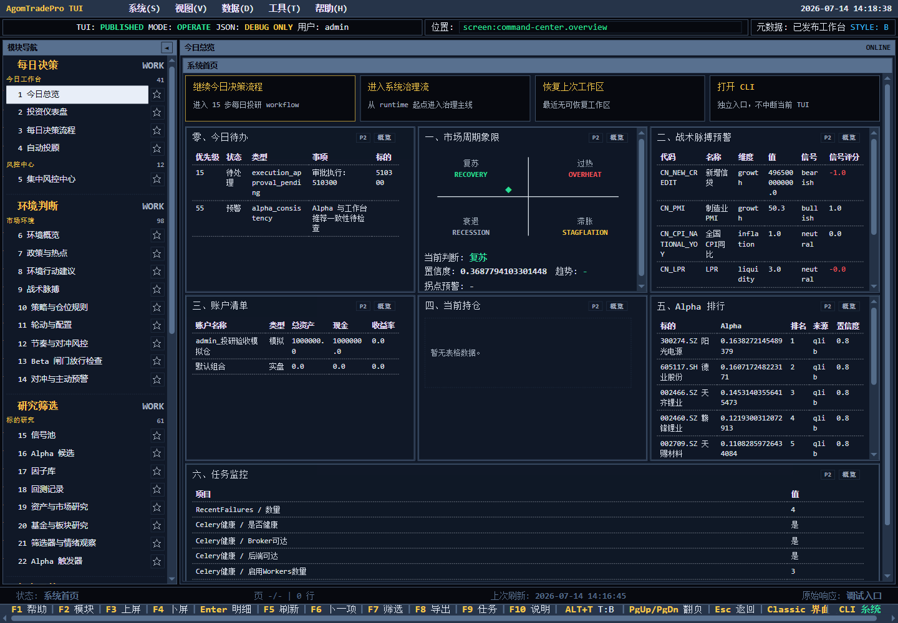
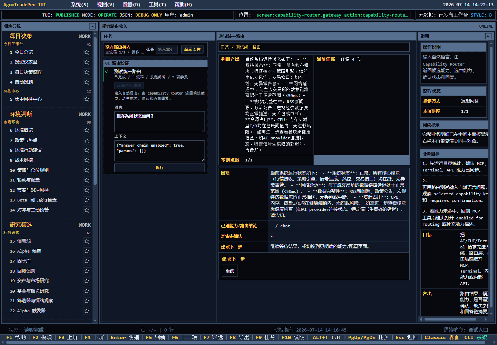
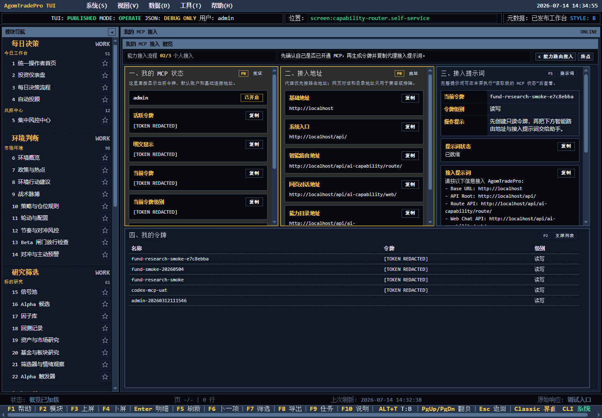
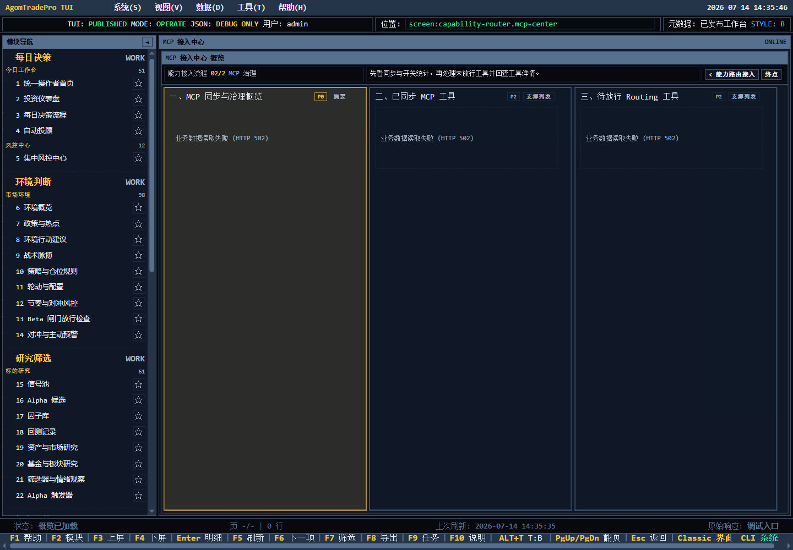
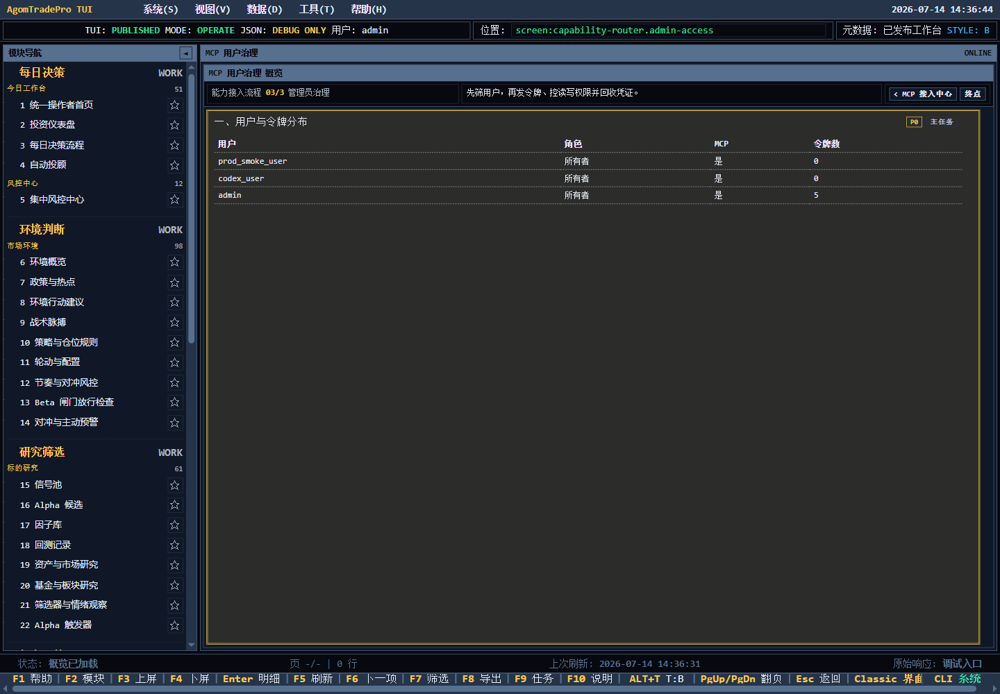

# TUI 能力路由用户体验审计

审计日期：2026-07-14

审计对象：`/tui/` 中的能力路由、MCP 自助接入、MCP 工具治理和用户治理

视口：1440 × 1000

测试用户：admin

> 状态说明：本文“结论—核心问题”记录的是整改前基线。2026-07-14 已完成实现与复验，最终状态和证据见文末“整改闭环”。

## 结论

当前模块不是一条清晰的“接入流程”，而是把三类不同用户任务塞进了同一个“能力路由”目录：

1. 开发者调试：测试统一路由、看能力命中结果。
2. 普通用户接入：拿 Token、Endpoint 和代理提示词。
3. 管理员治理：同步工具、放行 Routing、发放或撤销用户令牌。

这三类任务的对象、权限和完成标准不同。混在一起后，普通用户首先看到的是路由调试，而真正需要的 Token 页面既没有成为入口，在当前 8000 预览服务中还根本没有发布。

## 真实运行差异

### 当前 8000 预览服务

- 能力路由目录只包含 `capability-router.gateway`。
- 请求 `capability-router.self-service` 时接口返回 HTTP 200，但实际返回的 `screen.key` 是 `command-center.overview`。
- 用户不会看到“页面不存在”或“版本未发布”，而是被静默送回首页。
- 因此当前“Token 不显示”的第一原因不是 Token 数据为空，而是自助接入屏没有进入正在运行的目录。

### 当前工作区代码（隔离端口 8001）

- 运行时元数据实际包含 4 个屏：gateway、mcp-center、self-service、admin-access。
- `self-service` 能显示完整 Token、Endpoint 和提示词。
- 当前本地数据库未应用最新语义治理字段，部分治理接口出现 `no such column: ai_capability_catalog.collected_semantic_key`，导致 MCP 中心面板返回 502；这属于环境/迁移未对齐，不能作为生产功能结论，但暴露了错误态设计问题。

## 用户旅程健康度

| 步骤 | 用户意图 | 当前体验 | 健康度 |
|---|---|---|---|
| 1 | 找到 MCP 接入入口 | 入口排到工作区第 37 项；首屏不可见；模块名“能力路由”不表达“拿 Token” | 严重 |
| 2 | 判断该从哪里开始 | 首屏是“测试统一路由”，要求理解 Capability Router、selected capability、Routing/Terminal 等内部概念 | 严重 |
| 3 | 打开个人接入页 | 8000 运行目录没有该屏；输入地址后静默回首页 | 阻断 |
| 4 | 拿到可用凭证 | 当前代码版能展示 Token，但同时展示多个“活跃令牌/明文提示/当前令牌/级别”和历史令牌，用户仍需自行判断复制哪一项 | 有风险 |
| 5 | 复制接入材料 | Endpoint 分散为基础地址、系统入口、路由、网页对话、能力目录；提示词又重复全部地址，没有单一“复制完整接入包” | 有风险 |
| 6 | 管理员治理 | 工具治理与用户治理分成两个大屏，但操作入口藏在任务栏；列表本身不像可操作对象 | 有风险 |
| 7 | 出错后恢复 | 三个面板分别重复“业务数据读取失败 (HTTP 502)”，没有原因、影响范围、重试或迁移提示 | 严重 |

## 截图证据

### 1. 总入口

- 能力路由位于第 37 个工作区，默认视口只展示到第 22 项。
- 顶栏暴露 `screen:*`、`JSON: DEBUG ONLY`、`STYLE: B` 等实现概念。
- 导航、快捷键、状态条与业务内容同时争夺注意力。

### 2. 当前 8000 的能力路由接入

- 主任务是“测试统一路由”，不是“完成 MCP 接入”。
- 用户必须理解路由候选、能力命中、确认状态和内部能力类型。
- 右侧业务目标要求先看目录统计、再测路由、再回工具治理，但首屏没有清晰的顺序式主 CTA。
- 返回内容大量占屏，真正的接入下一步只有一句泛化建议。

### 3. 当前代码版个人自助接入（Token 已脱敏）

- 优点：Token、Endpoint 和提示词终于进入首屏，且支持复制。
- 问题：首屏同时出现多组凭证字段和 5 条历史令牌，主凭证不够唯一。
- “当前令牌级别”被渲染成可复制的秘密值，语义错误。
- Endpoint 使用 `http://localhost`，没有解释“localhost 是运行在哪台机器上”；外部代理接入时非常容易复制错误地址。
- 地址和提示词重复呈现，页面信息密度过高。
- 页面写“能力接入流程 02/3”，但 gateway 元数据是 1/2、MCP 中心是 2/2、管理员治理又是 3/3，流程总数不一致。

### 4. MCP 工具治理错误态

- 三个面板同时失败，只重复错误码。
- 没有说明是“工具同步失败”“目录读取失败”还是“本地迁移缺失”。
- 没有提供重试、查看诊断、回到可工作页面等恢复动作。
- 即使正常态，这里也属于管理员/开发者治理，不应成为普通用户接入的强制下一步。

### 5. MCP 用户治理

- 用户、角色、MCP、令牌数清晰，但整个页面大面积空白。
- 列表行没有明显的“查看/发令牌/关闭/撤销”操作。
- 操作藏在通用任务面板或快捷键语义里，管理员难以建立“选中用户 → 采取动作 → 复核结果”的闭环。

## 核心问题

### P0：运行版本与发布目录不一致

当前 8000 服务没有发布 self-service、mcp-center 和 admin-access。未知 screen 又被 API 静默回退成首页，直接制造“我明明打开了但什么都没有”的体验。

建议：

1. 未知/未发布 screen 返回明确的 404 或结构化错误，不得返回首页 payload。
2. TUI 顶栏显示运行元数据版本、代码版本和发布时间，避免“代码已有、运行没更新”。
3. 预览服务重启后做目录冒烟：管理员必须看到 4 屏，普通用户必须看到 gateway + self-service。

### P0：普通用户没有一条单独的接入主线

普通用户的目标是“拿到一个可用接入包并验证连接”，不是理解统一路由架构。

建议把信息架构拆成：

- `我的 MCP 接入`：普通用户默认入口。
- `能力路由调试`：开发者工具，不放在普通接入主线。
- `MCP 管理`：管理员入口，内部再分“工具治理 / 用户与凭证”。

### P0：Token 虽显示，但主凭证不唯一

当前页面同时显示活跃令牌、明文提示、当前令牌、当前令牌级别和历史令牌。用户无法一眼确认“现在应该复制哪个”。

建议首屏只保留一个状态驱动的主卡：

- 无令牌：主按钮“创建只读令牌”。
- 有令牌：显示“推荐令牌”，提供“显示 / 复制 / 轮换”。
- 已失效或不可解密：明确原因和修复动作。
- 历史令牌放到折叠区，并默认只显示名称、级别、创建/最近使用时间，不默认展示完整值。

### P1：缺少“一次复制即可接入”的产出

建议提供唯一主动作“复制完整接入包”，内容包含：

- 推荐 Token
- 可从外部访问的 Route Endpoint
- Capability Catalog Endpoint
- 最短代理提示词
- 环境说明（本机、局域网、VPS）

单项复制保留为次级操作。

### P1：流程图和进度编号互相矛盾

代码中存在两套重叠流程：gateway → mcp-center 是 1/2 → 2/2；self-service → admin-access 又使用 2/3 → 3/3，但 self-service 的 previous 指向 gateway、admin-access 的 previous 指向 mcp-center。这不是一条可解释的用户旅程。

建议删除跨角色的统一 step/total，改成三个独立 journey；普通用户和管理员不要共享进度编号。

### P1：错误态不可恢复

建议错误面板至少提供：人话原因、受影响功能、是否可继续、重试、打开诊断、迁移/同步建议。不要把 HTTP 502 作为主要用户文案。

### P2：可读性与可访问性

- 正文字号和行距偏小，三列面板内还各自滚动，阅读负担高。
- 黄色、绿色、蓝色承担大量状态含义，需要同时提供文本/图标语义，不能只依赖颜色。
- 顶栏、左树、任务栏、主面板、说明栏、底部快捷键形成多个竞争焦点。
- 表格行和面板看起来可点击，但缺少明确可见的行操作与聚焦状态。

本次只基于桌面截图和可访问树做问题识别，不能据此声称已满足完整 WCAG 合规。

## 建议的目标用户流

普通用户：

1. 打开“我的 MCP 接入”。
2. 系统自动判断开通状态和令牌状态。
3. 无令牌则创建默认只读令牌；有令牌则选出推荐令牌。
4. 点击“复制完整接入包”。
5. 点击“验证连接”，看到成功或可恢复错误。
6. 完成。

管理员：

1. 打开“MCP 管理”。
2. 在“工具治理 / 用户与凭证”之间切换。
3. 选择工具或用户。
4. 在行内执行放行、发放、收紧或撤销。
5. 看到复核结果和审计记录。

## 验证记录

- 真实浏览器检查：8000 当前服务 + 8001 当前代码隔离预览。
- Token 截图已脱敏；包含原始 Token 的临时 Playwright 快照已清理。
- 局部自动化测试：4 passed。
  - 普通用户目录权限
  - 管理员目录权限
  - self-service 面板契约
  - self-service Token 优先级模型
- 未运行完整 `tests/unit/test_tui_workbench.py`、Terminal、SDK、部署回归包。

## 相关实现位置

- `apps/terminal/infrastructure/tui_metadata_runtime_injection_capability_router.py`
- `apps/terminal/infrastructure/tui_metadata_runtime_injection_identity_access.py`
- `apps/terminal/infrastructure/tui_metadata_repository.py`
- `static/js/tui-workbench.js`
- `docs/development/tui-user-facing-design-standard.md`

## 整改闭环（2026-07-14）

### 最终结论

原审计中的 3 个 P0、3 个 P1 和主要 P2 可用性问题均已完成代码整改并取得自动化或真实浏览器证据。普通用户现在只有“我的 MCP 接入”主线；管理员额外看到 MCP 工具治理、用户治理和能力路由调试。显式请求未知或越权页面分别得到结构化 404/403，不再静默回首页。

本次没有宣称完整 WCAG 合规。剩余风险集中在真实生产域名/反向代理地址、生产数据规模和不同辅助技术组合，详见下文。

### 原问题逐项状态

| 原问题 | 状态 | 实现证据 | 自动化/浏览器证据 |
|---|---|---|---|
| P0 运行版本与发布目录不一致，未知 screen 静默回退 | 已关闭 | 运行时注入支持受控覆盖旧 screen/action；screen 响应携带 registry/version；未知与越权 screen 使用稳定 404/403 边界 | `test_tui_runtime_injection_replaces_stale_mcp_screen_and_action_contracts`；[未知页面结构化 404](unknown-screen-bounded-error.png)；[普通用户结构化 403](ordinary-user-forbidden.png) |
| P0 普通用户没有独立接入主线 | 已关闭 | 导航拆为 `mcp-access`、`mcp-governance`、`capability-router-debug`；screen audience 与目录/直达授权统一 | 管理员可见 3 类模块；普通用户只看到个人 MCP 接入；普通用户直达治理页返回 403 |
| P0 Token 主凭证不唯一 | 已关闭 | 应用层输出 `disabled/no_token/ready/unavailable` 四态和至多一个推荐令牌；历史记录不含明文 | Account API 契约测试；[管理员接入包（已遮罩）](admin-self-service-masked.png)；[普通用户接入包（已遮罩）](ordinary-user-self-service-masked.png) |
| P1 缺少一次复制即可接入的产出 | 已关闭 | 服务端生成 canonical access package，包含 Token、Route、Catalog、最短提示词和环境说明；页面只有一个主“复制完整接入包”动作 | 浏览器确认主动作数量为 1；只读“验证接入”成功，未触发模型调用或令牌写入 |
| P1 流程编号互相矛盾 | 已关闭 | 删除跨角色共享 step/total；个人接入、管理员治理和调试分别发布独立 journey | 元数据编译器与目录权限测试；浏览器导航按角色分离 |
| P1 错误态不可恢复 | 已关闭 | 404/403/502/503 和数据库 readiness 统一为 `error_code/title/detail/recovery_actions/trace_id`；面板失败保留成功兄弟面板 | 404/403 截图均有追踪号、重试和安全返回动作；单元测试禁止把原始异常文本插入普通 UI |
| P2 治理列表缺少明显行操作 | 已关闭 | 工具和用户表发布经编译器校验的 `row_actions`；使用原生按钮并保留确认、再认证和后端授权 | [MCP 工具行操作](mcp-governance-row-actions.png)；[用户治理行操作](admin-user-governance-row-actions.png)；row-action schema/compiler/browser-source 测试 |
| P2 信息密度、嵌套滚动和焦点不清 | 已关闭（限定范围） | 个人/管理员最多两列；工具治理改为单列全宽；P2 默认折叠；面板入口与行操作为原生按钮并有 `:focus-visible` | 1440×1000 浏览器复验；TUI 浏览器源契约测试。未据此声称完整 WCAG 合规 |

### 真实浏览器复验

环境：当前工作区代码、当前本地迁移、独立本地服务端口、1440×1000 视口。验收账号和关联回放/告警/订阅数据已在验收后删除。

- 管理员目录：可见个人 MCP 接入、MCP 工具/用户治理和能力路由调试。
- 普通用户目录：仅可见个人 MCP 接入；直接请求管理员 screen 得到 HTTP 403 和结构化恢复 UI。
- 个人接入：首屏同时呈现推荐 Token、Route、Catalog、环境警告和完整接入包；Token 有显示/隐藏/复制；令牌级别及历史元数据无复制按钮；历史 P2 默认折叠。
- 验证接入：执行只读 GET-backed 验证，Token、路由和目录检查均通过；未创建、轮换或撤销令牌，未调用 AI 模型。
- 工具治理：每行可查看详情、切换 Routing 和切换 Terminal；动作参数来自当前行，操作后刷新面板。
- 用户治理：每行可查看用户 MCP 详情、创建只读令牌、切换 MCP 和撤销全部令牌。
- 未知 screen：接口返回 HTTP 404，页面显示“页面不存在”、追踪号、重试和返回首页；当前请求没有被替换为首页 payload。
- 浏览器日志：正常流程 0 个 console error/warning；故意触发的 404、403 各产生一条预期资源错误，没有其他异常网络或脚本错误。
- 所有保留截图均已遮罩秘密值；包含原始 Token 的 `.playwright-cli` 会话快照已删除，并将该目录加入忽略规则。

### 最终自动化验证

当前实现的固定回归结果：

- `pytest tests/unit/test_tui_metadata_compiler.py -q`：41 passed。
- `pytest tests/unit/test_tui_workbench.py -q`：213 passed。
- `pytest tests/api/test_account_api_edges.py -q`：26 passed。
- `pytest tests/unit/test_terminal_agent_service.py -q`：10 passed。
- `pytest sdk/tests/test_sdk/test_client.py -q`：20 passed。
- `pytest tests/unit/test_internal_ssl_redirect.py -q`：2 passed。
- `pytest tests/unit/test_generate_mcp_tool_inventory.py tests/unit/test_price_polling_service.py -q`：3 passed。
- `pytest tests/guardrails -q`：其余 132 项通过；唯一治理基线同步失败修正后，失败用例单独复跑 1 passed（分层、模块循环、ORM 越界均无新增违规）。
- `node --check static/js/tui-workbench.js`：通过。
- `python manage.py makemigrations --check --dry-run`：No changes detected。
- `python manage.py check`：System check identified no issues。

### 剩余风险

1. 本地验收地址为 loopback，页面已明确“仅同机可用”；VPS/反向代理下的真实公网 Route/Catalog 地址仍需在部署验收中复核。
2. 治理表已在当前 308 条工具目录、8 行首屏上验证；更长能力名、更多本地化语言和超大用户规模仍需持续做视觉回归。
3. 本轮验证了键盘焦点样式、原生控件和结构化语义，没有覆盖屏幕阅读器矩阵、缩放 200% 或完整 WCAG 2.2 审核。
4. 404/403 的 console 资源错误是刻意验收产生的预期浏览器行为；生产监控需按 HTTP 状态与 trace ID 区分用户越权/旧链接和系统故障。
